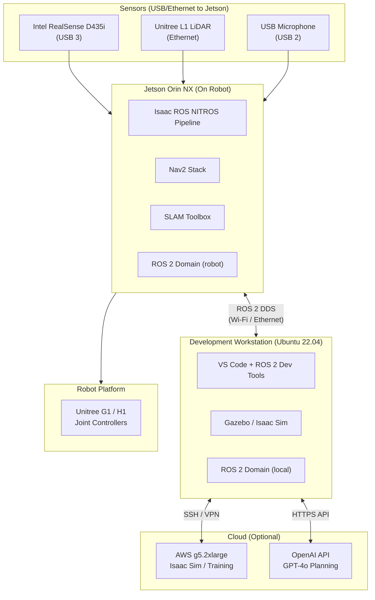

# Hardware Requirements Guide

> Appendix 1 — Physical AI & Humanoid Robotics

This guide covers every piece of hardware used or referenced throughout the course, organized from the minimum viable setup for completing all simulation exercises to the full kit required for real hardware deployment.

:::note
All four course modules can be completed entirely in simulation. Physical hardware is optional but strongly recommended for Module 3 (NVIDIA Isaac on Jetson) and the real-hardware extension of the capstone project.
:::

---

## 1. Development Workstation

The workstation is the primary machine on which you will write code, run Gazebo simulation, and optionally run Isaac Sim. It also hosts the ROS 2 development environment.

### 1.1 Minimum Specification

| Component | Minimum | Recommended |
|---|---|---|
| **CPU** | Intel Core i7-10th gen / AMD Ryzen 7 5000 | Intel Core i9-13th gen / AMD Ryzen 9 7000 |
| **RAM** | 32 GB DDR4 | 64 GB DDR5 |
| **GPU** | NVIDIA RTX 3070 (8 GB VRAM) | NVIDIA RTX 4070 Ti (12 GB VRAM) or better |
| **Storage** | 512 GB NVMe SSD | 1 TB NVMe SSD + 2 TB HDD |
| **OS** | Ubuntu 22.04 LTS (bare metal or WSL2) | Ubuntu 22.04 LTS (bare metal) |
| **Network** | Gigabit Ethernet | Gigabit Ethernet + Wi-Fi 6 |

:::warning
**Bare metal Ubuntu is strongly preferred.** WSL2 works for ROS 2 and Gazebo but has significant limitations with GPU passthrough (required for Isaac Sim) and USB device access (required for real sensors). If you must use Windows, plan on WSL2 for Modules 1-2 and a cloud instance or dual-boot for Modules 3-4.
:::

### 1.2 GPU Memory Requirements by Task

| Task | Minimum VRAM | Notes |
|---|---|---|
| Gazebo simulation + RViz2 | 4 GB | GPU used for rendering only |
| Isaac Sim (basic) | 8 GB | RTX 3070 / 4060 Ti sufficient |
| Isaac Sim (full scene) | 12 GB | RTX 4070 Ti / 3080 recommended |
| Whisper ASR (large model) | 8 GB | Can use CPU with lower speed |
| GPT-4o API | 0 GB | Runs via API, no local VRAM needed |
| Local LLM (llama-3 8B) | 8 GB | For offline experimentation only |

### 1.3 Ubuntu 22.04 Setup Notes

NVIDIA Isaac Sim requires NVIDIA driver version 525.85 or newer. After a fresh Ubuntu 22.04 install:

```bash
# Verify Ubuntu version
lsb_release -a

# Install NVIDIA driver (525 or newer)
sudo apt update
sudo ubuntu-drivers autoinstall
sudo reboot

# Verify driver after reboot
nvidia-smi
```

Expected output from `nvidia-smi` should show your GPU, driver version, and CUDA version. Keep CUDA 11.8 or 12.x.

---

## 2. NVIDIA Jetson Orin Developer Kit

The Jetson Orin NX is the edge AI compute module used in Module 3 for hardware-accelerated inference with Isaac ROS. It represents the class of hardware you would deploy on a real robot.

### 2.1 Jetson Orin Kit Contents and Cost Breakdown

| Item | Part / Source | Approx. Cost (USD) |
|---|---|---|
| **Jetson Orin NX 16GB Module** | NVIDIA or authorized reseller | $499 |
| **Seeed reComputer J4012 carrier board** | Seeed Studio | $149 (includes case/fan) |
| **MicroSD card 64GB A2 class** | Samsung or SanDisk | $12 |
| **USB-C 65W power supply** | Any PD 3.0 compatible | $15 |
| **HDMI cable (for initial setup)** | Any | $8 |
| **USB keyboard + mouse (for initial setup)** | Any | $17 |
| **Total** | | **~$700** |

:::tip
The Seeed reComputer J4012 is a popular carrier board choice because it includes an M.2 NVMe slot, dual Gigabit Ethernet, USB 3.2, and a pre-assembled heatsink. You can replace the MicroSD with a 256 GB NVMe SSD ($30) for significantly better I/O performance.
:::

### 2.2 Jetson Orin Technical Specifications

| Specification | Jetson Orin NX 16GB |
|---|---|
| CPU | 8-core Arm Cortex-A78AE v8.2 @ 2 GHz |
| GPU | 1024-core NVIDIA Ampere, 32 Tensor Cores |
| AI Performance | 100 TOPS |
| RAM | 16 GB LPDDR5 (shared CPU/GPU) |
| Storage | MicroSD + M.2 NVMe |
| Video encode/decode | H.264/H.265 hardware encoder + decoder |
| Camera interfaces | 2x MIPI CSI-2 |
| USB | 3x USB 3.2, 1x USB 2.0 |
| PCIe | 1x M.2 Key M PCIe Gen4 x4 |
| Power consumption | 10W–25W configurable |
| Dimensions | 69.6 mm × 45 mm (module only) |

### 2.3 JetPack SDK

The Jetson runs NVIDIA JetPack, which bundles:
- Ubuntu 20.04 (JetPack 5.x) or Ubuntu 22.04 (JetPack 6.x)
- CUDA, cuDNN, TensorRT
- VPI (Vision Programming Interface)
- DeepStream SDK

For this course, use **JetPack 6.0** (Ubuntu 22.04 base), which aligns with the ROS 2 Humble LTS release.

---

## 3. Sensors

### 3.1 Depth Camera: Intel RealSense D435i

The RealSense D435i is the primary depth sensor used throughout the course. It provides RGB, depth, and IMU data over a single USB 3 connection.

| Specification | Value |
|---|---|
| **RGB resolution** | 1920×1080 @ 30 fps |
| **Depth resolution** | 1280×720 @ 30 fps |
| **Depth range** | 0.2m – 10m |
| **Depth technology** | Active IR stereo |
| **IMU** | 6-DOF (3-axis accel + 3-axis gyro) |
| **Interface** | USB 3.1 Type-C |
| **Power** | Bus-powered (900mA) |
| **Price** | ~$200 |

The D435i is preferred over the D415 because the integrated IMU enables Visual-Inertial Odometry (VIO) — critical for robust SLAM on moving robots.

:::tip
For the Jetson, use the `realsense-ros` ROS 2 package (version 4.x for Humble). Compile from source on Jetson rather than installing from apt, as the apt binary may not be compiled against the Jetson-optimized librealsense.
:::

### 3.2 LiDAR: Unitree L1 (Optional but Recommended)

For robust outdoor SLAM and longer-range obstacle detection, consider adding a LiDAR unit:

| Specification | Unitree L1 |
|---|---|
| **Scan rate** | 21,600 points/second |
| **Range** | 0.1m – 30m |
| **FOV horizontal** | 360° |
| **FOV vertical** | ±25° |
| **Interface** | Ethernet |
| **Price** | ~$430 |

The Unitree L1 is purpose-built for the Unitree robot platforms and integrates cleanly with their SDK.

### 3.3 Microphone: Jabra Speak 510

For voice command input with Whisper:

| Specification | Value |
|---|---|
| **Microphone** | Omnidirectional, 360° pickup |
| **Noise cancellation** | Active echo cancellation |
| **Interface** | USB 2.0 |
| **Range** | Up to 3m |
| **Price** | ~$130 |

Any USB microphone will work for development. The Jabra Speak 510 is recommended for demonstrations because its omnidirectional pickup allows the robot to hear commands from any direction.

### 3.4 Sensor Summary

| Sensor | Use Case | Module | Price |
|---|---|---|---|
| Intel RealSense D435i | RGB-D perception, SLAM | 2, 3 | ~$200 |
| Unitree L1 LiDAR | Long-range SLAM, outdoor nav | 3 | ~$430 |
| Jabra Speak 510 USB mic | Voice command input | 4 | ~$130 |
| USB webcam (1080p) | Gesture detection (optional) | 4 | ~$50 |

---

## 4. Robot Platforms

The course references three Unitree robot platforms. You do not need to purchase a robot platform to complete the course — all exercises run in simulation — but the platforms are described here for completeness and for students pursuing real hardware deployment.

### 4.1 Platform Comparison Table

| Feature | **Unitree Go2 EDU** | **Unitree G1** | **Unitree H1** |
|---|---|---|---|
| **Type** | Quadruped (4-legged) | Humanoid (bipedal) | Humanoid (bipedal) |
| **Height** | 0.65m (standing) | 1.27m | 1.8m |
| **Weight** | 15 kg | 35 kg | 47 kg |
| **DOF** | 12 leg | 23 (full body) | 18 |
| **Payload** | 3 kg | 3 kg arm | 30 kg |
| **Arms** | Optional add-on | 2x 7-DOF | Optional |
| **Compute** | NVIDIA Orin NX | NVIDIA Orin NX | Intel Core i7 |
| **Battery** | 9,000 mAh (3hrs) | 10,000 mAh (2hrs) | 15,000 mAh (2hrs) |
| **Top speed** | 3.5 m/s | 2.0 m/s | 1.5 m/s |
| **SDK** | ROS 2 / Unitree SDK2 | ROS 2 / Unitree SDK2 | ROS 2 / Unitree SDK2 |
| **LiDAR** | Unitree L1 built-in | Optional | Optional |
| **Price (USD)** | ~$8,500 (EDU) | ~$16,000 | ~$90,000 |
| **Best for course** | Quadruped locomotion | Humanoid manipulation | Research/capstone |

### 4.2 Unitree Go2 EDU

The Go2 EDU is the most accessible platform and the one most students use if purchasing hardware. Key features relevant to this course:

- Ships with **Unitree SDK2**, which has a ROS 2 interface out of the box.
- Built-in **3D LiDAR** (Unitree L1) and depth camera.
- The EDU edition unlocks low-level joint control, necessary for custom locomotion controllers.
- Ideal for Module 2 (simulation) and Module 3 (perception/navigation).

### 4.3 Unitree G1

The G1 is a full humanoid with two 7-DOF arms, making it directly relevant to the manipulation tasks in Module 4. It is a research-grade platform increasingly used in academic labs. The SDK2 provides:

- Whole-body kinematics API.
- Individual joint torque control.
- ROS 2 topics for all sensor streams.

### 4.4 Unitree H1

The H1 is Unitree's flagship full-size humanoid. At 1.8m and 47 kg, it is closest in form factor to the ARIA capstone project design. It is significantly more expensive and is typically found in well-funded research labs or industry pilots. The course architecture is fully compatible with H1 deployment.

:::note
Unitree provides Gazebo simulation models for all three platforms. You can download the URDF and SDF files from [Unitree's GitHub repository](https://github.com/unitreerobotics). The course simulation environment uses these official models.
:::

---

## 5. Cloud Alternatives

If your local workstation does not meet the GPU requirements, or if you want to experiment with larger models, cloud GPU instances are a viable alternative.

### 5.1 Recommended Cloud Instance: AWS g5.2xlarge

| Specification | AWS g5.2xlarge |
|---|---|
| **GPU** | NVIDIA A10G (24 GB VRAM) |
| **vCPU** | 8 |
| **RAM** | 32 GB |
| **Storage** | 450 GB NVMe SSD |
| **Network** | Up to 10 Gbps |
| **On-demand price** | ~$1.21/hour |
| **Spot price** | ~$0.36/hour |

For a typical study session (4 hours), on-demand cost is approximately $4.84. Spot instances reduce this to ~$1.44 but may be interrupted.

### 5.2 Other Cloud Options

| Provider | Instance | GPU | Price/hr (approx) |
|---|---|---|---|
| **AWS** | g5.2xlarge | A10G 24GB | $1.21 |
| **GCP** | g2-standard-8 | L4 24GB | $1.31 |
| **Azure** | NC6s_v3 | V100 16GB | $3.06 |
| **Lambda Labs** | 1x A10 | A10 24GB | $0.60 |
| **RunPod** | GPU Pod | A10 24GB | $0.34 |

Lambda Labs and RunPod are generally the most cost-effective options for development work. For production training pipelines, AWS and GCP offer more managed tooling.

:::tip
**Lambda Labs** is particularly popular in the ML community for on-demand GPU access. Their instances come pre-configured with CUDA, PyTorch, and common ML libraries, reducing setup time significantly.
:::

### 5.3 Running Isaac Sim in the Cloud

Isaac Sim can run headlessly on a cloud instance with NVIDIA GPUs. Use Omniverse Streaming to connect a local web browser to the remote simulation:

```bash
# On the cloud instance (headless mode)
./isaac-sim.sh --headless --allow-root

# Access via browser at http://<instance-ip>:8211/streaming/webrtc-client/
```

This requires port 8211 to be open in the instance's security group.

---

## 6. Full Hardware Architecture Summary

The diagram below shows how all hardware components connect in a typical real-robot deployment:



### Component Budget Summary

| Category | Item | Approx. Cost |
|---|---|---|
| **Compute** | Development workstation (RTX 4070 Ti, 64 GB RAM) | $2,500 |
| **Edge AI** | Jetson Orin NX kit (~$700 breakdown above) | $700 |
| **Sensing** | RealSense D435i | $200 |
| **Sensing** | Unitree L1 LiDAR | $430 |
| **Sensing** | USB Microphone | $130 |
| **Robot** | Unitree Go2 EDU (simulation alternative: $0) | $8,500 |
| **Total (with robot)** | | **~$12,460** |
| **Total (simulation only)** | | **~$3,430** |

:::note
The "simulation only" total covers everything needed to complete 100% of course content in simulation. The robot platform is needed only for real hardware deployment extensions.
:::

---

## Frequently Asked Questions

**Q: Can I use a gaming laptop instead of a desktop workstation?**

A: Yes, with caveats. Ensure the laptop has an NVIDIA RTX GPU (not a mobile variant with TGP under 80W), at least 32 GB RAM, and runs Ubuntu 22.04 natively. Thermal throttling is a concern for long simulation sessions.

**Q: Can I run everything on Apple Silicon (M1/M2/M3 Mac)?**

A: ROS 2 and Gazebo run on Apple Silicon via Docker or native ARM builds. Isaac Sim does not support Apple Silicon. You would need a cloud GPU instance for Isaac Sim exercises.

**Q: Do I need to buy the Jetson if I have a powerful workstation?**

A: No. The Jetson exercises can be completed on any Ubuntu 22.04 machine with an NVIDIA GPU. The Jetson is specifically for students who want to deploy on a physical robot with battery-constrained edge compute.

**Q: What is the minimum GPU for Isaac Sim?**

A: NVIDIA officially requires an RTX 2070 or better (Turing or newer architecture) with at least 8 GB VRAM. Performance at the minimum is workable but slow. An RTX 3080 or 4070 Ti is the practical sweet spot.
