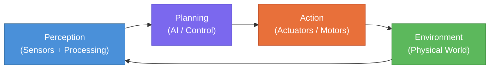
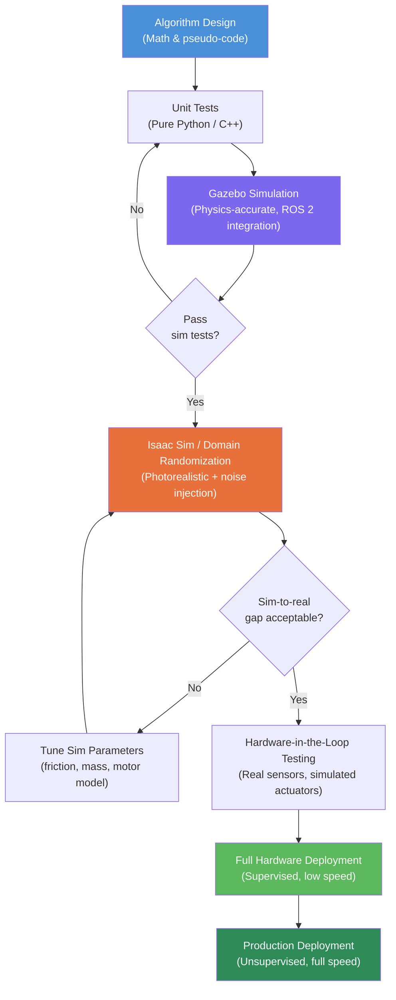

# Introduction to Physical AI

*Weeks 1–2 · Module 1: The Robotic Nervous System*

---

## Learning Objectives

By the end of this chapter, you will be able to:

- Define **Physical AI** and explain how it differs from software-only AI systems.
- Articulate why humanoid robots are a natural platform for embodied intelligence.
- Identify the key technologies that make up the Physical AI ecosystem: ROS 2, Gazebo, NVIDIA Isaac, and Vision-Language-Action (VLA) models.
- Distinguish between the major sensor modalities used in robotic systems and select the right sensor for a given task.
- Describe the sim-to-real pipeline and explain why simulation is critical before deploying code on real hardware.
- Write a basic Python script that processes simulated sensor data in a ROS 2-style pattern.

---

## Prerequisites

Before diving in, you should be comfortable with:

- **Python 3.10+** — functions, classes, type hints, and list comprehensions.
- **Basic Linux command line** — navigating directories, running scripts, installing packages with `apt` and `pip`.
- **Fundamental AI/ML concepts** — you should know what a neural network is and have a rough idea of how inference works.
- **No prior robotics experience required** — we will build everything from the ground up together.

:::note
If you need a Python refresher, we recommend working through the official [Python Tutorial](https://docs.python.org/3/tutorial/) sections 1–9 before proceeding. If Linux is new to you, the [Ubuntu Desktop tutorial](https://ubuntu.com/tutorials/command-line-for-beginners) is a great starting point.
:::

---

## What Is Physical AI?

Artificial Intelligence has, for most of its history, lived entirely inside computers. A large language model reads text and produces text. An image classifier receives pixels and emits a probability score. These systems are powerful, but they are fundamentally **disembodied**: they have no body, no senses, and no ability to act on the world around them.

**Physical AI** changes that equation. It is the branch of artificial intelligence concerned with building systems that **perceive, reason about, and act within the physical world in real time**. Where traditional AI transforms data into data, Physical AI transforms data into *motion*, *force*, and *change in the environment*.

### Digital AI vs. Embodied Intelligence

The distinction is worth dwelling on because it shapes every design decision we will make in this course.

| Dimension | Digital (Disembodied) AI | Physical (Embodied) AI |
|---|---|---|
| **Input** | Tokens, pixels, audio frames | Real-time sensor streams (LiDAR, cameras, IMUs) |
| **Output** | Text, classifications, embeddings | Motor commands, forces, velocities |
| **Latency tolerance** | Seconds to minutes acceptable | Milliseconds — delays cause physical harm |
| **Error consequences** | Wrong answer, hallucination | Collision, fall, actuator damage |
| **Environment** | Static, deterministic | Dynamic, unpredictable, continuous |
| **Feedback loop** | Typically open-loop | Always closed-loop |
| **Key challenge** | Reasoning, knowledge | Uncertainty, partial observability, real-time control |

The closed-loop nature of Physical AI is its defining characteristic. A robot does not simply compute an answer and stop — it continuously **senses the world, plans a response, executes an action, observes the result, and repeats**. This sense–plan–act cycle happens tens or hundreds of times per second on a running robot.

:::tip
Think of Physical AI as AI that has "skin in the game." Every inference it makes has immediate, physical consequences. This is what makes robotics one of the hardest and most rewarding frontiers in all of computer science.
:::

### Embodied Intelligence

The term **embodied intelligence** comes from cognitive science and philosophy. It reflects the idea that intelligence is not a property of an isolated brain (or CPU) but emerges from the interaction between a body, its sensors, and the environment. A human baby learns what "heavy" means by picking things up — not by reading a definition. Similarly, a robot can only truly learn manipulation by manipulating.

This insight has profound implications for how we build AI. It means that **a robot's body is part of its intelligence**. The shape of a hand constrains and simplifies grasping problems. Compliance in joints absorbs disturbances that a rigid system would need to compute around. We call this principle *morphological computation*, and we will return to it when we study actuator design in Module 4.

---

## Why Humanoid Robots?

With so many possible robot form factors — wheeled robots, robotic arms, quadrupeds, drones — why focus on humanoid robots?

### The Human-Centered World Argument

The most compelling answer is straightforward: **the world is built for humans**. Doorknobs, staircases, cars, kitchens, and hospital corridors are all designed around the dimensions, reach, and dexterity of the human body. A robot that shares that form factor can, in principle, operate in these spaces without any physical modifications to the environment.

Compare this to a wheeled robot, which requires ramps, wide corridors, and flat floors. Or a robotic arm bolted to a factory floor, which can only reach objects placed within its fixed workspace. The humanoid form is a general-purpose morphology for a human-scale world.

### Shared Physical Form Enables Transfer Learning

There is a second, more technical argument. Because humans and humanoid robots share a similar kinematic structure — two arms, two legs, a torso, a head — we can use **human motion capture data** directly to bootstrap robot learning. Vast archives of human movement data become training sets for robot control policies. This drastically reduces the amount of expensive robot-specific data collection required.

### The Labor Market Gap

A third argument is economic. The global working-age population is shrinking in many advanced economies while the demand for physical labor in warehouses, hospitals, and manufacturing continues to grow. Humanoid robots are one of the few technologies that could plausibly fill this gap without requiring a wholesale redesign of existing infrastructure.

Companies like Boston Dynamics, Figure AI, Agility Robotics, 1X Technologies, and Tesla Optimus are all betting on this thesis, and the pace of progress over the past three years has been remarkable.

:::warning
Humanoid robots are also among the hardest engineering challenges in existence. A bipedal robot that can walk on uneven terrain, recover from pushes, open a door, and pick up a fragile object is solving dozens of hard AI and control problems simultaneously. Do not underestimate the difficulty — but do not be discouraged either. That is exactly why we are here.
:::

---

## The Physical AI Ecosystem

Before writing a single line of code, we need to understand how the major components of a Physical AI system connect to each other. The fundamental loop is deceptively simple:



This **Perception → Planning → Action → Environment** loop is the heartbeat of every robot we will build in this course. Let us trace through it briefly:

1. **Perception**: Sensors — cameras, LiDAR, IMUs, force sensors — sample the environment and produce raw data. Software running on the robot's compute unit processes this data into a structured world model: "there is a box 0.4 m in front of me, slightly to the left, with an estimated mass of 1.2 kg."

2. **Planning**: The robot's AI layer — which might be a classical motion planner, a deep reinforcement learning policy, or a modern Vision-Language-Action model — takes the world model and the current goal and produces a plan. At the lowest level, this plan is a sequence of joint angles or end-effector velocities.

3. **Action**: Actuators (electric motors, hydraulic cylinders, pneumatic muscles) execute the plan by producing forces and torques on the robot's joints, which move the robot's body and interact with the environment.

4. **Environment**: The physical world responds. The box moves. The floor exerts a reaction force. Another person walks into the robot's path. The world is constantly changing, which is why the loop never stops.

The software framework that orchestrates this loop is **ROS 2**, and everything we build in this course runs inside it. We will cover ROS 2 in depth starting in the next chapter.

---

## Key Technologies Overview

Four technologies form the backbone of modern Physical AI development. We introduce each briefly here; each will receive its own dedicated module later in the course.

### ROS 2 — Robot Operating System 2

**ROS 2** (Robot Operating System 2) is not technically an operating system — it is a **middleware framework** that provides the plumbing for robot software. It gives us:

- A **publish/subscribe messaging system** so different software components (nodes) can exchange data without knowing about each other.
- A rich ecosystem of **pre-built packages** for perception, navigation, manipulation, and visualization.
- Support for **real-time control** via DDS (Data Distribution Service) as its communication backbone.
- **Language support** for Python and C++, with Python being our primary language in this course.

ROS 2 is the de facto standard for research and increasingly for industry. If you know ROS 2, you can work on almost any modern robot platform.

### Gazebo — Physics Simulation

**Gazebo** (now branded as *Ignition Gazebo* or simply *gz-sim*) is an open-source, physics-accurate robot simulator. It models rigid body dynamics, contact forces, sensor noise, and even lighting conditions. We use Gazebo to:

- Test code safely before running it on expensive hardware.
- Generate synthetic training data for machine learning models.
- Reproduce failure modes that are difficult or dangerous to trigger on real hardware.

Gazebo integrates tightly with ROS 2 through the `ros_gz` bridge package, so the same Python code that controls a simulated robot can (in principle) control a real one.

### NVIDIA Isaac — GPU-Accelerated Robotics

**NVIDIA Isaac** is a suite of GPU-accelerated tools for robot development. The key components are:

- **Isaac Sim**: A photorealistic robot simulator built on NVIDIA Omniverse, capable of ray-traced rendering for training vision models with near-zero sim-to-real gap.
- **Isaac ROS**: A library of hardware-accelerated ROS 2 packages optimized for NVIDIA Jetson and desktop GPUs.
- **Isaac Lab**: A reinforcement learning framework for training robot locomotion and manipulation policies at massive scale.

For the hardware-intensive parts of this course, we will use Isaac Sim when photorealistic perception data is required and Gazebo for standard control experiments.

### VLA Models — Vision-Language-Action

**Vision-Language-Action (VLA) models** represent the current frontier of Physical AI research. A VLA model takes as input a camera image and a natural language instruction ("pick up the red cup and place it on the shelf") and outputs a sequence of robot actions.

Examples include Google DeepMind's **RT-2**, Physical Intelligence's **pi0**, and OpenVLA from UC Berkeley. These models are essentially large transformer networks fine-tuned on robot demonstration data, and they blur the line between language models and control systems. We will build and fine-tune a small VLA-style model in Module 6.

:::note
VLA models are moving fast — papers appear weekly. Throughout this course we will point you to the latest benchmarks, but the underlying concepts you learn here will remain relevant regardless of which specific model architecture is dominant when you read this.
:::

---

## Sensor Systems for Robots

A robot that cannot sense its environment cannot act safely. Understanding sensor modalities — what they measure, how they work, and what their failure modes are — is foundational knowledge for Physical AI engineers.

We will cover four primary sensor types in this course.

### LiDAR (Light Detection and Ranging)

LiDAR fires rapid pulses of laser light and measures the time for each pulse to return after bouncing off a surface. From these time-of-flight measurements it constructs a **point cloud**: a 3D map of all surfaces within range, typically accurate to within a few centimeters.

LiDAR is excellent for:
- Mapping and localization (SLAM — Simultaneous Localization and Mapping).
- Obstacle detection in navigation.
- Measuring the geometry of large spaces.

LiDAR struggles with:
- Shiny or transparent surfaces (glass, mirrors).
- Rain, dust, and fog (the laser scatters).
- Fine texture — a point cloud tells you *where* a surface is, not *what* it looks like.

### Cameras

Cameras are the most information-rich sensors we have, and the cheapest. A standard RGB camera produces a 2D array of color values at high frame rates. **Depth cameras** (like the Intel RealSense or Microsoft Azure Kinect) add a per-pixel distance estimate, giving an **RGB-D** image.

Camera advantages:
- Rich texture and color information — essential for object recognition and manipulation.
- Low cost and small form factor.
- Huge existing deep learning ecosystem (YOLO, SAM, FoundationPose, etc.).

Camera disadvantages:
- Sensitive to lighting conditions.
- 2D cameras require non-trivial processing to recover 3D geometry.
- Calibration between cameras and the robot's frame of reference must be maintained carefully.

### IMUs (Inertial Measurement Units)

An **IMU** combines an accelerometer (measures linear acceleration) and a gyroscope (measures angular velocity) in a single chip. It runs at very high rates (up to 1000 Hz) and provides information about the robot's own motion — critical for balance control in legged robots.

IMUs cannot measure absolute position (only changes), so their signals accumulate drift over time. They are almost always fused with other sensors (cameras, LiDAR, GPS) using a **Kalman filter** or **factor graph** to produce a stable state estimate.

### Force/Torque Sensors

Mounted at a robot's wrists or ankles, **force/torque (F/T) sensors** measure the forces and moments being exerted on the robot's end effector or foot. This is the sense of **touch** for a robot, and it is indispensable for:

- Safe human-robot interaction (detecting accidental contact and stopping safely).
- Dexterous manipulation (knowing when you have gripped an object firmly enough but not too firmly).
- Legged locomotion (detecting ground contact and terrain type).

### Sensor Comparison Table

| Sensor | Measures | Update Rate | Range | Key Strength | Key Weakness |
|---|---|---|---|---|---|
| 3D LiDAR | Point cloud (geometry) | 10–20 Hz | 0.1–150 m | Accurate 3D geometry | No color/texture; fails on glass |
| RGB Camera | Color images | 30–120 Hz | Unlimited (passive) | Rich texture, cheap | 2D only; lighting-sensitive |
| RGB-D Camera | Color + depth | 30–90 Hz | 0.3–10 m | 3D + texture | Limited outdoor range |
| IMU | Acceleration + angular rate | 100–1000 Hz | — (proprioceptive) | Very high rate; no external reference | Drift; no absolute position |
| Force/Torque | Forces and moments | 100–1000 Hz | Contact only | Tactile feedback for safety | Only measures at contact point |

:::tip
In practice, every serious robot uses **sensor fusion** — combining multiple sensor types so that the weaknesses of one are covered by the strengths of another. For example, a foot F/T sensor tells the locomotion controller exactly when and where the foot contacts the ground, while the IMU tells it how the body is tilting. Together they enable stable dynamic walking.
:::

---

## From Software to Hardware: The Sim-to-Real Pipeline

One of the most important engineering principles in Physical AI is **"simulate first, deploy second."** Hardware is expensive, fragile, and dangerous. A bug in a controller that you discover in simulation costs you nothing. The same bug discovered while the robot is walking can cost you a wrist actuator ($2,000) or worse.

The pathway from a new idea to a running robot follows a structured pipeline:



### Domain Randomization

A key technique used in step E above is **domain randomization**. When we train a policy in simulation, the simulated world is never a perfect replica of the real world. The lighting is different, the friction coefficients are slightly off, the motor models are approximations.

Domain randomization addresses this by *randomly varying* these parameters during training: the friction coefficient might be 0.4 in one episode and 0.8 in the next; the camera exposure might vary; small amounts of sensor noise are injected. The resulting policy learns to be robust to this variation, and when deployed on real hardware — which is just another "random" instance of the environment — it generalizes successfully.

:::warning
Skipping the simulation stage and going straight to hardware testing is a common mistake made by teams under time pressure. Almost without exception it results in hardware damage and wasted time. Budget your project timelines to include thorough simulation testing. Your actuators (and your budget) will thank you.
:::

---

## A Simple Python Example: Basic Sensor Data Processing

Let us ground these concepts in code. The following example simulates the kind of sensor data processing that happens inside a ROS 2 node. We define simple data structures for LiDAR and IMU readings, then write a fusion function that combines them into a basic state estimate.

### Part 1: Sensor Data Structures and Parsing

```python
"""
sensor_basics.py

Demonstrates basic sensor data structures and processing patterns
that mirror real ROS 2 message handling. No ROS 2 installation required
to run this script — it uses plain Python data classes.
"""

from __future__ import annotations

import math
import time
from dataclasses import dataclass, field
from typing import List, Optional
import random


# ---------------------------------------------------------------------------
# Data structures (these mirror real ROS 2 message types)
# ---------------------------------------------------------------------------

@dataclass
class Vector3:
    """A 3-dimensional vector (used for accelerations, velocities, etc.)."""
    x: float = 0.0
    y: float = 0.0
    z: float = 0.0

    def magnitude(self) -> float:
        """Return the Euclidean norm of the vector."""
        return math.sqrt(self.x**2 + self.y**2 + self.z**2)

    def __repr__(self) -> str:
        return f"Vector3(x={self.x:.3f}, y={self.y:.3f}, z={self.z:.3f})"


@dataclass
class IMUReading:
    """
    Simulates a sensor_msgs/Imu ROS 2 message.
    Contains linear acceleration (m/s²) and angular velocity (rad/s).
    """
    timestamp: float
    linear_acceleration: Vector3 = field(default_factory=Vector3)
    angular_velocity: Vector3 = field(default_factory=Vector3)

    @property
    def is_stationary(self, threshold: float = 0.05) -> bool:
        """
        Heuristic: the robot is approximately stationary if angular velocity
        magnitude is below the threshold (rad/s).
        """
        return self.angular_velocity.magnitude() < threshold


@dataclass
class LiDARScan:
    """
    Simulates a simplified sensor_msgs/LaserScan ROS 2 message.
    angle_min/max in radians, ranges in meters.
    """
    timestamp: float
    angle_min: float        # Start angle of the scan (radians)
    angle_max: float        # End angle of the scan (radians)
    angle_increment: float  # Angular step between readings (radians)
    ranges: List[float] = field(default_factory=list)
    range_min: float = 0.1  # Minimum valid range (meters)
    range_max: float = 30.0 # Maximum valid range (meters)

    def valid_ranges(self) -> List[float]:
        """Filter out invalid readings (inf, nan, out-of-range)."""
        return [
            r for r in self.ranges
            if math.isfinite(r) and self.range_min <= r <= self.range_max
        ]

    def nearest_obstacle(self) -> Optional[float]:
        """Return the distance to the nearest detected obstacle, or None."""
        valid = self.valid_ranges()
        return min(valid) if valid else None


# ---------------------------------------------------------------------------
# Simulated sensor data generators
# ---------------------------------------------------------------------------

def generate_imu_reading(t: float, add_noise: bool = True) -> IMUReading:
    """
    Simulate an IMU reading for a robot standing still on flat ground.
    Gravity (9.81 m/s²) dominates the z-axis acceleration.
    """
    noise = lambda scale: random.gauss(0, scale) if add_noise else 0.0

    return IMUReading(
        timestamp=t,
        linear_acceleration=Vector3(
            x=noise(0.02),
            y=noise(0.02),
            z=9.81 + noise(0.05),   # gravity + noise
        ),
        angular_velocity=Vector3(
            x=noise(0.003),
            y=noise(0.003),
            z=noise(0.003),
        ),
    )


def generate_lidar_scan(t: float, obstacle_distance: float = 2.0) -> LiDARScan:
    """
    Simulate a 180-degree LiDAR scan with a single obstacle in front.
    """
    angle_min = -math.pi / 2  # -90 degrees
    angle_max =  math.pi / 2  #  90 degrees
    num_beams = 180
    increment = (angle_max - angle_min) / (num_beams - 1)

    ranges = []
    for i in range(num_beams):
        angle = angle_min + i * increment
        # Place an obstacle directly in front (angle ≈ 0)
        if abs(angle) < math.radians(10):
            dist = obstacle_distance + random.gauss(0, 0.02)
        else:
            dist = 30.0  # open space

        ranges.append(max(0.0, dist))

    return LiDARScan(
        timestamp=t,
        angle_min=angle_min,
        angle_max=angle_max,
        angle_increment=increment,
        ranges=ranges,
    )


# ---------------------------------------------------------------------------
# Entry point: run a short simulated sensor loop
# ---------------------------------------------------------------------------

if __name__ == "__main__":
    print("=== Physical AI Sensor Demo ===\n")
    LOOP_RATE_HZ = 10
    DURATION_S   = 1.0  # run for 1 simulated second

    for step in range(int(LOOP_RATE_HZ * DURATION_S)):
        t = step / LOOP_RATE_HZ

        imu  = generate_imu_reading(t)
        scan = generate_lidar_scan(t, obstacle_distance=2.0 - step * 0.05)

        nearest = scan.nearest_obstacle()
        print(
            f"t={t:.1f}s | "
            f"accel_z={imu.linear_acceleration.z:.3f} m/s² | "
            f"gyro_mag={imu.angular_velocity.magnitude():.4f} rad/s | "
            f"nearest_obstacle={nearest:.3f} m"
            if nearest else f"t={t:.1f}s | no obstacle detected"
        )

    print("\nDone.")
```

Running this script produces output such as:

```
=== Physical AI Sensor Demo ===

t=0.0s | accel_z=9.823 m/s² | gyro_mag=0.0031 rad/s | nearest_obstacle=2.008 m
t=0.1s | accel_z=9.798 m/s² | gyro_mag=0.0027 rad/s | nearest_obstacle=1.957 m
...
t=0.9s | accel_z=9.815 m/s² | gyro_mag=0.0044 rad/s | nearest_obstacle=1.512 m

Done.
```

### Part 2: A Simple Safety Monitor

Building on the sensor structures above, here is a simple safety monitor class — the kind of logic that runs continuously on a real robot to detect dangerous conditions:

```python
"""
safety_monitor.py

A simple safety monitor that fuses LiDAR and IMU data to make
stop/continue decisions. Demonstrates the closed-loop sensing pattern
central to all Physical AI systems.
"""

from __future__ import annotations

import math
from dataclasses import dataclass
from enum import Enum, auto
from typing import Deque
from collections import deque

# Import our sensor types from Part 1
from sensor_basics import IMUReading, LiDARScan, Vector3


class RobotState(Enum):
    """High-level robot operational states."""
    NOMINAL      = auto()  # All systems go
    SLOW_DOWN    = auto()  # Obstacle within caution zone
    STOP         = auto()  # Obstacle within safety zone or tilt detected
    EMERGENCY    = auto()  # Severe tilt — possible fall in progress


@dataclass
class SafetyConfig:
    """Tuneable parameters for the safety monitor."""
    caution_distance_m: float = 1.5    # Begin slowing down at this range
    stop_distance_m: float    = 0.5    # Full stop at this range
    max_tilt_deg: float       = 30.0   # Emergency stop if tilt exceeds this
    imu_buffer_len: int       = 10     # Number of IMU samples to average


class SafetyMonitor:
    """
    Fuses LiDAR and IMU readings to determine whether the robot
    should continue moving, slow down, stop, or trigger an emergency stop.
    """

    def __init__(self, config: SafetyConfig | None = None) -> None:
        self.config = config or SafetyConfig()
        self._imu_buffer: Deque[IMUReading] = deque(
            maxlen=self.config.imu_buffer_len
        )

    # ------------------------------------------------------------------
    # Public API
    # ------------------------------------------------------------------

    def update_imu(self, reading: IMUReading) -> None:
        """Push a new IMU reading into the rolling buffer."""
        self._imu_buffer.append(reading)

    def evaluate(self, scan: LiDARScan) -> RobotState:
        """
        Given a fresh LiDAR scan (and any buffered IMU data), return
        the current recommended robot state.
        """
        # --- 1. Check for dangerous tilt using IMU ---
        tilt_deg = self._estimate_tilt_deg()
        if tilt_deg > self.config.max_tilt_deg:
            return RobotState.EMERGENCY

        # --- 2. Check nearest obstacle distance ---
        nearest = scan.nearest_obstacle()

        if nearest is None:
            # No obstacles detected — fully nominal
            return RobotState.NOMINAL

        if nearest <= self.config.stop_distance_m:
            return RobotState.STOP

        if nearest <= self.config.caution_distance_m:
            return RobotState.SLOW_DOWN

        return RobotState.NOMINAL

    # ------------------------------------------------------------------
    # Private helpers
    # ------------------------------------------------------------------

    def _estimate_tilt_deg(self) -> float:
        """
        Estimate body tilt from the IMU buffer using the gravity vector.
        When upright, gravity points straight down (z-axis only).
        Any component in x/y indicates tilt.
        """
        if not self._imu_buffer:
            return 0.0

        # Average the last N readings to reduce noise
        avg_ax = sum(r.linear_acceleration.x for r in self._imu_buffer) / len(self._imu_buffer)
        avg_ay = sum(r.linear_acceleration.y for r in self._imu_buffer) / len(self._imu_buffer)
        avg_az = sum(r.linear_acceleration.z for r in self._imu_buffer) / len(self._imu_buffer)

        # Tilt angle = angle between gravity vector and -z axis
        gravity_mag = math.sqrt(avg_ax**2 + avg_ay**2 + avg_az**2)
        if gravity_mag < 1e-6:
            return 0.0

        cos_tilt = abs(avg_az) / gravity_mag
        # Clamp to [-1, 1] to guard against floating-point overshoot
        cos_tilt = max(-1.0, min(1.0, cos_tilt))
        return math.degrees(math.acos(cos_tilt))


# ---------------------------------------------------------------------------
# Quick demonstration
# ---------------------------------------------------------------------------

if __name__ == "__main__":
    from sensor_basics import generate_imu_reading, generate_lidar_scan

    monitor = SafetyMonitor()

    print("=== Safety Monitor Demo ===\n")
    print(f"{'Step':>4}  {'Distance':>10}  {'Tilt':>8}  {'State'}")
    print("-" * 45)

    for step in range(20):
        t = step * 0.1

        # Simulate the robot walking toward an obstacle
        obstacle_dist = 3.0 - step * 0.15

        imu  = generate_imu_reading(t)
        scan = generate_lidar_scan(t, obstacle_distance=max(0.1, obstacle_dist))

        monitor.update_imu(imu)
        state = monitor.evaluate(scan)

        nearest = scan.nearest_obstacle() or float("inf")
        tilt    = monitor._estimate_tilt_deg()

        print(f"{step:>4}  {nearest:>10.3f}m  {tilt:>7.2f}°  {state.name}")
```

:::tip
Notice how `SafetyMonitor` is completely independent of any robotics framework — it is pure Python. This is intentional. Writing core logic as framework-agnostic classes makes it easy to unit test without a running ROS 2 environment. In production, a thin ROS 2 wrapper (a node) subscribes to sensor topics, calls `monitor.update_imu()` and `monitor.evaluate()`, and publishes the resulting state. We will build exactly this wrapper in Chapter 2.
:::

---

## Hands-On Exercise: Exploring the Physical AI Landscape

### Overview

This exercise has two parts. Part A is research-based and requires only a web browser. Part B involves running the Python code from this chapter and extending it.

**Estimated time**: 90 minutes

### Part A: The Humanoid Robot Landscape (30 minutes)

Visit the websites or research papers for **three** of the following humanoid robot platforms:

- Boston Dynamics Atlas
- Figure AI Figure 02
- Agility Robotics Digit
- 1X Technologies NEO
- Tesla Optimus Gen 2
- Unitree H1

For each robot you choose, record the following in a short document (a simple text file or notebook is fine):

1. **Degrees of Freedom (DoF)** — How many joints does it have? How does this compare to the human body (~244 muscles, ~360 joints)?
2. **Primary sensors** — What sensors are listed in the spec sheet? Map each sensor to the modalities we covered (LiDAR, camera, IMU, F/T, other).
3. **Power source and runtime** — Is it battery-powered? What is the claimed operational duration?
4. **Stated use case** — What problem is the manufacturer trying to solve?
5. **One open research challenge** — Based on your reading, what is one technical limitation that the company has not yet fully solved?

### Part B: Extend the Safety Monitor (60 minutes)

Starting from `safety_monitor.py` above:

1. **Add a new sensor type**: Create a `ForceTorqueReading` dataclass with fields for `force` (`Vector3`) and `torque` (`Vector3`). Populate a generator function `generate_ft_reading(t)` that returns realistic values for a foot in contact with the ground (downward force ~80 N, small torques).

2. **Extend SafetyMonitor**: Add an `update_force_torque(reading: ForceTorqueReading)` method. If the vertical force component drops below 5 N (foot leaves the ground unexpectedly), add a new state `FOOT_SLIP` to `RobotState`.

3. **Write a test**: Using Python's built-in `unittest` module, write at least three test cases for `SafetyMonitor`:
   - Test that `STOP` is returned when the nearest obstacle is 0.3 m.
   - Test that `NOMINAL` is returned when the nearest obstacle is 5.0 m.
   - Test that `EMERGENCY` is returned when the IMU reports a 45-degree tilt.

4. **(Stretch goal)**: Plot the distance and safety state over 50 time steps using `matplotlib`. The x-axis should be time (seconds) and the y-axis should be distance (m), with the background color changing based on the current state (green=NOMINAL, yellow=SLOW_DOWN, red=STOP).

:::note
You do not need ROS 2 installed to complete this exercise. Everything runs with a standard Python 3.10+ installation. For the stretch goal, install matplotlib with `pip install matplotlib`.
:::

---

## Key Takeaways

- **Physical AI** is AI that perceives and acts in the physical world through a continuous sense–plan–act loop, not just data-in, data-out.
- **Embodied intelligence** holds that a robot's body, sensors, and environment are part of its intelligence — the form factor matters deeply.
- **Humanoid robots** are compelling because the world is built for humans; shared morphology enables both practical deployment and transfer of human motion data.
- The **Physical AI ecosystem** rests on four pillars: ROS 2 (middleware), Gazebo/Isaac Sim (simulation), NVIDIA Isaac (GPU acceleration), and VLA models (end-to-end AI control).
- **Sensor modalities** each have distinct strengths and weaknesses; real robots always fuse multiple sensor types.
- The **sim-to-real pipeline** — design, unit test, simulate, domain randomize, then deploy — is a non-negotiable engineering discipline that saves time, money, and hardware.
- **Domain randomization** is the primary technique for closing the sim-to-real gap by training policies that are robust to environmental variation.
- Clean, framework-agnostic Python classes are the right way to implement core robot logic; thin ROS 2 nodes wrap them for deployment.

---

## Review Questions

1. **Conceptual**: Explain the difference between a digital (disembodied) AI system and a Physical AI system in terms of their feedback loops, output types, and error consequences. Give one concrete example of each.

2. **Analysis**: A warehouse operator asks whether to deploy a wheeled mobile robot or a humanoid robot to fetch items from existing shelving units. Using the arguments from the "Why Humanoid Robots?" section, make a case for and against the humanoid option. What additional information would you need to make a final recommendation?

3. **Sensor selection**: You are designing a robot that must walk through a hospital corridor, open a door, pick up a medication tray from a cart, and hand it to a nurse. List the sensor modalities you would include and justify each choice. Are there any sensors you would deliberately leave out to reduce cost or weight?

4. **Sim-to-real**: A colleague proposes skipping the Gazebo simulation phase entirely and moving directly from unit tests to Isaac Sim for photorealistic training. What are the potential advantages of this approach? What risks does it introduce? How would domain randomization help or not help in this scenario?

5. **Code comprehension**: In the `SafetyMonitor` code, the `_estimate_tilt_deg` method uses the direction of the gravity vector measured by the accelerometer to compute tilt angle. Under what physical conditions would this estimate be *inaccurate* even if the IMU hardware is working perfectly? (Hint: think about what else contributes to the accelerometer's reading besides gravity.)

---

## Further Reading

The following official documentation and research papers will deepen your understanding of the topics covered in this chapter. We recommend bookmarking them now and returning to the original papers as we progress through the course.

### Official Documentation

- **ROS 2 Documentation** — [https://docs.ros.org/en/rolling/](https://docs.ros.org/en/rolling/)
  The authoritative reference for ROS 2. The "Beginner: CLI Tools" and "Beginner: Client Libraries" tutorials are your starting point.

- **Gazebo (gz-sim) Documentation** — [https://gazebosim.org/docs](https://gazebosim.org/docs)
  Covers simulation setup, sensor plugins, ROS 2 integration, and the SDF world format.

- **NVIDIA Isaac Platform** — [https://developer.nvidia.com/isaac](https://developer.nvidia.com/isaac)
  Entry point for Isaac Sim, Isaac ROS, and Isaac Lab. Requires free NVIDIA developer account.

- **Open Robotics GitHub** — [https://github.com/ros2](https://github.com/ros2)
  Source code for all core ROS 2 packages. Reading the source is invaluable when documentation falls short.

### Foundational Research Papers

- **RT-2: Vision-Language-Action Models Transfer Web Knowledge to Robotic Control** — Brohan et al., Google DeepMind, 2023.
  [https://arxiv.org/abs/2307.15818](https://arxiv.org/abs/2307.15818)
  The paper that demonstrated VLA models at scale. Required reading before Module 6.

- **Learning Agile and Dynamic Motor Skills for Legged Robots** — Hwangbo et al., Science Robotics, 2019.
  [https://www.science.org/doi/10.1126/scirobotics.aau5872](https://www.science.org/doi/10.1126/scirobotics.aau5872)
  Classic sim-to-real paper for legged locomotion. The domain randomization techniques described here are still in use today.

- **OpenVLA: An Open-Source Vision-Language-Action Model** — Kim et al., UC Berkeley, 2024.
  [https://arxiv.org/abs/2406.09246](https://arxiv.org/abs/2406.09246)
  Open-source VLA baseline that we will fine-tune in Module 6.

### Community Resources

- **Robotics Stack Exchange** — [https://robotics.stackexchange.com/](https://robotics.stackexchange.com/)
  The most active Q&A community for ROS and general robotics questions.

- **r/robotics and r/ROS** — Active Reddit communities where practitioners share projects, papers, and troubleshoot problems.

- **PIAIC Discord** — The course Discord server has a dedicated `#physical-ai` channel. Post your Part B exercise solutions there for peer review.

---

*Next up: **Chapter 2 — ROS 2 Architecture and Your First Node**, where we will install ROS 2 Humble, write our first publisher and subscriber in Python, and wire up the safety monitor from this chapter into a real ROS 2 node.*
