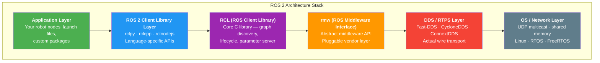
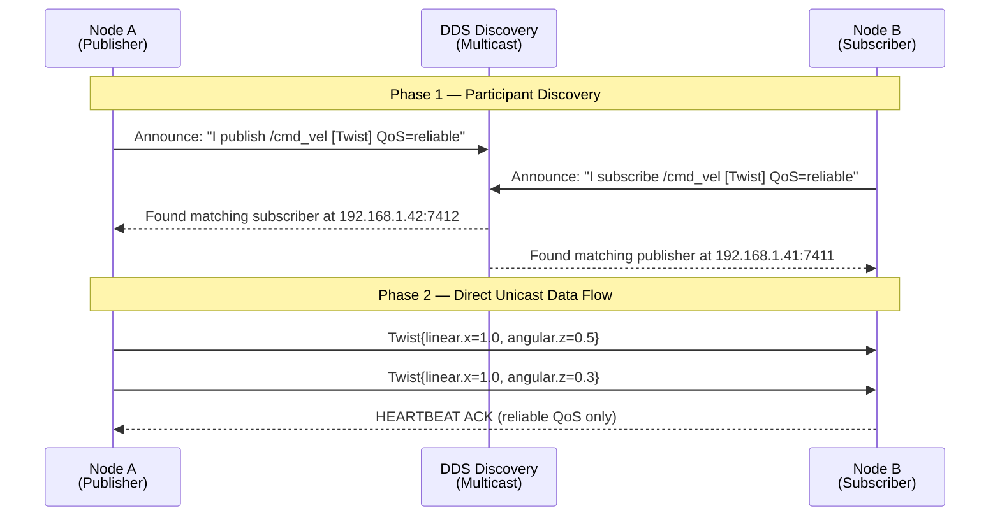
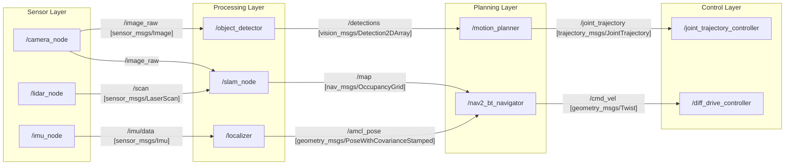

# ROS 2 Architecture & Core Concepts

**Week 3 — Module 1: The Robotic Nervous System**

---

## Learning Objectives

By the end of this chapter, you will be able to:

1. Explain the layered architecture of ROS 2 and how it differs from ROS 1.
2. Describe how DDS (Data Distribution Service) acts as the middleware backbone and configure QoS (Quality of Service) policies.
3. Map the components of the ROS 2 computation graph — nodes, topics, services, and actions — onto a conceptual diagram.
4. Create and organize a ROS 2 workspace with multiple packages using the correct directory conventions.
5. Build packages using the `colcon` build system and understand the artifacts it produces.
6. Use the core ROS 2 CLI tools (`ros2 node`, `ros2 topic`, `ros2 service`, `ros2 param`) to introspect a live robot system.

---

## Prerequisites

Before working through this chapter, you should be comfortable with:

- **Linux command line basics** — file navigation, shell scripting, environment variables.
- **Python 3.10+** — functions, classes, imports, and virtual environments.
- **Networking fundamentals** — IP addressing, TCP/UDP, publish/subscribe concepts.
- **Chapter 1 of this book** — Introduction to Physical AI and Humanoid Robotics.

:::note
All code examples assume Ubuntu 22.04 (Jammy) with **ROS 2 Humble Hawksbill** installed. If you are using a different distribution, package names and some API details may differ slightly. The concepts are identical across Humble, Iron, and Rolling.
:::

---

## 1. Why ROS 2 Exists: The Problem with ROS 1

ROS 1, released in 2007, transformed robotics research by providing a unified communication framework that let disparate hardware and software components talk to one another. Researchers could share packages, replay sensor data with `rosbag`, and visualize the robot's state in `rviz` — all without writing custom IPC from scratch.

But ROS 1 had a critical single point of failure: the **ROS Master**. Every node on every machine had to register with a central master process. If the master crashed, the entire robot system lost the ability to discover peers. This was tolerable in a laboratory, but unacceptable in a self-driving car, a surgical robot, or a humanoid assistant operating in a person's home.

ROS 2 was designed from the ground up to eliminate the master and to meet industrial-grade requirements:

| Requirement | ROS 1 | ROS 2 |
|---|---|---|
| Real-time support | No | Yes (via RTPS/DDS) |
| Security | None | SROS2 / DDS Security |
| Multi-robot | Fragile | Native via DDS domains |
| Embedded systems | No | Micro-ROS |
| Python type safety | Minimal | Typed interfaces |
| Build system | catkin / catkin_tools | ament + colcon |

Understanding why ROS 2 was redesigned tells you exactly what each architectural layer is trying to solve.

---

## 2. The ROS 2 Architecture Layers

ROS 2 is composed of five distinct layers stacked on top of one another. Each layer has a well-defined responsibility and communicates only with the layers directly above and below it.



### Layer 1: OS / Network

The foundation. ROS 2 runs on Linux (primary), macOS, and Windows. The network transport is typically UDP multicast for discovery and UDP unicast for data. For high-performance intra-process communication, DDS vendors can use shared memory, bypassing the network entirely.

### Layer 2: DDS / RTPS

**Data Distribution Service (DDS)** is an Object Management Group (OMG) standard for real-time publish/subscribe middleware. DDS uses the **Real-Time Publish-Subscribe (RTPS)** wire protocol. ROS 2 ships with two open-source DDS implementations by default:

- **Fast-DDS** (eProsima) — default in Humble.
- **CycloneDDS** (Eclipse) — popular in production deployments.

You can switch the DDS implementation by changing the `RMW_IMPLEMENTATION` environment variable without recompiling your application code:

```bash
export RMW_IMPLEMENTATION=rmw_cyclonedds_cpp
```

### Layer 3: rmw (ROS Middleware Interface)

`rmw` is a thin C abstraction layer that isolates the RCL from any specific DDS vendor. It defines a vendor-neutral API surface: `rmw_create_node`, `rmw_publish`, `rmw_take`, etc. This is how ROS 2 achieves DDS vendor portability.

### Layer 4: RCL (ROS Client Library)

`rcl` is the core C library shared by all language bindings. It implements:
- **Graph discovery** — finding nodes, topics, services.
- **Lifecycle management** — the managed node state machine.
- **Parameter server** — typed key/value configuration per node.
- **Clock and timer abstractions** — simulation-safe time.

### Layer 5: Language Client Libraries (rclpy / rclcpp)

`rclcpp` (C++) and `rclpy` (Python) wrap `rcl` and `rmw` into idiomatic language-native APIs. This is what you write application code against. `rclpy` uses Python's asyncio-compatible executor model. `rclcpp` exposes template-based publishers and subscribers.

### Layer 6: Application Layer

Your packages live here. A humanoid robot running Boston Dynamics-style locomotion might have dozens of nodes in this layer: a `foot_contact_estimator`, a `whole_body_controller`, a `gaze_planner`, and so on.

---

## 3. DDS Middleware Deep Dive

DDS is not just a transport — it is a complete distributed data management system. Understanding its three core abstractions will make you a significantly better ROS 2 developer.

### 3.1 The DDS Data Model

Every piece of data exchanged over DDS is described by an **IDL (Interface Definition Language)** type. ROS 2 automatically generates IDL from `.msg`, `.srv`, and `.action` files. You write `geometry_msgs/msg/Twist.msg`; the build system generates the DDS IDL.

### 3.2 DDS Discovery

DDS uses a **Participant Discovery Protocol (PDP)** that operates without a central master. Every participant:

1. Broadcasts its own metadata (name, topics published/subscribed, QoS) via UDP multicast.
2. Listens for other participants' broadcasts.
3. When two participants match on a topic name AND type AND compatible QoS, a unicast data channel is established automatically.

This is why ROS 2 works without a master process. Discovery is fully peer-to-peer.



### 3.3 QoS Policies

Quality of Service policies let you tune the reliability-versus-latency trade-off for each topic, service, and action. ROS 2 exposes DDS QoS through the `rclpy.qos` module.

The five most important QoS policies for robotics:

| Policy | Options | Best for |
|---|---|---|
| **Reliability** | `RELIABLE` / `BEST_EFFORT` | Sensor streams vs. commands |
| **Durability** | `VOLATILE` / `TRANSIENT_LOCAL` | Late-joiners (e.g., map server) |
| **History** | `KEEP_LAST(N)` / `KEEP_ALL` | Buffering vs. memory bounds |
| **Deadline** | Duration | Detecting stale controllers |
| **Liveliness** | `AUTOMATIC` / `MANUAL` | Detecting node crashes |

:::tip
Use `BEST_EFFORT` + `KEEP_LAST(1)` for high-frequency sensor data like camera frames or LiDAR point clouds. Dropping an old frame is far better than building a latency backlog. Use `RELIABLE` + `KEEP_LAST(10)` for control commands where every message matters.
:::

:::warning
A publisher and subscriber must have **compatible** QoS policies or the connection will silently fail — no data flows and no error is raised by default. A `RELIABLE` publisher is compatible with a `BEST_EFFORT` subscriber, but a `BEST_EFFORT` publisher is NOT compatible with a `RELIABLE` subscriber. Always check QoS mismatches when debugging "I publish but my subscriber receives nothing."
:::

---

## 4. The ROS 2 Computation Graph

The **computation graph** is the runtime view of a running ROS 2 system — all nodes, topics, services, and parameter servers currently active. It is a directed graph where:

- **Nodes** are vertices (computation units).
- **Topics** are directed edges (data flows).
- **Services** and **Actions** are bidirectional edges (request/response flows).



This graph represents a simplified mobile manipulation robot. In a real humanoid like Figure-02 or H1, the graph has hundreds of nodes and thousands of topic connections. The DDS discovery layer builds this graph automatically — you never manually wire connections.

### 4.1 Nodes

A **node** is the fundamental unit of computation in ROS 2. Each node:
- Has a unique name within its namespace (e.g., `/robot1/camera_node`).
- Runs in its own process OR shares a process with other nodes (composable nodes).
- Has its own parameter server.
- Has its own set of publishers, subscribers, service servers, and action servers.

### 4.2 Topics

A **topic** is a named bus for streaming data. Topics are unidirectional and use the publish/subscribe pattern. Many publishers can write to one topic; many subscribers can read from one topic. Topics have no built-in request/response mechanism.

### 4.3 Services

A **service** is a synchronous (in terms of the interaction model) request/response channel. One node acts as the server; one or more nodes act as clients. Services are appropriate for infrequent, low-latency operations: toggling a camera, querying a parameter, or requesting a path plan.

### 4.4 Actions

An **action** is an asynchronous long-running task with feedback streaming and cancellation support. Actions are built on top of topics and services internally. They are the right tool for commanding a robot arm to move to a target pose — the client sends a goal, the server streams progress feedback, and the client can cancel mid-execution.

We will implement all four patterns in depth in Chapter 3 (Nodes, Topics, Services & Actions).

---

## 5. Workspaces and Packages

### 5.1 The Workspace Concept

A ROS 2 **workspace** is a directory tree that contains one or more ROS 2 packages plus the build artifacts and install tree generated by `colcon`. The workspace provides an isolated, reproducible build environment.

```
ros2_ws/                        ← workspace root
├── src/                        ← source space (your packages live here)
│   ├── my_robot_bringup/
│   ├── my_robot_description/
│   └── my_robot_controller/
├── build/                      ← build space (generated by colcon)
│   ├── my_robot_bringup/
│   └── ...
├── install/                    ← install space (final artifacts)
│   ├── my_robot_bringup/
│   │   ├── lib/
│   │   ├── share/
│   │   └── local_setup.bash
│   └── setup.bash              ← source this to use your workspace
└── log/                        ← colcon build logs
```

:::note
You should ONLY edit files inside `src/`. The `build/`, `install/`, and `log/` directories are fully regenerated by `colcon build` and should not be tracked by version control. Add them to `.gitignore`.
:::

### 5.2 Package Structure

A ROS 2 Python package follows this layout:

```
my_robot_controller/
├── my_robot_controller/        ← Python module (same name as package)
│   ├── __init__.py
│   ├── base_controller.py
│   └── joint_controller.py
├── test/
│   ├── test_base_controller.py
│   └── test_joint_controller.py
├── resource/
│   └── my_robot_controller     ← ament resource marker (empty file)
├── package.xml                 ← package metadata and dependencies
├── setup.py                    ← Python setuptools config
└── setup.cfg                   ← entry points for CLI tools
```

A ROS 2 C++ package uses `CMakeLists.txt` instead of `setup.py`, but the `package.xml` is identical in structure.

### 5.3 package.xml in Detail

The `package.xml` file is the package manifest. It tells `colcon` what the package is named, what version it is, and what other packages it depends on:

```xml
<?xml version="1.0"?>
<?xml-model href="http://download.ros.org/schema/package_format3.xsd"
            schematypens="http://www.w3.org/2001/XMLSchema"?>
<package format="3">
  <name>my_robot_controller</name>
  <version>0.1.0</version>
  <description>
    Joint-level controller for my humanoid robot platform.
  </description>
  <maintainer email="you@example.com">Your Name</maintainer>
  <license>Apache-2.0</license>

  <!-- Build tool — always ament_python for pure-Python packages -->
  <buildtool_depend>ament_python</buildtool_depend>

  <!-- Runtime dependencies -->
  <depend>rclpy</depend>
  <depend>geometry_msgs</depend>
  <depend>sensor_msgs</depend>
  <depend>trajectory_msgs</depend>
  <depend>std_msgs</depend>

  <!-- Test dependencies -->
  <test_depend>ament_copyright</test_depend>
  <test_depend>ament_flake8</test_depend>
  <test_depend>ament_pep257</test_depend>
  <test_depend>pytest</test_depend>

  <export>
    <build_type>ament_python</build_type>
  </export>
</package>
```

---

## 6. Setting Up a ROS 2 Workspace from Scratch

The following script creates a complete, ready-to-build ROS 2 workspace with a single Python package. Run each block in your terminal.

```python
#!/usr/bin/env python3
"""
workspace_setup.py — Automates ROS 2 workspace and package creation.

Run this ONCE to scaffold your workspace. After running, use colcon to build.

Prerequisites:
    sudo apt install python3-colcon-common-extensions ros-humble-rclpy
"""

import os
import subprocess
import textwrap
from pathlib import Path


# ─────────────────────────────────────────────────────────────
# Configuration — edit these to match your project
# ─────────────────────────────────────────────────────────────
WORKSPACE_NAME = "humanoid_ws"
PACKAGE_NAME = "humanoid_controller"
PACKAGE_DESC = "Core controller package for a humanoid robot."
MAINTAINER_NAME = "Your Name"
MAINTAINER_EMAIL = "you@example.com"
HOME = Path.home()
WS_ROOT = HOME / WORKSPACE_NAME
SRC = WS_ROOT / "src"
PKG_ROOT = SRC / PACKAGE_NAME


def run(cmd: str, cwd: Path | None = None) -> None:
    """Run a shell command and raise on failure."""
    result = subprocess.run(
        cmd,
        shell=True,
        cwd=str(cwd) if cwd else None,
        capture_output=True,
        text=True,
    )
    if result.returncode != 0:
        raise RuntimeError(
            f"Command failed: {cmd}\n"
            f"stdout: {result.stdout}\n"
            f"stderr: {result.stderr}"
        )
    print(f"[OK] {cmd}")


def write_file(path: Path, content: str) -> None:
    """Write content to a file, creating parent directories as needed."""
    path.parent.mkdir(parents=True, exist_ok=True)
    path.write_text(textwrap.dedent(content).lstrip())
    print(f"[WRITE] {path}")


def create_workspace_structure() -> None:
    """Create the workspace directory tree."""
    for d in [SRC, PKG_ROOT / PACKAGE_NAME, PKG_ROOT / "test", PKG_ROOT / "resource"]:
        d.mkdir(parents=True, exist_ok=True)
    print(f"[OK] Workspace tree created at {WS_ROOT}")


def write_package_xml() -> None:
    write_file(
        PKG_ROOT / "package.xml",
        f"""\
        <?xml version="1.0"?>
        <?xml-model href="http://download.ros.org/schema/package_format3.xsd"
                    schematypens="http://www.w3.org/2001/XMLSchema"?>
        <package format="3">
          <name>{PACKAGE_NAME}</name>
          <version>0.1.0</version>
          <description>{PACKAGE_DESC}</description>
          <maintainer email="{MAINTAINER_EMAIL}">{MAINTAINER_NAME}</maintainer>
          <license>Apache-2.0</license>
          <buildtool_depend>ament_python</buildtool_depend>
          <depend>rclpy</depend>
          <depend>std_msgs</depend>
          <depend>geometry_msgs</depend>
          <depend>sensor_msgs</depend>
          <test_depend>ament_copyright</test_depend>
          <test_depend>ament_pep257</test_depend>
          <test_depend>pytest</test_depend>
          <export>
            <build_type>ament_python</build_type>
          </export>
        </package>
        """,
    )


def write_setup_py() -> None:
    write_file(
        PKG_ROOT / "setup.py",
        f"""\
        from setuptools import setup, find_packages

        package_name = '{PACKAGE_NAME}'

        setup(
            name=package_name,
            version='0.1.0',
            packages=find_packages(exclude=['test']),
            data_files=[
                ('share/ament_index/resource_index/packages',
                    ['resource/' + package_name]),
                ('share/' + package_name, ['package.xml']),
            ],
            install_requires=['setuptools'],
            zip_safe=True,
            maintainer='{MAINTAINER_NAME}',
            maintainer_email='{MAINTAINER_EMAIL}',
            description='{PACKAGE_DESC}',
            license='Apache-2.0',
            tests_require=['pytest'],
            entry_points={{
                'console_scripts': [
                    # Register executable nodes here, e.g.:
                    # 'my_node = {PACKAGE_NAME}.my_node:main',
                ],
            }},
        )
        """,
    )


def write_setup_cfg() -> None:
    write_file(
        PKG_ROOT / "setup.cfg",
        """\
        [develop]
        script_dir=$base/lib/humanoid_controller
        [install]
        install_scripts=$base/lib/humanoid_controller
        """,
    )


def write_init() -> None:
    write_file(
        PKG_ROOT / PACKAGE_NAME / "__init__.py",
        f'"""ROS 2 package: {PACKAGE_NAME}."""\n',
    )


def write_gitignore() -> None:
    write_file(
        WS_ROOT / ".gitignore",
        """\
        build/
        install/
        log/
        __pycache__/
        *.pyc
        .colcon_install_layout
        """,
    )


def build_workspace() -> None:
    """Source ROS 2 underlay and run colcon build."""
    build_cmd = (
        "bash -c 'source /opt/ros/humble/setup.bash && "
        f"cd {WS_ROOT} && "
        "colcon build --symlink-install'"
    )
    print("\n[BUILD] Running colcon build (this may take a minute)...")
    run(build_cmd)


def main() -> None:
    print(f"Creating ROS 2 workspace: {WS_ROOT}\n")
    create_workspace_structure()
    write_package_xml()
    write_setup_py()
    write_setup_cfg()
    write_init()
    write_gitignore()
    build_workspace()

    print(f"""
╔══════════════════════════════════════════════════════════╗
  Workspace ready!

  To use your workspace in any new terminal:
    source /opt/ros/humble/setup.bash
    source {WS_ROOT}/install/setup.bash

  To add a new node:
    1. Create {PACKAGE_NAME}/<your_node>.py
    2. Add an entry_point in setup.py
    3. Run: colcon build --symlink-install --packages-select {PACKAGE_NAME}
    4. Run: ros2 run {PACKAGE_NAME} <your_node>
╚══════════════════════════════════════════════════════════╝
    """)


if __name__ == "__main__":
    main()
```

---

## 7. The colcon Build System

`colcon` (collective construction) is the build tool that orchestrates building multiple ROS 2 packages in dependency order. It is not a build system itself — it drives CMake, setuptools, or other underlying build systems.

### 7.1 Essential colcon Commands

```bash
# Build all packages in src/
colcon build

# Build with symlink install (Python changes take effect without rebuild)
colcon build --symlink-install

# Build only specific packages (much faster during development)
colcon build --symlink-install --packages-select my_robot_controller

# Build a package and all packages that depend on it
colcon build --packages-up-to my_robot_bringup

# Run tests for all packages
colcon test

# Run tests and see output immediately
colcon test --event-handlers console_direct+

# Show test results
colcon test-result --all
```

### 7.2 Understanding --symlink-install

For Python packages, `--symlink-install` creates symbolic links from the `install/` tree back to your `src/` files instead of copying them. This means you can edit a Python file in `src/` and the change is immediately visible to `ros2 run` — no rebuild needed. For C++ packages this has no effect; you must always recompile after code changes.

:::tip
Create a shell alias for your most common build command:
```bash
alias cb='colcon build --symlink-install --packages-select'
# Usage: cb my_robot_controller
```
Add this to your `~/.bashrc` to make it permanent.
:::

---

## 8. ROS 2 CLI Tools

The ROS 2 CLI is your primary interface for observing, debugging, and interacting with a live robot system. Master these tools before you write a single node.

### 8.1 ros2 node

```bash
# List all active nodes
ros2 node list

# Show detailed info about a node (publishers, subscribers, services)
ros2 node info /my_robot_controller

# Kill a node (sends SIGINT)
# (use Ctrl+C in the terminal where the node is running)
```

### 8.2 ros2 topic

```bash
# List all active topics
ros2 topic list

# List topics with message type annotations
ros2 topic list -t

# Show the message type and QoS info for a topic
ros2 topic info /cmd_vel

# Subscribe and print messages to the terminal
ros2 topic echo /cmd_vel

# Echo only the first 5 messages, then exit
ros2 topic echo /cmd_vel --once  # (just 1 message)

# Check publish rate (Hz) of a topic
ros2 topic hz /camera/image_raw

# Check bandwidth consumed by a topic
ros2 topic bw /camera/image_raw

# Publish a message manually from the CLI
ros2 topic pub /cmd_vel geometry_msgs/msg/Twist \
  "{linear: {x: 0.5, y: 0.0, z: 0.0}, angular: {x: 0.0, y: 0.0, z: 0.2}}"

# Publish once and exit
ros2 topic pub --once /cmd_vel geometry_msgs/msg/Twist \
  "{linear: {x: 0.0, y: 0.0, z: 0.0}, angular: {x: 0.0, y: 0.0, z: 0.0}}"
```

### 8.3 ros2 service

```bash
# List all active services
ros2 service list

# Show the service type
ros2 service type /set_bool

# Find services by type
ros2 service find std_srvs/srv/SetBool

# Show the request/response interface definition
ros2 interface show std_srvs/srv/SetBool

# Call a service from the CLI
ros2 service call /set_bool std_srvs/srv/SetBool "{data: true}"
```

### 8.4 ros2 param

```bash
# List all parameters for a node
ros2 param list /my_controller

# Get a specific parameter value
ros2 param get /my_controller max_velocity

# Set a parameter value at runtime
ros2 param set /my_controller max_velocity 1.5

# Dump all parameters to a YAML file
ros2 param dump /my_controller > my_controller_params.yaml

# Load parameters from a YAML file
ros2 param load /my_controller my_controller_params.yaml
```

### 8.5 ros2 interface

```bash
# Show the definition of any message type
ros2 interface show geometry_msgs/msg/Twist

# List all message packages
ros2 interface packages

# List all messages in a package
ros2 interface package sensor_msgs
```

### 8.6 ros2 bag

```bash
# Record all topics
ros2 bag record -a -o my_recording

# Record specific topics
ros2 bag record /cmd_vel /scan /camera/image_raw -o sensor_recording

# Inspect a recording
ros2 bag info my_recording/

# Replay a recording
ros2 bag play my_recording/
```

:::warning
`ros2 bag record -a` on a robot with cameras and LiDAR will consume disk space very rapidly — easily 500 MB/minute. Always specify the topics you need rather than recording everything with `-a`. Use `ros2 topic bw` first to estimate bandwidth.
:::

---

## 9. Launch Files

While not strictly part of the architecture layers, **launch files** are how you start multi-node systems reproducibly. ROS 2 launch files are Python scripts (not XML as in ROS 1, though XML is still supported).

```python
# humanoid_bringup/launch/robot.launch.py
"""
Launch file that starts the full humanoid robot software stack.
"""

from launch import LaunchDescription
from launch.actions import DeclareLaunchArgument, LogInfo
from launch.substitutions import LaunchConfiguration
from launch_ros.actions import Node


def generate_launch_description() -> LaunchDescription:
    """Build the launch description for the full robot stack."""

    # Declare arguments that can be passed at launch time:
    # ros2 launch humanoid_bringup robot.launch.py use_sim:=true
    use_sim_arg = DeclareLaunchArgument(
        name="use_sim",
        default_value="false",
        description="Whether to run in simulation mode.",
    )

    camera_node = Node(
        package="humanoid_perception",
        executable="camera_node",
        name="camera_node",
        namespace="robot",
        parameters=[
            {
                "frame_rate": 30.0,
                "resolution_width": 1920,
                "resolution_height": 1080,
            }
        ],
        remappings=[
            ("~/image_raw", "/robot/camera/image_raw"),
        ],
    )

    controller_node = Node(
        package="humanoid_controller",
        executable="joint_controller",
        name="joint_controller",
        namespace="robot",
        parameters=[
            {"max_velocity": 1.0},
            {"control_frequency": 500.0},
            {"use_sim": LaunchConfiguration("use_sim")},
        ],
        output="screen",
    )

    return LaunchDescription(
        [
            use_sim_arg,
            LogInfo(msg="Starting humanoid robot software stack..."),
            camera_node,
            controller_node,
        ]
    )
```

---

## 10. Domains and Multi-Robot Systems

DDS uses **domain IDs** to isolate traffic between robot fleets or between a physical robot and a simulation. Nodes in domain 0 cannot see nodes in domain 1.

```bash
# Run a node in domain 42
export ROS_DOMAIN_ID=42
ros2 run my_package my_node

# Or inline
ROS_DOMAIN_ID=42 ros2 run my_package my_node
```

A common convention:
- **Domain 0** — Development and simulation.
- **Domain 1–10** — Individual physical robots.
- **Domain 99** — CI/CD testing pipelines.

This prevents a developer's test commands from interfering with a robot running in the field.

---

## Exercise: Exploring ROS 2 CLI with Turtlesim

**Objective**: Practice all ROS 2 CLI tools against a real (simulated) node.

**Setup** (run each command in a separate terminal):

```bash
# Terminal 1: Source ROS 2 and start turtlesim
source /opt/ros/humble/setup.bash
ros2 run turtlesim turtlesim_node

# Terminal 2: Start the teleoperation node
source /opt/ros/humble/setup.bash
ros2 run turtlesim turtle_teleop_key
```

**Tasks**:

1. **Node inspection** — Run `ros2 node list`. How many nodes are running? Run `ros2 node info /turtlesim`. What topics does it publish? What services does it advertise?

2. **Topic monitoring** — Use `ros2 topic echo /turtle1/pose` to watch the turtle's position update in real time. While the echo is running, press arrow keys in Terminal 2. What changes?

3. **Topic publishing** — Without using the teleop node, make the turtle move in a circle by publishing directly to `/turtle1/cmd_vel`. Use `ros2 interface show geometry_msgs/msg/Twist` first to understand the message format.

4. **Service calls** — Reset the simulation with `ros2 service call /reset std_srvs/srv/Empty {}`. Teleport the turtle to the center with `ros2 service call /turtle1/teleport_absolute turtlesim/srv/TeleportAbsolute "{x: 5.5, y: 5.5, theta: 0.0}"`.

5. **Parameter manipulation** — List all parameters for `/turtlesim`. Change the background color by setting the `background_r`, `background_g`, and `background_b` parameters. You will need to call the `/clear` service to see the change.

6. **Recording and replay** — Record the `/turtle1/cmd_vel` topic for 10 seconds while driving the turtle. Replay the recording. Does the turtle reproduce the same path?

**Expected deliverable**: A brief write-up (250 words) describing what each CLI tool revealed about the running system, plus a screenshot of your rqt_graph (`ros2 run rqt_graph rqt_graph`) showing the node/topic connections.

---

## Key Takeaways

- **ROS 2 eliminated the single point of failure** by replacing the ROS Master with DDS peer-to-peer discovery. Every node can find every other node independently.
- **DDS is not just a transport** — it provides typed data contracts (IDL), flexible QoS policies, and automatic peer discovery. Understanding DDS explains the majority of ROS 2's behavior.
- **QoS policies are critical** — a mismatch between publisher and subscriber QoS silently prevents data flow. Learn the five key policies (Reliability, Durability, History, Deadline, Liveliness) and apply them deliberately.
- **The workspace is your unit of isolation** — `src/` contains your code; `build/` and `install/` are generated artifacts. Use `colcon build --symlink-install` for fast Python development cycles.
- **The CLI tools are your debugger** — before opening a text editor when something is broken, open a terminal and use `ros2 topic echo`, `ros2 node info`, and `ros2 topic hz` to diagnose the problem at the system level.
- **Domain IDs prevent robot interference** — always set `ROS_DOMAIN_ID` deliberately in multi-robot environments.

---

## Review Questions

1. What problem does DDS peer-to-peer discovery solve that the ROS 1 Master introduced? Describe a failure scenario under ROS 1 that cannot occur under ROS 2.

2. Explain the difference between the `rmw` layer and the `rcl` layer. Why does ROS 2 need both?

3. A temperature sensor publishes at 100 Hz on `/temp` with `BEST_EFFORT` QoS. A safety monitor subscribes to `/temp` with `RELIABLE` QoS. Will they communicate? Explain why or why not, and what you would change to fix the mismatch.

4. What is the purpose of `--symlink-install` in `colcon build`? For which language does it make a meaningful difference, and why?

5. You are debugging a robot where `/cmd_vel` is published by the planner but the motor driver is not moving. List three CLI commands you would run in order, and explain what each one tells you.

6. A robotics team deploys three physical robots in the same warehouse. What configuration would you use to ensure robot 1's commands do not interfere with robot 2's subscribers? Write the relevant environment variable export for each robot.

7. In the ROS 2 architecture stack, what is the role of the `rclpy` layer relative to the `rcl` layer? Why is `rcl` written in C rather than Python?
