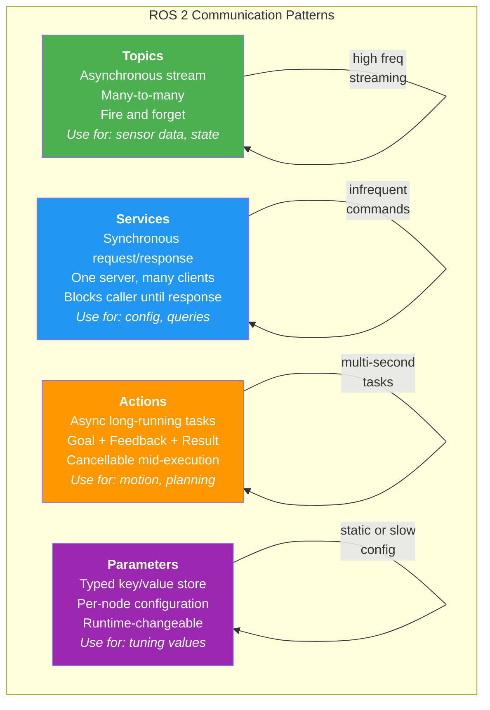
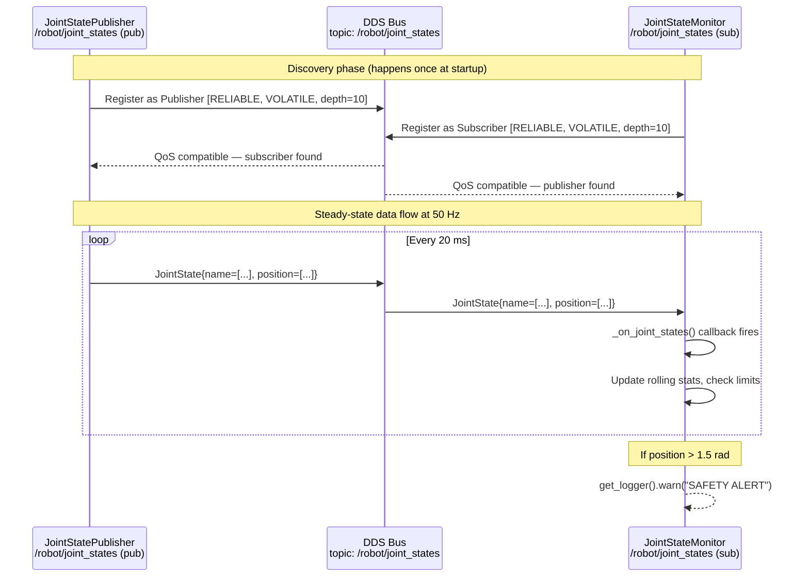
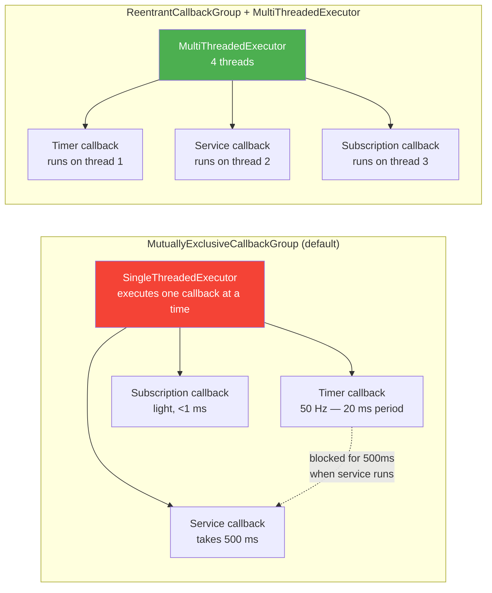

# Nodes, Topics, Services & Actions

**Week 4 — Module 1: The Robotic Nervous System**

---

## Learning Objectives

By the end of this chapter, you will be able to:

1. Implement a publisher and subscriber node in Python using `rclpy` with correct lifecycle management.
2. Select appropriate standard message types from `std_msgs`, `sensor_msgs`, and `geometry_msgs` for common robot data.
3. Write a service server and client in Python, including typed request/response handling.
4. Implement an action server and client that streams feedback and supports goal cancellation.
5. Configure QoS profiles for publishers and subscribers that match real-world sensor and actuator requirements.
6. Use callback groups and multi-threaded executors to prevent callbacks from blocking one another.
7. Design a custom message type and integrate it into a ROS 2 package.

---

## Prerequisites

- **Chapter 2 of this book** (ROS 2 Architecture & Core Concepts) — workspaces, packages, DDS, QoS concepts.
- A working ROS 2 Humble installation with the `humanoid_ws` workspace from Chapter 2 built and sourced.
- Python 3.10+ and familiarity with Python classes and decorators.
- Understanding of concurrency basics — threads, callbacks, event loops.

:::note
Source your workspace before running any code in this chapter:
```bash
source /opt/ros/humble/setup.bash
source ~/humanoid_ws/install/setup.bash
```
:::

---

## 1. The Four Communication Patterns

ROS 2 provides four distinct inter-node communication primitives. Each pattern is optimized for a specific interaction style. Choosing the wrong pattern is a common beginner mistake that leads to systems that are correct but brittle or poorly performing.



The guiding heuristic:

- **Topic**: "I am producing data continuously and do not need acknowledgement."
- **Service**: "I need a one-off answer or I want to trigger something and get a confirmation."
- **Action**: "I am commanding the robot to do something that takes time, and I need progress feedback."
- **Parameter**: "I need to configure a node's behavior without recompiling or redeploying."

---

## 2. Standard Message Types

Before writing any code, you must understand the message types ROS 2 provides. These are the strongly-typed contracts that govern what data can flow on a topic.

### 2.1 std_msgs — Primitive Wrappers

`std_msgs` wraps Python/C++ primitive types in ROS messages:

| Type | Python import | Field | Typical use |
|---|---|---|---|
| `std_msgs/msg/Bool` | `from std_msgs.msg import Bool` | `.data: bool` | Binary signals |
| `std_msgs/msg/Float64` | `from std_msgs.msg import Float64` | `.data: float` | Single float values |
| `std_msgs/msg/Int32` | `from std_msgs.msg import Int32` | `.data: int` | Single int values |
| `std_msgs/msg/String` | `from std_msgs.msg import String` | `.data: str` | Debug strings |
| `std_msgs/msg/Header` | `from std_msgs.msg import Header` | `.stamp`, `.frame_id` | Timestamps + coordinate frames |

:::warning
Avoid using `std_msgs/msg/String` to serialize structured data as JSON or CSV strings. This bypasses ROS 2's type system entirely and loses all QoS guarantees, introspection tools, and type safety. Define a proper custom message instead.
:::

### 2.2 geometry_msgs — Spatial Data

`geometry_msgs` is the backbone of robot spatial reasoning:

```bash
# Inspect any message definition
ros2 interface show geometry_msgs/msg/Twist
# ---
# Vector3 linear
#   float64 x
#   float64 y
#   float64 z
# Vector3 angular
#   float64 x
#   float64 y
#   float64 z

ros2 interface show geometry_msgs/msg/PoseStamped
# ---
# std_msgs/Header header
# Pose pose
#   Point position
#     float64 x / y / z
#   Quaternion orientation
#     float64 x / y / z / w
```

Key types: `Twist` (velocity commands), `Pose` / `PoseStamped` (position+orientation), `Transform` / `TransformStamped` (coordinate frame transforms), `Wrench` (force+torque for physical interaction).

### 2.3 sensor_msgs — Hardware Data

`sensor_msgs` represents standard robot sensor outputs:

| Type | Use case |
|---|---|
| `sensor_msgs/msg/Image` | Camera frames (raw bytes + encoding) |
| `sensor_msgs/msg/LaserScan` | 2D LiDAR scan |
| `sensor_msgs/msg/PointCloud2` | 3D LiDAR / depth camera |
| `sensor_msgs/msg/Imu` | IMU accelerometer + gyroscope |
| `sensor_msgs/msg/JointState` | Robot joint positions/velocities/efforts |
| `sensor_msgs/msg/BatteryState` | Battery voltage, current, state of charge |

---

## 3. Publisher / Subscriber Pattern

The publish/subscribe pattern is the workhorse of ROS 2. Let us build a complete, production-quality publisher first.

### 3.1 Publisher Node

```python
#!/usr/bin/env python3
"""
joint_state_publisher.py — Publishes simulated joint states for a 6-DOF arm.

Run with:
    ros2 run humanoid_controller joint_state_publisher
"""

import math
import time
from typing import Final

import rclpy
from rclpy.node import Node
from rclpy.qos import QoSDurabilityPolicy, QoSProfile, QoSReliabilityPolicy
from sensor_msgs.msg import JointState
from std_msgs.msg import Header


# QoS profile for joint states: reliable, volatile, keep last 10
JOINT_STATE_QOS: Final[QoSProfile] = QoSProfile(
    reliability=QoSReliabilityPolicy.RELIABLE,
    durability=QoSDurabilityPolicy.VOLATILE,
    depth=10,
)

# Joint names for a 6-DOF humanoid arm
JOINT_NAMES: Final[list[str]] = [
    "shoulder_pitch",
    "shoulder_roll",
    "shoulder_yaw",
    "elbow_pitch",
    "wrist_pitch",
    "wrist_roll",
]


class JointStatePublisher(Node):
    """
    Publishes synthetic joint states that simulate a sinusoidal arm sweep.

    This node is designed to demonstrate the publisher pattern with proper
    QoS configuration, parameter handling, and timer-driven callbacks.
    """

    def __init__(self) -> None:
        super().__init__("joint_state_publisher")

        # ── Parameters (configurable at launch or runtime) ──────────────
        self.declare_parameter("publish_rate_hz", 50.0)
        self.declare_parameter("amplitude_rad", 0.5)

        publish_rate = self.get_parameter("publish_rate_hz").value
        self._amplitude: float = self.get_parameter("amplitude_rad").value
        self._start_time: float = time.monotonic()

        # ── Publisher ────────────────────────────────────────────────────
        self._publisher = self.create_publisher(
            msg_type=JointState,
            topic="/robot/joint_states",
            qos_profile=JOINT_STATE_QOS,
        )

        # ── Timer ────────────────────────────────────────────────────────
        period = 1.0 / publish_rate
        self._timer = self.create_timer(period, self._publish_joint_states)

        self.get_logger().info(
            f"JointStatePublisher started — publishing at {publish_rate:.1f} Hz "
            f"on /robot/joint_states"
        )

    def _publish_joint_states(self) -> None:
        """Timer callback: build and publish a JointState message."""
        now = self.get_clock().now()
        elapsed = time.monotonic() - self._start_time

        msg = JointState()

        # Header carries the timestamp and coordinate frame reference
        msg.header = Header()
        msg.header.stamp = now.to_msg()
        msg.header.frame_id = "base_link"

        msg.name = JOINT_NAMES

        # Sinusoidal motion for each joint, offset by phase
        msg.position = [
            self._amplitude * math.sin(elapsed + i * 0.5)
            for i in range(len(JOINT_NAMES))
        ]
        msg.velocity = [
            self._amplitude * math.cos(elapsed + i * 0.5)
            for i in range(len(JOINT_NAMES))
        ]
        # Effort (torque) — zeros for this demo
        msg.effort = [0.0] * len(JOINT_NAMES)

        self._publisher.publish(msg)


def main(args: list[str] | None = None) -> None:
    """Entry point registered in setup.py console_scripts."""
    rclpy.init(args=args)
    node = JointStatePublisher()
    try:
        rclpy.spin(node)
    except KeyboardInterrupt:
        pass
    finally:
        node.destroy_node()
        rclpy.shutdown()


if __name__ == "__main__":
    main()
```

### 3.2 Subscriber Node

```python
#!/usr/bin/env python3
"""
joint_state_monitor.py — Subscribes to joint states and logs anomalies.

Run with:
    ros2 run humanoid_controller joint_state_monitor
"""

from collections import deque
from typing import Final

import rclpy
from rclpy.node import Node
from rclpy.qos import QoSDurabilityPolicy, QoSProfile, QoSReliabilityPolicy
from sensor_msgs.msg import JointState


JOINT_STATE_QOS: Final[QoSProfile] = QoSProfile(
    reliability=QoSReliabilityPolicy.RELIABLE,
    durability=QoSDurabilityPolicy.VOLATILE,
    depth=10,
)

# Safety limit in radians — alert if any joint exceeds this
POSITION_LIMIT_RAD: Final[float] = 1.5
# Rolling window size for velocity statistics
WINDOW_SIZE: Final[int] = 50


class JointStateMonitor(Node):
    """
    Monitors joint states and raises safety alerts for limit violations.

    Demonstrates the subscriber pattern with stateful callback processing,
    rolling statistics, and structured logging.
    """

    def __init__(self) -> None:
        super().__init__("joint_state_monitor")

        self.declare_parameter("position_limit_rad", POSITION_LIMIT_RAD)
        self._limit: float = self.get_parameter("position_limit_rad").value

        # Rolling history: joint_name -> deque of recent positions
        self._position_history: dict[str, deque[float]] = {}

        # Subscriber
        self._subscription = self.create_subscription(
            msg_type=JointState,
            topic="/robot/joint_states",
            callback=self._on_joint_states,
            qos_profile=JOINT_STATE_QOS,
        )

        self.get_logger().info(
            f"JointStateMonitor active — limit={self._limit:.2f} rad"
        )

    def _on_joint_states(self, msg: JointState) -> None:
        """
        Callback invoked for every received JointState message.

        This runs in the executor thread. Keep it fast — heavy computation
        should be offloaded to a separate thread or process.
        """
        if not msg.name:
            self.get_logger().warn("Received JointState with no joint names.")
            return

        for name, position in zip(msg.name, msg.position):
            # Initialize rolling window if first message for this joint
            if name not in self._position_history:
                self._position_history[name] = deque(maxlen=WINDOW_SIZE)

            self._position_history[name].append(position)

            # Safety check: warn if joint exceeds soft limit
            if abs(position) > self._limit:
                self.get_logger().warn(
                    f"SAFETY ALERT: Joint '{name}' at {position:.4f} rad "
                    f"exceeds limit ±{self._limit:.2f} rad"
                )

    def get_joint_statistics(self) -> dict[str, dict[str, float]]:
        """
        Return mean and peak position for each tracked joint.

        Public method — can be called externally or from a service callback.
        """
        stats = {}
        for name, history in self._position_history.items():
            if history:
                values = list(history)
                stats[name] = {
                    "mean": sum(values) / len(values),
                    "peak": max(abs(v) for v in values),
                    "count": len(values),
                }
        return stats


def main(args: list[str] | None = None) -> None:
    rclpy.init(args=args)
    node = JointStateMonitor()
    try:
        rclpy.spin(node)
    except KeyboardInterrupt:
        pass
    finally:
        node.destroy_node()
        rclpy.shutdown()


if __name__ == "__main__":
    main()
```

### 3.3 Pub/Sub Interaction Diagram



---

## 4. Service / Client Pattern

Services implement synchronous request/response. The client blocks (in terms of the interaction model) until the server replies. Under the hood, services in ROS 2 are implemented over DDS, not TCP, so they benefit from DDS discovery and QoS.

### 4.1 Service Server

```python
#!/usr/bin/env python3
"""
calibration_service.py — Service server for sensor calibration requests.

Run with:
    ros2 run humanoid_controller calibration_service

Test with:
    ros2 service call /calibrate_imu \
      humanoid_interfaces/srv/CalibrateImu \
      "{duration_seconds: 5.0, joint_name: 'shoulder_pitch'}"
"""

import time

import rclpy
from rclpy.node import Node
from std_srvs.srv import Trigger


class CalibrationService(Node):
    """
    Provides a /calibrate service that simulates sensor calibration.

    Uses std_srvs/srv/Trigger for simplicity. In production this would
    use a custom service type with calibration parameters and results.
    """

    def __init__(self) -> None:
        super().__init__("calibration_service")

        self._is_calibrated: bool = False
        self._calibration_count: int = 0

        # Create the service server
        # Signature: create_service(type, name, callback)
        self._service = self.create_service(
            srv_type=Trigger,
            srv_name="/calibrate",
            callback=self._handle_calibration,
        )

        self.get_logger().info("CalibrationService ready — waiting for requests.")

    def _handle_calibration(
        self,
        request: Trigger.Request,
        response: Trigger.Response,
    ) -> Trigger.Response:
        """
        Service callback. Called in the executor thread when a client calls.

        IMPORTANT: This callback runs synchronously — it blocks the executor
        while executing. For long operations (>10 ms) you must either:
          1. Use a ReentrantCallbackGroup + MultiThreadedExecutor, OR
          2. Dispatch to a background thread and return immediately.
        """
        self.get_logger().info(
            f"Calibration request #{self._calibration_count + 1} received."
        )

        # Simulate calibration work (in production: zero IMU offsets, etc.)
        time.sleep(0.5)  # 500 ms simulated calibration
        self._is_calibrated = True
        self._calibration_count += 1

        response.success = True
        response.message = (
            f"Calibration #{self._calibration_count} completed successfully. "
            f"Sensor offsets zeroed."
        )

        self.get_logger().info(f"Calibration complete: {response.message}")
        return response


def main(args: list[str] | None = None) -> None:
    rclpy.init(args=args)
    node = CalibrationService()
    try:
        rclpy.spin(node)
    except KeyboardInterrupt:
        pass
    finally:
        node.destroy_node()
        rclpy.shutdown()


if __name__ == "__main__":
    main()
```

### 4.2 Service Client

```python
#!/usr/bin/env python3
"""
calibration_client.py — Calls the /calibrate service and handles the response.

Run with:
    ros2 run humanoid_controller calibration_client
"""

import sys

import rclpy
from rclpy.node import Node
from std_srvs.srv import Trigger


class CalibrationClient(Node):
    """
    One-shot service client that calls /calibrate and exits.

    Demonstrates synchronous wait_for_service(), async call_async(), and
    proper spin_until_future_complete() usage.
    """

    def __init__(self) -> None:
        super().__init__("calibration_client")

        # Create the client
        self._client = self.create_client(
            srv_type=Trigger,
            srv_name="/calibrate",
        )

    def send_calibration_request(self) -> bool:
        """
        Block until the service is available, then send a request.

        Returns True if calibration succeeded, False otherwise.
        """
        # Wait for the server to come online
        self.get_logger().info("Waiting for /calibrate service...")
        if not self._client.wait_for_service(timeout_sec=5.0):
            self.get_logger().error(
                "/calibrate service not available after 5 seconds. "
                "Is calibration_service running?"
            )
            return False

        request = Trigger.Request()
        # call_async returns a Future — non-blocking
        future = self._client.call_async(request)

        self.get_logger().info("Request sent, waiting for response...")

        # spin_until_future_complete processes callbacks until the future resolves
        rclpy.spin_until_future_complete(self, future, timeout_sec=10.0)

        if future.done():
            response: Trigger.Response = future.result()
            if response.success:
                self.get_logger().info(f"SUCCESS: {response.message}")
                return True
            else:
                self.get_logger().error(f"FAILED: {response.message}")
                return False
        else:
            self.get_logger().error("Request timed out after 10 seconds.")
            return False


def main(args: list[str] | None = None) -> None:
    rclpy.init(args=args)
    node = CalibrationClient()

    success = node.send_calibration_request()

    node.destroy_node()
    rclpy.shutdown()

    sys.exit(0 if success else 1)


if __name__ == "__main__":
    main()
```

---

## 5. Action Server / Client Pattern

Actions are the right tool for multi-second robot commands. They combine three channels into one coherent interface:

1. **Goal** — sent by the client to start the task.
2. **Feedback** — streamed by the server to report progress.
3. **Result** — sent once when the task completes, fails, or is cancelled.

### 5.1 Defining the Action Interface

First, create the action definition file. In your package's `action/` directory:

```
# action/MoveArm.action
# ── Goal ──────────────────────────────────
# Target joint positions in radians
float64[] target_positions
float64   max_velocity_rad_per_sec
string    motion_profile        # "trapezoidal" | "cubic_spline"
---
# ── Result ────────────────────────────────
bool     success
string   message
float64  final_error_rad        # max joint error at completion
---
# ── Feedback ──────────────────────────────
float64[] current_positions
float64   percent_complete
float64   estimated_seconds_remaining
```

### 5.2 Action Server

```python
#!/usr/bin/env python3
"""
arm_action_server.py — Action server for executing arm motion goals.

Run with:
    ros2 run humanoid_controller arm_action_server
"""

import time
from typing import Final

import rclpy
from rclpy.action import ActionServer, CancelResponse, GoalResponse
from rclpy.callback_groups import ReentrantCallbackGroup
from rclpy.executors import MultiThreadedExecutor
from rclpy.node import Node

# In a real package this import would be:
# from humanoid_interfaces.action import MoveArm
# For this example we use the standard FollowJointTrajectory as a stand-in
# and show the MoveArm pattern structurally.
from action_msgs.msg import GoalStatus  # noqa: F401 — for reference

# Simulated joint count for a 6-DOF arm
NUM_JOINTS: Final[int] = 6
# Simulated control loop frequency (Hz)
CONTROL_HZ: Final[float] = 50.0


class ArmActionServer(Node):
    """
    Action server that simulates moving a 6-DOF arm to a target pose.

    Key design decisions demonstrated here:
    - ReentrantCallbackGroup allows concurrent goal handling.
    - execute_callback runs in a thread, not blocking the executor.
    - Proper cancellation checking inside the control loop.
    """

    def __init__(self) -> None:
        super().__init__("arm_action_server")

        # ReentrantCallbackGroup is required for action servers — the
        # execute callback must run concurrently with goal/cancel callbacks
        self._callback_group = ReentrantCallbackGroup()

        # Import here to avoid top-level import failure in environments
        # without humanoid_interfaces built. Replace with your actual action.
        try:
            from humanoid_interfaces.action import MoveArm  # type: ignore
            self._action_type = MoveArm
        except ImportError:
            self.get_logger().warn(
                "humanoid_interfaces not found — using mock action type."
            )
            self._action_type = None

        # Current simulated joint positions
        self._current_positions: list[float] = [0.0] * NUM_JOINTS

        if self._action_type is not None:
            self._action_server = ActionServer(
                node=self,
                action_type=self._action_type,
                action_name="/arm/move",
                execute_callback=self._execute_move,
                goal_callback=self._goal_callback,
                cancel_callback=self._cancel_callback,
                callback_group=self._callback_group,
            )
            self.get_logger().info("ArmActionServer ready on /arm/move")
        else:
            self.get_logger().warn(
                "Action server not started — missing action interface package."
            )

    def _goal_callback(self, goal_request) -> GoalResponse:
        """
        Called when a new goal arrives. Decide whether to accept or reject.

        This runs synchronously in the executor thread — keep it fast.
        """
        target = goal_request.target_positions
        self.get_logger().info(
            f"Goal received: {len(target)} joints, "
            f"max_vel={goal_request.max_velocity_rad_per_sec:.2f} rad/s"
        )

        # Reject goals with invalid joint count
        if len(target) != NUM_JOINTS:
            self.get_logger().warn(
                f"Rejecting goal: expected {NUM_JOINTS} joints, "
                f"got {len(target)}."
            )
            return GoalResponse.REJECT

        # Reject goals with out-of-range targets
        if any(abs(p) > 2.0 for p in target):
            self.get_logger().warn("Rejecting goal: target positions exceed ±2.0 rad.")
            return GoalResponse.REJECT

        return GoalResponse.ACCEPT

    def _cancel_callback(self, goal_handle) -> CancelResponse:
        """
        Called when a client requests cancellation.

        Always accept cancellation requests — do not block them.
        The execute callback is responsible for checking and acting on them.
        """
        self.get_logger().info("Cancellation requested.")
        return CancelResponse.ACCEPT

    async def _execute_move(self, goal_handle) -> object:
        """
        Main execution callback. Runs in a thread via the MultiThreadedExecutor.

        This is where the actual robot motion happens. In a real system this
        would command the hardware interface at the control loop rate.
        """
        goal = goal_handle.request
        target_positions = list(goal.target_positions)
        max_velocity = goal.max_velocity_rad_per_sec or 0.5

        self.get_logger().info(
            f"Executing move: targets={[f'{p:.3f}' for p in target_positions]}"
        )

        # Create the Result message (will be filled on completion)
        result = self._action_type.Result()

        # Create the Feedback message (will be updated each iteration)
        feedback = self._action_type.Feedback()

        # Simulate motion: linearly interpolate to target over N steps
        num_steps = int(3.0 * CONTROL_HZ)  # 3-second nominal motion
        dt = 1.0 / CONTROL_HZ

        for step in range(num_steps):
            # Check for cancellation at every control cycle
            if goal_handle.is_cancel_requested:
                goal_handle.canceled()
                result.success = False
                result.message = "Motion cancelled by client."
                result.final_error_rad = max(
                    abs(t - c)
                    for t, c in zip(target_positions, self._current_positions)
                )
                self.get_logger().info("Goal cancelled mid-motion.")
                return result

            # Interpolate positions (linear for simplicity)
            alpha = (step + 1) / num_steps
            self._current_positions = [
                start + alpha * (end - start)
                for start, end in zip(
                    self._current_positions, target_positions
                )
            ]

            # Publish feedback
            feedback.current_positions = self._current_positions
            feedback.percent_complete = alpha * 100.0
            feedback.estimated_seconds_remaining = (
                (num_steps - step - 1) * dt
            )
            goal_handle.publish_feedback(feedback)

            time.sleep(dt)  # Simulate control loop timing

        # Motion complete — check final error
        final_error = max(
            abs(t - c)
            for t, c in zip(target_positions, self._current_positions)
        )

        goal_handle.succeed()
        result.success = True
        result.message = f"Motion complete. Final error: {final_error:.4f} rad."
        result.final_error_rad = final_error

        self.get_logger().info(result.message)
        return result


def main(args: list[str] | None = None) -> None:
    rclpy.init(args=args)
    node = ArmActionServer()
    # MultiThreadedExecutor is REQUIRED for action servers
    executor = MultiThreadedExecutor(num_threads=4)
    executor.add_node(node)
    try:
        executor.spin()
    except KeyboardInterrupt:
        pass
    finally:
        executor.shutdown()
        node.destroy_node()
        rclpy.shutdown()


if __name__ == "__main__":
    main()
```

### 5.3 Action Client

```python
#!/usr/bin/env python3
"""
arm_action_client.py — Sends a goal to the arm action server.

Demonstrates async action client with feedback monitoring and
graceful cancellation on timeout.

Run with:
    ros2 run humanoid_controller arm_action_client
"""

import math
import sys
import time

import rclpy
from rclpy.action import ActionClient
from rclpy.node import Node


class ArmActionClient(Node):
    """
    Sends a goal to /arm/move and monitors feedback until completion.
    """

    def __init__(self) -> None:
        super().__init__("arm_action_client")

        try:
            from humanoid_interfaces.action import MoveArm  # type: ignore
            self._action_type = MoveArm
        except ImportError:
            self.get_logger().error(
                "humanoid_interfaces not found. Cannot create action client."
            )
            self._action_type = None
            return

        self._client = ActionClient(
            node=self,
            action_type=self._action_type,
            action_name="/arm/move",
        )

        self._goal_handle = None
        self._result_future = None

    def send_goal(
        self,
        target_positions: list[float],
        max_velocity: float = 0.5,
        timeout_sec: float = 30.0,
    ) -> bool:
        """
        Send a MoveArm goal and wait for completion.

        Returns True if the motion succeeded, False otherwise.
        """
        if self._action_type is None:
            return False

        self.get_logger().info("Waiting for /arm/move action server...")
        if not self._client.wait_for_server(timeout_sec=5.0):
            self.get_logger().error("Action server not available after 5 seconds.")
            return False

        goal = self._action_type.Goal()
        goal.target_positions = target_positions
        goal.max_velocity_rad_per_sec = max_velocity
        goal.motion_profile = "trapezoidal"

        self.get_logger().info(
            f"Sending goal: targets={[f'{p:.3f}' for p in target_positions]}"
        )

        send_future = self._client.send_goal_async(
            goal,
            feedback_callback=self._on_feedback,
        )
        rclpy.spin_until_future_complete(self, send_future, timeout_sec=5.0)

        if not send_future.done():
            self.get_logger().error("Goal send timed out.")
            return False

        self._goal_handle = send_future.result()
        if not self._goal_handle.accepted:
            self.get_logger().error("Goal was rejected by the server.")
            return False

        self.get_logger().info("Goal accepted — waiting for result...")

        # Get the result future and spin until complete or timeout
        self._result_future = self._goal_handle.get_result_async()

        deadline = time.monotonic() + timeout_sec
        while not self._result_future.done():
            rclpy.spin_once(self, timeout_sec=0.1)
            if time.monotonic() > deadline:
                self.get_logger().warn("Timeout reached — cancelling goal.")
                self._goal_handle.cancel_goal_async()
                return False

        result_response = self._result_future.result()
        result = result_response.result

        if result.success:
            self.get_logger().info(f"Goal succeeded: {result.message}")
            return True
        else:
            self.get_logger().error(f"Goal failed: {result.message}")
            return False

    def _on_feedback(self, feedback_msg) -> None:
        """Feedback callback — called each time the server publishes feedback."""
        fb = feedback_msg.feedback
        self.get_logger().info(
            f"Progress: {fb.percent_complete:.1f}% | "
            f"ETA: {fb.estimated_seconds_remaining:.1f}s | "
            f"pos[0]={fb.current_positions[0]:.3f} rad"
        )


def main(args: list[str] | None = None) -> None:
    rclpy.init(args=args)
    node = ArmActionClient()

    # Send the arm to a 45-degree raised position on all joints
    target = [math.pi / 4] * 6  # 0.785 rad on all 6 joints

    success = node.send_goal(
        target_positions=target,
        max_velocity=0.3,
        timeout_sec=15.0,
    )

    node.destroy_node()
    rclpy.shutdown()
    sys.exit(0 if success else 1)


if __name__ == "__main__":
    main()
```

---

## 6. Callback Groups and Executors

This is one of the most misunderstood aspects of `rclpy`. Understanding it prevents subtle bugs where callbacks silently starve each other.

### 6.1 The Problem: Blocking Callbacks

By default, all callbacks in a node share a single **MutuallyExclusiveCallbackGroup**. This means only ONE callback can execute at a time. If your service callback takes 500 ms, your 50 Hz timer callback will miss its deadline by exactly 500 ms.



### 6.2 Callback Group Types

| Group | Concurrent? | Use when |
|---|---|---|
| `MutuallyExclusiveCallbackGroup` | No — one at a time | Default; simple nodes with no blocking calls |
| `ReentrantCallbackGroup` | Yes — any number | Action servers; nodes with blocking I/O; mixed fast/slow callbacks |

### 6.3 Mixed Callback Group Example

```python
#!/usr/bin/env python3
"""
mixed_callback_node.py — Demonstrates ReentrantCallbackGroup usage.

The slow service callback does not block the fast timer callback.
"""

import time

import rclpy
from rclpy.callback_groups import MutuallyExclusiveCallbackGroup, ReentrantCallbackGroup
from rclpy.executors import MultiThreadedExecutor
from rclpy.node import Node
from std_msgs.msg import Float64
from std_srvs.srv import Trigger


class MixedCallbackNode(Node):
    """
    Combines a 50 Hz timer callback with a slow service callback.

    Without callback groups and a multi-threaded executor, the service
    would block the timer. With them, both run independently.
    """

    def __init__(self) -> None:
        super().__init__("mixed_callback_node")

        # Fast callbacks share a mutually exclusive group
        self._fast_group = MutuallyExclusiveCallbackGroup()
        # Slow callbacks get their own reentrant group
        self._slow_group = ReentrantCallbackGroup()

        # Fast publisher + timer (50 Hz)
        self._pub = self.create_publisher(Float64, "/sensor_value", 10)
        self._timer = self.create_timer(
            0.02,  # 50 Hz
            self._fast_timer_cb,
            callback_group=self._fast_group,
        )

        # Slow service (simulates 500 ms calibration)
        self._service = self.create_service(
            Trigger,
            "/calibrate",
            self._slow_service_cb,
            callback_group=self._slow_group,  # runs on its own thread
        )

        self._counter = 0
        self.get_logger().info("MixedCallbackNode running.")

    def _fast_timer_cb(self) -> None:
        """Runs at 50 Hz — must never be blocked by the service."""
        msg = Float64()
        msg.data = float(self._counter)
        self._pub.publish(msg)
        self._counter += 1

    def _slow_service_cb(
        self, request: Trigger.Request, response: Trigger.Response
    ) -> Trigger.Response:
        """Runs on its own thread — takes 500 ms but does not block the timer."""
        self.get_logger().info("Service called — sleeping 500 ms (on separate thread).")
        time.sleep(0.5)
        response.success = True
        response.message = "Calibration done."
        return response


def main(args: list[str] | None = None) -> None:
    rclpy.init(args=args)
    node = MixedCallbackNode()

    # MUST use MultiThreadedExecutor to actually run groups concurrently
    executor = MultiThreadedExecutor(num_threads=4)
    executor.add_node(node)

    try:
        executor.spin()
    except KeyboardInterrupt:
        pass
    finally:
        executor.shutdown()
        node.destroy_node()
        rclpy.shutdown()


if __name__ == "__main__":
    main()
```

:::warning
Declaring a `ReentrantCallbackGroup` alone is not sufficient. You must ALSO use a `MultiThreadedExecutor`. If you use the default `SingleThreadedExecutor` with a `ReentrantCallbackGroup`, callbacks will still run sequentially — `rclpy` will not raise an error, but the concurrency you intended will silently not happen.
:::

---

## 7. QoS Profiles in Practice

The `rclpy.qos` module provides both raw `QoSProfile` construction and several pre-built profiles for common scenarios:

```python
#!/usr/bin/env python3
"""
qos_profiles_demo.py — Shows pre-built and custom QoS profiles.
"""

from rclpy.qos import (
    QoSDurabilityPolicy,
    QoSHistoryPolicy,
    QoSLivelinessPolicy,
    QoSProfile,
    QoSReliabilityPolicy,
    qos_profile_sensor_data,      # BEST_EFFORT, VOLATILE, KEEP_LAST(5)
    qos_profile_system_default,   # RELIABLE, VOLATILE, KEEP_LAST(10)
    qos_profile_services_default, # RELIABLE, VOLATILE, KEEP_LAST(10)
    qos_profile_parameters,       # RELIABLE, VOLATILE, KEEP_LAST(1000)
)
from rclpy.duration import Duration

# ── Pre-built profiles ─────────────────────────────────────────────────────
# Use for camera frames, LiDAR scans, IMU at high frequency
CAMERA_QOS = qos_profile_sensor_data

# ── Custom profiles ────────────────────────────────────────────────────────
# For a map server: transient-local durability so late-joining subscribers
# receive the most recent map immediately upon connecting
MAP_QOS = QoSProfile(
    reliability=QoSReliabilityPolicy.RELIABLE,
    durability=QoSDurabilityPolicy.TRANSIENT_LOCAL,
    history=QoSHistoryPolicy.KEEP_LAST,
    depth=1,  # Only the latest map matters
)

# For a control command topic: reliable with deadline monitoring
CONTROL_QOS = QoSProfile(
    reliability=QoSReliabilityPolicy.RELIABLE,
    durability=QoSDurabilityPolicy.VOLATILE,
    history=QoSHistoryPolicy.KEEP_LAST,
    depth=1,
    deadline=Duration(seconds=0, nanoseconds=10_000_000),  # 10 ms deadline
    liveliness=QoSLivelinessPolicy.AUTOMATIC,
    liveliness_lease_duration=Duration(seconds=1),
)

# For a high-frequency sensor stream where occasional drops are acceptable
LIDAR_QOS = QoSProfile(
    reliability=QoSReliabilityPolicy.BEST_EFFORT,
    durability=QoSDurabilityPolicy.VOLATILE,
    history=QoSHistoryPolicy.KEEP_LAST,
    depth=5,
)

# QoS profile summary for documentation
QOS_PROFILES = {
    "camera": CAMERA_QOS,
    "map": MAP_QOS,
    "control": CONTROL_QOS,
    "lidar": LIDAR_QOS,
}

if __name__ == "__main__":
    for name, profile in QOS_PROFILES.items():
        print(f"\n{name}:")
        print(f"  reliability : {profile.reliability}")
        print(f"  durability  : {profile.durability}")
        print(f"  history     : {profile.history}")
        print(f"  depth       : {profile.depth}")
```

---

## Exercise: Building a Custom Message Type

**Objective**: Define a custom ROS 2 message type, integrate it into a package, publish it from one node, and subscribe to it from another.

### Step 1: Create the Interfaces Package

```bash
# In your workspace src/ directory
cd ~/humanoid_ws/src
ros2 pkg create humanoid_interfaces \
  --build-type ament_cmake \
  --dependencies std_msgs geometry_msgs sensor_msgs

mkdir -p humanoid_interfaces/msg
```

### Step 2: Define the Custom Message

Create the file `humanoid_interfaces/msg/RobotStatus.msg`:

```
# humanoid_interfaces/msg/RobotStatus.msg
# Status report broadcast by the robot's health monitor node.

# Standard header for timestamp and frame ID
std_msgs/Header header

# Robot identity
string robot_id
string firmware_version

# Power system
float32 battery_voltage        # Volts
float32 battery_percent        # 0.0 - 100.0
bool    is_charging

# Safety system
bool    emergency_stop_active
bool    all_limits_ok
string  fault_description      # Empty string if no fault

# Performance
float32 cpu_load_percent       # 0.0 - 100.0
float32 memory_used_percent    # 0.0 - 100.0
uint32  active_node_count
```

### Step 3: Register the Message in CMakeLists.txt

```cmake
# humanoid_interfaces/CMakeLists.txt
cmake_minimum_required(VERSION 3.8)
project(humanoid_interfaces)

find_package(ament_cmake REQUIRED)
find_package(std_msgs REQUIRED)
find_package(geometry_msgs REQUIRED)
find_package(rosidl_default_generators REQUIRED)

rosidl_generate_interfaces(${PROJECT_NAME}
  "msg/RobotStatus.msg"
  DEPENDENCIES std_msgs geometry_msgs
)

ament_export_dependencies(rosidl_default_runtime)
ament_package()
```

### Step 4: Build the Interfaces Package

```bash
cd ~/humanoid_ws
colcon build --packages-select humanoid_interfaces
source install/setup.bash

# Verify the message was generated
ros2 interface show humanoid_interfaces/msg/RobotStatus
```

### Step 5: Write a Publisher Using the Custom Message

```python
#!/usr/bin/env python3
"""
robot_status_publisher.py — Publishes RobotStatus custom messages.

After completing the exercise, this node should be importable as:
    ros2 run humanoid_controller robot_status_publisher
"""

import rclpy
from rclpy.node import Node
from rclpy.qos import QoSProfile, QoSReliabilityPolicy, QoSDurabilityPolicy
from std_msgs.msg import Header

from humanoid_interfaces.msg import RobotStatus  # Our custom message


class RobotStatusPublisher(Node):
    """Periodically broadcasts the robot's operational status."""

    def __init__(self) -> None:
        super().__init__("robot_status_publisher")

        qos = QoSProfile(
            reliability=QoSReliabilityPolicy.RELIABLE,
            durability=QoSDurabilityPolicy.TRANSIENT_LOCAL,
            depth=1,
        )

        self._pub = self.create_publisher(RobotStatus, "/robot/status", qos)
        self._timer = self.create_timer(1.0, self._publish_status)  # 1 Hz

        self.get_logger().info("RobotStatusPublisher started.")

    def _publish_status(self) -> None:
        msg = RobotStatus()
        msg.header = Header()
        msg.header.stamp = self.get_clock().now().to_msg()
        msg.header.frame_id = "base_link"

        msg.robot_id = "humanoid-001"
        msg.firmware_version = "2.1.4"

        msg.battery_voltage = 48.2
        msg.battery_percent = 87.5
        msg.is_charging = False

        msg.emergency_stop_active = False
        msg.all_limits_ok = True
        msg.fault_description = ""

        msg.cpu_load_percent = 34.2
        msg.memory_used_percent = 61.8
        msg.active_node_count = 47

        self._pub.publish(msg)
        self.get_logger().debug(
            f"Published status: battery={msg.battery_percent:.1f}% "
            f"cpu={msg.cpu_load_percent:.1f}%"
        )


def main(args: list[str] | None = None) -> None:
    rclpy.init(args=args)
    node = RobotStatusPublisher()
    try:
        rclpy.spin(node)
    except KeyboardInterrupt:
        pass
    finally:
        node.destroy_node()
        rclpy.shutdown()


if __name__ == "__main__":
    main()
```

**Expected deliverables**:
1. `humanoid_interfaces/msg/RobotStatus.msg` (or your own variant with at least 8 fields).
2. A publisher node that populates and sends the message at 1 Hz.
3. A subscriber node that receives the message and logs a warning if `battery_percent < 20.0` or `emergency_stop_active == True`.
4. A screenshot of `ros2 topic echo /robot/status` showing live data.
5. A screenshot of `ros2 interface show humanoid_interfaces/msg/RobotStatus` confirming the message was generated correctly.

:::tip
After adding a new `.msg` file, you must rebuild the interfaces package AND re-source your workspace before the new type becomes available to Python imports. The typical workflow is:
```bash
colcon build --packages-select humanoid_interfaces && source install/setup.bash
```
:::

---

## Key Takeaways

- **Choose your communication pattern deliberately**: Topics for streaming data, Services for one-shot queries, Actions for long-running commanded tasks, Parameters for configuration. The wrong choice produces code that works in demos but fails under real system load.
- **QoS is not optional**: Every publisher/subscriber pair has QoS policies whether you set them or not. Understand the defaults and override them intentionally for sensor streams, control commands, and map data.
- **Callback groups and executors are tightly coupled**: A `ReentrantCallbackGroup` only provides concurrency when paired with a `MultiThreadedExecutor`. Forgetting the executor is a silent bug.
- **Custom message types are the right abstraction boundary**: When you find yourself serializing structured data into a `String` message, that is a signal to define a proper `.msg` file.
- **The Header stamp is your time reference**: Always populate `header.stamp` from `self.get_clock().now()`, not from Python's `time.time()`. The ROS clock is simulation-aware — wall-clock time breaks recorded playback.
- **Actions enable safe robot commanding**: The goal/feedback/result pattern with cancellation is what separates a toy robot demo from a production system. Learn action servers early; they appear everywhere in real humanoid robot stacks.

---

## Review Questions

1. A node subscribes to a camera topic at 30 Hz with `RELIABLE` QoS, but the camera publishes with `BEST_EFFORT` QoS. What happens to the connection, and how would you fix it?

2. Explain the difference between a ROS 2 Service and a ROS 2 Action. Give a concrete example of a robot task that requires an Action instead of a Service, and explain why.

3. You have a node with a 1 kHz control loop timer callback and a service that takes 50 ms to respond. Without changing the service implementation, how do you prevent the service from blocking the control loop? Write the relevant `rclpy` code (just the executor setup and callback group declarations, not the full node).

4. What is the purpose of `header.frame_id` in `std_msgs/Header`? Why does it matter for a humanoid robot with many moving joints?

5. A subscriber callback receives `JointState` messages. Inside the callback you realize you need to call `self.some_service.call_async(request)` and wait for the result. What problem does this create, and what is the correct architecture to solve it?

6. Describe the three phases of an Action interaction (Goal, Feedback, Result). In each phase, which party (client or server) is the initiator, and what data is transmitted?

7. You are creating a custom message for a force-torque sensor on a robot hand. The sensor measures 6 values (Fx, Fy, Fz, Tx, Ty, Tz) at 1000 Hz. Design the `.msg` file with appropriate field names and types. Justify your choice of `float32` vs `float64` for the force values.
