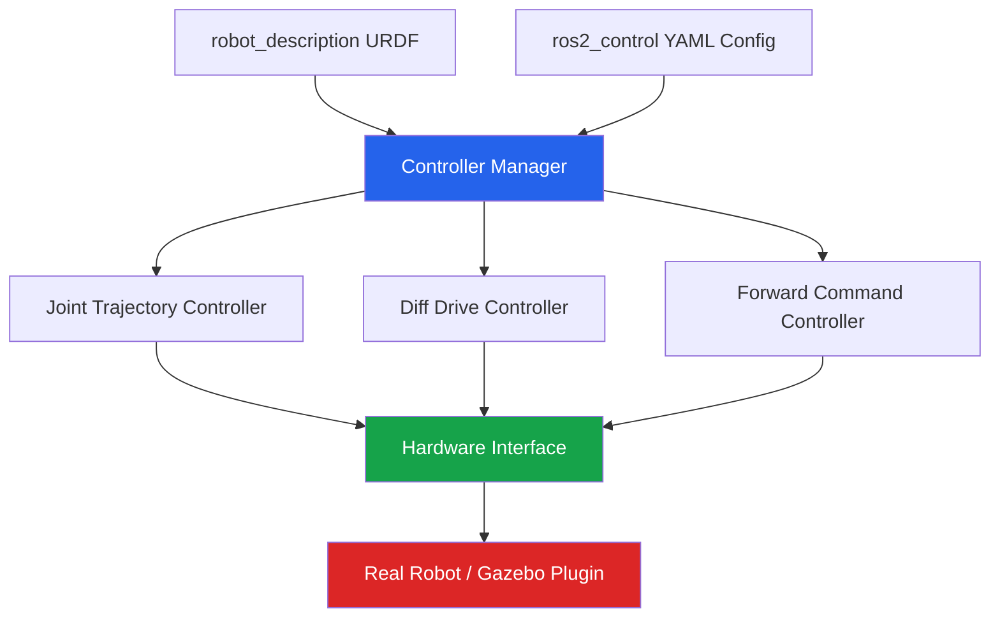

# Building ROS 2 Packages with Python

## Learning Objectives

By the end of this chapter, you will be able to:

- Understand the complete directory structure of an `ament_python` ROS 2 package
- Create a new ROS 2 Python package using the `ros2 pkg create` command
- Register nodes as executable entry points using `setup.py` console scripts
- Write Python launch files using `LaunchDescription`, `Node`, and `DeclareLaunchArgument`
- Declare, load, and override ROS 2 parameters via code and YAML configuration files
- Describe the purpose of `ros2_control` and how it abstracts robot hardware from controllers
- Build and test a multi-node Python package from scratch

---

## Prerequisites

Before working through this chapter you should be comfortable with:

- Writing Python classes and modules (Chapter 2 background)
- The ROS 2 node, topic, and service concepts covered in Chapters 1–3
- A working ROS 2 Humble (or later) installation with `colcon` and `rosdep`
- Basic terminal usage on Linux or WSL2

:::note
All examples in this chapter assume ROS 2 Humble. If you are on a newer distribution the commands and APIs are identical; only certain default paths may differ.
:::

---

## 1. Why Packages Matter in ROS 2

In ROS 2, the **package** is the fundamental unit of software organisation. Every piece of code — whether a sensor driver, a motion planner, or a visualisation tool — lives inside a package. Packages give us:

- **Reproducibility**: anyone who clones your workspace can build and run your code with a single `colcon build`
- **Dependency management**: `package.xml` declares what libraries and other packages your code needs, and `rosdep` can install them automatically
- **Namespace isolation**: every node, topic, service, and parameter is rooted in its package's namespace, preventing name collisions in large systems
- **Reusability**: packages can be installed system-wide or shared as binary `.deb` files via the ROS package infrastructure

ROS 2 supports two build types for Python work:

| Build type | When to use |
|---|---|
| `ament_python` | Pure-Python packages: nodes, utilities, launch files |
| `ament_cmake` with Python bindings | Mixed C++/Python packages or custom message definitions |

In this chapter we focus exclusively on `ament_python` because it covers the vast majority of Python work you will do with humanoid robots.

---

## 2. Anatomy of an `ament_python` Package

When you create a new package, ROS 2 scaffolds the following structure for you:

```
my_robot_bringup/
├── my_robot_bringup/          # Python sub-package (importable module)
│   ├── __init__.py
│   ├── controller_node.py
│   ├── sensor_fusion_node.py
│   └── utils/
│       ├── __init__.py
│       └── math_helpers.py
├── launch/
│   ├── robot.launch.py
│   └── simulation.launch.py
├── config/
│   ├── robot_params.yaml
│   └── sim_params.yaml
├── resource/
│   └── my_robot_bringup         # marker file required by ament
├── test/
│   ├── test_copyright.py
│   ├── test_flake8.py
│   └── test_pep8.py
├── package.xml
├── setup.cfg
└── setup.py
```

Let us examine each important piece.

### 2.1 `package.xml` — Package Metadata and Dependencies

```xml
<?xml version="1.0"?>
<?xml-model href="http://download.ros.org/schema/package_format3.xsd"
            schematypens="http://www.w3.org/2001/XMLSchema"?>
<package format="3">
  <name>my_robot_bringup</name>
  <version>0.1.0</version>
  <description>
    Bringup package for the Panaversity humanoid robot platform.
    Contains top-level launch files, parameter files, and orchestration nodes.
  </description>
  <maintainer email="you@example.com">Your Name</maintainer>
  <license>Apache-2.0</license>

  <!-- Build tool -->
  <buildtool_depend>ament_python</buildtool_depend>

  <!-- Runtime dependencies -->
  <depend>rclpy</depend>
  <depend>std_msgs</depend>
  <depend>sensor_msgs</depend>
  <depend>geometry_msgs</depend>
  <depend>tf2_ros</depend>

  <!-- Launch dependencies -->
  <exec_depend>launch</exec_depend>
  <exec_depend>launch_ros</exec_depend>

  <!-- Test dependencies -->
  <test_depend>ament_copyright</test_depend>
  <test_depend>ament_flake8</test_depend>
  <test_depend>ament_pep8</test_depend>
  <test_depend>python3-pytest</test_depend>

  <export>
    <build_type>ament_python</build_type>
  </export>
</package>
```

:::tip
Use `<depend>` (which implies build + exec + test) for most Python packages. Reserve `<build_depend>` and `<exec_depend>` for packages where you need fine-grained control, such as when a dependency is only needed at compile time (e.g., code generators).
:::

### 2.2 `setup.py` — The Python Distribution Manifest

```python
from setuptools import find_packages, setup
import os
from glob import glob

package_name = 'my_robot_bringup'

setup(
    name=package_name,
    version='0.1.0',
    packages=find_packages(exclude=['test']),
    data_files=[
        # Required ament marker file
        ('share/ament_index/resource_index/packages',
            ['resource/' + package_name]),
        # package.xml must be installed alongside the Python package
        ('share/' + package_name, ['package.xml']),
        # Install all launch files
        (os.path.join('share', package_name, 'launch'),
            glob(os.path.join('launch', '*.launch.py'))),
        # Install all config / parameter files
        (os.path.join('share', package_name, 'config'),
            glob(os.path.join('config', '*.yaml'))),
    ],
    install_requires=['setuptools'],
    zip_safe=True,
    maintainer='Your Name',
    maintainer_email='you@example.com',
    description='Bringup package for the Panaversity humanoid robot.',
    license='Apache-2.0',
    tests_require=['pytest'],
    entry_points={
        'console_scripts': [
            # Format: 'executable_name = package.module:function'
            'controller_node = my_robot_bringup.controller_node:main',
            'sensor_fusion = my_robot_bringup.sensor_fusion_node:main',
        ],
    },
)
```

The `entry_points` dictionary under `console_scripts` is the bridge between the ROS 2 command line and your Python code. After `colcon build`, each entry here becomes a shell script installed in `install/my_robot_bringup/lib/my_robot_bringup/` that calls the specified `main()` function. This is how `ros2 run my_robot_bringup controller_node` knows which function to call.

### 2.3 `setup.cfg` — Wheel Metadata

```ini
[develop]
script_dir=$base/lib/my_robot_bringup

[install]
install_scripts=$base/lib/my_robot_bringup
```

This file redirects the installation of scripts to the location ROS 2 expects them. Without it, executable scripts would land in the wrong directory and `ros2 run` would fail to find them.

### 2.4 The `resource/` Marker File

The empty file at `resource/my_robot_bringup` is an ament index marker. Ament (ROS 2's meta-build system) uses this to quickly discover which packages are installed. The file must be empty and must have exactly the same name as the package.

---

## 3. Creating a Package with `ros2 pkg create`

The fastest way to start a new package is with the built-in package generator:

```bash
cd ~/ros2_ws/src

ros2 pkg create \
  --build-type ament_python \
  --dependencies rclpy std_msgs sensor_msgs geometry_msgs \
  --node-name controller_node \
  my_robot_bringup
```

This single command:

1. Creates the full directory scaffold shown in Section 2
2. Writes a skeleton `package.xml` with your declared `--dependencies`
3. Creates `my_robot_bringup/controller_node.py` with a minimal `main()` function
4. Registers `controller_node` as a console script entry point in `setup.py`

After creation, build immediately to verify the scaffold is valid:

```bash
cd ~/ros2_ws
colcon build --packages-select my_robot_bringup
source install/setup.bash
ros2 run my_robot_bringup controller_node
```

:::note
Always run `source install/setup.bash` after every `colcon build`. The overlay sourcing updates `$PATH`, `$PYTHONPATH`, and `$AMENT_PREFIX_PATH` so the new executables and Python modules are visible.
:::

---

## 4. Writing Nodes with `rclpy`

Here is a complete, production-quality node that demonstrates best practices for Python nodes in ROS 2:

```python
#!/usr/bin/env python3
"""
controller_node.py
------------------
Top-level controller node for the Panaversity humanoid robot.
Subscribes to joint-state goals and publishes command outputs.
"""

import rclpy
from rclpy.node import Node
from rclpy.qos import QoSProfile, ReliabilityPolicy, HistoryPolicy
from sensor_msgs.msg import JointState
from std_msgs.msg import Float64MultiArray


class ControllerNode(Node):
    """Receives joint-state goals and forwards commands to hardware."""

    def __init__(self) -> None:
        super().__init__('controller_node')

        # --- Parameter declarations (see Section 6) ---
        self.declare_parameter('control_rate_hz', 100.0)
        self.declare_parameter('joint_names', ['shoulder', 'elbow', 'wrist'])
        self.declare_parameter('max_velocity_rad_s', 1.5)

        rate_hz: float = self.get_parameter('control_rate_hz').value
        self._joint_names: list[str] = self.get_parameter('joint_names').value
        self._max_vel: float = self.get_parameter('max_velocity_rad_s').value

        self.get_logger().info(
            f'Controller starting at {rate_hz} Hz, '
            f'joints: {self._joint_names}'
        )

        # --- QoS profiles ---
        reliable_qos = QoSProfile(
            reliability=ReliabilityPolicy.RELIABLE,
            history=HistoryPolicy.KEEP_LAST,
            depth=10,
        )

        # --- Subscriber ---
        self._goal_sub = self.create_subscription(
            JointState,
            '/joint_goals',
            self._goal_callback,
            reliable_qos,
        )

        # --- Publisher ---
        self._cmd_pub = self.create_publisher(
            Float64MultiArray,
            '/joint_commands',
            reliable_qos,
        )

        # --- Control loop timer ---
        period_s = 1.0 / rate_hz
        self._timer = self.create_timer(period_s, self._control_loop)
        self._latest_goal: JointState | None = None

    # ------------------------------------------------------------------
    def _goal_callback(self, msg: JointState) -> None:
        """Store the latest goal; the control loop will process it."""
        self._latest_goal = msg

    def _control_loop(self) -> None:
        """Run at `control_rate_hz`; publishes clamped velocity commands."""
        if self._latest_goal is None:
            return

        clamped = [
            max(-self._max_vel, min(self._max_vel, v))
            for v in self._latest_goal.velocity
        ]

        cmd_msg = Float64MultiArray()
        cmd_msg.data = clamped
        self._cmd_pub.publish(cmd_msg)


# ----------------------------------------------------------------------
def main(args=None) -> None:
    rclpy.init(args=args)
    node = ControllerNode()
    try:
        rclpy.spin(node)
    except KeyboardInterrupt:
        pass
    finally:
        node.destroy_node()
        rclpy.shutdown()


if __name__ == '__main__':
    main()
```

:::tip
Always put the `rclpy.init()` / `rclpy.shutdown()` calls in `main()`, not in `__init__`. This keeps your node class unit-testable: tests can construct the class without needing a live ROS 2 context.
:::

---

## 5. Launch Files in Python

A **launch file** orchestrates the startup of one or more nodes, optionally remapping topics, passing parameters, and conditionally including other launch files. ROS 2 launch files are plain Python scripts that return a `LaunchDescription` object.

### 5.1 Minimal Single-Node Launch File

```python
# launch/robot.launch.py

from launch import LaunchDescription
from launch_ros.actions import Node


def generate_launch_description() -> LaunchDescription:
    controller = Node(
        package='my_robot_bringup',
        executable='controller_node',
        name='controller',
        output='screen',
    )

    return LaunchDescription([controller])
```

Run it with:

```bash
ros2 launch my_robot_bringup robot.launch.py
```

### 5.2 Full Launch File with Arguments, Remapping, and Parameters

```python
# launch/simulation.launch.py
"""
Launch file for the Panaversity humanoid robot in simulation.

Configurable arguments:
  use_sim_time   -- bool, default true in simulation
  robot_name     -- str,  name prefix for all node namespaces
  config_file    -- path to a YAML parameter file
"""

import os

from ament_index_python.packages import get_package_share_directory
from launch import LaunchDescription
from launch.actions import (
    DeclareLaunchArgument,
    GroupAction,
    IncludeLaunchDescription,
    LogInfo,
)
from launch.conditions import IfCondition, UnlessCondition
from launch.launch_description_sources import PythonLaunchDescriptionSource
from launch.substitutions import (
    LaunchConfiguration,
    PathJoinSubstitution,
)
from launch_ros.actions import Node, PushRosNamespace
from launch_ros.substitutions import FindPackageShare


def generate_launch_description() -> LaunchDescription:

    pkg_share = get_package_share_directory('my_robot_bringup')
    default_config = os.path.join(pkg_share, 'config', 'robot_params.yaml')

    # ------------------------------------------------------------------ #
    # Declare command-line arguments
    # ------------------------------------------------------------------ #
    arg_use_sim_time = DeclareLaunchArgument(
        'use_sim_time',
        default_value='true',
        description='Use simulation (Gazebo) clock if true',
    )

    arg_robot_name = DeclareLaunchArgument(
        'robot_name',
        default_value='panaversity_bot',
        description='Namespace prefix for all robot nodes',
    )

    arg_config = DeclareLaunchArgument(
        'config_file',
        default_value=default_config,
        description='Full path to the YAML parameter file',
    )

    # ------------------------------------------------------------------ #
    # Retrieve argument values as substitutions (lazy evaluated)
    # ------------------------------------------------------------------ #
    use_sim_time   = LaunchConfiguration('use_sim_time')
    robot_name     = LaunchConfiguration('robot_name')
    config_file    = LaunchConfiguration('config_file')

    # ------------------------------------------------------------------ #
    # Define nodes
    # ------------------------------------------------------------------ #
    controller_node = Node(
        package='my_robot_bringup',
        executable='controller_node',
        name='controller',
        namespace=robot_name,
        output='screen',
        parameters=[
            config_file,
            {'use_sim_time': use_sim_time},
        ],
        remappings=[
            ('/joint_goals',    '/robot/joint_goals'),
            ('/joint_commands', '/robot/joint_commands'),
        ],
    )

    sensor_fusion_node = Node(
        package='my_robot_bringup',
        executable='sensor_fusion',
        name='sensor_fusion',
        namespace=robot_name,
        output='screen',
        parameters=[config_file],
    )

    log_startup = LogInfo(
        msg=['Launching humanoid robot with name: ', robot_name]
    )

    return LaunchDescription([
        arg_use_sim_time,
        arg_robot_name,
        arg_config,
        log_startup,
        controller_node,
        sensor_fusion_node,
    ])
```

Override arguments at launch time:

```bash
ros2 launch my_robot_bringup simulation.launch.py \
  robot_name:=humanoid_01 \
  use_sim_time:=false \
  config_file:=/home/user/custom_params.yaml
```

:::warning
Always install launch files in `setup.py` under `data_files` (as shown in Section 2.2). If you omit that `glob` entry, `ros2 launch` will not find your launch files after `colcon build`, even though they exist in the source tree. This is one of the most common beginner mistakes.
:::

---

## 6. Parameter Management

Parameters allow you to configure node behaviour without recompiling. In ROS 2, every node owns its parameters; they are typed, introspectable, and can be changed at runtime.

### 6.1 Declaring and Reading Parameters in Code

```python
# Inside __init__:

# Scalar parameters
self.declare_parameter('max_velocity_rad_s', 1.5)
self.declare_parameter('enable_torque_limit', True)
self.declare_parameter('robot_model', 'humanoid_v2')

# List parameter
self.declare_parameter('joint_names', ['hip_l', 'hip_r', 'knee_l', 'knee_r'])

# Read back
max_vel   = self.get_parameter('max_velocity_rad_s').value  # float
torque_ok = self.get_parameter('enable_torque_limit').value  # bool
joints    = self.get_parameter('joint_names').value           # list[str]
```

### 6.2 Reacting to Parameter Changes at Runtime

```python
from rcl_interfaces.msg import SetParametersResult
from rclpy.parameter import Parameter

# Register a callback inside __init__
self.add_on_set_parameters_callback(self._on_params_changed)

def _on_params_changed(
    self, params: list[Parameter]
) -> SetParametersResult:
    for p in params:
        if p.name == 'max_velocity_rad_s':
            if p.value < 0.0:
                return SetParametersResult(
                    successful=False,
                    reason='max_velocity_rad_s must be non-negative'
                )
            self._max_vel = p.value
            self.get_logger().info(f'Updated max velocity to {p.value}')
    return SetParametersResult(successful=True)
```

Change a parameter from another terminal while the node is running:

```bash
ros2 param set /panaversity_bot/controller max_velocity_rad_s 2.0
```

### 6.3 YAML Parameter Files

YAML files let us separate configuration from code and swap profiles easily (e.g., simulation vs. real hardware):

```yaml
# config/robot_params.yaml

/**:             # wildcard — applies to all nodes unless overridden below
  ros__parameters:
    use_sim_time: false

/panaversity_bot/controller:
  ros__parameters:
    control_rate_hz: 200.0
    max_velocity_rad_s: 1.2
    enable_torque_limit: true
    joint_names:
      - hip_pitch_l
      - hip_pitch_r
      - knee_l
      - knee_r
      - ankle_l
      - ankle_r
      - shoulder_l
      - shoulder_r
      - elbow_l
      - elbow_r

/panaversity_bot/sensor_fusion:
  ros__parameters:
    imu_topic: /imu/data_raw
    publish_rate_hz: 100.0
    filter_window_size: 5
    frame_id: base_link
```

Load the file when running a node directly:

```bash
ros2 run my_robot_bringup controller_node \
  --ros-args --params-file ~/ros2_ws/src/my_robot_bringup/config/robot_params.yaml
```

Or pass it in a launch file via the `parameters` list (as shown in Section 5.2).

:::tip
Use the `/**` wildcard key at the top of your YAML to set shared parameters (like `use_sim_time`) once. Node-specific sections below it override only what needs to differ. This avoids repeating `use_sim_time` under every node.
:::

---

## 7. Introduction to `ros2_control`

As we move from simulated robots to physical hardware, we need a principled way to talk to motors, encoders, and actuators without coupling our control algorithms to specific hardware APIs. This is exactly what `ros2_control` provides.

### 7.1 Architecture Overview



The key abstractions are:

| Component | Role |
|---|---|
| **Controller Manager** | Loads, starts, stops, and switches controllers at runtime |
| **Controller** | Implements a control algorithm (PID, trajectory following, etc.) |
| **Hardware Interface** | Speaks to the actual hardware or simulator; exposes state and command interfaces |
| **State Interface** | Read-only data from hardware (position, velocity, effort) |
| **Command Interface** | Write-only data to hardware (position setpoint, velocity command, torque) |

### 7.2 A Minimal `ros2_control` Hardware Description in URDF

```xml
<ros2_control name="panaversity_arm" type="system">
  <hardware>
    <!-- Use the mock hardware for testing without a real robot -->
    <plugin>mock_components/GenericSystem</plugin>
  </hardware>

  <joint name="shoulder_pitch">
    <command_interface name="position">
      <param name="min">-1.5708</param>   <!-- -90 deg -->
      <param name="max">1.5708</param>    <!--  90 deg -->
    </command_interface>
    <state_interface name="position"/>
    <state_interface name="velocity"/>
    <state_interface name="effort"/>
  </joint>

  <joint name="elbow_flex">
    <command_interface name="position">
      <param name="min">0.0</param>
      <param name="max">2.618</param>     <!-- 150 deg -->
    </command_interface>
    <state_interface name="position"/>
    <state_interface name="velocity"/>
  </joint>
</ros2_control>
```

### 7.3 Controller Configuration YAML

```yaml
# config/ros2_control.yaml

controller_manager:
  ros__parameters:
    update_rate: 100  # Hz

    joint_state_broadcaster:
      type: joint_state_broadcaster/JointStateBroadcaster

    arm_controller:
      type: joint_trajectory_controller/JointTrajectoryController

arm_controller:
  ros__parameters:
    joints:
      - shoulder_pitch
      - elbow_flex
    command_interfaces:
      - position
    state_interfaces:
      - position
      - velocity
    open_loop_control: false
    allow_partial_joints_goal: false
```

### 7.4 Loading Controllers in a Launch File

```python
# Inside generate_launch_description():

from launch.actions import TimerAction
from launch_ros.actions import Node

controller_manager = Node(
    package='controller_manager',
    executable='ros2_control_node',
    parameters=[
        robot_description_param,   # {'robot_description': urdf_string}
        ros2_control_config,       # path to ros2_control.yaml
    ],
    output='screen',
)

# Spawners are launched after a short delay to let the CM initialise
joint_state_broadcaster_spawner = Node(
    package='controller_manager',
    executable='spawner',
    arguments=['joint_state_broadcaster', '--controller-manager', '/controller_manager'],
)

arm_controller_spawner = Node(
    package='controller_manager',
    executable='spawner',
    arguments=['arm_controller', '--controller-manager', '/controller_manager'],
)

delay_arm = TimerAction(
    period=2.0,
    actions=[arm_controller_spawner],
)
```

:::note
`ros2_control` is a deep topic that we will revisit in Module 3 when we wire real servo motors to the Raspberry Pi CM4 on the humanoid arm. For now, focus on understanding the layered abstraction: your controller code never calls hardware APIs directly; it writes to command interfaces and reads from state interfaces through the Hardware Interface plugin.
:::

---

## 8. Building and Testing Your Package

### 8.1 Full Build Workflow

```bash
# From the workspace root
cd ~/ros2_ws

# Resolve any missing system dependencies declared in package.xml
rosdep install --from-paths src --ignore-src -r -y

# Build only your package (faster than building everything)
colcon build --packages-select my_robot_bringup --symlink-install

# Source the new overlay
source install/setup.bash

# Verify the node is discoverable
ros2 pkg executables my_robot_bringup
```

The `--symlink-install` flag creates symlinks to your source files instead of copying them. This means edits to Python files take effect immediately without rebuilding — a significant time-saver during development.

### 8.2 Running the Linting Tests

```bash
colcon test --packages-select my_robot_bringup
colcon test-result --verbose
```

The scaffold includes three test files: `test_copyright.py`, `test_flake8.py`, and `test_pep8.py`. Passing all three is required before submitting code to a shared repository.

---

## 9. Chapter Exercise: Multi-Node Bringup Package

Build a package called `arm_bringup` that brings up a simulated 2-DOF arm system. The package must satisfy all of the following requirements:

**Package structure requirements:**
- Package name: `arm_bringup`
- Two nodes: `joint_publisher` (publishes `JointState` at 50 Hz) and `joint_monitor` (subscribes and logs min/max effort values)
- Both nodes registered as console scripts

**Parameter requirements:**
- `joint_publisher` must declare parameters: `publish_rate_hz` (default `50.0`), `joint_names` (default `['shoulder', 'elbow']`), `amplitude_rad` (default `0.5`)
- Parameters must be loadable from a YAML file `config/arm_params.yaml`

**Launch file requirements:**
- One launch file `launch/arm.launch.py` that starts both nodes
- Must accept a `use_sim_time` launch argument (default `false`)
- Must load `config/arm_params.yaml` for both nodes

**Validation:**
```bash
ros2 launch arm_bringup arm.launch.py
# In a second terminal:
ros2 topic echo /joint_states
ros2 param get /joint_publisher publish_rate_hz
ros2 param set /joint_publisher amplitude_rad 1.0
# Verify the published amplitude changes without restarting
```

:::tip
A clean solution is approximately 150 lines of Python across both node files plus the launch file. If your solution is significantly longer, look for opportunities to extract helper functions or use `rclpy.parameter.ParameterType` for cleaner parameter declarations.
:::

---

## Key Takeaways

- An `ament_python` package requires five key files: `package.xml`, `setup.py`, `setup.cfg`, `resource/<pkg_name>`, and the Python sub-package with `__init__.py`.
- Entry points in `setup.py` under `console_scripts` are the bridge between `ros2 run` and your `main()` function.
- Python launch files return a `LaunchDescription`; use `DeclareLaunchArgument` and `LaunchConfiguration` to make launch files configurable from the command line.
- Parameters must be **declared** before they can be read; use YAML files to separate configuration from code.
- `ros2_control` decouples control algorithms from hardware by providing standardised command and state interfaces through the Controller Manager.

---

## Review Questions

1. What is the purpose of the empty file in the `resource/` directory, and what happens if it is missing?
2. Explain the difference between `<depend>`, `<build_depend>`, and `<exec_depend>` in `package.xml`. Give a concrete scenario where you would choose `<exec_depend>` over `<depend>`.
3. In a Python launch file, why do we use `LaunchConfiguration` instead of reading the argument value directly as a Python string?
4. What does `--symlink-install` do during `colcon build`, and why is it useful during active development?
5. Describe the three-layer architecture of `ros2_control` (Controller, Controller Manager, Hardware Interface) in your own words. Why does this separation matter for a physical humanoid robot?
6. A colleague's node ignores a `ros2 param set` command sent at runtime. What code change do they need to make?
