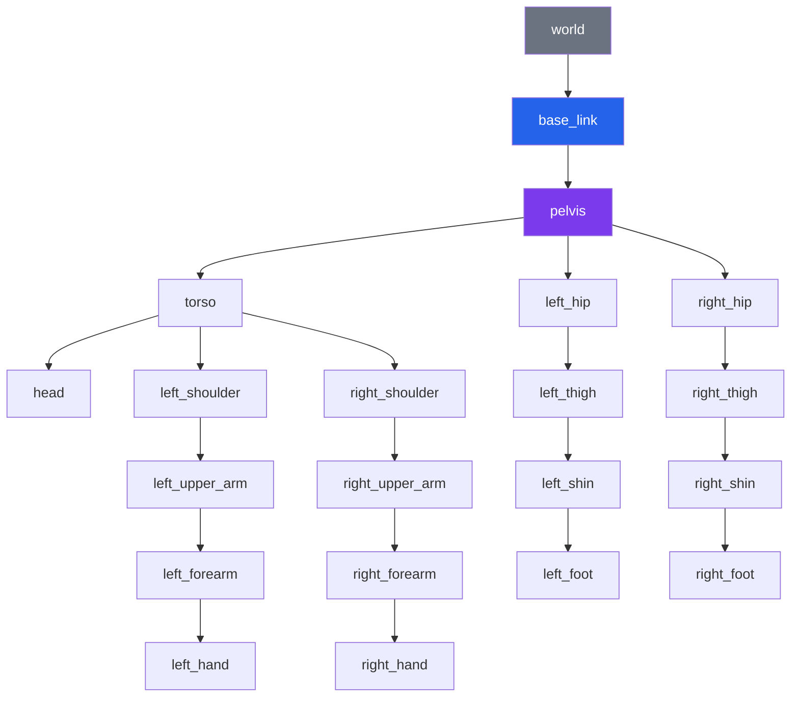
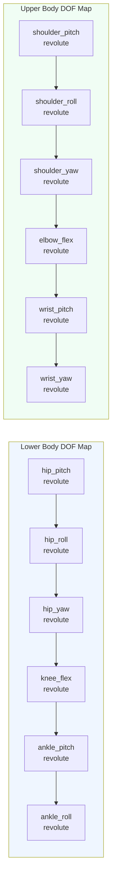
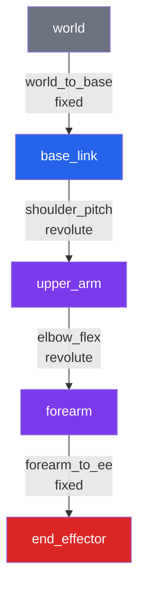

# URDF for Humanoid Robots

## Learning Objectives

By the end of this chapter, you will be able to:

- Explain the XML structure of a URDF file and the role of `<robot>`, `<link>`, and `<joint>` elements
- Define visual, collision, and inertial properties for robot links
- Choose the correct joint type (revolute, continuous, prismatic, fixed) for a given degree of freedom in a humanoid robot
- Write Xacro macros to eliminate repetition in a bilateral (left/right) humanoid body
- Describe how tf2 builds a transform tree from the URDF joint hierarchy
- Visualise a URDF model in `rviz2` and inspect the tf2 tree with `rqt_tf_tree`
- Build a URDF for a 6-DOF robot arm from scratch

---

## Prerequisites

Before working through this chapter you should be comfortable with:

- ROS 2 packages and the `colcon` build system (Chapter 4)
- Basic XML syntax (elements, attributes, namespaces)
- 3D coordinate frames: right-hand rule, rotation axes, homogeneous transforms
- The ROS 2 concept of the `robot_state_publisher` node

:::note
All URDF examples in this chapter comply with the URDF 1.0 schema. Xacro examples require the `xacro` package (`sudo apt install ros-humble-xacro`). The visualisation examples require `rviz2` and `joint_state_publisher_gui`.
:::

---

## 1. What Is URDF and Why Do We Need It?

A **Unified Robot Description Format** (URDF) file is an XML document that completely describes the physical structure of a robot: every rigid body (called a **link**), every movable connection between bodies (called a **joint**), every visual mesh, every collision geometry, and every inertia tensor.

URDF serves multiple consumers simultaneously:

| Consumer | What it uses URDF for |
|---|---|
| `robot_state_publisher` | Computes and broadcasts tf2 transforms for every joint |
| `rviz2` | Renders the visual meshes in the correct poses |
| Gazebo / Ignition | Simulates rigid-body dynamics using collision shapes and inertia data |
| `ros2_control` | Reads the `<ros2_control>` block to discover hardware interfaces |
| MoveIt 2 | Builds a kinematic chain for motion planning |

For a humanoid robot, a single well-authored URDF file is the single source of truth for all of these tools.

---

## 2. The Kinematic Tree Model

A robot described in URDF is a **tree** of rigid bodies. One link is the **root** (usually called `base_link` or `world`). Every other link is connected to exactly one parent via a joint. Links may have multiple children, but never more than one parent.



Every edge in this diagram corresponds to a `<joint>` element in the URDF. The nodes are `<link>` elements.

---

## 3. The `<robot>` Root Element

Every URDF file begins and ends with a `<robot>` element:

```xml
<?xml version="1.0"?>
<robot name="panaversity_arm" xmlns:xacro="http://www.ros.org/wiki/xacro">
  <!-- links and joints go here -->
</robot>
```

The `name` attribute is used by `robot_state_publisher` as the robot's identifier in tf2. The `xmlns:xacro` namespace declaration enables Xacro processing (covered in Section 7).

---

## 4. Links: Describing Rigid Bodies

A `<link>` element describes one rigid body. It has up to three sub-elements: `<visual>`, `<collision>`, and `<inertial>`.

### 4.1 Visual Properties

The `<visual>` block defines what `rviz2` and Gazebo render:

```xml
<link name="upper_arm">
  <visual>
    <!-- Origin is the pose of the geometry relative to the link frame -->
    <origin xyz="0 0 0.15" rpy="0 0 0"/>
    <geometry>
      <!-- Option 1: primitive shapes (fast, no mesh file needed) -->
      <cylinder radius="0.04" length="0.30"/>
      <!-- Option 2: mesh file (more realistic) -->
      <!-- <mesh filename="package://my_robot_description/meshes/upper_arm.dae"/> -->
    </geometry>
    <material name="carbon_fibre">
      <color rgba="0.2 0.2 0.2 1.0"/>
    </material>
  </visual>
</link>
```

Supported primitive geometry types:

| Type | Parameters |
|---|---|
| `<box>` | `size="x y z"` (metres) |
| `<cylinder>` | `radius`, `length` |
| `<sphere>` | `radius` |
| `<mesh>` | `filename` (package:// URI), optional `scale` |

### 4.2 Collision Properties

The `<collision>` block defines the geometry used for physics collision detection. It is almost always simpler than the visual geometry to keep simulation fast:

```xml
<link name="upper_arm">
  <visual>
    <geometry>
      <mesh filename="package://my_robot_description/meshes/upper_arm.dae"/>
    </geometry>
  </visual>

  <collision>
    <!-- Approximate with a capsule (cylinder + hemispheres) for speed -->
    <origin xyz="0 0 0.15" rpy="0 0 0"/>
    <geometry>
      <cylinder radius="0.045" length="0.30"/>
    </geometry>
  </collision>
</link>
```

:::tip
Always author collision geometry separately from visual geometry. Using a high-polygon DAE mesh for collision will make your physics simulation run 10-100x slower than using a bounding primitive. For humanoid limbs, capsules (cylinders) are a good approximation.
:::

### 4.3 Inertial Properties

The `<inertial>` block provides the mass and inertia tensor needed for dynamics simulation:

```xml
<link name="upper_arm">
  <inertial>
    <origin xyz="0 0 0.15" rpy="0 0 0"/>  <!-- centre of mass -->
    <mass value="0.8"/>                     <!-- kilograms -->
    <inertia
      ixx="0.006" ixy="0.0" ixz="0.0"
      iyy="0.006" iyz="0.0"
      izz="0.001"/>                         <!-- kg·m² -->
  </inertial>
</link>
```

The inertia matrix is symmetric, so URDF only requires the upper triangle (6 values). For a solid cylinder of mass m, radius r, and length L the principal moments are:

- I_xx = I_yy = (1/12) * m * (3r² + L²)
- I_zz = (1/2) * m * r²

:::note
Incorrect inertia values are one of the most common causes of unstable simulation. If your simulated robot immediately flips or explodes, check your mass and inertia values first. The `xacro` macros in Section 7.3 include formulae for computing inertia tensors for common primitive shapes.
:::

---

## 5. Joints: Connecting Links

A `<joint>` element connects exactly two links: a **parent** and a **child**. The child link's coordinate frame is offset from the parent's frame by the joint's `<origin>`.

### 5.1 Joint Types

| Type | DOF | Typical use in humanoid |
|---|---|---|
| `revolute` | 1 rotational (with limits) | Knee, elbow, shoulder pitch |
| `continuous` | 1 rotational (no limits) | Wheel, propeller |
| `prismatic` | 1 translational (with limits) | Linear actuator, spine extension |
| `fixed` | 0 | Sensors bolted to the body, aesthetic links |
| `floating` | 6 DOF | Free-flying base (rarely used directly) |
| `planar` | 3 DOF (plane) | Rarely used |

### 5.2 The `revolute` Joint in Detail

```xml
<joint name="elbow_flex" type="revolute">
  <!-- Origin: position and orientation of the child frame
       relative to the parent frame when the joint is at zero position -->
  <origin xyz="0 0 0.30" rpy="0 0 0"/>

  <!-- Which links are connected -->
  <parent link="upper_arm"/>
  <child  link="forearm"/>

  <!-- Rotation axis in the child frame (unit vector) -->
  <axis xyz="0 1 0"/>   <!-- rotate around Y axis -->

  <!-- Joint travel limits (radians) and dynamics -->
  <limit
    lower="-0.1"         <!-- -5.7 deg, nearly straight -->
    upper="2.618"        <!-- 150 deg -->
    effort="25.0"        <!-- maximum torque, N·m -->
    velocity="3.14"/>    <!-- maximum angular velocity, rad/s -->

  <!-- Optional: soft limits warn controllers before hard limits -->
  <safety_controller
    soft_lower_limit="0.05"
    soft_upper_limit="2.57"
    k_position="100"
    k_velocity="10"/>

  <!-- Optional: physical joint properties -->
  <dynamics damping="0.05" friction="0.01"/>
</joint>
```

### 5.3 Joint Types Used in a Humanoid



A full humanoid typically requires 28–34 degrees of freedom: 6 DOF per leg, 7 DOF per arm, 3 DOF for the neck, and 1–3 DOF for the spine.

---

## 6. Complete URDF: A 2-Link Arm

Here is a fully self-contained URDF for a simple 2-link arm with a fixed base, one shoulder joint, and one elbow joint. This is a working file you can load into `rviz2` immediately:

```xml
<?xml version="1.0"?>
<!-- simple_arm.urdf
     A minimal 2-link robot arm suitable for URDF tutorial purposes.
     Frame convention: Z-up, X-forward, Y-left (REP 103)
-->
<robot name="simple_arm">

  <!-- ============================================================
       MATERIALS
       ============================================================ -->
  <material name="white">
    <color rgba="0.9 0.9 0.9 1.0"/>
  </material>
  <material name="dark_grey">
    <color rgba="0.2 0.2 0.2 1.0"/>
  </material>
  <material name="blue">
    <color rgba="0.0 0.5 1.0 1.0"/>
  </material>

  <!-- ============================================================
       LINK: world  (inertia-less anchor)
       ============================================================ -->
  <link name="world"/>

  <!-- ============================================================
       JOINT: world -> base_link  (fixed mount)
       ============================================================ -->
  <joint name="world_to_base" type="fixed">
    <origin xyz="0 0 0" rpy="0 0 0"/>
    <parent link="world"/>
    <child  link="base_link"/>
  </joint>

  <!-- ============================================================
       LINK: base_link  (mounting platform)
       ============================================================ -->
  <link name="base_link">
    <visual>
      <origin xyz="0 0 0.05" rpy="0 0 0"/>
      <geometry><box size="0.12 0.12 0.10"/></geometry>
      <material name="dark_grey"/>
    </visual>
    <collision>
      <origin xyz="0 0 0.05" rpy="0 0 0"/>
      <geometry><box size="0.12 0.12 0.10"/></geometry>
    </collision>
    <inertial>
      <origin xyz="0 0 0.05" rpy="0 0 0"/>
      <mass value="0.5"/>
      <inertia ixx="0.001" ixy="0" ixz="0"
               iyy="0.001" iyz="0"
               izz="0.001"/>
    </inertial>
  </link>

  <!-- ============================================================
       JOINT: base_link -> upper_arm  (shoulder pitch)
       ============================================================ -->
  <joint name="shoulder_pitch" type="revolute">
    <origin xyz="0 0 0.10" rpy="0 0 0"/>
    <parent link="base_link"/>
    <child  link="upper_arm"/>
    <axis xyz="0 1 0"/>
    <limit lower="-1.5708" upper="1.5708" effort="30.0" velocity="2.0"/>
    <dynamics damping="0.1" friction="0.02"/>
  </joint>

  <!-- ============================================================
       LINK: upper_arm  (0.30 m cylindrical link)
       ============================================================ -->
  <link name="upper_arm">
    <visual>
      <origin xyz="0 0 0.15" rpy="0 0 0"/>
      <geometry><cylinder radius="0.035" length="0.30"/></geometry>
      <material name="white"/>
    </visual>
    <collision>
      <origin xyz="0 0 0.15" rpy="0 0 0"/>
      <geometry><cylinder radius="0.038" length="0.30"/></geometry>
    </collision>
    <inertial>
      <!-- Solid cylinder: Ixx = Iyy = m*(3r²+L²)/12, Izz = m*r²/2 -->
      <!-- m=0.4 kg, r=0.035 m, L=0.30 m -->
      <origin xyz="0 0 0.15" rpy="0 0 0"/>
      <mass value="0.4"/>
      <inertia ixx="0.003245" ixy="0" ixz="0"
               iyy="0.003245" iyz="0"
               izz="0.000245"/>
    </inertial>
  </link>

  <!-- ============================================================
       JOINT: upper_arm -> forearm  (elbow flex)
       ============================================================ -->
  <joint name="elbow_flex" type="revolute">
    <origin xyz="0 0 0.30" rpy="0 0 0"/>
    <parent link="upper_arm"/>
    <child  link="forearm"/>
    <axis xyz="0 1 0"/>
    <limit lower="0.0" upper="2.618" effort="20.0" velocity="2.5"/>
    <dynamics damping="0.08" friction="0.01"/>
  </joint>

  <!-- ============================================================
       LINK: forearm  (0.25 m cylindrical link)
       ============================================================ -->
  <link name="forearm">
    <visual>
      <origin xyz="0 0 0.125" rpy="0 0 0"/>
      <geometry><cylinder radius="0.030" length="0.25"/></geometry>
      <material name="blue"/>
    </visual>
    <collision>
      <origin xyz="0 0 0.125" rpy="0 0 0"/>
      <geometry><cylinder radius="0.033" length="0.25"/></geometry>
    </collision>
    <inertial>
      <!-- m=0.3 kg, r=0.030 m, L=0.25 m -->
      <origin xyz="0 0 0.125" rpy="0 0 0"/>
      <mass value="0.3"/>
      <inertia ixx="0.001694" ixy="0" ixz="0"
               iyy="0.001694" iyz="0"
               izz="0.000135"/>
    </inertial>
  </link>

  <!-- ============================================================
       LINK: end_effector  (tool-centre point)
       ============================================================ -->
  <link name="end_effector"/>

  <joint name="forearm_to_ee" type="fixed">
    <origin xyz="0 0 0.25" rpy="0 0 0"/>
    <parent link="forearm"/>
    <child  link="end_effector"/>
  </joint>

</robot>
```

Visualise it with:

```bash
# Install visualisation tools if needed
sudo apt install ros-humble-joint-state-publisher-gui ros-humble-rviz2

# Launch the standard URDF viewer
ros2 launch urdf_tutorial display.launch.py \
  model:=$(ros2 pkg prefix --share my_robot_description)/urdf/simple_arm.urdf
```

---

## 7. Xacro: Parameterised URDF

A full humanoid robot has many symmetric links (left arm / right arm, left leg / right leg). Writing duplicate XML for each is error-prone and unmaintainable. **Xacro** (XML macro language) solves this with variables, expressions, and reusable macros.

### 7.1 Enabling Xacro

Rename your file from `.urdf` to `.urdf.xacro` and add the Xacro namespace:

```xml
<?xml version="1.0"?>
<robot name="humanoid_arm" xmlns:xacro="http://www.ros.org/wiki/xacro">
```

Process the file to produce plain URDF:

```bash
xacro my_robot.urdf.xacro > my_robot.urdf
# Or load directly in a launch file (preferred):
ros2 run xacro xacro my_robot.urdf.xacro
```

### 7.2 Xacro Properties (Constants)

```xml
<!-- Robot-wide constants -->
<xacro:property name="upper_arm_length" value="0.30"/>
<xacro:property name="forearm_length"   value="0.25"/>
<xacro:property name="link_radius"      value="0.035"/>
<xacro:property name="pi"               value="3.14159265"/>

<!-- Use in geometry: ${expression} syntax -->
<geometry>
  <cylinder radius="${link_radius}" length="${upper_arm_length}"/>
</geometry>

<!-- Arithmetic is supported -->
<origin xyz="0 0 ${upper_arm_length / 2}" rpy="0 0 0"/>
```

### 7.3 Inertia Macros

```xml
<!-- Reusable inertia tensor for a solid cylinder -->
<xacro:macro name="cylinder_inertia" params="mass radius length">
  <inertial>
    <mass value="${mass}"/>
    <inertia
      ixx="${(1.0/12.0) * mass * (3 * radius * radius + length * length)}"
      ixy="0" ixz="0"
      iyy="${(1.0/12.0) * mass * (3 * radius * radius + length * length)}"
      iyz="0"
      izz="${0.5 * mass * radius * radius}"/>
  </inertial>
</xacro:macro>

<!-- Usage -->
<link name="upper_arm">
  <xacro:cylinder_inertia mass="0.4" radius="0.035" length="0.30"/>
</link>
```

### 7.4 A Full Arm Macro for Bilateral Symmetry

This is the key pattern for humanoid robot URDF authoring. We define the arm geometry once as a macro and call it twice — once for each side:

```xml
<?xml version="1.0"?>
<robot name="humanoid" xmlns:xacro="http://www.ros.org/wiki/xacro">

  <!-- ============================================================
       CONSTANTS
       ============================================================ -->
  <xacro:property name="ua_len"    value="0.30"/>  <!-- upper arm -->
  <xacro:property name="fa_len"    value="0.25"/>  <!-- forearm   -->
  <xacro:property name="ua_r"      value="0.035"/>
  <xacro:property name="fa_r"      value="0.030"/>
  <xacro:property name="ua_mass"   value="0.40"/>
  <xacro:property name="fa_mass"   value="0.30"/>
  <xacro:property name="pi"        value="3.14159265358979"/>

  <!-- ============================================================
       INERTIA HELPER MACROS
       ============================================================ -->
  <xacro:macro name="cylinder_inertia" params="mass radius length">
    <inertial>
      <mass value="${mass}"/>
      <inertia
        ixx="${(1.0/12.0)*mass*(3*radius*radius + length*length)}"
        ixy="0" ixz="0"
        iyy="${(1.0/12.0)*mass*(3*radius*radius + length*length)}"
        iyz="0"
        izz="${0.5*mass*radius*radius}"/>
    </inertial>
  </xacro:macro>

  <!-- ============================================================
       ARM MACRO
       prefix : 'left' or 'right'
       side   : +1 for left,  -1 for right (Y-axis sign)
       parent : name of the torso/shoulder-socket link
       ============================================================ -->
  <xacro:macro name="arm" params="prefix side parent">

    <!-- --- Shoulder socket (fixed cosmetic link) --- -->
    <link name="${prefix}_shoulder_link">
      <visual>
        <geometry><sphere radius="0.045"/></geometry>
        <material name="dark_grey"/>
      </visual>
      <collision>
        <geometry><sphere radius="0.048"/></geometry>
      </collision>
      <xacro:cylinder_inertia mass="0.15" radius="0.045" length="0.045"/>
    </link>

    <joint name="${prefix}_shoulder_pitch" type="revolute">
      <origin xyz="0 ${side * 0.18} 0" rpy="0 0 0"/>
      <parent link="${parent}"/>
      <child  link="${prefix}_shoulder_link"/>
      <axis xyz="0 1 0"/>
      <limit lower="${-pi/2}" upper="${pi/2}"
             effort="40.0" velocity="2.0"/>
    </joint>

    <!-- --- Upper arm --- -->
    <link name="${prefix}_upper_arm">
      <visual>
        <origin xyz="0 0 ${-ua_len/2}" rpy="0 0 0"/>
        <geometry><cylinder radius="${ua_r}" length="${ua_len}"/></geometry>
        <material name="white"/>
      </visual>
      <collision>
        <origin xyz="0 0 ${-ua_len/2}" rpy="0 0 0"/>
        <geometry><cylinder radius="${ua_r + 0.003}" length="${ua_len}"/></geometry>
      </collision>
      <xacro:cylinder_inertia
        mass="${ua_mass}" radius="${ua_r}" length="${ua_len}"/>
    </link>

    <joint name="${prefix}_shoulder_roll" type="revolute">
      <origin xyz="0 0 0" rpy="0 0 0"/>
      <parent link="${prefix}_shoulder_link"/>
      <child  link="${prefix}_upper_arm"/>
      <axis xyz="1 0 0"/>
      <limit lower="${-pi/2}" upper="${pi/2}"
             effort="35.0" velocity="2.0"/>
    </joint>

    <!-- --- Elbow --- -->
    <link name="${prefix}_forearm">
      <visual>
        <origin xyz="0 0 ${-fa_len/2}" rpy="0 0 0"/>
        <geometry><cylinder radius="${fa_r}" length="${fa_len}"/></geometry>
        <material name="blue"/>
      </visual>
      <collision>
        <origin xyz="0 0 ${-fa_len/2}" rpy="0 0 0"/>
        <geometry><cylinder radius="${fa_r + 0.003}" length="${fa_len}"/></geometry>
      </collision>
      <xacro:cylinder_inertia
        mass="${fa_mass}" radius="${fa_r}" length="${fa_len}"/>
    </link>

    <joint name="${prefix}_elbow_flex" type="revolute">
      <origin xyz="0 0 ${-ua_len}" rpy="0 0 0"/>
      <parent link="${prefix}_upper_arm"/>
      <child  link="${prefix}_forearm"/>
      <axis xyz="0 1 0"/>
      <limit lower="0.0" upper="2.618"
             effort="20.0" velocity="2.5"/>
    </joint>

    <!-- --- Wrist (end-effector frame) --- -->
    <link name="${prefix}_wrist_link"/>

    <joint name="${prefix}_wrist_to_ee" type="fixed">
      <origin xyz="0 0 ${-fa_len}" rpy="0 0 0"/>
      <parent link="${prefix}_forearm"/>
      <child  link="${prefix}_wrist_link"/>
    </joint>

  </xacro:macro>

  <!-- ============================================================
       TORSO (root link for arms)
       ============================================================ -->
  <link name="torso">
    <visual>
      <origin xyz="0 0 0.15" rpy="0 0 0"/>
      <geometry><box size="0.30 0.18 0.40"/></geometry>
      <material name="white"/>
    </visual>
    <collision>
      <origin xyz="0 0 0.15" rpy="0 0 0"/>
      <geometry><box size="0.32 0.20 0.42"/></geometry>
    </collision>
    <inertial>
      <origin xyz="0 0 0.15" rpy="0 0 0"/>
      <mass value="6.0"/>
      <inertia ixx="0.12" ixy="0" ixz="0"
               iyy="0.10" iyz="0" izz="0.05"/>
    </inertial>
  </link>

  <!-- ============================================================
       INSTANTIATE BOTH ARMS
       ============================================================ -->
  <xacro:arm prefix="left"  side="1"  parent="torso"/>
  <xacro:arm prefix="right" side="-1" parent="torso"/>

</robot>
```

:::tip
The `side` parameter (+1 / -1) is a clean pattern for mirroring bilateral geometry. By multiplying Y offsets by `side`, you create symmetric joint placements without duplicating any XML. Use the same technique for `rpy` sign-flips when needed.
:::

---

## 8. The tf2 Transform Tree

`tf2` is ROS 2's transform library. It maintains a time-stamped tree of coordinate frame relationships. Every joint in your URDF becomes one edge (one `TransformStamped` message) in this tree. The `robot_state_publisher` node reads the URDF and the `/joint_states` topic to continuously broadcast all transforms.

### 8.1 The tf2 Pipeline

```mermaid
graph LR
    URDF[URDF file<br/>robot_description param] --> RSP[robot_state_publisher]
    JS[/joint_states<br/>JointState msg] --> RSP
    RSP --> TF[/tf<br/>TransformStamped msgs]
    RSP --> TFS[/tf_static<br/>fixed joints]
    TF --> RVIZ[rviz2]
    TF --> MOVEIT[MoveIt 2]
    TF --> NAV[Nav2]
    TF --> CUSTOM[Your nodes<br/>tf2_ros::Buffer]

    style RSP fill:#2563eb,color:#fff
    style TF fill:#16a34a,color:#fff
    style TFS fill:#16a34a,color:#fff
```

Fixed joints (type `fixed`) are published once on `/tf_static`. Movable joints are published continuously on `/tf` at the rate of the incoming `/joint_states` topic.

### 8.2 tf2 Tree for the Simple 2-Link Arm



### 8.3 Looking Up Transforms in Python

```python
import rclpy
from rclpy.node import Node
from tf2_ros import Buffer, TransformListener, TransformException
from geometry_msgs.msg import TransformStamped


class ArmKinematics(Node):
    def __init__(self) -> None:
        super().__init__('arm_kinematics')

        # tf2 buffer stores the last N seconds of transforms
        self._tf_buffer   = Buffer()
        self._tf_listener = TransformListener(self._tf_buffer, self)

        self._timer = self.create_timer(0.1, self._on_timer)

    def _on_timer(self) -> None:
        try:
            # Look up where end_effector is relative to base_link RIGHT NOW
            transform: TransformStamped = self._tf_buffer.lookup_transform(
                target_frame='base_link',
                source_frame='end_effector',
                time=rclpy.time.Time(),   # latest available
            )
            t = transform.transform.translation
            self.get_logger().info(
                f'EE position in base_link: '
                f'x={t.x:.3f} y={t.y:.3f} z={t.z:.3f}'
            )
        except TransformException as ex:
            self.get_logger().warn(f'Could not get transform: {ex}')
```

:::warning
Never call `lookup_transform` with `rclpy.time.Time()` (current time) if tf2 data may not yet be available. During startup there is a brief window where the transform tree is empty. Wrapping the call in a try/except `TransformException` as shown above prevents your node from crashing during initialisation.
:::

---

## 9. Visualising URDF in rviz2

### 9.1 Manual Launch

```bash
# Terminal 1: publish the robot description and transforms
ros2 run robot_state_publisher robot_state_publisher \
  --ros-args -p robot_description:="$(xacro ~/ros2_ws/src/my_robot_description/urdf/simple_arm.urdf.xacro)"

# Terminal 2: publish joint states interactively
ros2 run joint_state_publisher_gui joint_state_publisher_gui

# Terminal 3: open rviz2
rviz2
```

In rviz2:
1. Set **Fixed Frame** to `world`
2. Click **Add** > **By display type** > **RobotModel** — set the topic to `/robot_description`
3. Click **Add** > **By display type** > **TF** to see all coordinate frames

### 9.2 Launch File for URDF Visualisation

```python
# launch/display.launch.py

import os
from ament_index_python.packages import get_package_share_directory
from launch import LaunchDescription
from launch.actions import DeclareLaunchArgument
from launch.substitutions import Command, LaunchConfiguration
from launch_ros.actions import Node
from launch_ros.parameter_descriptions import ParameterValue


def generate_launch_description() -> LaunchDescription:
    pkg_share = get_package_share_directory('my_robot_description')

    arg_model = DeclareLaunchArgument(
        'model',
        default_value=os.path.join(pkg_share, 'urdf', 'simple_arm.urdf.xacro'),
        description='Absolute path to robot URDF/Xacro file',
    )

    robot_description = ParameterValue(
        Command(['xacro ', LaunchConfiguration('model')]),
        value_type=str,
    )

    robot_state_publisher = Node(
        package='robot_state_publisher',
        executable='robot_state_publisher',
        parameters=[{'robot_description': robot_description}],
        output='screen',
    )

    joint_state_publisher_gui = Node(
        package='joint_state_publisher_gui',
        executable='joint_state_publisher_gui',
    )

    rviz2 = Node(
        package='rviz2',
        executable='rviz2',
        arguments=['-d', os.path.join(pkg_share, 'rviz', 'robot.rviz')],
        output='screen',
    )

    return LaunchDescription([
        arg_model,
        robot_state_publisher,
        joint_state_publisher_gui,
        rviz2,
    ])
```

### 9.3 Inspecting the tf2 Tree

```bash
# Visualise the transform tree as a PDF
ros2 run tf2_tools view_frames

# Or use the interactive GUI
ros2 run rqt_tf_tree rqt_tf_tree

# Check the transform between two specific frames
ros2 run tf2_ros tf2_echo base_link end_effector
```

---

## 10. Chapter Exercise: 6-DOF Arm URDF with Xacro

Design and implement a URDF (using Xacro) for a 6-DOF robot arm. The arm must satisfy all of the following requirements.

**Kinematic structure:**

```
base_link
  └── shoulder_yaw        (revolute, ±180°)
        └── shoulder_pitch (revolute, -90° to +90°)
              └── shoulder_roll (revolute, ±90°)
                    └── elbow_flex (revolute, 0° to 150°)
                          └── wrist_pitch (revolute, ±90°)
                                └── wrist_roll (revolute, ±180°)
                                      └── tool_frame (fixed)
```

**Required content:**
- A Xacro property for every geometric parameter (link lengths, radii, masses)
- Use the `cylinder_inertia` Xacro macro from Section 7.3 for all inertia tensors
- Correct `<axis>` vectors for each joint (document your convention)
- A `display.launch.py` that loads the URDF and starts `joint_state_publisher_gui` and `rviz2`

**Validation checklist:**
```bash
# 1. File parses without errors
xacro arm_6dof.urdf.xacro > /tmp/arm_6dof.urdf
check_urdf /tmp/arm_6dof.urdf

# 2. Launch visualisation
ros2 launch my_robot_description display.launch.py

# 3. Verify all 6 joints appear as sliders in joint_state_publisher_gui

# 4. Inspect the transform tree
ros2 run tf2_tools view_frames
# Verify: world -> base_link -> ... -> tool_frame has 6 revolute + 1 fixed joints

# 5. Read the end-effector position
ros2 run tf2_ros tf2_echo base_link tool_frame
# Move the joint sliders and verify the position changes
```

:::tip
`check_urdf` is a fast sanity checker. It will immediately report if any joint references a link that does not exist, if the tree has a cycle, or if required elements are missing. Run it every time you edit your URDF before launching.
:::

---

## Key Takeaways

- URDF describes a robot as a kinematic tree: links are rigid bodies, joints are connections with one degree of freedom (or zero, for fixed joints).
- Every `<link>` has up to three sub-elements: `<visual>` (rendering), `<collision>` (physics), and `<inertial>` (dynamics). Keep collision geometry simpler than visual geometry for simulation performance.
- The `revolute` joint type is used for most humanoid DOF; it requires `<axis>`, `<limit>`, and optionally `<dynamics>` to be physically meaningful.
- Xacro eliminates duplicated XML through properties, arithmetic expressions, and macros — essential for bilateral humanoid bodies.
- `robot_state_publisher` converts a URDF + `/joint_states` into a continuous stream of tf2 transforms on `/tf` and `/tf_static`.
- Always wrap `tf2_buffer.lookup_transform()` in try/except to handle the startup period before transforms become available.

---

## Review Questions

1. A link has high-resolution visual mesh with 50,000 polygons. Should the collision geometry use the same mesh? Explain your reasoning and suggest a better alternative.
2. What is the difference between `revolute` and `continuous` joint types? Give one example of each from a humanoid robot.
3. In the Xacro arm macro from Section 7.4, the parameter `side` is multiplied by the Y-axis offset. What would happen to the geometry if you called the macro with `side="0"` by mistake?
4. A `fixed` joint transform is published on `/tf_static` rather than `/tf`. Why is this an optimisation? What is the downside if you accidentally mark a movable joint as `fixed`?
5. You add a new joint to your URDF but `rviz2` shows the new link at the origin (0,0,0) regardless of the joint slider position. List two likely causes and how you would diagnose each.
6. Explain in your own words what `robot_state_publisher` needs to compute the transform from `base_link` to `tool_frame` at a given instant. What inputs does it require, and from where does each input come?
