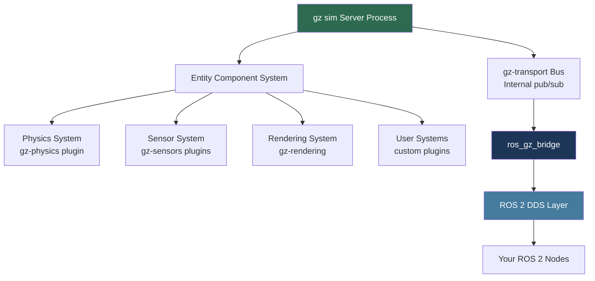
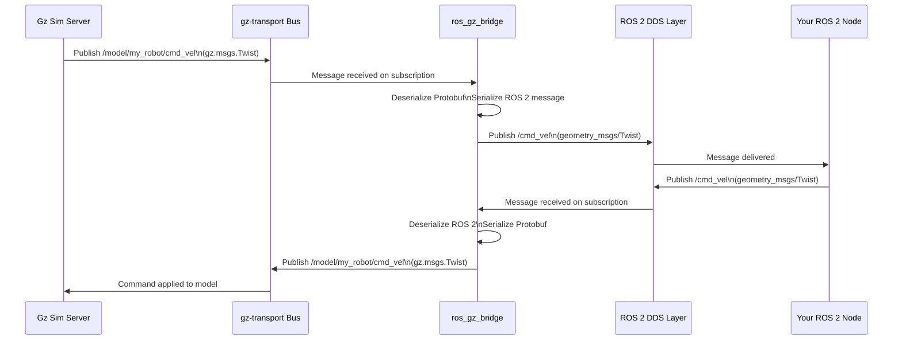
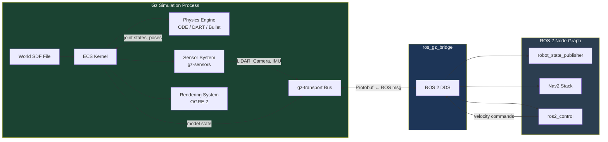

# Gazebo Simulation Environment

## Week 6 — Building Your Robot's Digital World

---

## Learning Objectives

By the end of this chapter, you will be able to:

- Explain the difference between Gazebo Classic and Gazebo Ignition/Gz and why the ecosystem migrated
- Distinguish between SDF and URDF formats and choose the correct one for a given context
- Compare the four major physics engines bundled with Gazebo and select the right one for your simulation requirements
- Author a complete SDF world file with custom gravity, step size, lighting, and ground plane
- Spawn a robot model inside a running Gazebo world from the command line and from a ROS 2 launch file
- Configure `ros_gz_bridge` to tunnel topics between Gazebo's internal message bus and ROS 2
- Describe the Gazebo plugin system and identify where sensor, world, and model plugins fit in the architecture

---

## Prerequisites

Before working through this chapter, confirm that you have completed the following:

- Module 1: ROS 2 Fundamentals (nodes, topics, launch files, colcon builds)
- A working ROS 2 Humble installation on Ubuntu 22.04 (native, WSL2, or Docker)
- Gazebo Garden or Gazebo Harmonic installed alongside `ros-humble-ros-gz`
- Familiarity with XML syntax (URDF is XML; SDF is XML)
- Basic terminal comfort — you should be able to run `colcon build` without guidance

:::note
All commands in this chapter target **ROS 2 Humble + Gazebo Harmonic** unless stated otherwise. If you are using an older Gazebo release (e.g., Ignition Fortress), the `gz` CLI commands may appear as `ign` in your environment. The concepts are identical.
:::

---

## 1. What Is Gazebo Ignition / Gz?

### 1.1 A Brief History

The name "Gazebo" has referred to two distinct software generations, and the naming has been a source of genuine confusion in the community.

**Gazebo Classic** (versions 1–11) was the original Open Source Robotics Foundation simulator released in 2004 alongside ROS 1. It used a monolithic architecture where every component — rendering, physics, GUI, sensor models — lived inside a single process. By the mid-2010s this architecture was showing its age: it did not scale well to multi-robot simulations, the internal APIs were difficult to extend, and the tight coupling between the GUI and the simulation server made headless (cloud) deployment awkward.

**Ignition Gazebo / Gz** (now simply called "Gz" after the OSRF rebranding in 2022) is a ground-up rewrite that began shipping with Ignition Citadel (2019). The project delivers simulation through a collection of loosely coupled libraries rather than a single executable:

| Library | Responsibility |
|---|---|
| `gz-sim` | ECS-based simulation kernel |
| `gz-rendering` | Abstracted rendering (OGRE 2, OptiX) |
| `gz-physics` | Physics engine plugin interface |
| `gz-transport` | Internal pub/sub message bus |
| `gz-sensors` | Sensor simulation plugins |
| `gz-gui` | Qt-based graphical interface |
| `gz-msgs` | Protobuf message definitions |

This library separation means you can embed the physics kernel in your own application, swap rendering backends, or run simulation with no GUI at all — capabilities that are increasingly important for large-scale reinforcement learning pipelines.

### 1.2 The Entity Component System (ECS)

The simulation kernel in Gz is built on an **Entity Component System** (ECS) architectural pattern. If you have done any game engine work (Unity, Unreal, Bevy), this pattern will feel familiar:

- An **Entity** is nothing more than an integer ID — a robot, a joint, a link, a light source.
- A **Component** is pure data attached to an entity — a pose, an inertia tensor, a material color.
- A **System** contains logic that processes entities which possess a specific combination of components.

This design eliminates the deep inheritance hierarchies that plagued Gazebo Classic and makes it straightforward to add new simulation features without modifying existing code.



---

## 2. SDF vs. URDF — Choosing the Right Format

One of the earliest decisions you will make in robot development is which description format to use. The table below compares the two formats across the criteria that matter most in practice:

| Criterion | URDF | SDF |
|---|---|---|
| Full name | Unified Robot Description Format | Simulation Description Format |
| Primary use case | Robot kinematic model for ROS 2 | Complete world and robot description for Gz |
| Supports multiple robots | No | Yes |
| Supports world elements (lights, gravity, ground) | No | Yes |
| Sensor definitions | Partial (through Gazebo tags) | First-class support |
| Joints supported | Revolute, prismatic, fixed, continuous, floating, planar | All URDF joints plus more |
| File nesting | `<robot>` root | `<world>` root containing `<model>` elements |
| ROS 2 tooling (`robot_state_publisher`) | Native | Via `gz_ros2_control` adapter |
| Physics engine hints | No | Yes (`<physics>` element) |
| Xacro macro support | Yes (widely used) | Limited (use Xacro then convert) |
| Maintained by | ROS community | Open Source Robotics Foundation |

### 2.1 When to Use Each

**Use URDF when:**
- You are working primarily with ROS 2 tools (`robot_state_publisher`, `MoveIt 2`, `Nav2`)
- You want to generate your model with Xacro macros
- Hardware abstraction (`ros2_control`) is your primary concern

**Use SDF when:**
- You need to describe a complete simulation world (multiple robots, terrain, custom lighting)
- You require fine-grained physics engine configuration
- You are building sensor-heavy simulations (LiDAR, cameras, IMU)
- You want to leverage Gz's full feature set

In practice, most production workflows use **Xacro → URDF → SDF conversion** via the `gz sdf -p` tool or through the `sdformat` library. This lets you maintain a single Xacro source of truth while generating both URDF (for ROS tools) and SDF (for Gz) automatically.

:::tip
Run `gz sdf -p my_robot.urdf > my_robot.sdf` to convert a URDF to SDF. Inspect the output carefully — the converter makes sensible defaults for missing SDF-specific elements (like inertia frames), but you should verify joint limits and collision geometry are preserved correctly.
:::

---

## 3. Physics Engines

Gazebo ships with an abstraction layer (`gz-physics`) that allows different physics backends to be loaded as plugins. This section introduces the four engines you are most likely to encounter.

### 3.1 ODE — Open Dynamics Engine

ODE is the default physics engine in Gazebo Classic and remains widely supported in Gz through the `gz-physics-ode-plugin`. It uses an iterative constraint solver and has a long track record of stability for wheeled robots and simple manipulators.

**Strengths:** Battle-tested, fast for rigid-body chains, good community documentation.
**Weaknesses:** Tunneling artifacts at high speeds, less accurate contact modeling than newer engines.
**Best for:** Mobile robot navigation, simple arm manipulation, when you need a quick and stable baseline.

### 3.2 Bullet

Bullet is an open-source real-time physics engine that originated in game development (it powered many PlayStation 3 titles). It implements both rigid-body and soft-body dynamics.

**Strengths:** Soft-body simulation (deformable objects, cloth), good at high-contact scenarios (grasping).
**Weaknesses:** Can exhibit instability with articulated robots at high step rates; solver configuration requires tuning.
**Best for:** Grasping and manipulation research where contact compliance matters.

### 3.3 DART — Dynamic Animation and Robotics Toolkit

DART was developed at Georgia Tech and the University of Washington specifically for robotics research. It uses a Featherstone recursive algorithm for articulated body dynamics, which is analytically more accurate than constraint-based solvers for serial chains.

**Strengths:** Accurate articulated dynamics, built-in support for inverse kinematics, good for legged robots.
**Weaknesses:** Slower than ODE for large contact-rich environments.
**Best for:** Legged locomotion research, precise arm dynamics, academic work where physical accuracy is paramount.

### 3.4 Simbody

Simbody is the physics engine underlying OpenSim, the biomechanics simulation platform. It is designed for high-fidelity musculoskeletal and constrained mechanical system simulation.

**Strengths:** Exceptional accuracy for constrained systems, good for humanoid research.
**Weaknesses:** Steep learning curve, less documentation in a robotics context.
**Best for:** Humanoid robots, biomechanics-inspired locomotion, when you need publication-grade physical accuracy.

### 3.5 Selecting a Physics Engine in SDF

```xml
<!-- Inside your world's <physics> block -->
<physics name="default_physics" type="dart">
  <max_step_size>0.001</max_step_size>
  <real_time_factor>1.0</real_time_factor>
  <real_time_update_rate>1000</real_time_update_rate>
  <dart>
    <solver>
      <solver_type>dantzig</solver_type>
    </solver>
    <collision_detector>bullet</collision_detector>
  </dart>
</physics>
```

:::warning
Setting `<real_time_factor>` above 1.0 speeds up simulation time relative to wall-clock time. This is useful for training RL agents quickly, but physics accuracy degrades. For hardware-in-the-loop testing always keep `real_time_factor` at 1.0 or below.
:::

---

## 4. Creating World Files

An SDF world file is the single document that defines everything about your simulation environment: the physics engine, lighting, ground plane, static objects, and any robots you want pre-spawned. Understanding the structure deeply will save you hours of debugging later.

### 4.1 Anatomy of an SDF World File

```xml
<?xml version="1.0" ?>
<sdf version="1.9">
  <world name="my_robot_world">

    <!-- ===================== PHYSICS ===================== -->
    <physics name="default_physics" type="ode">
      <max_step_size>0.001</max_step_size>
      <real_time_factor>1.0</real_time_factor>
      <real_time_update_rate>1000</real_time_update_rate>
      <gravity>0 0 -9.81</gravity>
    </physics>

    <!-- ==================== PLUGINS ===================== -->
    <!-- gz-sim physics system -->
    <plugin filename="gz-sim-physics-system"
            name="gz::sim::systems::Physics">
    </plugin>
    <!-- User commands (spawn, delete models via service) -->
    <plugin filename="gz-sim-user-commands-system"
            name="gz::sim::systems::UserCommands">
    </plugin>
    <!-- Scene broadcaster (sends scene state to GUI) -->
    <plugin filename="gz-sim-scene-broadcaster-system"
            name="gz::sim::systems::SceneBroadcaster">
    </plugin>

    <!-- ==================== LIGHTING ==================== -->
    <light type="directional" name="sun">
      <cast_shadows>true</cast_shadows>
      <pose>0 0 10 0 0 0</pose>
      <diffuse>0.8 0.8 0.8 1</diffuse>
      <specular>0.2 0.2 0.2 1</specular>
      <attenuation>
        <range>1000</range>
        <constant>0.9</constant>
        <linear>0.01</linear>
        <quadratic>0.001</quadratic>
      </attenuation>
      <direction>-0.5 0.1 -0.9</direction>
    </light>

    <!-- ================== GROUND PLANE ================== -->
    <model name="ground_plane">
      <static>true</static>
      <link name="link">
        <collision name="collision">
          <geometry>
            <plane>
              <normal>0 0 1</normal>
              <size>100 100</size>
            </plane>
          </geometry>
        </collision>
        <visual name="visual">
          <geometry>
            <plane>
              <normal>0 0 1</normal>
              <size>100 100</size>
            </plane>
          </geometry>
          <material>
            <ambient>0.8 0.8 0.8 1</ambient>
            <diffuse>0.8 0.8 0.8 1</diffuse>
            <specular>0.8 0.8 0.8 1</specular>
          </material>
        </visual>
      </link>
    </model>

    <!-- ============ OPTIONAL: PRE-SPAWN A ROBOT ========= -->
    <include>
      <uri>model://turtlebot3_waffle</uri>
      <pose>0 0 0.01 0 0 0</pose>
      <name>turtlebot3</name>
    </include>

  </world>
</sdf>
```

### 4.2 Key Parameters Explained

**`<max_step_size>`** — The physics integration time step in seconds. Smaller values increase accuracy but also increase computational cost. For mobile robots, `0.001` (1 ms) is a safe default. For legged robots with fast dynamics, you may need `0.0005` or smaller.

**`<real_time_update_rate>`** — How many physics steps the server attempts per wall-clock second. `1000` combined with `max_step_size=0.001` gives real-time simulation. Setting this to `0` means "run as fast as possible" — useful for RL training.

**`<gravity>`** — A 3D vector in m/s². Earth standard is `0 0 -9.81`. For space robotics research you might set `0 0 -1.62` (Moon) or `0 0 -3.72` (Mars).

**`<cast_shadows>`** — Shadow casting is computationally expensive. Disable it in headless training environments where visual fidelity is not needed.

:::tip
Save your world files in a `worlds/` subdirectory of your ROS 2 package and reference them with the `GZ_SIM_RESOURCE_PATH` environment variable. This prevents hard-coded absolute paths that break when teammates clone your repository.
:::

---

## 5. Spawning Robots in Simulation

There are three standard ways to place a robot model into a running Gz world. Understanding all three gives you the flexibility to choose the right approach for your workflow.

### 5.1 Via the `gz service` CLI

The most direct method is to call the `/world/<world_name>/create` service directly using the `gz` command-line tool. This is useful for quick tests and debugging.

```bash
# Spawn a model from a local SDF file
gz service -s /world/my_robot_world/create \
  --reqtype gz.msgs.EntityFactory \
  --reptype gz.msgs.Boolean \
  --timeout 1000 \
  --req 'sdf_filename: "/path/to/my_robot.sdf", name: "my_robot", pose: {position: {x: 1.0, y: 0.0, z: 0.1}}'
```

### 5.2 Via a ROS 2 Launch File

In a real project, robot spawning is almost always driven by a ROS 2 launch file so that the process integrates with your parameter server and lifecycle management:

```python
# launch/spawn_robot.launch.py
import os
from ament_python_import import get_package_share_directory
from launch import LaunchDescription
from launch.actions import DeclareLaunchArgument, ExecuteProcess
from launch.substitutions import LaunchConfiguration, PathJoinSubstitution
from launch_ros.actions import Node
from launch_ros.substitutions import FindPackageShare


def generate_launch_description():
    pkg_share = FindPackageShare("my_robot_description")

    # Argument: initial robot pose
    x_arg = DeclareLaunchArgument("x", default_value="0.0")
    y_arg = DeclareLaunchArgument("y", default_value="0.0")
    z_arg = DeclareLaunchArgument("z", default_value="0.05")

    # Path to the SDF file
    sdf_path = PathJoinSubstitution([pkg_share, "models", "my_robot.sdf"])

    # robot_state_publisher — publishes TF from URDF
    urdf_path = PathJoinSubstitution([pkg_share, "urdf", "my_robot.urdf"])
    robot_state_publisher = Node(
        package="robot_state_publisher",
        executable="robot_state_publisher",
        parameters=[{"robot_description": open(urdf_path.perform(None)).read()}],
    )

    # gz_spawn_entity spawns a model into the running Gz instance
    spawn_entity = Node(
        package="ros_gz_sim",
        executable="create",
        arguments=[
            "-file", sdf_path,
            "-name", "my_robot",
            "-x", LaunchConfiguration("x"),
            "-y", LaunchConfiguration("y"),
            "-z", LaunchConfiguration("z"),
        ],
        output="screen",
    )

    return LaunchDescription([
        x_arg, y_arg, z_arg,
        robot_state_publisher,
        spawn_entity,
    ])
```

### 5.3 Pre-Spawned in the World File

As shown in section 4.1, you can embed `<include>` tags directly in the SDF world file. This is appropriate for static environments (test tracks, warehouses) but becomes unwieldy when you need dynamic spawning (multi-robot RL, random object placement).

---

## 6. The `ros_gz_bridge` — Connecting Two Worlds

Gz and ROS 2 use different message transport systems. Gz uses `gz-transport` with Protobuf serialization. ROS 2 uses DDS (typically FastDDS or Cyclone DDS) with ROS 2 message types. The `ros_gz_bridge` package provides bidirectional message translation between the two buses.

### 6.1 How the Bridge Works



### 6.2 Bridge Configuration via YAML

Rather than passing each topic mapping as a command-line argument, the recommended approach is to define all bridge mappings in a YAML file:

```yaml
# config/ros_gz_bridge.yaml
---
- ros_topic_name: "/cmd_vel"
  gz_topic_name: "/model/my_robot/cmd_vel"
  ros_type_name: "geometry_msgs/msg/Twist"
  gz_type_name: "gz.msgs.Twist"
  direction: ROS_TO_GZ

- ros_topic_name: "/odom"
  gz_topic_name: "/model/my_robot/odometry"
  ros_type_name: "nav_msgs/msg/Odometry"
  gz_type_name: "gz.msgs.Odometry"
  direction: GZ_TO_ROS

- ros_topic_name: "/scan"
  gz_topic_name: "/lidar"
  ros_type_name: "sensor_msgs/msg/LaserScan"
  gz_type_name: "gz.msgs.LaserScan"
  direction: GZ_TO_ROS

- ros_topic_name: "/camera/image_raw"
  gz_topic_name: "/camera"
  ros_type_name: "sensor_msgs/msg/Image"
  gz_type_name: "gz.msgs.Image"
  direction: GZ_TO_ROS

- ros_topic_name: "/imu"
  gz_topic_name: "/imu"
  ros_type_name: "sensor_msgs/msg/Imu"
  gz_type_name: "gz.msgs.IMU"
  direction: GZ_TO_ROS

- ros_topic_name: "/clock"
  gz_topic_name: "/clock"
  ros_type_name: "rosgraph_msgs/msg/Clock"
  gz_type_name: "gz.msgs.Clock"
  direction: GZ_TO_ROS
```

Launch the bridge node with this config file:

```python
# Inside your launch file
from launch_ros.actions import Node

bridge = Node(
    package="ros_gz_bridge",
    executable="parameter_bridge",
    parameters=[{
        "config_file": "/path/to/config/ros_gz_bridge.yaml",
        "qos_overrides./clock.publisher.durability": "transient_local",
    }],
    output="screen",
)
```

:::warning
Always bridge the `/clock` topic from Gz to ROS 2. Without this, ROS 2 nodes use wall-clock time while Gz uses simulation time, causing transform lookup failures, timeout misbehavior in Nav2, and other subtle bugs that are difficult to trace. Set `use_sim_time: true` on all ROS 2 nodes when running with Gz.
:::

### 6.3 Checking Bridge Health

```bash
# List all active gz-transport topics
gz topic -l

# Echo a specific gz-transport topic
gz topic -e -t /model/my_robot/odometry

# Confirm the topic appears on the ROS 2 side
ros2 topic list
ros2 topic echo /odom

# Inspect message frequency to verify no dropped frames
ros2 topic hz /scan
```

---

## 7. The Gazebo Plugin System

Plugins are dynamically loaded shared libraries (`.so` files on Linux) that implement simulation behavior. They attach to specific simulation entities and are declared in SDF with `<plugin>` tags. Understanding the plugin taxonomy is essential before tackling sensor simulation in Chapter 2.

### 7.1 Plugin Types

| Plugin Type | Scope | Typical Use Cases |
|---|---|---|
| **World plugin** | Entire simulation world | Wind simulation, weather effects, population spawning |
| **Model plugin** | A specific model (robot body) | Differential drive controller, joint PID controller |
| **Sensor plugin** | A specific sensor entity | LiDAR ray casting, camera rendering, IMU noise |
| **System plugin** | Gz ECS system (most powerful) | Custom physics coupling, RL environment interface |
| **GUI plugin** | Qt-based UI panel | Custom visualization, teleop controls |

### 7.2 A Minimal Model Plugin Declaration

```xml
<!-- Inside your robot's SDF <model> block -->
<plugin
  filename="gz-sim-diff-drive-system"
  name="gz::sim::systems::DiffDrive">
  <left_joint>left_wheel_joint</left_joint>
  <right_joint>right_wheel_joint</right_joint>
  <wheel_separation>0.287</wheel_separation>
  <wheel_radius>0.033</wheel_radius>
  <odom_publish_frequency>50</odom_publish_frequency>
  <topic>/model/my_robot/cmd_vel</topic>
  <odom_topic>/model/my_robot/odometry</odom_topic>
  <frame_id>odom</frame_id>
  <child_frame_id>base_footprint</child_frame_id>
</plugin>
```

### 7.3 Writing a Custom System Plugin (Overview)

A custom Gz System must implement the `gz::sim::System` interface and one or more of its lifecycle callbacks: `PreUpdate`, `Update`, or `PostUpdate`. The difference matters:

- `PreUpdate` — called before the physics step. Use this to apply forces and commands.
- `Update` — called during the physics step. Reserved for physics engine internals; custom plugins rarely use this.
- `PostUpdate` — called after the physics step. Use this to read sensor data, compute state estimates, and publish.

```cpp
// Minimal skeleton of a custom Gz System plugin
#include <gz/sim/System.hh>
#include <gz/sim/EntityComponentManager.hh>

class MyCustomSystem
    : public gz::sim::System,
      public gz::sim::ISystemPreUpdate,
      public gz::sim::ISystemPostUpdate
{
public:
  void PreUpdate(const gz::sim::UpdateInfo &_info,
                 gz::sim::EntityComponentManager &_ecm) override
  {
    // Apply actuator commands before physics integration
  }

  void PostUpdate(const gz::sim::UpdateInfo &_info,
                  const gz::sim::EntityComponentManager &_ecm) override
  {
    // Read sensor outputs after physics integration
  }
};

// Register the plugin with the Gz plugin system
GZ_ADD_PLUGIN(MyCustomSystem,
              gz::sim::System,
              gz::sim::ISystemPreUpdate,
              gz::sim::ISystemPostUpdate)
```

---

## 8. Putting It All Together — Full Architecture View



---

## 9. Hands-On Exercise — Creating a Custom World

This exercise walks you through creating a complete Gz simulation world from scratch, spawning the TurtleBot3 Waffle model, and verifying bridge communication.

### Step 1 — Create the Package

```bash
cd ~/ros2_ws/src
ros2 pkg create --build-type ament_cmake my_simulation_world \
  --dependencies rclcpp ros_gz_sim ros_gz_bridge

mkdir -p my_simulation_world/worlds
mkdir -p my_simulation_world/config
mkdir -p my_simulation_world/launch
```

### Step 2 — Write the World File

Save the following as `worlds/obstacle_course.world`:

```xml
<?xml version="1.0" ?>
<sdf version="1.9">
  <world name="obstacle_course">

    <physics name="default" type="dart">
      <max_step_size>0.001</max_step_size>
      <real_time_factor>1.0</real_time_factor>
      <real_time_update_rate>1000</real_time_update_rate>
      <gravity>0 0 -9.81</gravity>
    </physics>

    <plugin filename="gz-sim-physics-system"
            name="gz::sim::systems::Physics"/>
    <plugin filename="gz-sim-user-commands-system"
            name="gz::sim::systems::UserCommands"/>
    <plugin filename="gz-sim-scene-broadcaster-system"
            name="gz::sim::systems::SceneBroadcaster"/>

    <light type="directional" name="sun">
      <cast_shadows>true</cast_shadows>
      <pose>0 0 10 0 0 0</pose>
      <diffuse>1 1 1 1</diffuse>
      <specular>0.3 0.3 0.3 1</specular>
      <direction>-0.5 0.1 -0.9</direction>
    </light>

    <!-- Ground plane -->
    <model name="ground_plane">
      <static>true</static>
      <link name="link">
        <collision name="col">
          <geometry><plane><normal>0 0 1</normal></plane></geometry>
        </collision>
        <visual name="vis">
          <geometry><plane><normal>0 0 1</normal><size>50 50</size></plane></geometry>
          <material><ambient>0.7 0.7 0.7 1</ambient></material>
        </visual>
      </link>
    </model>

    <!-- Obstacle box 1 -->
    <model name="box_1">
      <static>true</static>
      <pose>2 0 0.25 0 0 0</pose>
      <link name="link">
        <collision name="col">
          <geometry><box><size>0.5 0.5 0.5</size></box></geometry>
        </collision>
        <visual name="vis">
          <geometry><box><size>0.5 0.5 0.5</size></box></geometry>
          <material><ambient>1 0 0 1</ambient></material>
        </visual>
      </link>
    </model>

    <!-- Obstacle box 2 -->
    <model name="box_2">
      <static>true</static>
      <pose>3 1.5 0.25 0 0 0</pose>
      <link name="link">
        <collision name="col">
          <geometry><box><size>0.5 0.5 0.5</size></box></geometry>
        </collision>
        <visual name="vis">
          <geometry><box><size>0.5 0.5 0.5</size></box></geometry>
          <material><ambient>0 0 1 1</ambient></material>
        </visual>
      </link>
    </model>

  </world>
</sdf>
```

### Step 3 — Write the Bridge Config

Save as `config/bridge.yaml`:

```yaml
---
- ros_topic_name: "/cmd_vel"
  gz_topic_name: "/model/turtlebot3/cmd_vel"
  ros_type_name: "geometry_msgs/msg/Twist"
  gz_type_name: "gz.msgs.Twist"
  direction: ROS_TO_GZ

- ros_topic_name: "/odom"
  gz_topic_name: "/model/turtlebot3/odometry"
  ros_type_name: "nav_msgs/msg/Odometry"
  gz_type_name: "gz.msgs.Odometry"
  direction: GZ_TO_ROS

- ros_topic_name: "/clock"
  gz_topic_name: "/clock"
  ros_type_name: "rosgraph_msgs/msg/Clock"
  gz_type_name: "gz.msgs.Clock"
  direction: GZ_TO_ROS
```

### Step 4 — Write the Launch File

Save as `launch/simulation.launch.py`:

```python
import os
from ament_index_python.packages import get_package_share_directory
from launch import LaunchDescription
from launch.actions import ExecuteProcess, IncludeLaunchDescription
from launch.launch_description_sources import PythonLaunchDescriptionSource
from launch_ros.actions import Node


def generate_launch_description():
    pkg = get_package_share_directory("my_simulation_world")
    world_file = os.path.join(pkg, "worlds", "obstacle_course.world")
    bridge_config = os.path.join(pkg, "config", "bridge.yaml")

    # Launch Gazebo with the custom world
    gz_sim = ExecuteProcess(
        cmd=["gz", "sim", world_file, "-r"],
        output="screen",
    )

    # Spawn TurtleBot3
    spawn_robot = Node(
        package="ros_gz_sim",
        executable="create",
        arguments=[
            "-name", "turtlebot3",
            "-topic", "robot_description",
            "-z", "0.05",
        ],
        output="screen",
    )

    # Start the bridge
    bridge = Node(
        package="ros_gz_bridge",
        executable="parameter_bridge",
        parameters=[{"config_file": bridge_config}],
        output="screen",
    )

    return LaunchDescription([gz_sim, spawn_robot, bridge])
```

### Step 5 — Build and Run

```bash
cd ~/ros2_ws
colcon build --packages-select my_simulation_world
source install/setup.bash

# Launch everything
ros2 launch my_simulation_world simulation.launch.py

# In a second terminal, drive the robot
ros2 topic pub /cmd_vel geometry_msgs/msg/Twist \
  "{linear: {x: 0.3}, angular: {z: 0.5}}" --rate 10

# Verify odometry is flowing
ros2 topic echo /odom
```

:::note
If you see `[ERROR] [gz_sim]: Failed to find world file`, ensure your `CMakeLists.txt` installs the `worlds/` and `config/` directories. Add the following to your `CMakeLists.txt`:
```cmake
install(DIRECTORY worlds config launch
  DESTINATION share/${PROJECT_NAME})
```
:::

---

## Key Takeaways

- **Gz (Ignition/Gazebo)** is the modern successor to Gazebo Classic, built on a modular ECS architecture that supports swappable rendering, physics, and sensor backends.
- **SDF** is the native description format for Gz and handles complete world descriptions including multiple robots, lighting, and physics configuration. **URDF** remains the standard for ROS 2 tooling. Most production workflows convert Xacro → URDF → SDF.
- **Physics engine selection** should be driven by your simulation goals: ODE for fast stable baselines, DART for articulated accuracy, Bullet for soft-body contact, Simbody for biomechanical fidelity.
- **World files** centralize environment configuration. Always define `<physics>`, `<plugin>` declarations, lighting, and a ground plane. Use the `GZ_SIM_RESOURCE_PATH` environment variable to avoid hard-coded paths.
- **`ros_gz_bridge`** is the translation layer between Gz's Protobuf transport and ROS 2 DDS. Always bridge `/clock` and set `use_sim_time: true` on all ROS 2 nodes.
- **Plugins** are the extension mechanism for Gz. Sensor plugins, drive controller plugins, and custom system plugins all follow the same dynamic library loading pattern declared in SDF.

---

## Review Questions

1. What architectural pattern does Gz use internally, and how does it differ from the Gazebo Classic monolithic design? What practical benefit does this provide for robotics engineers?

2. A colleague asks why their URDF file works with `robot_state_publisher` but Gz cannot load the full environment description from it. How do you explain the difference between URDF and SDF, and what conversion workflow would you recommend?

3. You are simulating a quadruped robot and need highly accurate joint torque calculations. Which physics engine would you select and why? What trade-off would you be accepting?

4. Your Nav2 stack intermittently reports `Transform Lookup from 'odom' to 'base_link' failed`. The robot moves correctly visually in Gz. What is the most likely cause and how do you fix it?

5. Describe the three `ros_gz_bridge` direction values (`ROS_TO_GZ`, `GZ_TO_ROS`, `BIDIRECTIONAL`). Give a concrete example of a topic that should use each direction.

6. In the plugin system, what is the practical difference between a `PreUpdate` callback and a `PostUpdate` callback? Why does this matter for sensor data publishing?

---

## Further Reading

- [Gazebo Harmonic Documentation](https://gazebosim.org/docs/harmonic/getstarted) — Official getting started guide and API reference
- [SDFormat Specification](http://sdformat.org/spec) — Complete SDF element reference
- [ros_gz Repository](https://github.com/gazebosim/ros_gz) — Source code for the bridge, including all supported message type pairs
- [gz-sim ECS Architecture](https://gazebosim.org/api/sim/8/architecture.html) — Deep dive into the Entity Component System design
- [DART Physics Engine](https://dartsim.github.io/) — Academic papers and documentation for the DART solver
