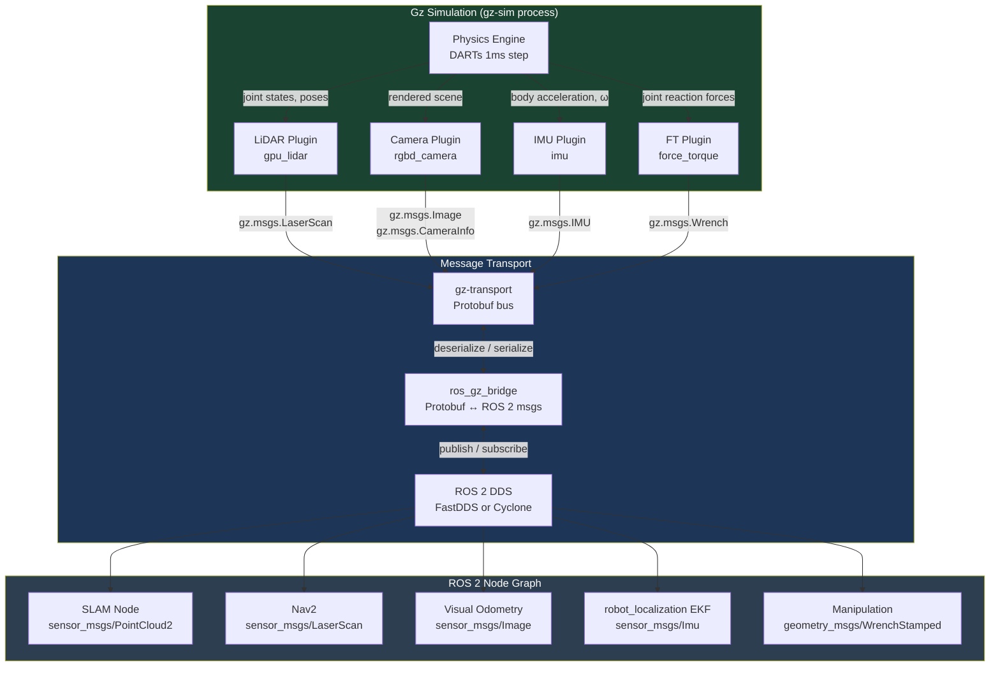
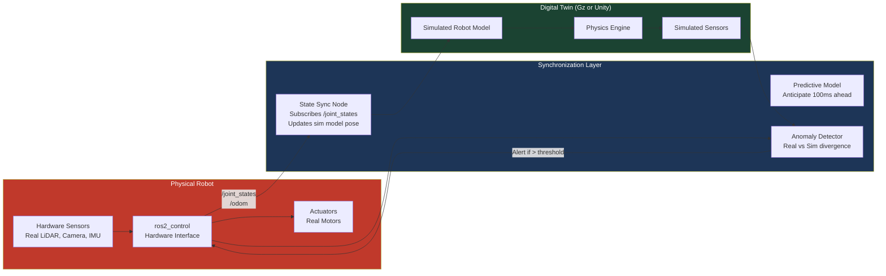

# Sensor Simulation & Unity Integration

## Week 7 — Giving Your Robot Eyes, Ears, and Balance

---

## Learning Objectives

By the end of this chapter, you will be able to:

- Explain how Gazebo simulates LiDAR sensors using ray casting and configure a multi-layer 3D LiDAR plugin in SDF
- Describe the difference between a monocular camera, an RGB-D camera, and a stereo camera in the context of simulation
- Configure a depth camera plugin in SDF that reproduces the characteristics of the Intel RealSense D435i
- Explain the IMU sensor model — accelerometer, gyroscope, bias drift, and Gaussian noise — and configure these parameters in SDF
- Describe how force/torque sensors are attached to joints in SDF and what data they publish
- Trace the path of sensor data from Gz plugin output through `ros_gz_bridge` to a subscribing ROS 2 node
- Set up the Unity Robotics Hub, import a URDF model with the URDF Importer, and establish a bidirectional ROS-TCP-Connector link
- Articulate the digital twin concept and its relevance to Physical AI development

---

## Prerequisites

- Chapter 1 of this module: Gazebo Simulation Environment (SDF world files, plugins, ros_gz_bridge)
- Module 1: ROS 2 Fundamentals (topics, message types, launch files)
- Familiarity with `sensor_msgs` message types: `LaserScan`, `PointCloud2`, `Image`, `CameraInfo`, `Imu`, `FluidPressure`
- Python 3 and the `numpy`, `open3d` packages installed for the point cloud exercises
- Unity 2022 LTS installed (for the Unity integration section)

:::note
The sensor SDF configurations in this chapter are written for **Gazebo Harmonic** with the `gz-sensors` library version 8.x. The XML element names and default values differ slightly in older Gazebo releases (Ignition Fortress, Garden). Cross-reference the `gz-sensors` changelog if you are on an older release.
:::

---

## 1. Sensor Simulation Fundamentals

Before diving into individual sensor types, it is worth understanding what simulation actually does when it models a physical sensor. Every simulated sensor in Gz follows the same lifecycle:

1. **Geometry query** — The sensor plugin queries the physics simulation for the positions and shapes of all objects in the world.
2. **Physics-based measurement** — The plugin applies a model of the sensor's measurement principle (ray casting for LiDAR, rendering for cameras, rigid-body motion for IMU).
3. **Noise injection** — Statistical noise models (Gaussian, bias drift, quantization) are applied to the raw measurement.
4. **Message serialization** — The noisy measurement is packed into a `gz.msgs` Protobuf message and published on `gz-transport`.
5. **Bridge translation** — `ros_gz_bridge` translates the message to the corresponding `sensor_msgs` type and publishes it on ROS 2 DDS.

This pipeline means that a well-configured simulated sensor should produce data that is statistically indistinguishable from its physical counterpart, making it possible to develop and validate perception algorithms entirely in simulation before deploying to hardware.

### 1.1 Sensor Comparison Overview

| Sensor | Measurement Principle | ROS 2 Topic Type | Typical Hz | Sim Cost |
|---|---|---|---|---|
| 2D LiDAR | Ray casting (single plane) | `sensor_msgs/LaserScan` | 10–40 Hz | Low |
| 3D LiDAR | Ray casting (multi-layer) | `sensor_msgs/PointCloud2` | 10–20 Hz | Medium-High |
| RGB Camera | Scene rendering (pinhole) | `sensor_msgs/Image` | 30–60 Hz | Medium |
| Depth Camera (RGB-D) | Structured light / stereo render | `sensor_msgs/Image` + `sensor_msgs/CameraInfo` | 30–90 Hz | High |
| IMU | Rigid-body acceleration + rotation | `sensor_msgs/Imu` | 100–400 Hz | Very Low |
| Force/Torque | Joint reaction force integration | `geometry_msgs/WrenchStamped` | 100–1000 Hz | Low |
| GPS | World pose lookup | `sensor_msgs/NavSatFix` | 1–10 Hz | Very Low |

---

## 2. LiDAR Simulation

### 2.1 How Ray Casting Works

LiDAR (Light Detection And Ranging) measures distance by emitting laser pulses and recording the time-of-flight until the pulse returns from a surface. In simulation, this is replicated with **ray casting**: for each beam, the physics engine casts a ray from the sensor origin in the configured direction, finds the first intersection with a collision mesh, and returns the distance to that intersection.

The quality of a simulated LiDAR scan depends heavily on the collision geometry of your world models. A robot model using primitive collision shapes (boxes, cylinders, spheres) will produce a cleaner scan but less realistic occlusion behavior than one using the full visual mesh as a collision shape.

### 2.2 2D LiDAR — SDF Configuration

The simplest LiDAR case is a single-plane scanner, equivalent to the RPLidar or SICK TIM series used on most mobile robot platforms:

```xml
<!-- Inside your robot model's <link name="lidar_link"> -->
<sensor name="lidar_2d" type="gpu_lidar">
  <update_rate>10</update_rate>
  <topic>/lidar</topic>
  <gz_frame_id>lidar_link</gz_frame_id>

  <lidar>
    <scan>
      <horizontal>
        <samples>360</samples>
        <resolution>1</resolution>
        <min_angle>-3.14159</min_angle>
        <max_angle>3.14159</max_angle>
      </horizontal>
    </scan>
    <range>
      <min>0.12</min>
      <max>12.0</max>
      <resolution>0.015</resolution>
    </range>
    <noise>
      <type>gaussian</type>
      <mean>0.0</mean>
      <stddev>0.01</stddev>
    </noise>
  </lidar>

  <always_on>true</always_on>
  <visualize>true</visualize>
</sensor>
```

Key parameters:
- **`<samples>`** — Number of beams per revolution. 360 gives one beam per degree; use 720 for 0.5° resolution.
- **`<min_angle>` / `<max_angle>`** — Angular sweep range in radians. `-π` to `+π` gives a full 360° scan.
- **`<range><resolution>`** — Distance quantization in meters. The RPLidar A1 has approximately 15 mm range resolution.
- **`<noise><stddev>`** — Standard deviation of Gaussian distance noise in meters. 1 cm is typical for consumer-grade LiDARs.

:::tip
Use `type="gpu_lidar"` rather than the CPU-based `type="ray"` from Gazebo Classic. The GPU ray caster in `gz-sensors` is dramatically faster for high-sample-count scanners (360+ beams) and produces more physically accurate results including reflectance modeling.
:::

### 2.3 3D LiDAR — Velodyne VLP-16 Style Configuration

A 3D LiDAR adds a vertical dimension with multiple stacked scan planes. The Velodyne VLP-16 ("Puck") has 16 vertical channels spanning -15° to +15°:

```xml
<sensor name="lidar_3d" type="gpu_lidar">
  <update_rate>10</update_rate>
  <topic>/points</topic>
  <gz_frame_id>lidar_3d_link</gz_frame_id>

  <lidar>
    <scan>
      <horizontal>
        <samples>1800</samples>
        <resolution>1</resolution>
        <min_angle>-3.14159</min_angle>
        <max_angle>3.14159</max_angle>
      </horizontal>
      <vertical>
        <samples>16</samples>
        <resolution>1</resolution>
        <min_angle>-0.26180</min_angle>   <!-- -15 degrees -->
        <max_angle>0.26180</max_angle>    <!-- +15 degrees -->
      </vertical>
    </scan>
    <range>
      <min>0.1</min>
      <max>100.0</max>
      <resolution>0.001</resolution>
    </range>
    <noise>
      <type>gaussian</type>
      <mean>0.0</mean>
      <stddev>0.003</stddev>
    </noise>
  </lidar>

  <always_on>true</always_on>
  <visualize>false</visualize>  <!-- disable for performance -->
</sensor>
```

### 2.4 Working with Point Clouds in Python

The 3D LiDAR publishes `sensor_msgs/PointCloud2` messages. This is a binary-encoded format that requires deserialization before you can work with the individual points:

```python
#!/usr/bin/env python3
"""
point_cloud_processor.py
Subscribes to /points, converts to numpy array, and computes
the nearest obstacle distance using Open3D.
"""
import rclpy
from rclpy.node import Node
from sensor_msgs.msg import PointCloud2
import sensor_msgs_py.point_cloud2 as pc2
import numpy as np
import open3d as o3d


class PointCloudProcessor(Node):
    def __init__(self):
        super().__init__("point_cloud_processor")
        self.sub = self.create_subscription(
            PointCloud2,
            "/points",
            self.cloud_callback,
            10,
        )
        self.get_logger().info("PointCloudProcessor ready")

    def cloud_callback(self, msg: PointCloud2):
        # Deserialize the binary PointCloud2 into a list of (x, y, z) tuples
        points_gen = pc2.read_points(msg, field_names=("x", "y", "z"),
                                     skip_nans=True)
        points_np = np.array(list(points_gen), dtype=np.float32)

        if points_np.shape[0] == 0:
            return

        # Convert to Open3D PointCloud for processing
        pcd = o3d.geometry.PointCloud()
        pcd.points = o3d.utility.Vector3dVector(points_np)

        # Remove statistical outliers
        cl, ind = pcd.remove_statistical_outlier(nb_neighbors=20, std_ratio=2.0)
        pcd_clean = pcd.select_by_index(ind)

        # Find nearest point distance from sensor origin (0, 0, 0)
        distances = np.linalg.norm(np.asarray(pcd_clean.points), axis=1)
        nearest = float(np.min(distances))
        self.get_logger().info(f"Nearest obstacle: {nearest:.3f} m  "
                               f"Total points: {len(pcd_clean.points)}")


def main():
    rclpy.init()
    node = PointCloudProcessor()
    rclpy.spin(node)
    rclpy.shutdown()


if __name__ == "__main__":
    main()
```

---

## 3. Depth Camera Simulation

### 3.1 RGB-D Cameras — How They Work

An RGB-D camera combines a conventional color camera with a depth-sensing modality. The Intel RealSense D435i uses **active stereo** — it projects a structured infrared pattern onto the scene and uses two IR cameras to compute disparity (and therefore depth) for each pixel. The depth image is then aligned with the color image to produce a registered RGBD frame.

In simulation, the depth camera plugin renders the scene from two slightly offset viewpoints, computes the simulated disparity map, and outputs both a color image and a 16-bit depth image (where each pixel value encodes distance in millimeters).

### 3.2 RealSense D435i — SDF Plugin Configuration

The following SDF configuration closely matches the intrinsic parameters of the physical Intel RealSense D435i:

```xml
<!-- RGB-D Camera sensor inside a link -->
<sensor name="realsense_d435i" type="rgbd_camera">
  <update_rate>30</update_rate>
  <topic>/camera</topic>
  <gz_frame_id>camera_link</gz_frame_id>
  <always_on>true</always_on>
  <visualize>false</visualize>

  <camera name="realsense">
    <!-- Color stream: 1920x1080 at 30 fps -->
    <image>
      <width>1280</width>
      <height>720</height>
      <format>R8G8B8</format>
    </image>

    <!-- Depth stream characteristics -->
    <depth_camera>
      <output>depths</output>
    </depth_camera>

    <!-- Field of view matching D435i 69° H x 42° V -->
    <horizontal_fov>1.2043</horizontal_fov>  <!-- 69 degrees in radians -->

    <!-- Clip planes matching D435i range: 0.1m - 10m -->
    <clip>
      <near>0.1</near>
      <far>10.0</far>
    </clip>

    <!-- Lens distortion (minimal for D435i's global shutter) -->
    <distortion>
      <k1>0.0</k1>
      <k2>0.0</k2>
      <k3>0.0</k3>
      <p1>0.0</p1>
      <p2>0.0</p2>
      <center>0.5 0.5</center>
    </distortion>

    <!-- Depth noise model -->
    <noise>
      <type>gaussian</type>
      <mean>0.0</mean>
      <stddev>0.007</stddev>  <!-- ~7mm at 1m, scales with distance -->
    </noise>
  </camera>
</sensor>
```

### 3.3 CameraInfo and Intrinsic Calibration

The bridge will also publish a `sensor_msgs/CameraInfo` message on `/camera/camera_info`. This message carries the camera's intrinsic matrix **K**, distortion coefficients **D**, and projection matrix **P**. These are essential for any 3D reconstruction, visual odometry, or SLAM algorithm.

```python
#!/usr/bin/env python3
"""
depth_processor.py
Converts a depth image to a colored point cloud using camera intrinsics.
"""
import rclpy
from rclpy.node import Node
from sensor_msgs.msg import Image, CameraInfo
from message_filters import Subscriber, ApproximateTimeSynchronizer
import numpy as np
import cv2
from cv_bridge import CvBridge


class DepthToPointCloud(Node):
    def __init__(self):
        super().__init__("depth_to_pointcloud")
        self.bridge = CvBridge()
        self.K = None  # Camera intrinsic matrix

        # Subscribe to both depth and camera_info with time sync
        self.depth_sub = Subscriber(self, Image, "/camera/depth_image")
        self.info_sub = Subscriber(self, CameraInfo, "/camera/camera_info")
        self.sync = ApproximateTimeSynchronizer(
            [self.depth_sub, self.info_sub], queue_size=10, slop=0.1
        )
        self.sync.registerCallback(self.callback)

    def callback(self, depth_msg: Image, info_msg: CameraInfo):
        # Extract intrinsics on first message
        if self.K is None:
            self.K = np.array(info_msg.k).reshape(3, 3)
            self.fx = self.K[0, 0]
            self.fy = self.K[1, 1]
            self.cx = self.K[0, 2]
            self.cy = self.K[1, 2]
            self.get_logger().info(f"Camera intrinsics loaded: fx={self.fx:.1f}")

        # Convert 16UC1 depth image to float32 (meters)
        depth_cv = self.bridge.imgmsg_to_cv2(depth_msg, desired_encoding="passthrough")
        depth_m = depth_cv.astype(np.float32) / 1000.0  # mm -> m

        h, w = depth_m.shape
        u_coords, v_coords = np.meshgrid(np.arange(w), np.arange(h))

        # Back-project pixels to 3D using pinhole model
        X = (u_coords - self.cx) * depth_m / self.fx
        Y = (v_coords - self.cy) * depth_m / self.fy
        Z = depth_m

        # Filter out invalid depth readings
        valid = Z > 0.1
        points = np.stack([X[valid], Y[valid], Z[valid]], axis=-1)

        self.get_logger().info(
            f"Generated {len(points)} 3D points from depth frame"
        )


def main():
    rclpy.init()
    rclpy.spin(DepthToPointCloud())
    rclpy.shutdown()
```

:::warning
When bridging RGB-D camera data, you need to bridge **three separate topics**: the color image (`/camera/image`), the depth image (`/camera/depth_image`), and the camera info (`/camera/camera_info`). A common mistake is to bridge only the color image and then wonder why depth reconstruction algorithms fail — they require all three.
:::

---

## 4. IMU Sensor Simulation

### 4.1 The IMU Sensor Model

An Inertial Measurement Unit (IMU) combines an accelerometer (measures specific force, which is linear acceleration minus gravitational acceleration) with a gyroscope (measures angular velocity). In physical hardware, both sensors are contaminated by systematic errors that must be modeled accurately in simulation for any realistic sensor fusion or state estimation work.

The key error sources are:

| Error Source | Sensor Affected | Description |
|---|---|---|
| Gaussian noise | Both | White noise proportional to measurement bandwidth |
| Bias | Both | Constant offset at power-on |
| Bias drift (random walk) | Both | Bias that slowly wanders over time |
| Scale factor error | Both | Gain error — real output is `(1 + s) * true` |
| Axis misalignment | Both | Cross-axis sensitivity |
| Gravity coupling | Accelerometer | Accelerometer measures gravity + linear acceleration |

### 4.2 IMU SDF Plugin Configuration

```xml
<!-- IMU sensor attached to the base_link -->
<sensor name="imu_sensor" type="imu">
  <update_rate>200</update_rate>
  <topic>/imu</topic>
  <gz_frame_id>base_link</gz_frame_id>
  <always_on>true</always_on>

  <imu>
    <!-- Accelerometer noise model (units: m/s²) -->
    <linear_acceleration>
      <x>
        <noise type="gaussian">
          <mean>0.0</mean>
          <stddev>0.00196</stddev>       <!-- ~0.2 mg, typical MEMS -->
          <bias_mean>0.0</bias_mean>
          <bias_stddev>0.0001</bias_stddev>   <!-- bias drift -->
          <dynamic_bias_stddev>0.006</dynamic_bias_stddev>
          <dynamic_bias_correlation_time>0.5</dynamic_bias_correlation_time>
        </noise>
      </x>
      <y>
        <noise type="gaussian">
          <mean>0.0</mean>
          <stddev>0.00196</stddev>
          <bias_mean>0.0</bias_mean>
          <bias_stddev>0.0001</bias_stddev>
          <dynamic_bias_stddev>0.006</dynamic_bias_stddev>
          <dynamic_bias_correlation_time>0.5</dynamic_bias_correlation_time>
        </noise>
      </y>
      <z>
        <noise type="gaussian">
          <mean>0.0</mean>
          <stddev>0.00196</stddev>
          <bias_mean>0.0</bias_mean>
          <bias_stddev>0.0001</bias_stddev>
          <dynamic_bias_stddev>0.006</dynamic_bias_stddev>
          <dynamic_bias_correlation_time>0.5</dynamic_bias_correlation_time>
        </noise>
      </z>
    </linear_acceleration>

    <!-- Gyroscope noise model (units: rad/s) -->
    <angular_velocity>
      <x>
        <noise type="gaussian">
          <mean>0.0</mean>
          <stddev>0.000218</stddev>        <!-- ~0.013 deg/s -->
          <bias_mean>0.0</bias_mean>
          <bias_stddev>0.0000075</bias_stddev>
          <dynamic_bias_stddev>0.000002</dynamic_bias_stddev>
          <dynamic_bias_correlation_time>0.5</dynamic_bias_correlation_time>
        </noise>
      </x>
      <y>
        <noise type="gaussian">
          <mean>0.0</mean>
          <stddev>0.000218</stddev>
          <bias_mean>0.0</bias_mean>
          <bias_stddev>0.0000075</bias_stddev>
          <dynamic_bias_stddev>0.000002</dynamic_bias_stddev>
          <dynamic_bias_correlation_time>0.5</dynamic_bias_correlation_time>
        </noise>
      </y>
      <z>
        <noise type="gaussian">
          <mean>0.0</mean>
          <stddev>0.000218</stddev>
          <bias_mean>0.0</bias_mean>
          <bias_stddev>0.0000075</bias_stddev>
          <dynamic_bias_stddev>0.000002</dynamic_bias_stddev>
          <dynamic_bias_correlation_time>0.5</dynamic_bias_correlation_time>
        </noise>
      </z>
    </angular_velocity>
  </imu>
</sensor>
```

The noise parameters above are modeled after the **BMI088** IMU (used on many wheeled and legged robots). If you are simulating a specific hardware platform, look up the IMU datasheet for its **noise density** (in units of `mg/√Hz` for the accelerometer and `mdeg/s/√Hz` for the gyroscope) and convert to `stddev` using:

```
stddev = noise_density * sqrt(update_rate)
```

### 4.3 Sensor Fusion Basics — EKF for Odometry

The `robot_localization` package provides an Extended Kalman Filter (EKF) that fuses IMU data with wheel odometry to produce a more accurate pose estimate. Configure it with:

```yaml
# config/ekf.yaml
ekf_filter_node:
  ros__parameters:
    frequency: 50.0
    sensor_timeout: 0.1
    two_d_mode: true
    publish_tf: true
    map_frame: map
    odom_frame: odom
    base_link_frame: base_link
    world_frame: odom
    use_sim_time: true

    odom0: /odom
    odom0_config: [false, false, false,
                   false, false, false,
                   true,  true,  false,
                   false, false, true,
                   false, false, false]

    imu0: /imu
    imu0_config: [false, false, false,
                  true,  true,  true,
                  false, false, false,
                  true,  true,  true,
                  true,  false, false]
    imu0_differential: false
    imu0_relative: false
    imu0_remove_gravitational_acceleration: true
```

:::tip
Set `imu0_remove_gravitational_acceleration: true` whenever your IMU is mounted with the Z-axis pointing up. The EKF will subtract the expected 9.81 m/s² gravitational component from the accelerometer's Z reading, leaving only the true linear acceleration.
:::

---

## 5. Force/Torque Sensors

Force/Torque (F/T) sensors measure the six-component wrench (three force components Fx, Fy, Fz and three torque components Tx, Ty, Tz) acting at a joint or contact point. They are essential for compliant manipulation, contact detection, and legged robot ground reaction force estimation.

### 5.1 SDF Configuration

Force/Torque sensors in SDF attach to a **joint** rather than a link:

```xml
<!-- Inside the joint definition in your robot SDF -->
<joint name="wrist_ft_joint" type="fixed">
  <parent>forearm_link</parent>
  <child>wrist_link</child>
  <pose>0 0 0 0 0 0</pose>

  <sensor name="ft_sensor" type="force_torque">
    <update_rate>500</update_rate>
    <topic>/ft_sensor</topic>
    <gz_frame_id>wrist_link</gz_frame_id>
    <always_on>true</always_on>

    <force_torque>
      <frame>child</frame>
      <measure_direction>child_to_parent</measure_direction>
      <force>
        <x><noise type="gaussian"><mean>0</mean><stddev>0.1</stddev></noise></x>
        <y><noise type="gaussian"><mean>0</mean><stddev>0.1</stddev></noise></y>
        <z><noise type="gaussian"><mean>0</mean><stddev>0.1</stddev></noise></z>
      </force>
      <torque>
        <x><noise type="gaussian"><mean>0</mean><stddev>0.005</stddev></noise></x>
        <y><noise type="gaussian"><mean>0</mean><stddev>0.005</stddev></noise></y>
        <z><noise type="gaussian"><mean>0</mean><stddev>0.005</stddev></noise></z>
      </torque>
    </force_torque>
  </sensor>
</joint>
```

The F/T sensor publishes `geometry_msgs/WrenchStamped` on the ROS 2 side. Bridge it with:

```yaml
# Add to your bridge config
- ros_topic_name: "/ft_sensor"
  gz_topic_name: "/ft_sensor"
  ros_type_name: "geometry_msgs/msg/WrenchStamped"
  gz_type_name: "gz.msgs.Wrench"
  direction: GZ_TO_ROS
```

---

## 6. Sensor Data Flow Through ROS 2

Understanding the complete data flow from physics simulation through to your perception algorithm is essential for debugging latency issues, missed callbacks, and message synchronization problems.



### 6.1 Complete Bridge Configuration for a Sensor-Rich Robot

```yaml
# config/sensor_bridge.yaml
# Complete bridge config for a mobile robot with LiDAR, RGB-D camera, IMU

# --- Clock (mandatory) ---
- ros_topic_name: "/clock"
  gz_topic_name: "/clock"
  ros_type_name: "rosgraph_msgs/msg/Clock"
  gz_type_name: "gz.msgs.Clock"
  direction: GZ_TO_ROS

# --- Drive and Odometry ---
- ros_topic_name: "/cmd_vel"
  gz_topic_name: "/model/my_robot/cmd_vel"
  ros_type_name: "geometry_msgs/msg/Twist"
  gz_type_name: "gz.msgs.Twist"
  direction: ROS_TO_GZ

- ros_topic_name: "/odom"
  gz_topic_name: "/model/my_robot/odometry"
  ros_type_name: "nav_msgs/msg/Odometry"
  gz_type_name: "gz.msgs.Odometry"
  direction: GZ_TO_ROS

# --- 2D LiDAR ---
- ros_topic_name: "/scan"
  gz_topic_name: "/lidar"
  ros_type_name: "sensor_msgs/msg/LaserScan"
  gz_type_name: "gz.msgs.LaserScan"
  direction: GZ_TO_ROS

# --- 3D LiDAR ---
- ros_topic_name: "/points"
  gz_topic_name: "/points"
  ros_type_name: "sensor_msgs/msg/PointCloud2"
  gz_type_name: "gz.msgs.PointCloudPacked"
  direction: GZ_TO_ROS

# --- RGB-D Camera: Color Image ---
- ros_topic_name: "/camera/image_raw"
  gz_topic_name: "/camera/image"
  ros_type_name: "sensor_msgs/msg/Image"
  gz_type_name: "gz.msgs.Image"
  direction: GZ_TO_ROS

# --- RGB-D Camera: Depth Image ---
- ros_topic_name: "/camera/depth/image_raw"
  gz_topic_name: "/camera/depth_image"
  ros_type_name: "sensor_msgs/msg/Image"
  gz_type_name: "gz.msgs.Image"
  direction: GZ_TO_ROS

# --- RGB-D Camera: Camera Info ---
- ros_topic_name: "/camera/camera_info"
  gz_topic_name: "/camera/camera_info"
  ros_type_name: "sensor_msgs/msg/CameraInfo"
  gz_type_name: "gz.msgs.CameraInfo"
  direction: GZ_TO_ROS

# --- IMU ---
- ros_topic_name: "/imu"
  gz_topic_name: "/imu"
  ros_type_name: "sensor_msgs/msg/Imu"
  gz_type_name: "gz.msgs.IMU"
  direction: GZ_TO_ROS

# --- Joint States (for robot_state_publisher TF) ---
- ros_topic_name: "/joint_states"
  gz_topic_name: "/world/my_world/model/my_robot/joint_state"
  ros_type_name: "sensor_msgs/msg/JointState"
  gz_type_name: "gz.msgs.Model"
  direction: GZ_TO_ROS
```

---

## 7. Unity Robotics Hub — Introduction

While Gazebo is the industry-standard robotics simulator, Unity has emerged as a compelling alternative for scenarios requiring high-fidelity photorealistic rendering, physics-based material interaction, and seamless integration with machine learning toolkits (Unity ML-Agents).

### 7.1 Why Consider Unity for Robotics?

| Capability | Gazebo Harmonic | Unity (Robotics Hub) |
|---|---|---|
| Photorealistic rendering | OGRE 2 (good) | HDRP / URP (excellent) |
| Physics accuracy | DART / Bullet | PhysX / Havok (good for rigid bodies) |
| ROS 2 integration | Native (`ros_gz`) | Via ROS-TCP-Connector (TCP bridge) |
| ML training infrastructure | External RL libs | Unity ML-Agents (built-in) |
| Asset library | Fuel model library | Unity Asset Store (massive) |
| Deformable/cloth simulation | Bullet (basic) | PhysX cloth (production-grade) |
| Learning curve | Moderate (XML/SDF) | Moderate (C#/Unity Editor) |
| Open source | Fully open | Editor is free-tier, not open source |

Unity is the right choice when:
- You need photorealistic image data for training vision models (sim-to-real transfer)
- Your application involves human environments with complex materials and lighting
- You want to leverage the Unity ML-Agents reinforcement learning ecosystem
- High-fidelity grasping physics with deformable objects is required

### 7.2 Unity Robotics Hub Architecture

The Unity Robotics Hub is a collection of Unity packages maintained by Unity Technologies that enables bidirectional communication between Unity and ROS/ROS 2:

```mermaid
graph LR
    subgraph Unity ["Unity Editor / Player"]
        ROBOT[Robot URDF\n(URDF Importer)]
        PHYSICS[PhysX Engine]
        SENSORS[Sensor Scripts\nCamera, LiDAR, IMU]
        ROBOT --> PHYSICS
        PHYSICS --> SENSORS
        SENSORS --> TCPCONN[ROS-TCP-Connector\nTCP Client C#]
    end

    subgraph Bridge ["ROS-TCP-Endpoint"]
        SERVER[ros_tcp_endpoint\nPython TCP Server]
        TCPCONN <-->|JSON-serialized\nROS messages| SERVER
    end

    subgraph ROS2 ["ROS 2 Node Graph"]
        SERVER <-->|Native ROS 2\ntopics and services| NODES[Your ROS 2 Nodes]
    end

    style Unity fill:#2d6a4f,color:#fff
    style Bridge fill:#1d3557,color:#fff
    style ROS2 fill:#2c3e50,color:#fff
```

### 7.3 Setting Up the URDF Importer

The URDF Importer converts a ROS 2 URDF package into a Unity GameObject hierarchy. Follow these steps:

**Step 1 — Install the packages via the Unity Package Manager:**

Open your Unity project, navigate to `Window > Package Manager > Add package by name` and add:
- `com.unity.robotics.urdf-importer` (URDF Importer)
- `com.unity.robotics.ros-tcp-connector` (ROS-TCP-Connector)

**Step 2 — Import your URDF model:**

```csharp
// This is handled through the Unity Editor UI:
// Assets > Import Robot from URDF
// Select your robot's .urdf file
// The importer creates:
//   - A GameObject hierarchy matching the URDF link tree
//   - ArticulationBody components for each joint
//   - Mesh renderers for each visual geometry
//   - Collider components for each collision geometry
```

**Step 3 — Configure the ROS-TCP-Connector:**

In the Unity scene, create a new empty `GameObject` and add the `ROSConnection` component:

```csharp
using Unity.Robotics.ROSTCPConnector;
using RosMessageTypes.Geometry;
using RosMessageTypes.Nav;

public class RobotController : MonoBehaviour
{
    private ROSConnection ros;
    private const string CMD_VEL_TOPIC = "/cmd_vel";
    private const string ODOM_TOPIC    = "/odom";

    void Start()
    {
        ros = ROSConnection.GetOrCreateInstance();

        // Register a publisher for velocity commands
        ros.RegisterPublisher<TwistMsg>(CMD_VEL_TOPIC);

        // Subscribe to odometry coming from ROS 2
        ros.Subscribe<OdometryMsg>(ODOM_TOPIC, OdomCallback);
    }

    void OdomCallback(OdometryMsg msg)
    {
        // Update robot pose in Unity scene from ROS 2 odometry
        float x = (float)msg.pose.pose.position.x;
        float y = (float)msg.pose.pose.position.y;
        // Apply to transform (Unity uses Y-up, ROS uses Z-up — convert!)
        transform.position = new Vector3(x, 0f, y);
    }

    public void SendVelocityCommand(float linearX, float angularZ)
    {
        var twist = new TwistMsg
        {
            linear  = new Vector3Msg { x = linearX, y = 0, z = 0 },
            angular = new Vector3Msg { x = 0, y = 0, z = angularZ }
        };
        ros.Publish(CMD_VEL_TOPIC, twist);
    }
}
```

**Step 4 — Launch the ROS-TCP-Endpoint on the ROS 2 side:**

```bash
# Install the endpoint package
sudo apt install ros-humble-ros-tcp-endpoint

# Launch the endpoint (Unity will connect to port 10000 by default)
ros2 run ros_tcp_endpoint default_server_endpoint \
  --ros-args -p ROS_IP:=0.0.0.0 -p ROS_TCP_PORT:=10000
```

:::note
Unity uses a **left-handed Y-up** coordinate system while ROS 2 uses a **right-handed Z-up** (REP-103) coordinate system. The URDF Importer handles this conversion automatically for static geometry, but any code that manually constructs transforms or interprets sensor data must apply the conversion: `(x_ros, y_ros, z_ros)` maps to `(x_ros, z_ros, -y_ros)` in Unity world space.
:::

---

## 8. The Digital Twin Concept

A **digital twin** is a continuously synchronized virtual representation of a physical system. The term originated in aerospace (NASA used digital twin concepts for the Apollo program) but has become central to modern Physical AI development.

In the context of robotics and Physical AI, a digital twin differs from a standard simulation in one critical way: **bidirectional synchronization**. A simulation runs ahead of reality (or independently). A digital twin maintains a live mirror of the physical robot's state at all times.

### 8.1 Digital Twin Architecture in ROS 2



### 8.2 Applications in Physical AI

The digital twin pattern enables several capabilities that are central to the Physical AI roadmap:

**Predictive maintenance** — By running the simulation slightly ahead of reality, you can predict joint wear, detect bearing friction changes, and schedule maintenance before failures occur.

**Safe exploration** — A reinforcement learning agent can first explore in the digital twin (with no risk of hardware damage) and then transfer the learned policy to the physical robot. The sim-to-real gap is minimized when the digital twin accurately models hardware dynamics.

**Operator training** — Human operators can train on the digital twin without risk to expensive physical hardware or to bystanders.

**Post-incident analysis** — When an unexpected event occurs (a collision, a drop), you can replay the digital twin using the recorded sensor logs to understand root cause.

---

## 9. Hands-On Exercise — Simulating a RealSense D435i on TurtleBot3

This exercise adds a simulated Intel RealSense D435i depth camera to a TurtleBot3 Waffle model, bridges the sensor data to ROS 2, and visualizes the point cloud in RViz2.

### Step 1 — Create a Camera-Equipped Robot SDF

Save the following as `models/turtlebot3_with_camera.sdf`. This file extends the standard TurtleBot3 Waffle with a camera mount:

```xml
<?xml version="1.0" ?>
<sdf version="1.9">
  <model name="turtlebot3_camera">
    <!-- Include the base TurtleBot3 Waffle model -->
    <include merge="true">
      <uri>model://turtlebot3_waffle</uri>
    </include>

    <!-- Camera mount link -->
    <link name="camera_mount_link">
      <pose relative_to="base_link">0.064 0 0.172 0 0 0</pose>
      <inertial>
        <mass>0.072</mass>
        <inertia>
          <ixx>0.00001</ixx><iyy>0.00001</iyy><izz>0.00001</izz>
        </inertia>
      </inertial>
      <visual name="camera_vis">
        <geometry>
          <box><size>0.025 0.090 0.025</size></box>
        </geometry>
        <material><ambient>0.1 0.1 0.1 1</ambient></material>
      </visual>

      <!-- RealSense D435i RGB-D sensor -->
      <sensor name="realsense_d435i" type="rgbd_camera">
        <update_rate>30</update_rate>
        <topic>/camera</topic>
        <gz_frame_id>camera_mount_link</gz_frame_id>
        <always_on>true</always_on>
        <visualize>false</visualize>

        <camera name="realsense">
          <image>
            <width>640</width>
            <height>480</height>
            <format>R8G8B8</format>
          </image>
          <depth_camera>
            <output>depths</output>
          </depth_camera>
          <horizontal_fov>1.2043</horizontal_fov>
          <clip>
            <near>0.1</near>
            <far>10.0</far>
          </clip>
          <noise>
            <type>gaussian</type>
            <mean>0.0</mean>
            <stddev>0.007</stddev>
          </noise>
        </camera>
      </sensor>

      <!-- IMU sensor co-located with camera (D435i has built-in IMU) -->
      <sensor name="camera_imu" type="imu">
        <update_rate>200</update_rate>
        <topic>/camera/imu</topic>
        <gz_frame_id>camera_mount_link</gz_frame_id>
        <always_on>true</always_on>
        <imu>
          <linear_acceleration>
            <x><noise type="gaussian"><stddev>0.00196</stddev></noise></x>
            <y><noise type="gaussian"><stddev>0.00196</stddev></noise></y>
            <z><noise type="gaussian"><stddev>0.00196</stddev></noise></z>
          </linear_acceleration>
          <angular_velocity>
            <x><noise type="gaussian"><stddev>0.000218</stddev></noise></x>
            <y><noise type="gaussian"><stddev>0.000218</stddev></noise></y>
            <z><noise type="gaussian"><stddev>0.000218</stddev></noise></z>
          </angular_velocity>
        </imu>
      </sensor>
    </link>

    <!-- Fixed joint attaching camera to base -->
    <joint name="camera_mount_joint" type="fixed">
      <parent>base_link</parent>
      <child>camera_mount_link</child>
    </joint>

  </model>
</sdf>
```

### Step 2 — Update the Bridge Configuration

Add these entries to your `config/sensor_bridge.yaml`:

```yaml
# RealSense Color
- ros_topic_name: "/camera/image_raw"
  gz_topic_name: "/camera/image"
  ros_type_name: "sensor_msgs/msg/Image"
  gz_type_name: "gz.msgs.Image"
  direction: GZ_TO_ROS

# RealSense Depth
- ros_topic_name: "/camera/depth/image_raw"
  gz_topic_name: "/camera/depth_image"
  ros_type_name: "sensor_msgs/msg/Image"
  gz_type_name: "gz.msgs.Image"
  direction: GZ_TO_ROS

# RealSense Camera Info
- ros_topic_name: "/camera/camera_info"
  gz_topic_name: "/camera/camera_info"
  ros_type_name: "sensor_msgs/msg/CameraInfo"
  gz_type_name: "gz.msgs.CameraInfo"
  direction: GZ_TO_ROS

# RealSense IMU
- ros_topic_name: "/camera/imu"
  gz_topic_name: "/camera/imu"
  ros_type_name: "sensor_msgs/msg/Imu"
  gz_type_name: "gz.msgs.IMU"
  direction: GZ_TO_ROS
```

### Step 3 — Visualize in RViz2

```bash
# Terminal 1: launch Gazebo with the camera-equipped robot
ros2 launch my_simulation_world simulation.launch.py

# Terminal 2: launch RViz2 with a sensor config
ros2 run rviz2 rviz2

# In RViz2:
# 1. Set Fixed Frame to "odom"
# 2. Add -> By topic -> /scan -> LaserScan
# 3. Add -> By topic -> /camera/depth/image_raw -> Image
# 4. Add -> By topic -> /camera/image_raw -> Image
# 5. Add -> DepthCloud, set Depth Map Topic to /camera/depth/image_raw
#    and set Color Image Topic to /camera/image_raw
```

### Step 4 — Write a Simple Obstacle Detector

```python
#!/usr/bin/env python3
"""
camera_obstacle_detector.py
Uses depth image to detect if any obstacle is within 0.5m in front of the robot.
"""
import rclpy
from rclpy.node import Node
from sensor_msgs.msg import Image
from cv_bridge import CvBridge
import numpy as np


class CameraObstacleDetector(Node):
    def __init__(self):
        super().__init__("camera_obstacle_detector")
        self.bridge = CvBridge()
        self.warning_distance = self.declare_parameter(
            "warning_distance", 0.5
        ).get_parameter_value().double_value

        self.sub = self.create_subscription(
            Image,
            "/camera/depth/image_raw",
            self.depth_callback,
            10,
        )
        self.get_logger().info(
            f"Obstacle detector active. Warning at {self.warning_distance}m"
        )

    def depth_callback(self, msg: Image):
        depth_cv = self.bridge.imgmsg_to_cv2(msg, desired_encoding="passthrough")
        depth_m = depth_cv.astype(np.float32) / 1000.0

        h, w = depth_m.shape
        # Consider only the central 30% of the image (forward-facing region)
        center_w = slice(int(w * 0.35), int(w * 0.65))
        center_h = slice(int(h * 0.35), int(h * 0.65))
        roi = depth_m[center_h, center_w]

        valid = roi[(roi > 0.1) & (roi < 10.0)]
        if valid.size == 0:
            return

        min_dist = float(np.min(valid))
        if min_dist < self.warning_distance:
            self.get_logger().warn(
                f"OBSTACLE DETECTED: {min_dist:.3f}m ahead!"
            )
        else:
            self.get_logger().info(
                f"Path clear. Nearest object: {min_dist:.3f}m"
            )


def main():
    rclpy.init()
    rclpy.spin(CameraObstacleDetector())
    rclpy.shutdown()
```

Run the detector:

```bash
ros2 run my_simulation_world camera_obstacle_detector \
  --ros-args -p warning_distance:=0.8
```

:::tip
When developing perception algorithms that will be deployed to real hardware, test your code against both the simulated sensor and — if available — a bag file recorded from the physical sensor. The ROS 2 bag tools (`ros2 bag record -a` and `ros2 bag play`) make this workflow straightforward.
:::

---

## Key Takeaways

- **Every simulated sensor** follows the same pipeline: geometry query → physics-based measurement → noise injection → Protobuf publication → bridge translation → ROS 2 subscription.
- **LiDAR simulation** uses GPU-accelerated ray casting. Use `type="gpu_lidar"` and configure `<samples>`, `<range>`, and `<noise><stddev>` to match your target hardware's datasheet.
- **Depth cameras** publish three separate streams — color image, depth image, and camera info — all of which must be bridged and time-synchronized for downstream algorithms.
- **IMU noise modeling** requires setting Gaussian noise `stddev`, `bias_stddev`, and `dynamic_bias_stddev` separately. Use the sensor datasheet to compute `stddev = noise_density * sqrt(update_rate)`.
- **Force/Torque sensors** attach to **joints** rather than links in SDF, and the `<frame>` and `<measure_direction>` parameters determine the coordinate frame of the reported wrench.
- **`ros_gz_bridge`** requires a complete YAML configuration covering all sensor topics, the `/clock` topic, and any actuator command topics.
- **Unity Robotics Hub** provides a production-grade alternative to Gazebo for high-fidelity visual environments. The URDF Importer and ROS-TCP-Connector packages form the bridge between Unity's physics/rendering and your ROS 2 node graph.
- **Digital twins** go beyond simulation by maintaining live bidirectional synchronization with a physical robot, enabling predictive maintenance, safe exploration, and anomaly detection.

---

## Review Questions

1. The Gz sensor pipeline applies noise injection after the physics-based measurement step. Why is this ordering significant? What would happen to your perception algorithm if noise were applied before the measurement step?

2. You are simulating a Velodyne VLP-32C LiDAR (32 channels, -25° to +15° vertical FOV, 0.1° horizontal resolution). Write the `<scan>` block of the SDF sensor configuration with the correct `<samples>`, `<vertical><min_angle>`, `<vertical><max_angle>`, and `<vertical><samples>` values.

3. A colleague reports that their EKF (`robot_localization`) is producing a pose estimate that drifts significantly over time even with a perfect ground truth odometry source. They mention that the IMU data looks reasonable. What IMU configuration parameter is most likely misconfigured, and what effect would it have if set incorrectly?

4. Why does bridging an RGB-D camera require three separate YAML bridge entries rather than one? What happens to a depth reconstruction algorithm if only the color image and depth image are bridged but the camera info is omitted?

5. Explain the coordinate frame difference between Unity and ROS 2 (REP-103). Write a Python function `ros_to_unity(x, y, z)` that converts a ROS 2 3D position to a Unity 3D position.

6. Distinguish between a "simulation" and a "digital twin." Give a concrete example of a Physical AI application where you would need a digital twin rather than a simulation, and explain the specific capability that requires the digital twin architecture.

---

## Further Reading

- [gz-sensors Documentation](https://gazebosim.org/api/sensors/9/) — Complete sensor plugin API reference
- [Intel RealSense D435i Product Page](https://www.intelrealsense.com/depth-camera-d435i/) — Datasheet for calibrating simulation noise parameters
- [Unity Robotics Hub GitHub](https://github.com/Unity-Technologies/Unity-Robotics-Hub) — URDF Importer and ROS-TCP-Connector source code and tutorials
- [robot_localization ROS 2 Documentation](https://docs.ros.org/en/humble/p/robot_localization/) — EKF/UKF configuration reference
- [Open3D Point Cloud Processing](https://www.open3d.org/docs/release/tutorial/geometry/pointcloud.html) — Point cloud filtering, registration, and visualization
- [PCL (Point Cloud Library)](https://pointclouds.org/) — C++ library for production-grade point cloud processing
- [Digital Twin Consortium](https://www.digitaltwinconsortium.org/) — Industry standards and architecture patterns for digital twins
