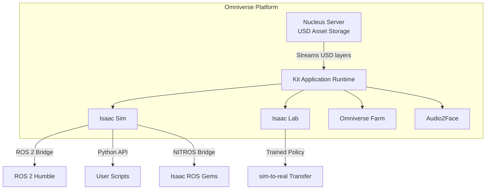
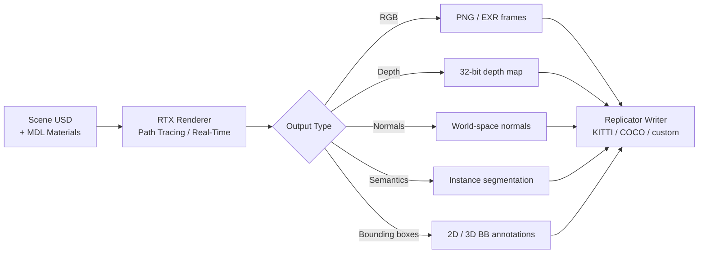
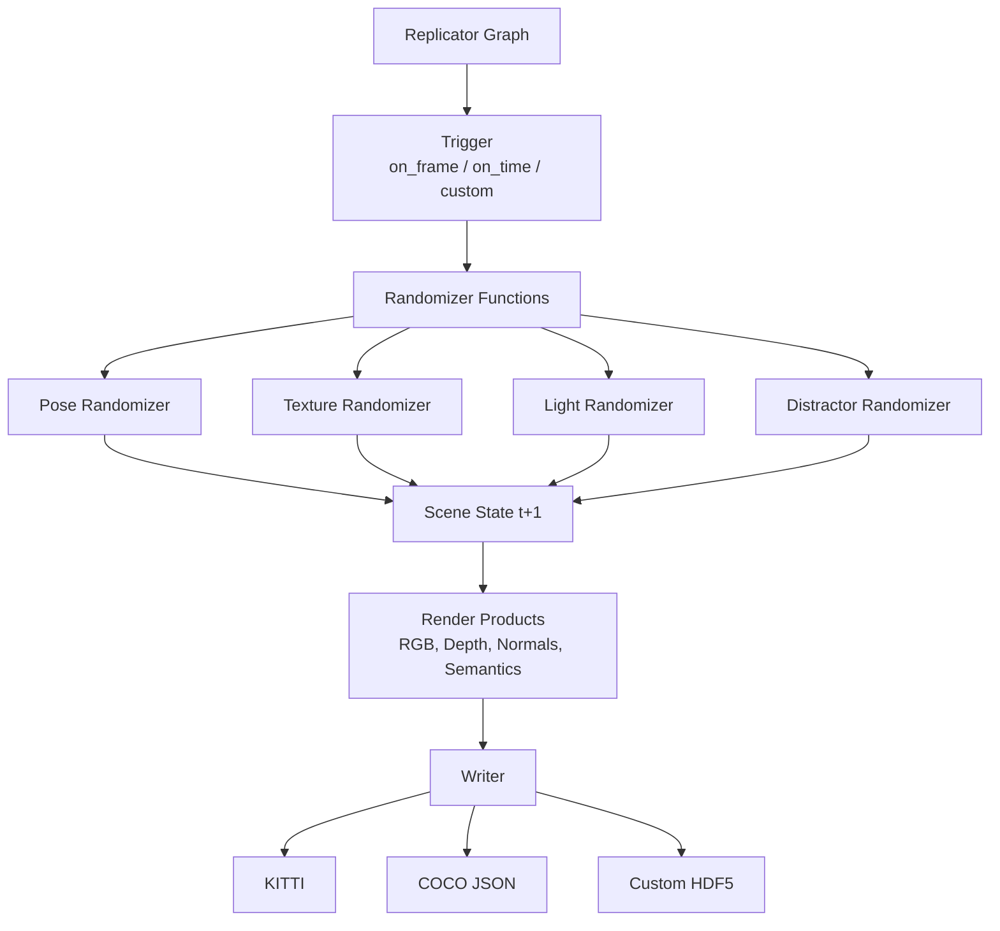

# NVIDIA Isaac Sim

## Week 8: Photorealistic Robot Simulation with NVIDIA Omniverse

NVIDIA Isaac Sim is the premier robotics simulation platform for teams that need physics accuracy, photorealism, and seamless integration with GPU-accelerated AI training pipelines. Built on the NVIDIA Omniverse platform, it goes far beyond what conventional simulators offer: every rendered frame uses RTX ray tracing, every contact is resolved by PhysX 5, and every synthetic image can feed directly into a data pipeline for training neural networks.

This chapter introduces the full Isaac Sim ecosystem — from the Universal Scene Description (USD) format that underpins every scene, through the Replicator framework that automates synthetic dataset creation, to the OmniGraph visual programming system that orchestrates robot behavior inside the simulator. By the end of this week you will be able to open a simulated warehouse, drop in a robot asset, generate a labelled image dataset, and understand every layer of the software stack that makes it possible.

---

## Learning Objectives

By the end of this chapter you will be able to:

1. Explain the role of the NVIDIA Omniverse platform and how Isaac Sim sits within it.
2. Describe the Universal Scene Description (USD) format and manipulate USD scenes programmatically.
3. Configure PhysX 5 simulation parameters for realistic rigid-body and contact dynamics.
4. Enable RTX ray-traced rendering and understand its impact on synthetic data quality.
5. Use NVIDIA Replicator to generate labelled synthetic datasets with domain randomization.
6. Wire robot behavior using OmniGraph visual scripting nodes.
7. Identify the minimum hardware requirements for running Isaac Sim at interactive frame rates.

---

## Prerequisites

Before working through this chapter you should be comfortable with:

- Python 3.10+ (classes, decorators, async/await)
- ROS 2 Humble fundamentals (nodes, topics, transforms) — covered in Module 1
- Basic 3-D geometry: coordinate frames, homogeneous transforms, Euler angles
- Linux terminal fluency (file system navigation, environment variables, pip)

:::note
Isaac Sim runs only on Linux (Ubuntu 22.04 LTS recommended) or Windows 11 with WSL2. macOS is not supported. All code in this chapter assumes Ubuntu 22.04.
:::

---

## 1. The NVIDIA Omniverse Platform

NVIDIA Omniverse is a real-time 3-D collaboration and simulation platform built around two core technologies: the **Universal Scene Description (USD)** format and the **Nucleus** content-storage server. Isaac Sim is one application that runs on top of this platform, alongside tools like Isaac Lab (reinforcement learning), Omniverse Farm (cloud rendering), and Audio2Face.



The **Kit** runtime is the plugin engine beneath every Omniverse application. It loads extensions — compiled C++/CUDA modules or Python packages — and connects them through a unified stage (scene) represented as a USD file tree.

### 1.1 Why Isaac Sim for Robotics?

| Feature | Gazebo Classic | Gazebo Harmonic | Isaac Sim |
|---|---|---|---|
| Physics engine | ODE / Bullet | Dart / Bullet | PhysX 5 (GPU) |
| Rendering | OGRE | OGRE / Vulkan | RTX ray tracing |
| Sensor fidelity | Approximated | Improved | Physically-based |
| Synthetic data pipeline | Manual | Manual | Built-in Replicator |
| ROS 2 integration | ros_gz_bridge | ros_gz_bridge | Isaac ROS bridge |
| GPU acceleration | None | Partial | Full (CUDA) |
| USD support | No | Partial | Native |

The trade-off is hardware demand: Isaac Sim requires a discrete NVIDIA RTX GPU with at least 8 GB VRAM. The sim-to-real quality it delivers justifies this requirement when training perception networks.

---

## 2. Universal Scene Description (USD)

USD was created by Pixar and open-sourced in 2016. NVIDIA extended it with the **Omniverse USD** dialect that adds physics schemas, MDL material definitions, and semantic labelling attributes required for robotics.

### 2.1 USD Concepts in 60 Seconds

A USD **stage** is a virtual scene. It is composed from multiple **layers** stacked on top of each other — each layer can override values from layers below it. This "composition arc" system lets you separate environment layout, robot assets, and lighting into independent files that merge at runtime.

```
stage/
├── world.usd          ← root layer  (coordinate system, up-axis)
│   ├── envs/
│   │   └── warehouse.usd  ← reference layer (static geometry)
│   ├── robots/
│   │   └── g1.usd         ← reference layer (robot asset)
│   └── lighting.usd       ← sublayer   (HDRI + rect lights)
```

Each item in the hierarchy is a **prim** (primitive). Prims carry **attributes** (typed values: floats, vectors, strings) and **relationships** (typed links to other prims). Schemas such as `UsdPhysics.RigidBodyAPI` are applied to prims to attach physics behaviour.

### 2.2 Reading and Writing USD with Python

```python
#!/usr/bin/env python3
"""usd_basics.py — create a simple USD stage with a physics cube."""

from pxr import Usd, UsdGeom, UsdPhysics, Gf, Sdf

# ── Create a new stage ──────────────────────────────────────────────────────
stage: Usd.Stage = Usd.Stage.CreateNew("/tmp/demo.usda")
UsdGeom.SetStageUpAxis(stage, UsdGeom.Tokens.z)
UsdGeom.SetStageMetersPerUnit(stage, 1.0)   # SI units

# ── Add a ground plane ───────────────────────────────────────────────────────
ground = UsdGeom.Xform.Define(stage, "/World/GroundPlane")
plane_geom = UsdGeom.Plane.Define(stage, "/World/GroundPlane/Mesh")
plane_geom.CreateAxisAttr(UsdGeom.Tokens.z)
UsdPhysics.CollisionAPI.Apply(plane_geom.GetPrim())

# ── Add a rigid-body cube ────────────────────────────────────────────────────
cube_xform = UsdGeom.Xform.Define(stage, "/World/Cube")
cube_xform.AddTranslateOp().Set(Gf.Vec3d(0.0, 0.0, 1.0))  # 1 m above ground
cube_geom = UsdGeom.Cube.Define(stage, "/World/Cube/Mesh")
cube_geom.CreateSizeAttr(0.2)                               # 20 cm sides

# Apply physics schemas
rb_api = UsdPhysics.RigidBodyAPI.Apply(cube_geom.GetPrim())
rb_api.CreateVelocityAttr(Gf.Vec3f(0.0))
UsdPhysics.CollisionAPI.Apply(cube_geom.GetPrim())
UsdPhysics.MassAPI.Apply(cube_geom.GetPrim()).CreateMassAttr(1.0)  # 1 kg

# ── Save ─────────────────────────────────────────────────────────────────────
stage.GetRootLayer().Save()
print("Stage saved to /tmp/demo.usda")
```

:::tip
Run `usdview /tmp/demo.usda` from within an Isaac Sim Python environment to preview the scene without launching the full GUI. This is ideal for CI/CD pipelines that validate assets automatically.
:::

### 2.3 USD Semantic Labelling for Synthetic Data

Isaac Replicator relies on semantic attributes attached to USD prims to generate ground-truth labels.

```python
from pxr import Usd, Semantics

def label_prim(stage: Usd.Stage, prim_path: str, class_name: str) -> None:
    """Apply a semantic class label to a USD prim."""
    prim = stage.GetPrimAtPath(prim_path)
    sem_api = Semantics.SemanticsAPI.Apply(prim, "class")
    sem_api.CreateSemanticTypeAttr().Set("class")
    sem_api.CreateSemanticDataAttr().Set(class_name)

# Example usage
label_prim(stage, "/World/Objects/Box_01", "cardboard_box")
label_prim(stage, "/World/Robots/G1/torso_link", "robot")
```

---

## 3. PhysX 5 Physics Engine

NVIDIA PhysX 5 is a GPU-accelerated rigid-body and articulation solver. Isaac Sim exposes it through both the GUI and the Python physics API.

### 3.1 Physics Scene Configuration

```python
#!/usr/bin/env python3
"""physics_scene.py — configure a PhysX 5 scene in Isaac Sim."""

import omni.physx
from pxr import Usd, UsdPhysics, PhysxSchema, Gf

def configure_physics_scene(stage: Usd.Stage) -> None:
    """Set up a PhysX scene with realistic parameters."""
    physics_scene = UsdPhysics.Scene.Define(stage, "/World/PhysicsScene")

    # Gravity (Z-up, SI units)
    physics_scene.CreateGravityDirectionAttr(Gf.Vec3f(0.0, 0.0, -1.0))
    physics_scene.CreateGravityMagnitudeAttr(9.81)

    # PhysX solver settings
    physx_scene = PhysxSchema.PhysxSceneAPI.Apply(physics_scene.GetPrim())
    physx_scene.CreateSolverTypeAttr("TGS")         # Temporal Gauss-Seidel
    physx_scene.CreateTimeStepsPerSecondAttr(200)   # 200 Hz physics rate
    physx_scene.CreateEnableCCDAttr(True)            # continuous collision detection
    physx_scene.CreateEnableGPUDynamicsAttr(True)    # GPU acceleration
    physx_scene.CreateGpuMaxNumPartitionsAttr(8)

    print("PhysX 5 scene configured with GPU dynamics at 200 Hz.")
```

### 3.2 Articulation — Modelling Robot Joints

Humanoid robots are **articulations** in PhysX 5: trees of rigid bodies connected by joints. Each joint can be driven by a position, velocity, or force target.

```python
from pxr import UsdPhysics, PhysxSchema

def add_revolute_joint(
    stage,
    joint_path: str,
    body0_path: str,
    body1_path: str,
    axis: str = "X",
    lower_deg: float = -90.0,
    upper_deg: float = 90.0,
) -> None:
    """Define a driven revolute joint between two rigid bodies."""
    joint = UsdPhysics.RevoluteJoint.Define(stage, joint_path)
    joint.CreateBody0Rel().SetTargets([body0_path])
    joint.CreateBody1Rel().SetTargets([body1_path])
    joint.CreateAxisAttr(axis)
    joint.CreateLowerLimitAttr(lower_deg)
    joint.CreateUpperLimitAttr(upper_deg)

    # Drive API — position control
    drive = UsdPhysics.DriveAPI.Apply(joint.GetPrim(), "angular")
    drive.CreateTypeAttr("force")
    drive.CreateMaxForceAttr(500.0)   # N·m
    drive.CreateStiffnessAttr(1e4)
    drive.CreateDampingAttr(1e3)
```

:::warning
Setting `timeStepsPerSecond` below 120 Hz for articulated robots can introduce visible simulation instability (joint chatter, energy gain). For humanoid robots with many degrees of freedom, 200 Hz is the recommended minimum.
:::

---

## 4. RTX Ray-Traced Rendering

Isaac Sim uses NVIDIA RTX technology to produce physically-based images indistinguishable from real camera footage. This is critical for synthetic data: networks trained on photorealistic renders transfer to real cameras far better than those trained on rasterised images.



### 4.1 Render Modes

| Mode | Latency | Quality | Use case |
|---|---|---|---|
| Real-Time RTX | Low (~30 ms) | High | Interactive development |
| Path Tracing | High (~500 ms+) | Photorealistic | Final dataset generation |
| Iray | Very high | Reference | Material validation |

### 4.2 Enabling RTX in a Headless Script

```python
#!/usr/bin/env python3
"""headless_rtx.py — run Isaac Sim headlessly and capture an RTX frame."""

import omni.kit.app
from omni.isaac.core import SimulationApp

# Launch the simulator headlessly
simulation_app = SimulationApp(
    {
        "headless": True,
        "renderer": "RaytracedLighting",   # or "PathTracing"
        "width": 1920,
        "height": 1080,
    }
)

import omni.replicator.core as rep
from omni.isaac.core.utils.stage import open_stage

# Open a pre-built warehouse scene
open_stage("/home/user/assets/warehouse.usd")

# Create a camera and render product
camera = rep.create.camera(position=(2.0, 0.0, 1.5), look_at=(0.0, 0.0, 0.5))
render_product = rep.create.render_product(camera, (1920, 1080))

# Write one frame to disk
with rep.trigger.on_frame(num_frames=1):
    writer = rep.WriterRegistry.get("BasicWriter")
    writer.initialize(output_dir="/tmp/isaac_output", rgb=True, distance_to_image_plane=True)
    writer.attach([render_product])

rep.orchestrator.run()
simulation_app.close()
```

---

## 5. NVIDIA Replicator & Synthetic Data Generation

NVIDIA Replicator is a programmatic synthetic data generation (SDG) framework built into Isaac Sim. It lets you define **randomizers** — functions that vary scene parameters on each frame — and **writers** that save the resulting images and annotations in standard formats.

### 5.1 Replicator Architecture



### 5.2 A Complete SDG Script

```python
#!/usr/bin/env python3
"""sdg_pipeline.py — generate 1000 labelled images of a robot in a warehouse."""

from omni.isaac.core import SimulationApp

simulation_app = SimulationApp({"headless": True, "renderer": "RaytracedLighting"})

import omni.replicator.core as rep
from omni.isaac.core.utils.stage import open_stage

NUM_FRAMES = 1000
OUTPUT_DIR = "/tmp/sdg_dataset"

open_stage("/home/user/assets/warehouse_with_robot.usd")

# ── Randomizer: object poses ─────────────────────────────────────────────────
boxes = rep.get.prims(semantics=[("class", "cardboard_box")])

def randomize_box_poses():
    with boxes:
        rep.randomizer.pose(
            position=rep.distribution.uniform((-3.0, -3.0, 0.05), (3.0, 3.0, 0.05)),
            rotation=rep.distribution.uniform((0, 0, -180), (0, 0, 180)),
        )
    return boxes.node

rep.randomizer.register(randomize_box_poses)

# ── Randomizer: lighting ──────────────────────────────────────────────────────
lights = rep.get.light()

def randomize_lighting():
    with lights:
        rep.modify.attribute("intensity", rep.distribution.uniform(500, 3000))
        rep.modify.attribute(
            "color",
            rep.distribution.uniform((0.8, 0.8, 0.8), (1.0, 1.0, 1.0)),
        )
    return lights.node

rep.randomizer.register(randomize_lighting)

# ── Camera ───────────────────────────────────────────────────────────────────
camera = rep.create.camera()
render_product = rep.create.render_product(camera, (1280, 720))

# ── Trigger + Writer ──────────────────────────────────────────────────────────
with rep.trigger.on_frame(num_frames=NUM_FRAMES):
    rep.randomizer.randomize_box_poses()
    rep.randomizer.randomize_lighting()
    rep.modify.pose(
        camera,
        position=rep.distribution.uniform((0.5, -2.0, 1.0), (3.0, 2.0, 2.5)),
        look_at=rep.distribution.choice(boxes),
    )

writer = rep.WriterRegistry.get("KittiWriter")
writer.initialize(
    output_dir=OUTPUT_DIR,
    write_bounding_box_data=True,
    write_semantic_segmentation=True,
)
writer.attach([render_product])

rep.orchestrator.run()
print(f"Dataset written to {OUTPUT_DIR}")
simulation_app.close()
```

:::tip
For large datasets (>50 k frames), run Isaac Sim in **cluster mode** using Omniverse Farm, which distributes the rendering workload across multiple GPU nodes and can generate millions of labelled images overnight.
:::

---

## 6. Domain Randomization

Domain randomization (DR) is the practice of varying simulation parameters during training so that the learned policy or perception model encounters a wide distribution of conditions. Networks trained with aggressive domain randomization generalise far better to real hardware than those trained on a fixed scene.

### 6.1 What to Randomize

| Category | Parameters | Effect on Transfer |
|---|---|---|
| Lighting | Intensity, color temperature, direction | Reduces over-fitting to fixed illumination |
| Textures | Albedo, roughness, metallic | Prevents texture memorisation |
| Object pose | Translation, rotation | Improves pose-estimation robustness |
| Camera | FOV, distortion, noise | Bridges sim/real sensor gap |
| Physics | Mass, friction, restitution | Improves policy robustness to contact uncertainty |
| Distractors | Random geometry, random colors | Forces the network to focus on semantics |

### 6.2 Physics Domain Randomization

```python
#!/usr/bin/env python3
"""physics_dr.py — randomize contact material properties each episode."""

import random
from pxr import Usd, UsdPhysics, PhysxSchema

def randomize_contact_materials(stage: Usd.Stage, prim_paths: list[str]) -> None:
    """
    Randomize friction and restitution for the listed prims.
    Call this at the start of every training episode.
    """
    for path in prim_paths:
        prim = stage.GetPrimAtPath(path)
        if not prim.IsValid():
            continue

        mat_api = PhysxSchema.PhysxMaterialAPI.Apply(prim)
        mat_api.CreateStaticFrictionAttr(random.uniform(0.3, 0.9))
        mat_api.CreateDynamicFrictionAttr(random.uniform(0.2, 0.7))
        mat_api.CreateRestitutionAttr(random.uniform(0.0, 0.5))

# Example: randomize floor and box materials
randomize_contact_materials(
    stage,
    ["/World/Floor", "/World/Objects/Box_01", "/World/Objects/Box_02"],
)
```

---

## 7. OmniGraph Visual Programming

OmniGraph is a real-time dataflow programming system built into Isaac Sim. It lets you connect computation nodes — math operations, ROS publishers, sensor readers, PID controllers — by drawing wires in a visual editor. OmniGraph executes on the GPU, making it suitable for low-latency sensor processing.

### 7.1 Common OmniGraph Node Types

| Node Category | Examples |
|---|---|
| ROS 2 | ROS2 Publisher, ROS2 Subscriber, Clock, TF2 broadcaster |
| Sensors | IsaacReadCamera, IsaacReadLidar, IsaacReadIMU |
| Math | Add, Multiply, Normalize, TransformVector |
| Control | ArticulationController, JointStateWriter |
| Logic | Tick, Gate, BranchIf |

### 7.2 Creating an OmniGraph from Python

```python
#!/usr/bin/env python3
"""omnigraph_ros.py — programmatically create an OmniGraph that publishes
   a robot's joint states over ROS 2."""

import omni.graph.core as og

keys = og.Controller.Keys

# Build the graph
(graph, [tick, js_reader, ros_pub], _, _) = og.Controller.edit(
    {"graph_path": "/ActionGraph", "evaluator_name": "execution"},
    {
        keys.CREATE_NODES: [
            ("OnPlaybackTick", "omni.graph.action.OnPlaybackTick"),
            ("ArticulationStateReader", "omni.isaac.core_nodes.IsaacArticulationState"),
            ("ROS2JointStatePublisher", "omni.isaac.ros2_bridge.ROS2PublishJointState"),
        ],
        keys.CONNECT: [
            ("OnPlaybackTick.outputs:tick", "ArticulationStateReader.inputs:execIn"),
            ("ArticulationStateReader.outputs:execOut", "ROS2JointStatePublisher.inputs:execIn"),
            ("ArticulationStateReader.outputs:jointNames", "ROS2JointStatePublisher.inputs:jointNames"),
            ("ArticulationStateReader.outputs:positionState", "ROS2JointStatePublisher.inputs:positionState"),
            ("ArticulationStateReader.outputs:velocityState", "ROS2JointStatePublisher.inputs:velocityState"),
        ],
        keys.SET_VALUES: [
            ("ArticulationStateReader.inputs:robotPath", "/World/Robots/G1"),
            ("ROS2JointStatePublisher.inputs:topicName", "/joint_states"),
            ("ROS2JointStatePublisher.inputs:frameId", "world"),
        ],
    },
)
print("OmniGraph created:", graph.get_path_to_graph())
```

---

## 8. Hardware Requirements

Running Isaac Sim at useful simulation rates demands significant GPU resources. The table below lists recommended configurations by use case.

| Use Case | GPU | VRAM | System RAM | Storage |
|---|---|---|---|---|
| Development / exploration | RTX 4070 Ti | 12 GB | 32 GB | 50 GB SSD |
| Single-robot training | RTX 4080 | 16 GB | 64 GB | 100 GB NVMe |
| Multi-robot / SDG at scale | RTX 4090 | 24 GB | 128 GB | 500 GB NVMe |
| Data-centre SDG | A100 / H100 | 40–80 GB | 256 GB | 2 TB NVMe |

:::warning
Attempting to run Isaac Sim on a GPU without RTX ray-tracing cores (e.g., GTX series, AMD, Intel Arc) will fall back to a limited rasterisation mode. PhysX GPU dynamics will also be unavailable. This severely limits the simulation quality and defeats the purpose of using Isaac Sim over Gazebo.
:::

### 8.1 Installation Quick-Start

```bash
# 1. Install NVIDIA driver >= 525
sudo apt-get install nvidia-driver-525

# 2. Install the Omniverse Launcher (GUI) or use the CLI path
pip install isaacsim-rl isaacsim-replicator isaacsim-extscache-physics \
            isaacsim-extscache-kit isaacsim-extscache-kit-sdk --extra-index-url \
            https://pypi.nvidia.com

# 3. Accept the EULA on first launch
python -c "from omni.isaac.core import SimulationApp; SimulationApp({'headless': False})"
```

---

## 9. Hands-On Exercise: Warehouse SDG Pipeline

### Objective

Generate a 500-image dataset of labelled cardboard boxes in a simulated warehouse, applying texture and lighting domain randomization, and export it in COCO JSON format.

### Steps

1. **Download the sample scene**: Obtain `warehouse_annotated.usd` from the Isaac Sim sample assets (`omni://localhost/NVIDIA/Assets/Isaac/4.2/Isaac/Environments/Simple_Warehouse`).
2. **Label prims**: Verify that all `Box_*` prims have a `semantics:class = "cardboard_box"` attribute using the Semantics Schema Editor panel.
3. **Write the SDG script**: Adapt `sdg_pipeline.py` from Section 5.2 to use a `COCOWriter` and set `NUM_FRAMES = 500`.
4. **Add texture randomization**: Extend the script with a texture randomizer that loads random textures from the Omniverse content library onto the floor prim.
5. **Run and inspect**: Execute headlessly, then open a sample annotation file in `labelme` or the `pycocotools` library to verify bounding boxes align with objects.
6. **Measure transfer**: (Optional) Train a YOLOv8-nano model on your synthetic dataset and evaluate mAP on 50 real phone-camera photos of cardboard boxes.

### Expected Deliverable

A `/tmp/sdg_dataset/` directory containing:
- 500 RGB images at 1280×720
- `instances.json` in COCO format with bounding box annotations
- A brief report comparing bounding-box coverage across lighting conditions

---

## Key Takeaways

- **Isaac Sim = Omniverse + PhysX 5 + RTX + Replicator**: each layer contributes to the sim-to-real quality that makes it uniquely powerful for robotics AI.
- **USD is the foundation**: understanding layers, prims, attributes, and semantic schemas is mandatory for any productive Isaac Sim work.
- **PhysX 5 GPU articulations** simulate high-DOF robots at 200 Hz with realistic contact dynamics — critical for training locomotion and manipulation policies.
- **Replicator automates synthetic data at scale**: a few hundred lines of Python can produce millions of labelled training images overnight on a GPU cluster.
- **Domain randomization bridges the sim-to-real gap**: randomizing textures, lighting, poses, and physics properties during training is the single most impactful technique for improving real-world policy transfer.
- **OmniGraph is the runtime glue**: connecting sensors, controllers, and ROS 2 publishers without leaving the simulator keeps your development loop tight.

---

## Review Questions

1. What is the difference between a USD **layer** and a USD **prim**? Why does the layering system matter for large team workflows?
2. Explain why setting PhysX `timeStepsPerSecond` too low causes joint instability in articulated robots.
3. A perception model trained on non-randomised synthetic data achieves 95% mAP in simulation but only 40% mAP on real images. What domain randomization strategies would you apply to close this gap?
4. What is the purpose of the `SemanticsAPI` schema in USD, and at what point in the pipeline does Replicator consume it?
5. Describe two scenarios in which the Path Tracing render mode is preferable to Real-Time RTX, and two scenarios in which Real-Time RTX is the better choice.
6. What hardware constraint prevents Isaac Sim from running on AMD or Intel GPUs, and what rendering feature is most affected?
