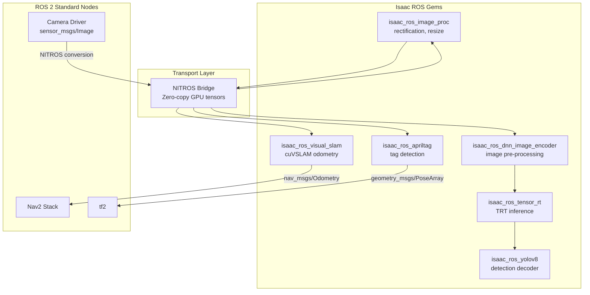
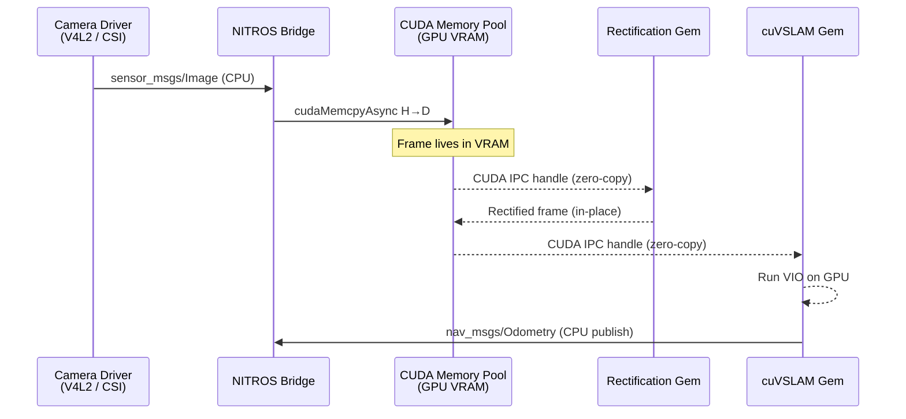
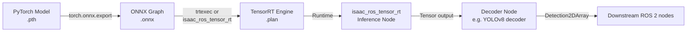

# Isaac ROS & Hardware-Accelerated Perception

## Week 9: GPU-Native Perception on NVIDIA Jetson

Robots perceive the world through cameras, LiDARs, and IMUs, but turning raw sensor streams into actionable scene understanding in real-time demands more than CPU processing can reliably deliver. NVIDIA Isaac ROS solves this problem by providing a library of GPU-accelerated ROS 2 packages — called **gems** — that run computer vision algorithms entirely on GPU memory, eliminating the CPU copy bottlenecks that would otherwise cap throughput.

This chapter covers the three pillars of Isaac ROS: the **NITROS** (NVIDIA Isaac Transport for ROS) zero-copy transport layer, the **perception gems** (cuVSLAM, AprilTag, object detection), and **deployment** on NVIDIA Jetson edge hardware using JetPack SDK and TensorRT for optimised DNN inference.

---

## Learning Objectives

By the end of this chapter you will be able to:

1. Explain the NITROS framework and why zero-copy GPU tensor transport matters for real-time perception.
2. Launch and configure the `isaac_ros_visual_slam` gem for cuVSLAM.
3. Detect AprilTags and use their pose output to localise a robot in a known environment.
4. Convert a pre-trained detection model to a TensorRT engine and run it with `isaac_ros_tensor_rt`.
5. Identify the different Jetson Orin modules and select the appropriate one for a given robot compute budget.
6. Flash and configure a Jetson Orin board with JetPack SDK.
7. Compose multi-gem Isaac ROS launch files using the `ComposableNode` pattern.

---

## Prerequisites

Before working through this chapter you should be comfortable with:

- ROS 2 Humble: nodes, topics, launch files, `colcon` build system (Module 1)
- Camera calibration concepts: intrinsic matrix, distortion coefficients
- Basic neural network inference concepts (forward pass, batch size, precision)
- Isaac Sim fundamentals from Chapter 1 (for the simulation-based exercises)

:::note
The perception gems in this chapter run on NVIDIA hardware only. For development on a desktop, an RTX GPU with CUDA 12.x is required. For edge deployment, a Jetson Orin module with JetPack 6.x is required. AMD and Intel GPUs are not supported.
:::

---

## 1. The Isaac ROS Ecosystem

Isaac ROS is a collection of open-source ROS 2 packages hosted on GitHub under `NVIDIA-ISAAC-ROS`. Each package is a **gem** — a self-contained node or set of nodes that wraps a GPU-accelerated algorithm. Gems communicate with each other and with standard ROS 2 nodes using NITROS-compatible message types.



### 1.1 Isaac ROS vs. Standard ROS 2 Perception

| Metric | cv_bridge + CPU | Isaac ROS NITROS |
|---|---|---|
| 1080p debayer latency | ~15 ms | ~1.5 ms |
| Stereo depth (1280×720) | ~80 ms | ~8 ms |
| Visual odometry update rate | ~10 Hz | ~60 Hz |
| GPU memory copies per frame | 2–4 | 0 (zero-copy) |
| CPU load at 60 Hz | 300–500% | 20–40% |

The performance gap grows with resolution and frame rate, making NITROS indispensable for high-speed robots.

---

## 2. NITROS: NVIDIA Isaac Transport for ROS

NITROS is the transport layer that makes Isaac ROS fast. Standard ROS 2 nodes pass sensor messages as CPU memory buffers — even if a camera driver and a GPU algorithm are on the same machine, the data travels: GPU → CPU → DMA → CPU → GPU. NITROS replaces this path with direct GPU-to-GPU transfers using CUDA IPC and zero-copy shared CUDA memory pools.

### 2.1 NITROS Data Flow



### 2.2 Message Type Compatibility

NITROS introduces typed tensor messages (`isaac_ros_nitros_interfaces`) that carry GPU pointer handles alongside the standard ROS 2 metadata. Gems that support NITROS advertise this capability via the `NitrosPublisher` and `NitrosSubscriber` classes. When two NITROS-capable gems are composed in the same container, ROS 2's `intra_process_comms` is automatically bypassed in favour of the zero-copy path.

```python
# Checking NITROS compatibility in a launch file
from launch_ros.actions import ComposableNodeContainer
from launch_ros.descriptions import ComposableNode

container = ComposableNodeContainer(
    name="nitros_container",
    namespace="",
    package="rclcpp_components",
    executable="component_container_mt",   # multi-threaded executor
    composable_node_descriptions=[
        ComposableNode(
            package="isaac_ros_image_proc",
            plugin="nvidia::isaac_ros::image_proc::RectifyNode",
            name="rectify",
            parameters=[{"output_width": 1280, "output_height": 720}],
        ),
        ComposableNode(
            package="isaac_ros_visual_slam",
            plugin="nvidia::isaac_ros::visual_slam::VisualSlamNode",
            name="visual_slam",
        ),
    ],
)
```

:::tip
Always compose NITROS gems inside a single `ComposableNodeContainer` with `component_container_mt`. Running them as separate processes forces serialisation and copying of messages across process boundaries, negating the zero-copy advantage.
:::

---

## 3. cuVSLAM: GPU-Accelerated Visual SLAM

`isaac_ros_visual_slam` wraps NVIDIA's cuVSLAM library — a stereo or mono-inertial SLAM algorithm that runs entirely on CUDA. It outputs camera odometry at up to 60 Hz on Jetson Orin and provides a 3-D map of tracked features.

### 3.1 cuVSLAM Architecture

cuVSLAM is a keyframe-based Visual-Inertial Odometry (VIO) system. It extracts ORB-like features on the GPU, tracks them with optical flow, estimates motion with a tightly-coupled IMU pre-integration factor, and runs a sliding-window bundle adjustment — all in CUDA kernels.

```mermaid
flowchart LR
    A[Rectified Stereo<br/>Image Pair] --> B[GPU Feature<br/>Extraction]
    C[IMU Messages<br/>at 200 Hz] --> D[IMU Pre-integration<br/>CUDA]
    B --> E[GPU Optical<br/>Flow Tracking]
    D --> E
    E --> F[Sliding-Window<br/>Bundle Adjustment<br/>CUDA Solver]
    F --> G[nav_msgs/Odometry<br/>@60 Hz]
    F --> H[Keyframe Map<br/>PoseGraph]
    H --> I[Loop Closure<br/>Detector]
    I -->|Correction| F
```

### 3.2 Launching cuVSLAM

```python
#!/usr/bin/env python3
"""launch/vslam.launch.py — launch cuVSLAM with a ZED 2i stereo camera."""

from launch import LaunchDescription
from launch_ros.actions import ComposableNodeContainer
from launch_ros.descriptions import ComposableNode
from launch.actions import DeclareLaunchArgument
from launch.substitutions import LaunchConfiguration


def generate_launch_description() -> LaunchDescription:
    use_sim_time = LaunchConfiguration("use_sim_time", default="false")

    vslam_node = ComposableNode(
        package="isaac_ros_visual_slam",
        plugin="nvidia::isaac_ros::visual_slam::VisualSlamNode",
        name="visual_slam_node",
        parameters=[
            {
                "use_sim_time": use_sim_time,
                # Camera configuration
                "num_cameras": 2,
                "min_num_images": 2,
                "enable_imu_fusion": True,
                "gyro_noise_density": 0.000244,
                "gyro_random_walk": 0.000019393,
                "accel_noise_density": 0.001862,
                "accel_random_walk": 0.003,
                # SLAM settings
                "enable_planar_mode": False,
                "publish_map_to_odom_tf": True,
                "map_frame": "map",
                "odom_frame": "odom",
                "base_frame": "base_link",
            }
        ],
        remappings=[
            ("stereo_camera/left/image", "/zed2i/zed_node/left/image_rect_color"),
            ("stereo_camera/right/image", "/zed2i/zed_node/right/image_rect_color"),
            ("stereo_camera/left/camera_info", "/zed2i/zed_node/left/camera_info"),
            ("stereo_camera/right/camera_info", "/zed2i/zed_node/right/camera_info"),
            ("imu", "/zed2i/zed_node/imu/data"),
        ],
    )

    container = ComposableNodeContainer(
        name="vslam_container",
        namespace="",
        package="rclcpp_components",
        executable="component_container_mt",
        composable_node_descriptions=[vslam_node],
        output="screen",
    )

    return LaunchDescription(
        [
            DeclareLaunchArgument("use_sim_time", default_value="false"),
            container,
        ]
    )
```

### 3.3 Evaluating Odometry Quality

```bash
# Record a test sequence
ros2 bag record /visual_slam/tracking/odometry /tf /tf_static -o vslam_test

# Compare against ground truth using evo
pip install evo
evo_ape bag vslam_test.db3 /ground_truth/odometry /visual_slam/tracking/odometry \
    --align --plot --save_results vslam_ape.zip
```

---

## 4. AprilTag Detection

AprilTag is a fiducial marker system widely used in robotics for precise 6-DoF pose estimation. `isaac_ros_apriltag` runs the detector entirely on GPU, achieving >200 FPS on Jetson Orin — fast enough to track moving tags in real-time.

### 4.1 AprilTag Use Cases in Humanoid Robotics

| Use Case | Tag Placement | Output Used |
|---|---|---|
| Global localisation | Walls, doorframes, charging stations | Tag pose → known map pose |
| Gripper calibration | Calibration board | Tag pose → hand-eye calibration |
| Object-relative grasping | On target objects | Tag pose → grasp frame |
| Multi-robot coordination | On each robot | Relative pose between robots |

### 4.2 AprilTag Launch File

```python
#!/usr/bin/env python3
"""launch/apriltag.launch.py — GPU-accelerated AprilTag detection."""

from launch import LaunchDescription
from launch_ros.actions import ComposableNodeContainer
from launch_ros.descriptions import ComposableNode


def generate_launch_description() -> LaunchDescription:
    rectify_node = ComposableNode(
        package="isaac_ros_image_proc",
        plugin="nvidia::isaac_ros::image_proc::RectifyNode",
        name="rectify_node",
        parameters=[{"output_width": 1280, "output_height": 720}],
        remappings=[
            ("image_raw", "/camera/color/image_raw"),
            ("camera_info", "/camera/color/camera_info"),
        ],
    )

    apriltag_node = ComposableNode(
        package="isaac_ros_apriltag",
        plugin="nvidia::isaac_ros::apriltag::AprilTagNode",
        name="apriltag_node",
        parameters=[
            {
                "family": "36h11",   # tag family
                "size": 0.162,       # physical tag size in metres
                "max_tags": 64,
            }
        ],
        remappings=[
            ("image", "image_rect"),
            ("camera_info", "camera_info_rect"),
        ],
    )

    container = ComposableNodeContainer(
        name="apriltag_container",
        namespace="",
        package="rclcpp_components",
        executable="component_container_mt",
        composable_node_descriptions=[rectify_node, apriltag_node],
        output="screen",
    )

    return LaunchDescription([container])
```

### 4.3 Consuming AprilTag Detections in Python

```python
#!/usr/bin/env python3
"""apriltag_listener.py — subscribe to AprilTag detections and print poses."""

import rclpy
from rclpy.node import Node
from isaac_ros_apriltag_interfaces.msg import AprilTagDetectionArray
from geometry_msgs.msg import PoseWithCovariance
import numpy as np


class AprilTagListener(Node):
    def __init__(self) -> None:
        super().__init__("apriltag_listener")
        self.sub = self.create_subscription(
            AprilTagDetectionArray,
            "/tag_detections",
            self._callback,
            10,
        )

    def _callback(self, msg: AprilTagDetectionArray) -> None:
        for detection in msg.detections:
            tag_id = detection.id
            pose: PoseWithCovariance = detection.pose.pose
            p = pose.pose.position
            q = pose.pose.orientation
            # Convert quaternion to Euler for readability
            roll, pitch, yaw = self._quat_to_euler(q.x, q.y, q.z, q.w)
            self.get_logger().info(
                f"Tag {tag_id:3d} | "
                f"pos=({p.x:.3f}, {p.y:.3f}, {p.z:.3f}) m | "
                f"rpy=({np.degrees(roll):.1f}, {np.degrees(pitch):.1f}, {np.degrees(yaw):.1f}) deg"
            )

    @staticmethod
    def _quat_to_euler(x: float, y: float, z: float, w: float) -> tuple[float, float, float]:
        """Convert quaternion to roll-pitch-yaw (ZYX convention)."""
        sinr_cosp = 2.0 * (w * x + y * z)
        cosr_cosp = 1.0 - 2.0 * (x * x + y * y)
        roll = np.arctan2(sinr_cosp, cosr_cosp)
        sinp = 2.0 * (w * y - z * x)
        pitch = np.arcsin(np.clip(sinp, -1.0, 1.0))
        siny_cosp = 2.0 * (w * z + x * y)
        cosy_cosp = 1.0 - 2.0 * (y * y + z * z)
        yaw = np.arctan2(siny_cosp, cosy_cosp)
        return roll, pitch, yaw


def main() -> None:
    rclpy.init()
    node = AprilTagListener()
    rclpy.spin(node)
    rclpy.shutdown()


if __name__ == "__main__":
    main()
```

---

## 5. DNN Inference with TensorRT

TensorRT is NVIDIA's inference optimisation library. It takes a trained model (ONNX, PyTorch, or TensorFlow) and compiles it to a highly optimised **engine** for a specific GPU architecture. On Jetson Orin, TensorRT achieves 5–10x lower latency than running the same model through PyTorch with CUDA.

### 5.1 Model → TensorRT Engine Workflow



### 5.2 Exporting a YOLOv8 Model to ONNX

```python
#!/usr/bin/env python3
"""export_yolov8.py — export a YOLOv8n model to ONNX for TensorRT."""

from ultralytics import YOLO

model = YOLO("yolov8n.pt")

# Export to ONNX with dynamic batch axis disabled (TRT prefers fixed shapes)
model.export(
    format="onnx",
    imgsz=(640, 640),
    batch=1,
    opset=17,
    simplify=True,
    dynamic=False,
    half=False,          # will set FP16 during TRT compilation instead
)
print("Exported: yolov8n.onnx")
```

### 5.3 Compiling to TensorRT Engine

```bash
# On the Jetson (JetPack 6.x) or x86 with TensorRT 10.x installed
trtexec \
    --onnx=yolov8n.onnx \
    --saveEngine=yolov8n.plan \
    --fp16 \
    --inputIOFormats=fp16:chw \
    --outputIOFormats=fp16:chw \
    --workspace=4096 \
    --verbose

# Expected output on Jetson Orin NX 16 GB:
# Latency: min = 3.42 ms, max = 3.91 ms, mean = 3.58 ms  (FP16, batch=1, 640x640)
```

### 5.4 Isaac ROS TensorRT Launch File

```python
#!/usr/bin/env python3
"""launch/yolov8_trt.launch.py — run YOLOv8 via isaac_ros_tensor_rt."""

from launch import LaunchDescription
from launch_ros.actions import ComposableNodeContainer
from launch_ros.descriptions import ComposableNode
import os


def generate_launch_description() -> LaunchDescription:
    engine_path = os.path.expanduser("~/models/yolov8n.plan")

    encoder_node = ComposableNode(
        package="isaac_ros_dnn_image_encoder",
        plugin="nvidia::isaac_ros::dnn_inference::DnnImageEncoderNode",
        name="dnn_image_encoder",
        parameters=[
            {
                "network_image_width": 640,
                "network_image_height": 640,
                "image_mean": [0.0, 0.0, 0.0],
                "image_stddev": [1.0, 1.0, 1.0],
            }
        ],
        remappings=[("image", "/camera/color/image_raw")],
    )

    trt_node = ComposableNode(
        package="isaac_ros_tensor_rt",
        plugin="nvidia::isaac_ros::dnn_inference::TensorRTNode",
        name="tensor_rt",
        parameters=[
            {
                "model_file_path": engine_path,
                "engine_file_path": engine_path,
                "input_tensor_names": ["images"],
                "input_binding_names": ["images"],
                "output_tensor_names": ["output0"],
                "output_binding_names": ["output0"],
                "verbose": False,
                "force_engine_update": False,
            }
        ],
    )

    decoder_node = ComposableNode(
        package="isaac_ros_yolov8",
        plugin="nvidia::isaac_ros::yolov8::YoloV8DecoderNode",
        name="yolov8_decoder",
        parameters=[
            {
                "confidence_threshold": 0.25,
                "nms_threshold": 0.45,
            }
        ],
    )

    container = ComposableNodeContainer(
        name="yolov8_container",
        namespace="",
        package="rclcpp_components",
        executable="component_container_mt",
        composable_node_descriptions=[encoder_node, trt_node, decoder_node],
        output="screen",
    )

    return LaunchDescription([container])
```

:::tip
Run `trtexec` with `--dumpLayerInfo --exportLayerInfo=layers.json` to identify which layers consume the most inference time. On Jetson Orin, the `Conv2d` layers in the backbone almost always dominate. Enable INT8 calibration on those layers to further reduce latency if you have representative calibration data.
:::

---

## 6. Object Detection Packages

Isaac ROS ships pre-integrated gem packages for several popular architectures.

| Package | Algorithm | Backbone | Typical mAP (COCO) | Jetson Orin NX Latency |
|---|---|---|---|---|
| `isaac_ros_yolov8` | YOLOv8 | CSPDarknet | 37.3 (YOLOv8n) | 3.6 ms FP16 |
| `isaac_ros_rtdetr` | RT-DETR | ResNet-50D | 53.1 | 8.2 ms FP16 |
| `isaac_ros_segment_anything` | SAM | ViT-B | — | 45 ms FP16 |
| `isaac_ros_stereo_image_proc` | SGM Depth | — | — | 4.1 ms FP16 |

### 6.1 Processing the Detection Output

```python
#!/usr/bin/env python3
"""detection_subscriber.py — subscribe to YOLOv8 detections."""

import rclpy
from rclpy.node import Node
from vision_msgs.msg import Detection2DArray, Detection2D, BoundingBox2D


class DetectionSubscriber(Node):
    def __init__(self) -> None:
        super().__init__("detection_subscriber")
        self.sub = self.create_subscription(
            Detection2DArray,
            "/detections_output",
            self._callback,
            10,
        )
        self.get_logger().info("Listening for detections...")

    def _callback(self, msg: Detection2DArray) -> None:
        for det in msg.detections:
            det: Detection2D
            bbox: BoundingBox2D = det.bbox
            # Best hypothesis
            if det.results:
                best = max(det.results, key=lambda r: r.hypothesis.score)
                label = best.hypothesis.class_id
                score = best.hypothesis.score
                cx = bbox.center.position.x
                cy = bbox.center.position.y
                w = bbox.size_x
                h = bbox.size_y
                self.get_logger().info(
                    f"{label} {score:.2f} | cx={cx:.0f} cy={cy:.0f} "
                    f"w={w:.0f} h={h:.0f}"
                )


def main() -> None:
    rclpy.init()
    rclpy.spin(DetectionSubscriber())
    rclpy.shutdown()


if __name__ == "__main__":
    main()
```

---

## 7. Jetson Deployment

NVIDIA Jetson is the edge AI platform designed for robotics. The Orin generation (2022–present) provides an unprecedented combination of CPU, GPU, and DLA (Deep Learning Accelerator) compute in a thermally efficient package.

### 7.1 Jetson Orin Module Comparison

| Module | CPU | GPU | DLA | RAM | TDP | Target Application |
|---|---|---|---|---|---|---|
| Orin Nano 4 GB | 6-core A78AE | 1024-core Ampere | — | 4 GB | 7–10 W | Low-cost edge nodes |
| Orin Nano 8 GB | 6-core A78AE | 1024-core Ampere | — | 8 GB | 7–15 W | Mobile perception |
| Orin NX 8 GB | 6-core A78AE | 1024-core Ampere | 2× | 8 GB | 10–20 W | Robotics compute unit |
| Orin NX 16 GB | 8-core A78AE | 1024-core Ampere | 2× | 16 GB | 10–25 W | Full perception stack |
| AGX Orin 32 GB | 12-core A78AE | 2048-core Ampere | 4× | 32 GB | 15–60 W | Autonomous vehicles |
| AGX Orin 64 GB | 12-core A78AE | 2048-core Ampere | 4× | 64 GB | 15–60 W | Full autonomy stack |

For a bipedal humanoid robot running cuVSLAM + YOLOv8 + Nav2, the **Orin NX 16 GB** hits the sweet spot of performance and power consumption.

### 7.2 JetPack SDK Setup

```bash
# Flash a Jetson Orin NX with JetPack 6.0 using SDK Manager
# (run this on an x86 Ubuntu 20.04/22.04 host machine)
# 1. Download and install NVIDIA SDK Manager from developer.nvidia.com
# 2. Put the Jetson into recovery mode (hold FORCE_RECOVERY, press POWER)

# On the Jetson after first boot — verify the JetPack install
cat /etc/nv_tegra_release
# Expected: # R36 (release), REVISION: 3.0, GCID: 36...

# Install Isaac ROS common dependencies
sudo apt-get update && sudo apt-get install -y \
    ros-humble-isaac-ros-common \
    ros-humble-isaac-ros-nitros \
    ros-humble-isaac-ros-image-proc

# Verify CUDA
nvcc --version
# nvcc: NVIDIA (R) Cuda compiler driver
# Cuda compilation tools, release 12.2, V12.2.140

# Check GPU stats
tegrastats --interval 1000
```

### 7.3 DLA Offloading

Jetson Orin modules with DLA cores can offload whole models or individual layers to the DLA, freeing the GPU for other tasks:

```bash
# Compile YOLOv8 backbone for DLA, head for GPU
trtexec \
    --onnx=yolov8n.onnx \
    --saveEngine=yolov8n_dla.plan \
    --fp16 \
    --useDLACore=0 \
    --allowGPUFallback \
    --workspace=4096
```

:::warning
DLA only supports a subset of ONNX operators. Always use `--allowGPUFallback` when targeting DLA to prevent engine build failures on unsupported operations. Check the TensorRT DLA support matrix before assuming a given model will fully offload.
:::

---

## 8. Full Perception Stack Integration

Bringing cuVSLAM, AprilTag, and YOLOv8 together into a single launch file:

```python
#!/usr/bin/env python3
"""launch/full_perception.launch.py — complete Isaac ROS perception stack."""

from launch import LaunchDescription
from launch_ros.actions import ComposableNodeContainer
from launch_ros.descriptions import ComposableNode
import os


def generate_launch_description() -> LaunchDescription:
    engine = os.path.expanduser("~/models/yolov8n.plan")

    nodes = [
        # ── Image pre-processing ─────────────────────────────────────────────
        ComposableNode(
            package="isaac_ros_image_proc",
            plugin="nvidia::isaac_ros::image_proc::RectifyNode",
            name="rectify",
            parameters=[{"output_width": 1280, "output_height": 720}],
            remappings=[
                ("image_raw", "/camera/left/image_raw"),
                ("camera_info", "/camera/left/camera_info"),
            ],
        ),
        # ── cuVSLAM ──────────────────────────────────────────────────────────
        ComposableNode(
            package="isaac_ros_visual_slam",
            plugin="nvidia::isaac_ros::visual_slam::VisualSlamNode",
            name="vslam",
            parameters=[
                {
                    "num_cameras": 2,
                    "enable_imu_fusion": True,
                    "map_frame": "map",
                    "odom_frame": "odom",
                    "base_frame": "base_link",
                }
            ],
        ),
        # ── AprilTag ─────────────────────────────────────────────────────────
        ComposableNode(
            package="isaac_ros_apriltag",
            plugin="nvidia::isaac_ros::apriltag::AprilTagNode",
            name="apriltag",
            parameters=[{"family": "36h11", "size": 0.162}],
            remappings=[("image", "image_rect")],
        ),
        # ── YOLOv8 encoder → TRT → decoder ──────────────────────────────────
        ComposableNode(
            package="isaac_ros_dnn_image_encoder",
            plugin="nvidia::isaac_ros::dnn_inference::DnnImageEncoderNode",
            name="encoder",
            parameters=[{"network_image_width": 640, "network_image_height": 640,
                         "image_mean": [0.0, 0.0, 0.0],
                         "image_stddev": [1.0, 1.0, 1.0]}],
            remappings=[("image", "/camera/color/image_raw")],
        ),
        ComposableNode(
            package="isaac_ros_tensor_rt",
            plugin="nvidia::isaac_ros::dnn_inference::TensorRTNode",
            name="trt",
            parameters=[{"model_file_path": engine, "engine_file_path": engine,
                         "input_tensor_names": ["images"],
                         "output_tensor_names": ["output0"],
                         "input_binding_names": ["images"],
                         "output_binding_names": ["output0"]}],
        ),
        ComposableNode(
            package="isaac_ros_yolov8",
            plugin="nvidia::isaac_ros::yolov8::YoloV8DecoderNode",
            name="yolov8_decoder",
            parameters=[{"confidence_threshold": 0.25, "nms_threshold": 0.45}],
        ),
    ]

    container = ComposableNodeContainer(
        name="perception_container",
        namespace="",
        package="rclcpp_components",
        executable="component_container_mt",
        composable_node_descriptions=nodes,
        output="screen",
    )

    return LaunchDescription([container])
```

---

## 9. Hands-On Exercise: AprilTag-Guided Docking

### Objective

Implement an Isaac ROS perception pipeline that uses AprilTag detections to guide a simulated robot to a docking station in Isaac Sim.

### Steps

1. **Set up the simulation**: Open Isaac Sim and place a `36h11` AprilTag (ID 0, 16.2 cm) on a docking station prop.
2. **Launch the perception stack**: Use the full `full_perception.launch.py` from Section 8, with `use_sim_time:=true`.
3. **Verify detections**: Run `ros2 topic echo /tag_detections` and confirm the tag pose appears when the camera faces the dock.
4. **Write a docking controller**: Create a ROS 2 node (`docking_controller.py`) that:
   - Subscribes to `/tag_detections`
   - Publishes `geometry_msgs/Twist` to `/cmd_vel`
   - Drives the robot forward until the tag's Z distance is under 0.5 m, then stops
5. **Tune the controller**: Add proportional yaw control so the robot centres on the tag while approaching.
6. **Measure performance**: Record the final docking error (distance from ideal dock pose) across 10 runs with randomised start poses.

### Expected Deliverable

A `docking_controller.py` ROS 2 node and a brief results table showing mean docking error and success rate across 10 trials.

---

## Key Takeaways

- **NITROS eliminates CPU bottlenecks**: by keeping image data in GPU memory across the entire perception chain, Isaac ROS delivers 5–10x lower latency than CPU-bridged alternatives.
- **cuVSLAM provides production-grade visual odometry at 60 Hz** on Jetson Orin — suitable for fast-moving humanoid robots where CPU-based odometry would lag behind.
- **AprilTag detection is O(1) cost per frame on GPU** regardless of scene complexity, making it the most reliable localisation anchor for structured environments.
- **TensorRT is not optional on Jetson**: the quantisation and layer-fusion optimisations it applies routinely deliver 5× latency improvements over vanilla PyTorch with CUDA.
- **ComposableNode composition is the correct deployment pattern**: it enables zero-copy NITROS transport and reduces launch overhead compared to individual processes.
- **Jetson Orin NX 16 GB is the recommended minimum** for a full humanoid perception stack (VSLAM + detection + AprilTag).

---

## Review Questions

1. Explain why running NITROS gems as separate ROS 2 processes (not composable nodes) eliminates the zero-copy performance benefit.
2. cuVSLAM uses IMU pre-integration in its factor graph. What happens to odometry quality when the IMU data rate drops from 200 Hz to 50 Hz, and why?
3. What is the difference between `--fp16` and `--int8` quantisation in TensorRT, and what trade-off does each introduce?
4. An AprilTag detection returns a pose estimate with a 3× higher position variance than expected. List three potential causes related to camera calibration.
5. A Jetson Orin Nano 4 GB runs out of VRAM when running the full perception stack. Describe two architectural changes you could make to reduce memory usage without changing the hardware.
6. Why does `component_container_mt` (multi-threaded) perform better than `component_container` (single-threaded) for the Isaac ROS perception stack?
