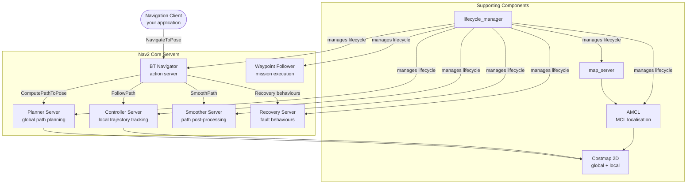
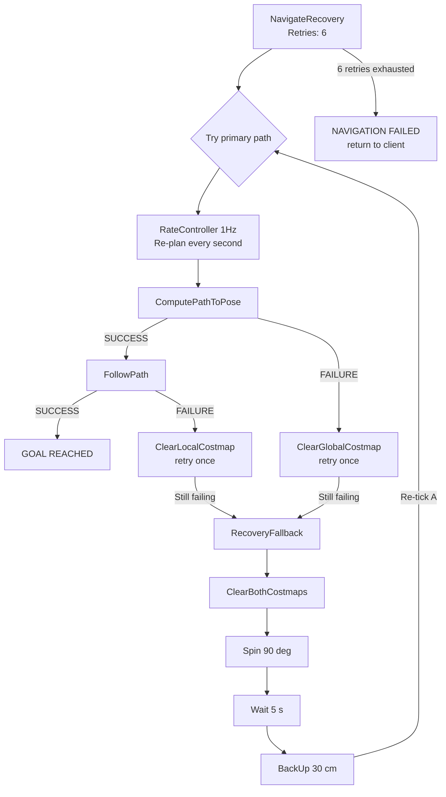
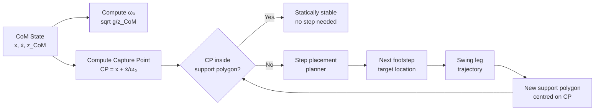
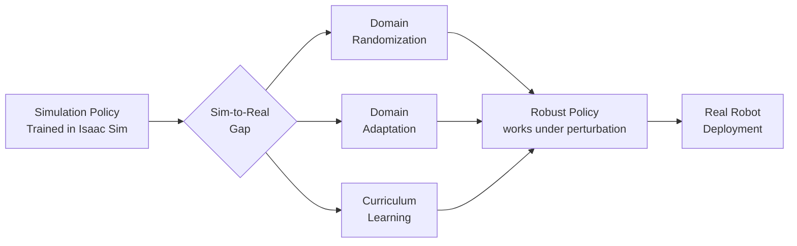

# VSLAM & Nav2 Navigation

## Week 10: Autonomous Navigation for Legged and Wheeled Robots

A robot that can perceive its surroundings but cannot act on that perception to navigate purposefully is of limited practical value. This chapter bridges the perception outputs from Week 9 — odometry from cuVSLAM, obstacle geometry from depth cameras — into Nav2, the ROS 2 navigation stack, and extends into the unique challenges of **bipedal locomotion planning** that distinguish humanoid navigation from wheeled mobile robotics.

By the end of this chapter you will have a complete navigation pipeline running: the robot builds and localises in a map using visual SLAM, plans collision-free paths through the environment using Nav2, executes those paths with a feedback controller, and recovers autonomously from failures using behaviour trees. You will also understand the theoretical foundations — Zero-Moment Point (ZMP), capture-point control — that underpin stable bipedal motion.

---

## Learning Objectives

By the end of this chapter you will be able to:

1. Describe the Visual SLAM pipeline end-to-end, from raw stereo images to a globally consistent map.
2. Configure Nav2's lifecycle system and understand how its six core servers interact.
3. Write and interpret Nav2 behaviour trees that encode complex navigation policies.
4. Tune a Costmap 2D configuration for both a wheeled and a bipedal robot footprint.
5. Explain the Zero-Moment Point (ZMP) criterion and how it defines stability for bipedal locomotion.
6. Describe the capture-point and divergent component of motion (DCM) frameworks for real-time balance control.
7. Apply three sim-to-real transfer techniques — domain randomization, domain adaptation, and curriculum learning — to a locomotion policy.

---

## Prerequisites

Before working through this chapter you should be comfortable with:

- ROS 2 Humble: lifecycle nodes, action servers, launch files (Module 1)
- Isaac ROS perception gems and cuVSLAM output topics (Chapter 2 of this module)
- tf2: coordinate frame conventions, `robot_state_publisher`, `static_transform_publisher`
- Basic control theory: PID controllers, feedback loops

:::note
All Nav2 YAML configurations in this chapter target ROS 2 Humble with Nav2 Humble (Nav2 version 1.1.x). Parameter names differ slightly in Iron and Jazzy; consult the migration guide at nav2.org if using a later distribution.
:::

---

## 1. Visual SLAM: From Images to a Global Map

The cuVSLAM gem introduced in Chapter 2 provides real-time **visual odometry** — a continuous estimate of the robot's motion relative to its starting position. But odometry accumulates drift over time. Visual SLAM extends odometry with **loop closure**: when the robot re-visits a previously seen place, the SLAM back-end detects the match, computes the geometric constraint, and corrects the entire trajectory history. The result is a globally consistent **pose graph** and a **dense or sparse 3-D map**.

### 1.1 VSLAM Pipeline Architecture

```mermaid
flowchart TD
    A[Left Camera\nRaw Images] --> B[Image\nRectification]
    C[Right Camera\nRaw Images] --> B
    D[IMU\n200 Hz] --> E[IMU\nPre-integration]
    B --> F[GPU Feature\nExtraction\ncuVSLAM]
    E --> F
    F --> G[Stereo Feature\nMatching & Depth]
    G --> H[Visual-Inertial\nOdometry\nSliding Window BA]
    H --> I[Local Map\nKeyframes + Landmarks]
    I --> J{Loop Closure\nDetector}
    J -->|No loop| K[nav_msgs/Odometry\n@ 60 Hz]
    J -->|Loop detected| L[Pose Graph\nOptimisation]
    L --> M[Corrected Map\n+ Trajectory]
    M --> K
    K --> N[Nav2\nAMCL / map_server]
```

### 1.2 Coordinate Frames in Navigation

Nav2 and VSLAM follow the REP-105 frame convention:

| Frame | Parent | Populated by | Description |
|---|---|---|---|
| `map` | — | SLAM / AMCL | Global, fixed, drift-corrected world frame |
| `odom` | `map` | cuVSLAM / wheel odometry | Continuous, no jumps, accumulates drift |
| `base_link` | `odom` | robot_state_publisher | Robot body centre |
| `base_footprint` | `base_link` | urdf | Projection of base_link onto ground plane |
| `camera_link` | `base_link` | urdf | Camera optical centre |

The `map → odom` transform is the SLAM correction transform: it is updated whenever a loop is closed or AMCL re-localises the robot.

```bash
# Verify your TF tree is healthy
ros2 run tf2_tools view_frames
# Inspect the generated PDF: frames.pdf
# Look for: map -> odom -> base_link -> camera_link chain
```

### 1.3 Saving and Loading a Map

```bash
# Save the current VSLAM map using nav2_map_server
ros2 run nav2_map_server map_saver_cli \
    -f ~/maps/warehouse_map \
    --ros-args -p save_map_timeout:=5.0

# Output files:
#   ~/maps/warehouse_map.pgm  (occupancy grid image)
#   ~/maps/warehouse_map.yaml (metadata: resolution, origin, threshold)
```

```yaml
# warehouse_map.yaml — inspect to verify parameters
image: warehouse_map.pgm
resolution: 0.05          # metres per pixel
origin: [-10.0, -10.0, 0.0]   # map origin in world coordinates
negate: 0
occupied_thresh: 0.65
free_thresh: 0.25
```

---

## 2. Nav2 Architecture

Nav2 is a server-based navigation framework. Each server is a ROS 2 lifecycle node that can be individually activated, deactivated, and reset — critical for production robots that must handle hardware faults gracefully.



### 2.1 Nav2 Lifecycle Startup Sequence

```bash
# Manual lifecycle management (useful for debugging)
ros2 lifecycle set /bt_navigator configure
ros2 lifecycle set /planner_server configure
ros2 lifecycle set /controller_server configure
ros2 lifecycle set /recoveries_server configure
ros2 lifecycle set /bt_navigator activate
ros2 lifecycle set /planner_server activate
ros2 lifecycle set /controller_server activate
ros2 lifecycle set /recoveries_server activate

# In production, use nav2_lifecycle_manager instead:
ros2 launch nav2_bringup bringup_launch.py \
    map:=$HOME/maps/warehouse_map.yaml \
    use_sim_time:=true
```

---

## 3. Costmap 2D Configuration

Costmap 2D is Nav2's spatial representation of obstacles and inflation zones. There are two costmaps: the **global costmap** (large, slower, used for path planning) and the **local costmap** (small, fast, used for reactive collision avoidance).

### 3.1 Costmap Layers

| Layer | Purpose | Data Source |
|---|---|---|
| `StaticLayer` | Pre-built map occupancy grid | `map_server` |
| `ObstacleLayer` | Dynamic 2D laser/point-cloud obstacles | LiDAR, depth camera |
| `InflationLayer` | Expands obstacles by robot radius | Computed from above layers |
| `VoxelLayer` | 3D obstacle representation cleared by ray-casting | Depth camera |
| `SpeedDecoratorLayer` | Assigns speed limits to regions | Manual annotations |

### 3.2 Nav2 Parameters YAML

```yaml
# nav2_params.yaml — complete configuration for a bipedal robot
# ─────────────────────────────────────────────────────────────────────────────

bt_navigator:
  ros__parameters:
    use_sim_time: true
    global_frame: map
    robot_base_frame: base_link
    odom_topic: /odom
    bt_loop_duration: 10        # ms between BT ticks
    default_server_timeout: 20
    # Custom BT XML file (see Section 4)
    default_nav_to_pose_bt_xml: /home/user/config/navigate_with_recovery.xml
    navigators: ["navigate_to_pose", "navigate_through_poses"]
    navigate_to_pose:
      plugin: "nav2_bt_navigator/NavigateToPoseNavigator"
    navigate_through_poses:
      plugin: "nav2_bt_navigator/NavigateThroughPosesNavigator"

# ─── Planner ─────────────────────────────────────────────────────────────────
planner_server:
  ros__parameters:
    use_sim_time: true
    planner_plugins: ["GridBased"]
    GridBased:
      plugin: "nav2_smac_planner/SmacPlannerHybrid"
      tolerance: 0.5
      downsample_costmap: false
      downsampling_factor: 1
      allow_unknown: true
      max_iterations: 1000000
      max_on_approach_iterations: 1000
      max_planning_time: 5.0
      motion_model_for_search: "DUBIN"   # DUBIN / REEDS_SHEPP / STATE_LATTICE
      angle_quantization_bins: 72
      analytic_expansion_ratio: 3.5
      minimum_turning_radius: 0.40       # metres — set to 0 for holonomic / bipedal

# ─── Controller ──────────────────────────────────────────────────────────────
controller_server:
  ros__parameters:
    use_sim_time: true
    controller_frequency: 20.0
    controller_plugins: ["FollowPath"]
    FollowPath:
      plugin: "nav2_mppi_controller::MPPIController"
      time_steps: 56
      model_dt: 0.05
      batch_size: 2000
      vx_std: 0.2
      vy_std: 0.2           # non-zero for holonomic / bipedal side-stepping
      wz_std: 0.4
      vx_max: 0.5           # m/s — conservative for bipedal stability
      vx_min: -0.35
      vy_max: 0.3
      wz_max: 1.0           # rad/s
      iteration_count: 1
      prune_distance: 1.7
      transform_tolerance: 0.1
      temperature: 0.3
      gamma: 0.015
      motion_model: "Omni"  # Omni for humanoid (holonomic footstep planner)
      critics: [
        "ConstraintCritic",
        "GoalCritic",
        "GoalAngleCritic",
        "PathAlignCritic",
        "ObstaclesCritic",
        "PathFollowCritic",
        "PreferForwardCritic",
      ]
      ObstaclesCritic:
        enabled: true
        cost_power: 1
        repulsion_weight: 1.5
        critical_weight: 20.0
        consider_footprint: true
        collision_cost: 10000.0
        collision_margin_distance: 0.1
        near_goal_distance: 0.5
      GoalCritic:
        enabled: true
        cost_power: 1
        cost_weight: 5.0
        threshold_to_consider: 1.0

# ─── Global Costmap ───────────────────────────────────────────────────────────
global_costmap:
  global_costmap:
    ros__parameters:
      use_sim_time: true
      update_frequency: 1.0
      publish_frequency: 1.0
      global_frame: map
      robot_base_frame: base_link
      # Bipedal footprint — rectangular approximation of humanoid torso
      footprint: "[[0.35, 0.25], [0.35, -0.25], [-0.35, -0.25], [-0.35, 0.25]]"
      resolution: 0.05
      plugins: ["static_layer", "obstacle_layer", "inflation_layer"]
      static_layer:
        plugin: "nav2_costmap_2d::StaticLayer"
        map_subscribe_transient_local: true
      obstacle_layer:
        plugin: "nav2_costmap_2d::ObstacleLayer"
        observation_sources: scan
        scan:
          topic: /scan
          max_obstacle_height: 2.0
          clearing: true
          marking: true
          data_type: "LaserScan"
          raytrace_max_range: 8.0
          obstacle_max_range: 6.0
      inflation_layer:
        plugin: "nav2_costmap_2d::InflationLayer"
        cost_scaling_factor: 3.0
        inflation_radius: 0.55         # humanoid needs slightly more clearance

# ─── Local Costmap ────────────────────────────────────────────────────────────
local_costmap:
  local_costmap:
    ros__parameters:
      use_sim_time: true
      update_frequency: 10.0
      publish_frequency: 5.0
      global_frame: odom
      robot_base_frame: base_link
      rolling_window: true
      width: 5
      height: 5
      resolution: 0.05
      footprint: "[[0.35, 0.25], [0.35, -0.25], [-0.35, -0.25], [-0.35, 0.25]]"
      plugins: ["voxel_layer", "inflation_layer"]
      voxel_layer:
        plugin: "nav2_costmap_2d::VoxelLayer"
        enabled: true
        publish_voxel_map: false
        origin_z: 0.0
        z_resolution: 0.05
        z_voxels: 16
        max_obstacle_height: 2.0
        mark_threshold: 0
        observation_sources: pointcloud
        pointcloud:
          topic: /camera/depth/points
          max_obstacle_height: 2.0
          min_obstacle_height: 0.1      # ignore floor returns
          clearing: true
          marking: true
          data_type: "PointCloud2"
      inflation_layer:
        plugin: "nav2_costmap_2d::InflationLayer"
        cost_scaling_factor: 3.0
        inflation_radius: 0.55

# ─── Recovery Behaviours ──────────────────────────────────────────────────────
recoveries_server:
  ros__parameters:
    use_sim_time: true
    costmap_topic: local_costmap/costmap_raw
    footprint_topic: local_costmap/published_footprint
    cycle_frequency: 10.0
    recovery_plugins: ["spin", "back_up", "wait"]
    spin:
      plugin: "nav2_recoveries/Spin"
    back_up:
      plugin: "nav2_recoveries/BackUp"
    wait:
      plugin: "nav2_recoveries/Wait"
    global_frame: odom
    robot_base_frame: base_link
    transform_timeout: 0.1
    use_sim_time: true
    simulate_ahead_time: 2.0
    max_rotational_vel: 1.0
    min_rotational_vel: 0.4
    rotational_acc_lim: 3.2
```

:::tip
For bipedal robots, set `motion_model: "Omni"` in the MPPI controller. Humanoids can side-step and in-place rotate, making the omnidirectional model more accurate than Ackermann or differential-drive models. Setting `vy_max` to a non-zero value allows the planner to exploit this capability.
:::

---

## 4. Navigation Behaviour Trees

Nav2 encodes high-level navigation logic in XML-format behaviour trees (BTs). A BT is a directed tree where leaf nodes are **actions** (call a server) or **conditions** (check a predicate), and internal nodes are **control flow** nodes that determine execution order.

### 4.1 BT Control Flow Nodes

| Node Type | Symbol | Semantics |
|---|---|---|
| Sequence | `→` | Run children left-to-right; stop on first failure |
| Fallback (Selector) | `?` | Run children left-to-right; stop on first success |
| Parallel | `||` | Run all children simultaneously; policy-dependent success |
| Decorator | `⊗` | Wraps one child; modifies its return value or tick rate |

### 4.2 Navigate-with-Recovery BT

```xml
<!-- navigate_with_recovery.xml -->
<root main_tree_to_execute="MainTree">
  <BehaviorTree ID="MainTree">
    <RecoveryNode number_of_retries="6" name="NavigateRecovery">

      <!-- Primary navigation attempt -->
      <PipelineSequence name="NavigateWithReplanning">
        <RateController hz="1.0">
          <RecoveryNode number_of_retries="1" name="ComputePathRecovery">
            <ComputePathToPose goal="{goal}" path="{path}" planner_id="GridBased"/>
            <ClearEntireCostmap name="ClearGlobalCostmap" service_name="global_costmap/clear_entirely_global_costmap"/>
          </RecoveryNode>
        </RateController>
        <RecoveryNode number_of_retries="1" name="FollowPathRecovery">
          <FollowPath path="{path}" controller_id="FollowPath"/>
          <ClearEntireCostmap name="ClearLocalCostmap" service_name="local_costmap/clear_entirely_local_costmap"/>
        </RecoveryNode>
      </PipelineSequence>

      <!-- Fallback recovery sequence -->
      <ReactiveFallback name="RecoveryFallback">
        <GoalUpdated/>
        <SequenceStar name="RecoveryActions">
          <ClearEntireCostmap name="ClearLocalCostmap2" service_name="local_costmap/clear_entirely_local_costmap"/>
          <ClearEntireCostmap name="ClearGlobalCostmap2" service_name="global_costmap/clear_entirely_global_costmap"/>
          <Spin spin_dist="1.57"/>
          <Wait wait_duration="5"/>
          <BackUp backup_dist="0.30" backup_speed="0.05"/>
        </SequenceStar>
      </ReactiveFallback>

    </RecoveryNode>
  </BehaviorTree>
</root>
```

### 4.3 BT Execution Flow



### 4.4 Sending a Navigation Goal from Python

```python
#!/usr/bin/env python3
"""navigate_to_pose.py — send a Nav2 NavigateToPose goal from Python."""

import rclpy
from rclpy.node import Node
from rclpy.action import ActionClient
from nav2_msgs.action import NavigateToPose
from geometry_msgs.msg import PoseStamped
import math


class Navigator(Node):
    def __init__(self) -> None:
        super().__init__("simple_navigator")
        self._client = ActionClient(self, NavigateToPose, "navigate_to_pose")

    def navigate_to(self, x: float, y: float, yaw_deg: float = 0.0) -> None:
        """Send a goal pose and wait for completion."""
        self.get_logger().info(f"Navigating to ({x:.2f}, {y:.2f}), yaw={yaw_deg:.1f}°")
        self._client.wait_for_server()

        goal = NavigateToPose.Goal()
        goal.pose = PoseStamped()
        goal.pose.header.frame_id = "map"
        goal.pose.header.stamp = self.get_clock().now().to_msg()
        goal.pose.pose.position.x = x
        goal.pose.pose.position.y = y
        goal.pose.pose.position.z = 0.0

        # Convert yaw to quaternion (Z-axis rotation)
        yaw_rad = math.radians(yaw_deg)
        goal.pose.pose.orientation.z = math.sin(yaw_rad / 2.0)
        goal.pose.pose.orientation.w = math.cos(yaw_rad / 2.0)

        future = self._client.send_goal_async(
            goal, feedback_callback=self._feedback_callback
        )
        rclpy.spin_until_future_complete(self, future)
        result_future = future.result().get_result_async()
        rclpy.spin_until_future_complete(self, result_future)
        self.get_logger().info("Navigation complete.")

    def _feedback_callback(self, feedback_msg) -> None:
        fb = feedback_msg.feedback
        self.get_logger().info(
            f"Distance remaining: {fb.distance_remaining:.2f} m"
        )


def main() -> None:
    rclpy.init()
    nav = Navigator()
    nav.navigate_to(3.0, 2.0, 90.0)
    rclpy.shutdown()


if __name__ == "__main__":
    main()
```

---

## 5. Bipedal Locomotion Planning

Wheeled robots obey simple kinematic models (differential drive, Ackermann). Bipedal humanoids face a fundamentally harder problem: they must **maintain dynamic balance** while generating purposeful motion. Two theoretical frameworks — Zero-Moment Point (ZMP) and Capture Point — are the cornerstones of practical bipedal locomotion planning.

### 5.1 Zero-Moment Point (ZMP)

The ZMP is the point on the ground where the net moment of all forces (gravity + inertial) has no horizontal component. For a robot to remain dynamically stable, the ZMP must stay within the **support polygon** — the convex hull of all contact points with the ground.

```
Support Polygon (single support):
    ┌──────────────────────┐
    │                      │  ← stance foot outline
    │      ZMP must be     │
    │      inside here     │
    └──────────────────────┘

Support Polygon (double support):
    ┌───────────────────────────────────────────┐
    │  left foot  │  connecting │  right foot   │  ← convex hull
    │             │   region    │               │
    └───────────────────────────────────────────┘
```

The ZMP constraint for a simplified 3-D Linear Inverted Pendulum Model (3D-LIPM) can be written as:

```
x_ZMP = x_CoM - (z_CoM / g) * ẍ_CoM
y_ZMP = y_CoM - (z_CoM / g) * ÿ_CoM
```

Where `(x_CoM, y_CoM)` is the horizontal Centre of Mass position, `z_CoM` is the constant CoM height (LIPM assumption), and `g` is gravitational acceleration.

### 5.2 Capture Point

The Capture Point (CP) — also called the Instantaneous Capture Point (ICP) or Extrapolated Centre of Mass (XCoM) — is the point on the ground where the robot must step in order to come to a complete stop. It was introduced by Pratt et al. (2006) and is the foundation of modern real-time balance controllers.

```
CP = x_CoM + (1 / ω₀) * ẋ_CoM

where  ω₀ = sqrt(g / z_CoM)   [natural frequency of the LIPM]
```



### 5.3 Divergent Component of Motion (DCM)

The DCM framework by Englsberger et al. generalises the capture point to 3D walking trajectories. The DCM is defined as:

```
ξ = x_CoM + (1 / ω₀) * ẋ_CoM
```

And its dynamics satisfy:

```
ξ̇ = ω₀ * (ξ - u_ZMP)
```

This is an **unstable first-order linear system**: if the ZMP reference `u_ZMP` does not track the DCM, errors grow exponentially. The walking controller must therefore plan ZMP trajectories that make the DCM converge to desired step locations.

```python
#!/usr/bin/env python3
"""dcm_planner.py — simplified DCM stepping trajectory planner."""

import numpy as np
from dataclasses import dataclass
from typing import List


@dataclass
class Footstep:
    x: float
    y: float
    is_left: bool


def compute_dcm_trajectory(
    footsteps: List[Footstep],
    z_com: float = 0.85,       # CoM height in metres
    step_duration: float = 0.6,  # seconds per step
    dt: float = 0.01,           # planning timestep
) -> np.ndarray:
    """
    Compute the reference DCM trajectory for a sequence of footsteps
    using the Divergent Component of Motion framework.

    Returns an (N, 2) array of DCM reference positions.
    """
    g = 9.81
    omega = np.sqrt(g / z_com)           # LIPM natural frequency [rad/s]
    T = step_duration
    alpha = np.exp(omega * T)            # step-to-step DCM mapping coefficient

    num_steps = len(footsteps)
    total_samples = int(num_steps * T / dt)
    dcm_ref = np.zeros((total_samples, 2))

    # Terminal DCM = final foot position (robot stops there)
    xi_terminal = np.array([footsteps[-1].x, footsteps[-1].y])

    # Backward recursion: compute initial DCM for each step
    step_initial_dcms = [xi_terminal]
    for step in reversed(footsteps[:-1]):
        vrp = np.array([step.x, step.y])          # VRP ≈ footstep location
        xi_next = step_initial_dcms[-1]
        xi_start = vrp + (xi_next - vrp) / alpha   # backward integration
        step_initial_dcms.append(xi_start)
    step_initial_dcms = list(reversed(step_initial_dcms))

    # Forward integration to produce the DCM trajectory
    sample_idx = 0
    for i, step in enumerate(footsteps):
        vrp = np.array([step.x, step.y])
        xi_0 = step_initial_dcms[i]
        n_samples = int(T / dt)
        for k in range(n_samples):
            t_local = k * dt
            xi = vrp + np.exp(omega * t_local) * (xi_0 - vrp)
            dcm_ref[sample_idx] = xi
            sample_idx += 1

    return dcm_ref


if __name__ == "__main__":
    steps = [
        Footstep(0.0, 0.10, True),
        Footstep(0.3, -0.10, False),
        Footstep(0.6, 0.10, True),
        Footstep(0.9, -0.10, False),
        Footstep(1.2, 0.0, True),
    ]
    trajectory = compute_dcm_trajectory(steps)
    print(f"DCM trajectory: {len(trajectory)} samples")
    print(f"Start: {trajectory[0]}, End: {trajectory[-1]}")
```

### 5.4 Footstep Planning with Nav2

Nav2's SMAC lattice planner can be extended for bipedal footstep planning by replacing the circular footprint with an asymmetric footstep lattice. Each "state" in the planner is a `(x, y, θ, stance_foot)` tuple, and transitions correspond to feasible footstep locations determined by the robot's step length, width, and angle constraints.

| Parameter | Typical Value (Humanoid) | Description |
|---|---|---|
| `max_step_length` | 0.40 m | Maximum sagittal stride |
| `max_step_width` | 0.30 m | Maximum lateral step width |
| `max_step_angle` | 20 deg | Maximum yaw change per step |
| `min_step_width` | 0.15 m | Minimum lateral clearance (hips) |
| `step_duration` | 0.5–0.8 s | Nominal swing phase duration |
| `double_support_ratio` | 0.2 | Fraction of step duration in double support |

---

## 6. Sim-to-Real Transfer

Even with photorealistic Isaac Sim rendering and accurate PhysX 5 physics, a gap remains between simulation and reality. Three complementary techniques close this gap.



### 6.1 Domain Randomization (DR)

DR was covered conceptually in Chapter 1. For locomotion policies specifically, the most impactful parameters to randomise are:

| Category | Parameters | Range |
|---|---|---|
| Ground properties | Friction coefficient | μ ∈ [0.3, 1.2] |
| Ground geometry | Terrain slope | ±5° random per tile |
| Robot dynamics | Joint damping | ±30% of nominal |
| Robot dynamics | Link masses | ±20% of nominal |
| Actuator | Motor latency | 5–30 ms additional delay |
| Actuator | Gear backlash | 0–3 deg random offset |
| Sensing | IMU noise | Gaussian + drift |

### 6.2 Domain Adaptation

While DR trains a policy to be robust to variation, **domain adaptation** aligns the simulation distribution to the real-world distribution by learning the residual gap. A common approach is System Identification (SysID): run the real robot, record trajectories, and optimise simulation parameters to minimise trajectory prediction error.

```python
#!/usr/bin/env python3
"""sysid.py — simple system identification via trajectory matching."""

import numpy as np
from scipy.optimize import minimize
from typing import Callable


def simulate_pendulum(
    params: np.ndarray,
    initial_state: np.ndarray,
    torques: np.ndarray,
    dt: float,
) -> np.ndarray:
    """
    Simulate a single rigid pendulum with parameters [mass, length, damping].
    Returns the simulated trajectory.
    """
    mass, length, damping = params
    g = 9.81
    n = len(torques)
    states = np.zeros((n + 1, 2))    # [theta, theta_dot]
    states[0] = initial_state

    for i in range(n):
        theta, theta_dot = states[i]
        inertia = mass * length ** 2
        theta_ddot = (torques[i] - damping * theta_dot - mass * g * length * np.sin(theta)) / inertia
        states[i + 1, 0] = theta + theta_dot * dt
        states[i + 1, 1] = theta_dot + theta_ddot * dt

    return states[1:]


def sysid_loss(
    params: np.ndarray,
    real_trajectory: np.ndarray,
    initial_state: np.ndarray,
    torques: np.ndarray,
    dt: float,
) -> float:
    """Mean-squared error between simulated and real trajectories."""
    sim_traj = simulate_pendulum(params, initial_state, torques, dt)
    return float(np.mean((sim_traj - real_trajectory) ** 2))


def run_sysid(
    real_trajectory: np.ndarray,
    torques: np.ndarray,
    initial_state: np.ndarray,
    dt: float = 0.005,
) -> np.ndarray:
    """Identify mass, length, damping to match the real trajectory."""
    x0 = np.array([5.0, 0.5, 0.1])    # initial guess: 5 kg, 0.5 m, 0.1 Nm·s
    bounds = [(0.1, 50.0), (0.1, 2.0), (0.0, 5.0)]
    result = minimize(
        sysid_loss,
        x0,
        args=(real_trajectory, initial_state, torques, dt),
        method="L-BFGS-B",
        bounds=bounds,
    )
    print(f"SysID result: mass={result.x[0]:.3f} kg, "
          f"length={result.x[1]:.3f} m, damping={result.x[2]:.3f} Nm·s")
    return result.x
```

### 6.3 Curriculum Learning

Curriculum learning (CL) progressively increases task difficulty during training, allowing the policy to master simpler sub-tasks before attempting the full problem.

| Stage | Environment | Difficulty | Duration |
|---|---|---|---|
| 1 | Flat ground, no disturbances | Easy | 20% of training |
| 2 | Flat ground, push disturbances | Medium | 20% of training |
| 3 | Uneven terrain (±2 cm), push | Hard | 20% of training |
| 4 | Random slopes (±5°), push | Very hard | 20% of training |
| 5 | Stairs, obstacles, payload | Expert | 20% of training |

:::warning
Advancing the curriculum too quickly — before the policy has reliably solved the current stage — causes **catastrophic forgetting**: performance on the current stage degrades as the policy attempts to learn the harder stage. Monitor the success rate on the current stage and advance only when it exceeds a threshold (typically 80–90% over the last 100 episodes).
:::

---

## 7. Full Navigation Stack Launch

```python
#!/usr/bin/env python3
"""launch/full_navigation.launch.py — complete navigation stack for Isaac Sim."""

from launch import LaunchDescription
from launch.actions import IncludeLaunchDescription, DeclareLaunchArgument
from launch.launch_description_sources import PythonLaunchDescriptionSource
from launch.substitutions import LaunchConfiguration, PathJoinSubstitution
from launch_ros.actions import Node
from launch_ros.substitutions import FindPackageShare
import os


def generate_launch_description() -> LaunchDescription:
    use_sim_time = LaunchConfiguration("use_sim_time", default="true")
    map_yaml = LaunchConfiguration("map", default=os.path.expanduser("~/maps/warehouse_map.yaml"))
    params_file = LaunchConfiguration(
        "params_file", default=os.path.expanduser("~/config/nav2_params.yaml")
    )

    nav2_launch = IncludeLaunchDescription(
        PythonLaunchDescriptionSource(
            PathJoinSubstitution([FindPackageShare("nav2_bringup"), "launch", "bringup_launch.py"])
        ),
        launch_arguments={
            "use_sim_time": use_sim_time,
            "map": map_yaml,
            "params_file": params_file,
        }.items(),
    )

    # Static transform: odom → base_link (initial pose, overridden by VSLAM)
    static_tf = Node(
        package="tf2_ros",
        executable="static_transform_publisher",
        name="static_odom_base",
        arguments=["0", "0", "0", "0", "0", "0", "odom", "base_link"],
        parameters=[{"use_sim_time": use_sim_time}],
    )

    return LaunchDescription(
        [
            DeclareLaunchArgument("use_sim_time", default_value="true"),
            DeclareLaunchArgument("map"),
            DeclareLaunchArgument("params_file"),
            static_tf,
            nav2_launch,
        ]
    )
```

---

## 8. Hands-On Exercise: Autonomous Waypoint Navigation in Isaac Sim

### Objective

Deploy the complete VSLAM + Nav2 stack in Isaac Sim, build a map of the warehouse environment, and execute a four-waypoint autonomous navigation mission with full recovery behaviour.

### Steps

1. **Launch Isaac Sim** with the `warehouse_with_robot.usd` scene from Chapter 1. Start the ROS 2 bridge.
2. **Launch the perception stack** from Chapter 2 (`full_perception.launch.py`) with `use_sim_time:=true`.
3. **Build a map**: Teleoperate the robot through the warehouse using `teleop_twist_keyboard`. Observe the occupancy grid building in RViz2.
4. **Save the map**: Use `map_saver_cli` to save to `~/maps/warehouse_map.yaml`.
5. **Launch navigation**: Start `full_navigation.launch.py` with the saved map.
6. **Send waypoints**: Write a Python script (`mission.py`) that sends four `NavigateToPose` goals in sequence:
   - Waypoint 1: `(2.0, 1.5, 0°)` — rack inspection point A
   - Waypoint 2: `(5.0, -1.0, 90°)` — rack inspection point B
   - Waypoint 3: `(-1.0, 3.0, 180°)` — charging station
   - Waypoint 4: `(0.0, 0.0, 0°)` — home position
7. **Introduce a failure**: Place a dynamic obstacle box in the robot's planned path mid-mission and verify that the recovery behaviour (clear costmap → spin → replan) succeeds.
8. **Measure**: Record the time-to-complete for the four-waypoint mission over five runs and report mean and standard deviation.

### Expected Deliverable

- `mission.py` source file
- RViz2 screenshot showing the final map with all four waypoints marked
- A table of mission completion times across five runs

---

## Key Takeaways

- **VSLAM provides drift-corrected global localisation** by detecting previously visited places and applying pose-graph corrections — pure odometry cannot do this.
- **Nav2's lifecycle architecture** separates robot navigation into independently managed servers, enabling graceful fault handling on real hardware.
- **Costmap 2D configuration is robot-specific**: bipedal robots need holonomic footprints, omnidirectional motion models (MPPI with `vy_max > 0`), and larger inflation radii than compact wheeled robots.
- **Behaviour trees encode recoverable navigation logic**: the six-retry structure with costmap clearing, spin, and backup covers the vast majority of real-world stuck scenarios.
- **ZMP and capture-point are complementary**: ZMP defines the stability criterion; capture point provides the real-time balance controller that satisfies it.
- **Sim-to-real transfer requires all three tools**: domain randomization builds robustness, domain adaptation aligns the simulation to reality, and curriculum learning makes the problem tractable by progressively increasing difficulty.

---

## Review Questions

1. Explain how loop closure detection improves the quality of the occupancy map produced by VSLAM compared to using raw odometry. What visual features are typically used for place recognition?
2. Nav2 uses two separate costmaps. Describe one situation where the global and local costmaps disagree and explain how Nav2 resolves the conflict.
3. A humanoid robot's ZMP moves outside the support polygon during a fast walking step. Describe the physical consequence and explain how the capture-point controller responds.
4. What is the LIPM assumption, and in which locomotion scenarios does it break down for a real humanoid robot?
5. You are tuning the MPPI controller for a bipedal robot and observe that it consistently clips corners of obstacles. Which cost critic would you increase, and by what mechanism does increasing it change the planned trajectory?
6. A locomotion policy trained with domain randomization on flat ground fails on 3° inclines in the real world. Using the curriculum learning table in Section 6.3, explain which stage was missing from training and what data you would add.
