# Voice-to-Action with Whisper

## Learning Objectives

By the end of this chapter, you will be able to:
- Understand the voice-to-action pipeline for robotic systems
- Capture and process audio input for robot commands
- Use OpenAI Whisper for speech-to-text transcription
- Parse natural language intents from transcribed text
- Map voice commands to ROS 2 action goals
- Handle edge cases in voice-controlled robotics

## Prerequisites

- Completion of Module 1 (ROS 2 fundamentals, actions)
- Python programming experience
- Basic understanding of audio processing concepts
- Familiarity with ROS 2 action servers from Chapter 3

---

## From Voice to Robot Motion

Imagine telling a humanoid robot: *"Walk to the kitchen table and pick up the red cup."* This seemingly simple instruction requires a sophisticated pipeline that converts sound waves into physical robot actions. This chapter explores how to build that pipeline.

The **Voice-to-Action (V2A)** pipeline is the first stage of the Vision-Language-Action (VLA) architecture. It bridges the gap between human speech and robot behavior, enabling natural human-robot interaction without keyboards or controllers.

### Why Voice Control Matters for Humanoid Robots

Humanoid robots are designed to operate in human environments — homes, offices, hospitals, factories. In these spaces, voice is the most natural interface:

| Interface | Pros | Cons |
|-----------|------|------|
| Keyboard/Mouse | Precise, familiar | Requires proximity to computer |
| Joystick/Gamepad | Good for teleoperation | Requires dedicated hardware |
| Gesture | Natural, hands-free | Limited vocabulary, occlusion issues |
| **Voice** | **Natural, hands-free, rich vocabulary** | **Ambient noise, accents, ambiguity** |

:::tip Why Voice First?
Voice commands allow operators to interact with robots while their hands are busy — a critical requirement in manufacturing, healthcare, and domestic assistance scenarios.
:::

## The Voice-to-Action Pipeline

The complete pipeline from speech to robot motion follows this architecture:

```mermaid
graph LR
    A["🎤 Microphone"] --> B["Audio Capture"]
    B --> C["Whisper ASR"]
    C --> D["Intent Parser"]
    D --> E["Action Mapper"]
    E --> F["ROS 2 Action Client"]
    F --> G["🤖 Robot Action Server"]

    style A fill:#e1f5fe
    style C fill:#fff3e0
    style F fill:#e8f5e9
    style G fill:#fce4ec
```



Each stage transforms data into a more structured format:

1. **Audio Capture**: Raw audio from microphone (WAV/PCM format)
2. **Whisper ASR**: Audio → text transcription
3. **Intent Parser**: Text → structured intent (action + parameters)
4. **Action Mapper**: Intent → ROS 2 action goal message
5. **ROS 2 Action Client**: Goal → robot execution with feedback

### Pipeline Data Flow Example

```
Audio: [waveform data, 16kHz, 3.2 seconds]
  ↓ Whisper
Text: "walk to the kitchen table"
  ↓ Intent Parser
Intent: { action: "navigate", target: "kitchen_table" }
  ↓ Action Mapper
ROS 2 Goal: NavigateToPose(pose=kitchen_table_pose)
  ↓ Action Client
Robot: [executing navigation with feedback...]
```

## Audio Capture with Python

The first step is capturing audio from a microphone. We use the `sounddevice` library for cross-platform audio capture:

```python title="audio_capture.py"
import sounddevice as sd
import numpy as np
import wave
import tempfile

class AudioCapture:
    """Captures audio from the default microphone."""

    def __init__(self, sample_rate=16000, channels=1):
        self.sample_rate = sample_rate
        self.channels = channels

    def record(self, duration_seconds=5):
        """Record audio for a specified duration."""
        print(f"Recording for {duration_seconds} seconds...")
        audio_data = sd.rec(
            int(duration_seconds * self.sample_rate),
            samplerate=self.sample_rate,
            channels=self.channels,
            dtype='float32'
        )
        sd.wait()  # Wait until recording is complete
        print("Recording complete.")
        return audio_data

    def save_wav(self, audio_data, filepath):
        """Save recorded audio as a WAV file."""
        audio_int16 = (audio_data * 32767).astype(np.int16)
        with wave.open(filepath, 'w') as wf:
            wf.setnchannels(self.channels)
            wf.setsampwidth(2)  # 16-bit audio
            wf.setframerate(self.sample_rate)
            wf.writeframes(audio_int16.tobytes())
        return filepath

    def record_to_file(self, duration_seconds=5):
        """Record and save to a temporary WAV file."""
        audio_data = self.record(duration_seconds)
        filepath = tempfile.mktemp(suffix='.wav')
        return self.save_wav(audio_data, filepath)


# Usage
if __name__ == '__main__':
    capture = AudioCapture(sample_rate=16000)
    wav_path = capture.record_to_file(duration_seconds=5)
    print(f"Audio saved to: {wav_path}")
```

:::note Audio Format Requirements
OpenAI Whisper works best with **16kHz mono audio**. Higher sample rates are automatically downsampled, but starting at 16kHz reduces processing overhead — important for real-time robot control.
:::

## Speech-to-Text with OpenAI Whisper

[OpenAI Whisper](https://github.com/openai/whisper) is a general-purpose speech recognition model trained on 680,000 hours of multilingual audio. It handles accents, background noise, and technical terminology remarkably well.

### Whisper Model Sizes

| Model | Parameters | VRAM | Relative Speed | Best For |
|-------|-----------|------|----------------|----------|
| tiny | 39M | ~1 GB | ~32x | Quick prototyping |
| base | 74M | ~1 GB | ~16x | Basic commands |
| small | 244M | ~2 GB | ~6x | Good accuracy |
| medium | 769M | ~5 GB | ~2x | High accuracy |
| **large-v3** | **1.5B** | **~10 GB** | **1x** | **Best accuracy** |

For robotics, the **small** or **medium** models provide the best balance between accuracy and latency. On a Jetson Orin Nano, the **base** model runs in near real-time.

### Using Whisper for Transcription

```python title="whisper_transcriber.py"
import whisper
import numpy as np


class WhisperTranscriber:
    """Transcribes audio using OpenAI Whisper."""

    def __init__(self, model_size='base'):
        print(f"Loading Whisper model: {model_size}")
        self.model = whisper.load_model(model_size)
        print("Model loaded successfully.")

    def transcribe_file(self, audio_path):
        """Transcribe audio from a WAV file."""
        result = self.model.transcribe(
            audio_path,
            language='en',
            fp16=False  # Set True if GPU available
        )
        return result['text'].strip()

    def transcribe_array(self, audio_array, sample_rate=16000):
        """Transcribe audio from a numpy array."""
        # Whisper expects float32 audio normalized to [-1, 1]
        if audio_array.dtype != np.float32:
            audio_array = audio_array.astype(np.float32)

        # Ensure mono
        if len(audio_array.shape) > 1:
            audio_array = audio_array.mean(axis=1)

        result = self.model.transcribe(
            audio_array,
            language='en',
            fp16=False
        )
        return result['text'].strip()


# Usage
if __name__ == '__main__':
    transcriber = WhisperTranscriber(model_size='base')
    text = transcriber.transcribe_file('command.wav')
    print(f"Transcribed: {text}")
```

:::warning Latency Considerations
On a CPU, Whisper base model takes ~2-3 seconds to transcribe 5 seconds of audio. On GPU (RTX 3060+), this drops to ~0.3 seconds. For real-time robotics, consider using Whisper's streaming mode or the `faster-whisper` library which uses CTranslate2 for 4x speedup.
:::

## Intent Parsing: From Text to Structure

Raw transcribed text like *"walk to the kitchen and grab the red mug"* must be decomposed into structured intents. We use a **keyword-based parser** for common robot commands and fall back to an **LLM-based parser** for complex instructions.

### Defining Robot Action Primitives

```python title="intent_parser.py"
from dataclasses import dataclass
from typing import Optional


@dataclass
class RobotIntent:
    """Structured representation of a voice command."""
    action: str           # e.g., 'navigate', 'pick', 'place', 'look'
    target: Optional[str] = None  # e.g., 'kitchen_table', 'red_cup'
    modifier: Optional[str] = None  # e.g., 'carefully', 'quickly'
    confidence: float = 1.0


# Supported action primitives for humanoid robots
ACTION_KEYWORDS = {
    'navigate': ['walk', 'go', 'move', 'navigate', 'head'],
    'pick': ['pick', 'grab', 'grasp', 'take', 'get'],
    'place': ['place', 'put', 'set', 'drop'],
    'look': ['look', 'see', 'find', 'search', 'scan'],
    'wave': ['wave', 'greet', 'hello'],
    'stop': ['stop', 'halt', 'freeze', 'wait'],
    'speak': ['say', 'tell', 'speak', 'announce'],
}

LOCATION_KEYWORDS = {
    'kitchen_table': ['kitchen table', 'kitchen'],
    'living_room': ['living room', 'lounge'],
    'front_door': ['front door', 'entrance', 'door'],
    'charging_station': ['charging station', 'charger', 'dock'],
}


class IntentParser:
    """Parses natural language into structured robot intents."""

    def parse(self, text: str) -> RobotIntent:
        """Parse transcribed text into a RobotIntent."""
        text_lower = text.lower().strip()

        # Identify action
        action = self._match_action(text_lower)

        # Identify target/location
        target = self._match_target(text_lower)

        # Identify modifiers
        modifier = self._match_modifier(text_lower)

        return RobotIntent(
            action=action,
            target=target,
            modifier=modifier,
            confidence=0.8 if action != 'unknown' else 0.2
        )

    def _match_action(self, text: str) -> str:
        for action, keywords in ACTION_KEYWORDS.items():
            if any(kw in text for kw in keywords):
                return action
        return 'unknown'

    def _match_target(self, text: str) -> Optional[str]:
        for target, keywords in LOCATION_KEYWORDS.items():
            if any(kw in text for kw in keywords):
                return target
        return None

    def _match_modifier(self, text: str) -> Optional[str]:
        modifiers = {
            'carefully': ['careful', 'gently', 'slow'],
            'quickly': ['quick', 'fast', 'hurry', 'rush'],
        }
        for mod, keywords in modifiers.items():
            if any(kw in text for kw in keywords):
                return mod
        return None


# Usage
if __name__ == '__main__':
    parser = IntentParser()

    commands = [
        "Walk to the kitchen table",
        "Pick up the red cup carefully",
        "Go to the front door quickly",
        "Stop immediately",
    ]

    for cmd in commands:
        intent = parser.parse(cmd)
        print(f"'{cmd}' -> {intent}")
```

### The Intent Pipeline Visualized

```mermaid
graph TD
    A["'Walk to the kitchen and pick up the red cup'"] --> B["Tokenize & Lowercase"]
    B --> C{"Match Action Keywords"}
    C -->|walk → navigate| D["action: navigate"]
    C -->|pick → pick| E["action: pick"]
    D --> F{"Match Location"}
    E --> G{"Match Object"}
    F -->|kitchen → kitchen_table| H["target: kitchen_table"]
    G -->|red cup → red_cup| I["target: red_cup"]
    H --> J["RobotIntent 1"]
    I --> K["RobotIntent 2"]

    style A fill:#e1f5fe
    style J fill:#e8f5e9
    style K fill:#e8f5e9
```



:::tip Complex Commands
For commands like *"Go to the kitchen, pick up the mug, and bring it to me"*, a single intent isn't enough. Chapter 12 covers **Cognitive Planning with LLMs** where we use GPT to decompose complex instructions into sequences of action primitives.
:::

## Mapping Intents to ROS 2 Actions

Once we have a structured `RobotIntent`, we map it to a ROS 2 action goal. This requires predefined action types for each primitive:

```python title="action_mapper_node.py"
import rclpy
from rclpy.node import Node
from rclpy.action import ActionClient
from geometry_msgs.msg import PoseStamped
from nav2_msgs.action import NavigateToPose


# Predefined poses for known locations
KNOWN_LOCATIONS = {
    'kitchen_table': {'x': 3.5, 'y': 2.0, 'z': 0.0, 'w': 1.0},
    'living_room': {'x': 1.0, 'y': 5.0, 'z': 0.0, 'w': 1.0},
    'front_door': {'x': 0.0, 'y': 0.0, 'z': 0.0, 'w': 1.0},
    'charging_station': {'x': -1.0, 'y': 0.0, 'z': 0.0, 'w': 1.0},
}


class VoiceActionNode(Node):
    """Maps voice intents to ROS 2 action goals."""

    def __init__(self):
        super().__init__('voice_action_node')

        # Action clients for different primitives
        self.nav_client = ActionClient(
            self, NavigateToPose, 'navigate_to_pose'
        )

        self.get_logger().info('Voice Action Node initialized')

    def execute_intent(self, intent):
        """Execute a RobotIntent by sending appropriate action goals."""
        if intent.action == 'navigate' and intent.target:
            self._navigate_to(intent.target)
        elif intent.action == 'stop':
            self._cancel_all_actions()
        elif intent.action == 'unknown':
            self.get_logger().warn(
                f'Unknown intent: {intent}. Ignoring.'
            )
        else:
            self.get_logger().info(
                f'Action "{intent.action}" acknowledged but '
                f'not yet implemented.'
            )

    def _navigate_to(self, location_name):
        """Send a NavigateToPose goal."""
        if location_name not in KNOWN_LOCATIONS:
            self.get_logger().error(
                f'Unknown location: {location_name}'
            )
            return

        coords = KNOWN_LOCATIONS[location_name]

        goal_msg = NavigateToPose.Goal()
        goal_msg.pose = PoseStamped()
        goal_msg.pose.header.frame_id = 'map'
        goal_msg.pose.header.stamp = self.get_clock().now().to_msg()
        goal_msg.pose.pose.position.x = coords['x']
        goal_msg.pose.pose.position.y = coords['y']
        goal_msg.pose.pose.orientation.w = coords['w']

        self.get_logger().info(
            f'Navigating to {location_name}: '
            f'({coords["x"]}, {coords["y"]})'
        )

        self.nav_client.wait_for_server()
        future = self.nav_client.send_goal_async(
            goal_msg,
            feedback_callback=self._nav_feedback
        )
        future.add_done_callback(self._nav_goal_response)

    def _nav_feedback(self, feedback_msg):
        """Handle navigation feedback."""
        feedback = feedback_msg.feedback
        self.get_logger().info(
            f'Distance remaining: '
            f'{feedback.distance_remaining:.2f}m'
        )

    def _nav_goal_response(self, future):
        """Handle goal acceptance/rejection."""
        goal_handle = future.result()
        if not goal_handle.accepted:
            self.get_logger().warn('Navigation goal rejected')
            return
        self.get_logger().info('Navigation goal accepted')

    def _cancel_all_actions(self):
        """Cancel all running actions (emergency stop)."""
        self.get_logger().warn('STOP command — canceling all actions')


def main(args=None):
    rclpy.init(args=args)
    node = VoiceActionNode()
    rclpy.spin(node)
    node.destroy_node()
    rclpy.shutdown()


if __name__ == '__main__':
    main()
```

## Handling Wake Words and Continuous Listening

In a real deployment, the robot shouldn't transcribe everything it hears. A **wake word** system activates listening only when addressed:

```python title="wake_word_listener.py"
import time
from audio_capture import AudioCapture
from whisper_transcriber import WhisperTranscriber
from intent_parser import IntentParser

WAKE_WORDS = ['hey robot', 'ok robot', 'robot']


class WakeWordListener:
    """Listens continuously and activates on wake word."""

    def __init__(self):
        self.capture = AudioCapture(sample_rate=16000)
        self.transcriber = WhisperTranscriber(model_size='base')
        self.parser = IntentParser()

    def listen_loop(self):
        """Main listening loop."""
        print("Listening for wake word...")
        while True:
            # Record short snippet for wake word detection
            text = self._quick_listen(duration=3)

            if self._has_wake_word(text):
                print("Wake word detected! Listening for command...")
                # Record longer for actual command
                command_text = self._quick_listen(duration=5)
                intent = self.parser.parse(command_text)
                print(f"Intent: {intent}")
                # Here you would call execute_intent()
                yield intent

            time.sleep(0.1)

    def _quick_listen(self, duration):
        wav_path = self.capture.record_to_file(duration)
        return self.transcriber.transcribe_file(wav_path)

    def _has_wake_word(self, text):
        text_lower = text.lower()
        return any(wake in text_lower for wake in WAKE_WORDS)
```

:::warning Safety First
Voice-controlled robots MUST implement a hardware emergency stop (e-stop) button. Voice commands can be misinterpreted, and a physical override is mandatory for safety. Never rely solely on a "stop" voice command for emergency situations.
:::

## Complete Voice-to-Action Pipeline

Here's how all the components connect in a complete ROS 2 node:


## Hands-On Exercise: Build a Voice Command Demo

Build a simple voice command system that recognizes basic robot commands.

### Step 1: Install Dependencies

```bash
pip install openai-whisper sounddevice numpy
```

### Step 2: Create the Pipeline

Create a file called `voice_demo.py` that:
1. Records 5 seconds of audio
2. Transcribes it with Whisper (base model)
3. Parses the intent
4. Prints the resulting `RobotIntent`

### Step 3: Test with These Commands

Try speaking these commands and verify the parser recognizes them:
- "Walk to the kitchen table"
- "Pick up the cup carefully"
- "Stop"
- "Go to the front door quickly"

### Expected Output

```
Recording for 5 seconds...
Recording complete.
Transcribed: "walk to the kitchen table"
Intent: RobotIntent(action='navigate', target='kitchen_table', modifier=None, confidence=0.8)
```

### Troubleshooting

- **No audio detected**: Check your microphone is the default input device
- **Whisper model download slow**: Models are downloaded on first use (~150MB for base)
- **Incorrect transcription**: Try speaking more clearly, reduce background noise, or use the `small` model for better accuracy

## Key Takeaways

- The **voice-to-action pipeline** converts speech → text → intent → ROS 2 action in four stages
- **OpenAI Whisper** provides robust, multilingual speech recognition suitable for robot commands
- **Intent parsing** maps natural language to structured `RobotIntent` objects with action, target, and modifier
- **Action mapping** translates intents to ROS 2 action goals (like `NavigateToPose`)
- **Wake word detection** prevents the robot from processing every sound it hears
- **Safety** requires hardware e-stop buttons — never rely solely on voice for emergency stops
- For complex multi-step commands, **LLM-based planning** (covered in next chapter) decomposes instructions into sequences

## Review Questions

1. What are the four main stages of the voice-to-action pipeline, and what data format does each stage produce?
2. Why is Whisper's `base` model often preferred over `large-v3` on edge devices like Jetson Orin Nano?
3. How does the intent parser handle ambiguous commands where multiple action keywords match?
4. Why is a wake word system important for deployed humanoid robots? What problems does it solve?
5. Describe a scenario where a voice command could be dangerous for a robot. How would you design safety constraints to prevent harm?

## Further Reading

- [OpenAI Whisper GitHub Repository](https://github.com/openai/whisper)
- [ROS 2 Actions Documentation](https://docs.ros.org/en/humble/Tutorials/Beginner-CLI-Tools/Understanding-ROS2-Actions.html)
- [Nav2 Documentation](https://docs.nav2.org/)
- [faster-whisper: CTranslate2 Whisper](https://github.com/guillaumekln/faster-whisper)
- [ROS 2 Audio Common](https://github.com/ros-drivers/audio_common)
