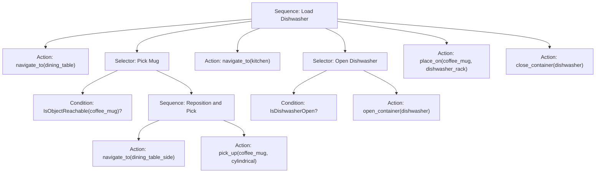
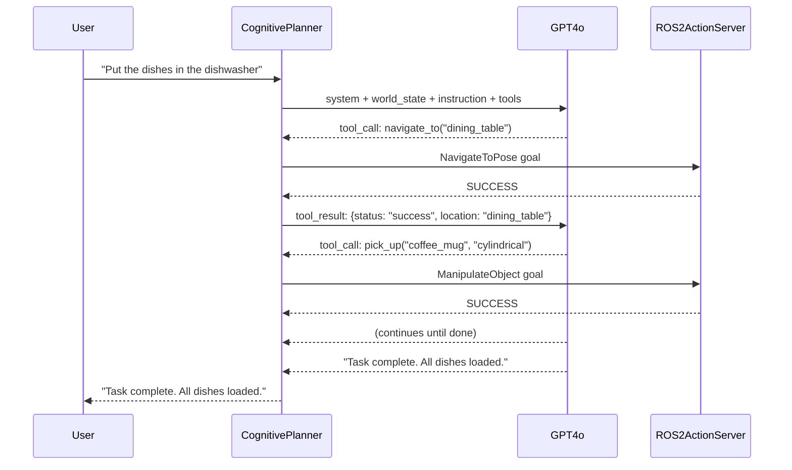
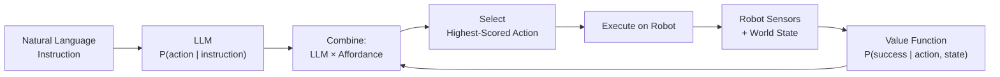
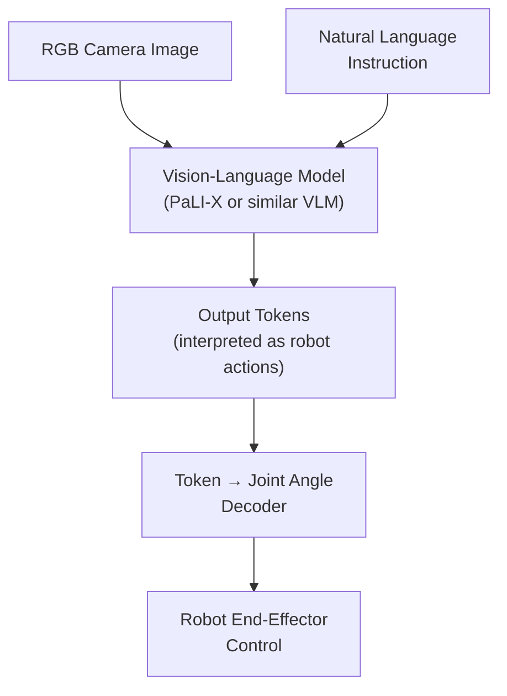

# Cognitive Planning with LLMs

> **Week 12** — Module 4: Vision-Language-Action (VLA)

---

## Learning Objectives

By the end of this chapter, you will be able to:

1. Translate natural language instructions into structured robot task plans using LLMs.
2. Define and register an **action primitive library** that the LLM can invoke.
3. Generate **behavior trees** automatically from LLM output.
4. Use **GPT function calling** to dispatch robot ROS 2 actions from language.
5. Implement **safety constraints** — workspace limits and force limits — that wrap every LLM-generated action.
6. Explain the grounding mechanisms used by **SayCan** and the architecture of **RT-2**.

---

## Prerequisites

Before starting this chapter, make sure you have completed:

- **Module 4, Chapter 1** — Voice-to-Action Pipelines (Whisper + ROS 2)
- **Module 3** — NVIDIA Isaac perception and Nav2 navigation
- A working ROS 2 Humble workspace with `rclpy` installed
- An OpenAI API key available in your environment as `OPENAI_API_KEY`

:::note
All Python examples in this chapter are self-contained. You can run them inside a ROS 2 workspace colcon package or as standalone scripts with the OpenAI package installed (`pip install openai`).
:::

---

## 1. The Cognitive Gap in Physical AI

A robot that can hear a voice command and execute a pre-programmed behavior is useful. A robot that can **reason about what to do** when faced with an instruction it has never explicitly seen before is transformative. This chapter addresses that gap.

When a person says *"Please tidy the table before my guests arrive,"* they are not issuing a robot command — they are expressing a **goal**. Achieving that goal requires:

1. **Understanding** what "tidy" means in context.
2. **Decomposing** the goal into sub-goals (identify clutter, pick it up, place it in the right location).
3. **Sequencing** actions in a feasible order.
4. **Handling failures** — what if a cup is too heavy, or the bin is full?

Large Language Models, trained on vast corpora of human text describing how to do things, have absorbed enormous amounts of procedural knowledge. The challenge is **grounding** that knowledge to actions the robot can actually execute.

---

## 2. Natural Language to Task Decomposition

The first step in cognitive planning is turning a free-form instruction into a structured sequence of achievable sub-tasks.

### 2.1 The Decomposition Prompt Pattern

A reliable pattern is to give the LLM:
- A description of the **robot's capabilities** (the action primitive library).
- The **current world state** (what the robot perceives).
- The **instruction**.
- A **schema** for how the output should be structured.

```python
# task_decomposer.py
import os
import json
from openai import OpenAI

client = OpenAI(api_key=os.environ["OPENAI_API_KEY"])

SYSTEM_PROMPT = """
You are a robot task planner for a humanoid robot.
The robot operates in a household environment.

Available action primitives:
- navigate_to(location: str)
- pick_up(object_name: str, grasp_type: str)
- place_on(object_name: str, surface: str)
- open_container(container_name: str)
- close_container(container_name: str)
- push(object_name: str, direction: str, distance_m: float)
- wait(duration_s: float)

Current world state (JSON):
{world_state}

Given a natural language instruction, decompose it into an ordered list of action steps.
Return ONLY valid JSON matching this schema:
{{
  "goal_summary": "<one sentence>",
  "steps": [
    {{
      "step_id": 1,
      "action": "<primitive name>",
      "parameters": {{...}},
      "rationale": "<why this step>"
    }}
  ]
}}
"""

def decompose_task(instruction: str, world_state: dict) -> dict:
    """Decompose a natural language instruction into robot action steps."""
    prompt = SYSTEM_PROMPT.replace("{world_state}", json.dumps(world_state, indent=2))

    response = client.chat.completions.create(
        model="gpt-4o",
        messages=[
            {"role": "system", "content": prompt},
            {"role": "user", "content": instruction},
        ],
        response_format={"type": "json_object"},
        temperature=0.2,  # Low temperature for deterministic plans
    )

    return json.loads(response.choices[0].message.content)


if __name__ == "__main__":
    world = {
        "robot_location": "kitchen",
        "objects": {
            "coffee_mug": {"location": "dining_table", "graspable": True, "weight_kg": 0.3},
            "plate": {"location": "dining_table", "graspable": True, "weight_kg": 0.5},
            "dishwasher": {"location": "kitchen", "is_open": False},
        },
        "surfaces": ["dining_table", "kitchen_counter", "dishwasher_rack"],
    }

    instruction = "Put the dirty dishes in the dishwasher."
    plan = decompose_task(instruction, world)

    print(json.dumps(plan, indent=2))
```

Running this produces output like:

```json
{
  "goal_summary": "Transport the coffee mug and plate from the dining table into the dishwasher.",
  "steps": [
    { "step_id": 1, "action": "navigate_to", "parameters": { "location": "dining_table" }, "rationale": "Robot must be at the table to pick objects." },
    { "step_id": 2, "action": "pick_up", "parameters": { "object_name": "coffee_mug", "grasp_type": "cylindrical" }, "rationale": "Pick up the mug first." },
    { "step_id": 3, "action": "navigate_to", "parameters": { "location": "kitchen" }, "rationale": "Move toward the dishwasher." },
    { "step_id": 4, "action": "open_container", "parameters": { "container_name": "dishwasher" }, "rationale": "Dishwasher must be open to place items." },
    { "step_id": 5, "action": "place_on", "parameters": { "object_name": "coffee_mug", "surface": "dishwasher_rack" }, "rationale": "Place mug inside." },
    { "step_id": 6, "action": "navigate_to", "parameters": { "location": "dining_table" }, "rationale": "Return for the plate." },
    { "step_id": 7, "action": "pick_up", "parameters": { "object_name": "plate", "grasp_type": "flat" }, "rationale": "Pick up the plate." },
    { "step_id": 8, "action": "navigate_to", "parameters": { "location": "kitchen" }, "rationale": "Return to dishwasher." },
    { "step_id": 9, "action": "place_on", "parameters": { "object_name": "plate", "surface": "dishwasher_rack" }, "rationale": "Place plate inside." },
    { "step_id": 10, "action": "close_container", "parameters": { "container_name": "dishwasher" }, "rationale": "Close when done." }
  ]
}
```

:::tip
Always set `temperature=0.2` or lower for task planning. Higher temperatures increase creative variation but reduce plan reliability.
:::

---

## 3. The Action Primitive Library

An **action primitive** is a named, parameterized motion or behavior that the robot can reliably execute. Think of them as a vocabulary the LLM writes programs in.

### 3.1 Designing Good Primitives

Good primitives share these properties:

| Property | Description | Example |
|---|---|---|
| **Atomic** | Cannot be broken into simpler safe units | `pick_up` not `close_fingers_then_lift` |
| **Parameterized** | Accept arguments, not hardcoded | `navigate_to(location)` not `go_to_kitchen` |
| **Verifiable** | Success/failure can be detected programmatically | Check grasp force, check joint positions |
| **Safe by default** | Internal safety checks, not assumed external | Force limits enforced inside the primitive |

### 3.2 Standard Primitive Set

```python
# primitives/registry.py
from dataclasses import dataclass, field
from typing import Callable, Dict, Any

@dataclass
class ActionPrimitive:
    name: str
    description: str
    parameters: Dict[str, str]   # param_name -> type_description
    executor: Callable           # function that runs on the robot
    workspace_required: str = "any"  # "manipulation", "navigation", or "any"

# The global primitive registry
PRIMITIVE_REGISTRY: Dict[str, ActionPrimitive] = {}

def register_primitive(primitive: ActionPrimitive) -> None:
    PRIMITIVE_REGISTRY[primitive.name] = primitive

def get_primitive(name: str) -> ActionPrimitive:
    if name not in PRIMITIVE_REGISTRY:
        raise KeyError(f"Unknown action primitive: '{name}'. "
                       f"Available: {list(PRIMITIVE_REGISTRY.keys())}")
    return PRIMITIVE_REGISTRY[name]
```

The six core primitives for household manipulation tasks:

| Primitive | Parameters | Description |
|---|---|---|
| `navigate_to` | `location: str` | Move the base to a named waypoint |
| `pick_up` | `object_name: str`, `grasp_type: str` | Grasp an object off a surface |
| `place_on` | `object_name: str`, `surface: str` | Set a held object onto a surface |
| `open_container` | `container_name: str` | Pull open a door, drawer, or lid |
| `close_container` | `container_name: str` | Push closed a door, drawer, or lid |
| `push` | `object_name: str`, `direction: str`, `distance_m: float` | Slide an object laterally |

---

## 4. Behavior Tree Generation from LLM Output

A flat list of steps is fragile — if step 4 fails, the robot has no recovery logic. **Behavior Trees (BTs)** solve this by encoding fallback behaviors and preconditions in a hierarchical tree structure.

### 4.1 Behavior Tree Concepts

```
Selector (?)
├── Sequence (→)
│   ├── Condition: IsDishwasherOpen?
│   └── Action: PlaceMug
└── Sequence (→)
    ├── Action: OpenDishwasher
    └── Action: PlaceMug
```

- **Sequence (→)**: Execute children left-to-right; fail immediately if any child fails.
- **Selector (?)**: Try children left-to-right; succeed as soon as any child succeeds.
- **Condition**: Checks a state predicate, returns SUCCESS or FAILURE instantly.
- **Action**: Executes a primitive, returns SUCCESS, FAILURE, or RUNNING.

### 4.2 Generating a Behavior Tree from the LLM

```python
# bt_generator.py
import json
from openai import OpenAI
import os

client = OpenAI(api_key=os.environ["OPENAI_API_KEY"])

BT_SYSTEM_PROMPT = """
You are a behavior tree architect for a humanoid robot.
Convert the provided robot task plan into a behavior tree expressed as JSON.

Use this node schema:
- Sequence: {"type": "sequence", "children": [...]}
- Selector: {"type": "selector", "children": [...]}
- Condition: {"type": "condition", "name": "<predicate>", "parameters": {...}}
- Action: {"type": "action", "primitive": "<name>", "parameters": {...}}

Wrap every action in a selector with a fallback for failure recovery.
Return ONLY valid JSON — the root node of the behavior tree.
"""

def generate_behavior_tree(task_plan: dict) -> dict:
    """Convert a flat task plan into a behavior tree."""
    response = client.chat.completions.create(
        model="gpt-4o",
        messages=[
            {"role": "system", "content": BT_SYSTEM_PROMPT},
            {"role": "user", "content": json.dumps(task_plan)},
        ],
        response_format={"type": "json_object"},
        temperature=0.1,
    )
    return json.loads(response.choices[0].message.content)


def execute_bt_node(node: dict, robot_interface) -> str:
    """Recursively execute a behavior tree node. Returns 'SUCCESS' or 'FAILURE'."""
    node_type = node["type"]

    if node_type == "sequence":
        for child in node["children"]:
            result = execute_bt_node(child, robot_interface)
            if result == "FAILURE":
                return "FAILURE"
        return "SUCCESS"

    elif node_type == "selector":
        for child in node["children"]:
            result = execute_bt_node(child, robot_interface)
            if result == "SUCCESS":
                return "SUCCESS"
        return "FAILURE"

    elif node_type == "condition":
        return robot_interface.check_condition(node["name"], node.get("parameters", {}))

    elif node_type == "action":
        return robot_interface.execute_primitive(node["primitive"], node.get("parameters", {}))

    return "FAILURE"
```

The Mermaid diagram below shows the structure of the generated behavior tree for the dishwasher task:



---

## 5. GPT Function Calling for Robot Actions

OpenAI's **function calling** API (also called "tool use") provides a structured way for the model to request actions. Instead of parsing free-text output, you define a schema and the model fills in arguments.

### 5.1 Defining Tool Schemas

```python
# tools/ros2_tools.py
"""
OpenAI tool definitions for ROS 2 robot actions.
Each tool maps to a ROS 2 action server.
"""

ROBOT_TOOLS = [
    {
        "type": "function",
        "function": {
            "name": "navigate_to",
            "description": "Move the robot base to a named location in the map.",
            "parameters": {
                "type": "object",
                "properties": {
                    "location": {
                        "type": "string",
                        "description": "Named waypoint, e.g. 'kitchen', 'dining_table', 'bedroom'."
                    }
                },
                "required": ["location"],
            },
        },
    },
    {
        "type": "function",
        "function": {
            "name": "pick_up",
            "description": "Pick up a named object from a surface using a specified grasp type.",
            "parameters": {
                "type": "object",
                "properties": {
                    "object_name": {
                        "type": "string",
                        "description": "The object to grasp."
                    },
                    "grasp_type": {
                        "type": "string",
                        "enum": ["cylindrical", "flat", "pinch", "spherical"],
                        "description": "Type of grasp based on object geometry."
                    }
                },
                "required": ["object_name", "grasp_type"],
            },
        },
    },
    {
        "type": "function",
        "function": {
            "name": "place_on",
            "description": "Place a currently held object onto a named surface.",
            "parameters": {
                "type": "object",
                "properties": {
                    "object_name": {"type": "string"},
                    "surface": {"type": "string"}
                },
                "required": ["object_name", "surface"],
            },
        },
    },
    {
        "type": "function",
        "function": {
            "name": "open_container",
            "description": "Open a container such as a dishwasher, cabinet, or refrigerator.",
            "parameters": {
                "type": "object",
                "properties": {
                    "container_name": {"type": "string"}
                },
                "required": ["container_name"],
            },
        },
    },
    {
        "type": "function",
        "function": {
            "name": "report_status",
            "description": "Report task completion status to the user.",
            "parameters": {
                "type": "object",
                "properties": {
                    "status": {
                        "type": "string",
                        "enum": ["complete", "failed", "needs_assistance"]
                    },
                    "message": {"type": "string"}
                },
                "required": ["status", "message"],
            },
        },
    },
]
```

### 5.2 The Agentic Loop

The function calling flow works as an **agentic loop**: the LLM calls a tool, you execute it and return the result, then the LLM decides what to do next.

```python
# planner/agent_loop.py
import json
import rclpy
from rclpy.node import Node
from rclpy.action import ActionClient
from nav2_msgs.action import NavigateToPose
from openai import OpenAI
from tools.ros2_tools import ROBOT_TOOLS
from primitives.executor import RobotExecutor

client = OpenAI(api_key=os.environ["OPENAI_API_KEY"])

AGENT_SYSTEM = """
You are the cognitive planning module for an autonomous humanoid robot.
Use the available tools to accomplish the user's goal step by step.
After each tool call, you will receive the result. Continue planning until
the goal is complete or you must request human assistance.
Always prioritize safety: never exceed workspace limits or apply excessive force.
"""

class CognitivePlannerNode(Node):
    def __init__(self):
        super().__init__("cognitive_planner")
        self.executor = RobotExecutor(self)
        self.get_logger().info("Cognitive Planner ready.")

    def run_agentic_loop(self, user_instruction: str, world_state: dict) -> str:
        """Run the full LLM agentic planning loop for a given instruction."""
        messages = [
            {"role": "system", "content": AGENT_SYSTEM},
            {"role": "user", "content": (
                f"World state: {json.dumps(world_state)}\n\n"
                f"Instruction: {user_instruction}"
            )},
        ]

        max_iterations = 20  # Safety: prevent infinite loops
        iteration = 0

        while iteration < max_iterations:
            iteration += 1
            self.get_logger().info(f"Planning iteration {iteration}")

            response = client.chat.completions.create(
                model="gpt-4o",
                messages=messages,
                tools=ROBOT_TOOLS,
                tool_choice="auto",
                temperature=0.1,
            )

            msg = response.choices[0].message
            messages.append(msg)

            # If no tool call, the model has finished planning
            if not msg.tool_calls:
                return msg.content or "Task complete."

            # Execute each tool call
            for tool_call in msg.tool_calls:
                fn_name = tool_call.function.name
                fn_args = json.loads(tool_call.function.arguments)

                self.get_logger().info(f"Executing: {fn_name}({fn_args})")
                result = self.executor.dispatch(fn_name, fn_args)
                self.get_logger().info(f"Result: {result}")

                messages.append({
                    "role": "tool",
                    "tool_call_id": tool_call.id,
                    "content": json.dumps(result),
                })

        return "Max planning iterations reached. Requesting human assistance."
```

The agentic loop illustrated:



---

## 6. Safety Constraints

Cognitive planners must be wrapped in safety systems. An LLM can generate semantically valid but physically dangerous actions. Two categories of constraints are essential.

### 6.1 Workspace Limits

Define a 3D bounding volume the robot's end-effector is permitted to enter:

```python
# safety/workspace_guard.py
from dataclasses import dataclass
import numpy as np

@dataclass
class WorkspaceBox:
    x_min: float; x_max: float
    y_min: float; y_max: float
    z_min: float; z_max: float  # z_min should be >= 0 (floor)

# Safe workspace for a kitchen environment
KITCHEN_WORKSPACE = WorkspaceBox(
    x_min=-0.8, x_max=0.8,
    y_min=-0.5, y_max=1.0,
    z_min=0.3,  z_max=1.4,   # 30cm off floor, up to 140cm (shoulder height)
)

def is_pose_safe(position: np.ndarray, workspace: WorkspaceBox) -> bool:
    """Check if a 3D position is within the safe workspace."""
    x, y, z = position
    return (workspace.x_min <= x <= workspace.x_max and
            workspace.y_min <= y <= workspace.y_max and
            workspace.z_min <= z <= workspace.z_max)

def clip_to_workspace(position: np.ndarray, workspace: WorkspaceBox) -> np.ndarray:
    """Clip a target position to the safe workspace boundaries."""
    return np.array([
        np.clip(position[0], workspace.x_min, workspace.x_max),
        np.clip(position[1], workspace.y_min, workspace.y_max),
        np.clip(position[2], workspace.z_min, workspace.z_max),
    ])
```

### 6.2 Force Limits

Excessive force can damage objects, surfaces, or people. Every manipulation primitive should enforce a maximum contact force:

```python
# safety/force_guard.py
MAX_GRASP_FORCE_N = {
    "fragile":    5.0,   # Glass, thin ceramics
    "normal":    20.0,   # Mugs, plates, bottles
    "heavy":     50.0,   # Pots, boxes
    "default":   15.0,
}

MAX_PUSH_FORCE_N = 30.0    # For pushing objects
MAX_OPEN_FORCE_N = 40.0    # For opening doors/drawers

def safe_grasp_force(object_material: str = "default") -> float:
    """Return the maximum allowed grasp force for an object material."""
    return MAX_GRASP_FORCE_N.get(object_material, MAX_GRASP_FORCE_N["default"])

class ForceMonitor:
    """Continuously monitors joint torques and triggers E-stop if exceeded."""
    def __init__(self, ros_node, force_topic: str = "/force_torque_sensor"):
        self.node = ros_node
        self.current_force = 0.0
        self.sub = ros_node.create_subscription(
            # WrenchStamped from geometry_msgs
            "geometry_msgs/msg/WrenchStamped",
            force_topic,
            self._force_callback,
            10,
        )

    def _force_callback(self, msg):
        import math
        fx = msg.wrench.force.x
        fy = msg.wrench.force.y
        fz = msg.wrench.force.z
        self.current_force = math.sqrt(fx**2 + fy**2 + fz**2)

    def check_limit(self, limit_n: float) -> bool:
        """Returns True if within limit, False if exceeded."""
        if self.current_force > limit_n:
            self.node.get_logger().error(
                f"Force limit exceeded: {self.current_force:.1f}N > {limit_n:.1f}N. E-STOP."
            )
            return False
        return True
```

:::warning
**Safety is not optional.** Always enforce workspace and force limits in hardware, not just in software. Never rely solely on the LLM to produce safe actions — assume the LLM can produce harmful outputs and defend against them at the execution layer.
:::

### 6.3 LLM-Level Safety in the System Prompt

In addition to hardware-level guards, include safety instructions in the system prompt:

```
SAFETY RULES (must not be violated):
1. Never command movements that exceed 0.8m/s base velocity.
2. Never pick objects heavier than 2kg without explicit confirmation.
3. Never navigate into areas marked as "restricted" in the world state.
4. If uncertain about object fragility, use "fragile" grasp force profile.
5. Always stop and report if force sensor exceeds 40N during any operation.
```

---

## 7. SayCan: Grounding Language in Physical Affordances

**SayCan** (Ahn et al., 2022, Google) addressed a fundamental limitation of pure LLM planning: the model can suggest actions that are *physically impossible* given the current state.

### 7.1 The Core Insight

SayCan combines two probabilities:

- **P(action | instruction)** — how semantically relevant an action is to the instruction (from the LLM).
- **P(success | action, state)** — how likely the action is to succeed given the current world state (from a value function learned by RL).

The final score for each candidate action is:

```
score(action) = P(action | instruction) × P(success | action, state)
```

This grounds the LLM's language understanding in physical reality. An action the robot genuinely cannot perform (because the object is out of reach, the door is locked, etc.) gets a near-zero affordance score, regardless of how linguistically appropriate it is.



### 7.2 Simplified SayCan in Python

```python
# saycan/scorer.py
from typing import List, Dict
import numpy as np

def score_actions_saycan(
    candidate_actions: List[str],
    llm_scores: Dict[str, float],       # From LLM log-probabilities
    affordance_scores: Dict[str, float], # From value function / heuristics
) -> str:
    """Select the best action using SayCan scoring."""
    combined = {}
    for action in candidate_actions:
        llm = llm_scores.get(action, 0.0)
        affordance = affordance_scores.get(action, 0.0)
        combined[action] = llm * affordance

    best_action = max(combined, key=combined.get)
    print(f"SayCan scores: {combined}")
    print(f"Selected: {best_action}")
    return best_action
```

---

## 8. RT-2: Robotics Transformer 2 Overview

**RT-2** (Brohan et al., 2023, Google DeepMind) takes a fundamentally different approach: instead of using the LLM as a *planner* that generates symbolic action sequences, RT-2 fine-tunes a Vision-Language Model (VLM) to directly output **robot motor commands as tokenized text**.

### 8.1 Key Architecture Points



- The VLM is originally trained on internet-scale image-text data.
- It is then co-fine-tuned on a dataset of **robot demonstrations** where the "text" output is tokenized joint velocities and gripper commands.
- At inference, the model receives an image and a language command and directly outputs action tokens.

### 8.2 RT-2 vs. SayCan: When to Use Which

| Aspect | SayCan | RT-2 |
|---|---|---|
| **Approach** | LLM selects from symbolic primitives | VLM directly outputs motor commands |
| **Flexibility** | Limited to primitive vocabulary | Can generalize to novel actions |
| **Data requirement** | RL value function per skill | Large robot demonstration dataset |
| **Interpretability** | High — clear action sequence | Low — end-to-end neural |
| **Best for** | Household task planning | Dexterous manipulation research |
| **Deployment complexity** | Moderate | Very high |

For the purposes of this course, the **SayCan-style symbolic planning approach** is more practical to implement and reason about. RT-2 represents the research frontier toward fully end-to-end Physical AI.

---

## 9. Putting It Together: The Complete Planner Node

```python
# planner/cognitive_planner_node.py
"""
ROS 2 node that connects the voice command subscriber to
LLM-based task decomposition and action execution.
"""
import json
import os
import rclpy
from rclpy.node import Node
from std_msgs.msg import String
from openai import OpenAI
from tools.ros2_tools import ROBOT_TOOLS
from safety.workspace_guard import KITCHEN_WORKSPACE, is_pose_safe
from safety.force_guard import ForceMonitor, safe_grasp_force

client = OpenAI(api_key=os.environ["OPENAI_API_KEY"])

PLANNER_SYSTEM = """
You are the cognitive brain of a humanoid service robot in a kitchen.
Use your available tools to accomplish user instructions step by step.
Safety rules:
- Never exceed workspace boundaries (x: ±0.8m, y: -0.5 to 1.0m, z: 0.3-1.4m)
- Max grasp force: 20N for normal objects, 5N for fragile objects
- If you cannot complete a task safely, report status as 'needs_assistance'
"""

class CognitivePlannerNode(Node):
    def __init__(self):
        super().__init__("cognitive_planner")
        self.force_monitor = ForceMonitor(self)
        self.messages: list = []

        # Subscribe to transcribed voice commands
        self.cmd_sub = self.create_subscription(
            String, "/voice_command", self.on_voice_command, 10
        )
        # Publish status updates
        self.status_pub = self.create_publisher(String, "/planner_status", 10)
        self.get_logger().info("Cognitive Planner Node started.")

    def on_voice_command(self, msg: String):
        instruction = msg.data
        self.get_logger().info(f"Received instruction: '{instruction}'")

        # Reset conversation for new task
        self.messages = [
            {"role": "system", "content": PLANNER_SYSTEM},
            {"role": "user", "content": instruction},
        ]

        self._run_planning_loop()

    def _run_planning_loop(self):
        for _ in range(15):  # Max 15 tool calls per task
            response = client.chat.completions.create(
                model="gpt-4o",
                messages=self.messages,
                tools=ROBOT_TOOLS,
                tool_choice="auto",
                temperature=0.1,
            )

            choice = response.choices[0]
            self.messages.append(choice.message)

            if not choice.message.tool_calls:
                final = choice.message.content or "Task complete."
                self.get_logger().info(f"Planner done: {final}")
                self.status_pub.publish(String(data=final))
                return

            for tc in choice.message.tool_calls:
                result = self._dispatch_tool(tc.function.name,
                                             json.loads(tc.function.arguments))
                self.messages.append({
                    "role": "tool",
                    "tool_call_id": tc.id,
                    "content": json.dumps(result),
                })

        self.status_pub.publish(String(data="Planning limit reached."))

    def _dispatch_tool(self, fn_name: str, fn_args: dict) -> dict:
        """Dispatch an LLM tool call to the appropriate robot subsystem."""
        self.get_logger().info(f"Dispatching: {fn_name}({fn_args})")

        if fn_name == "navigate_to":
            return {"status": "success", "arrived_at": fn_args["location"]}
        elif fn_name == "pick_up":
            force_limit = safe_grasp_force()
            if not self.force_monitor.check_limit(force_limit):
                return {"status": "failure", "reason": "force_limit_exceeded"}
            return {"status": "success", "holding": fn_args["object_name"]}
        elif fn_name == "place_on":
            return {"status": "success", "placed_on": fn_args["surface"]}
        elif fn_name == "open_container":
            return {"status": "success", "opened": fn_args["container_name"]}
        elif fn_name == "report_status":
            return {"acknowledged": True}
        else:
            return {"status": "failure", "reason": f"Unknown primitive: {fn_name}"}


def main():
    rclpy.init()
    node = CognitivePlannerNode()
    rclpy.spin(node)
    rclpy.shutdown()

if __name__ == "__main__":
    main()
```

---

## Takeaways

- LLMs decompose natural language goals into structured action sequences when given a clear primitive vocabulary and world state.
- The **action primitive library** serves as the grammar of robot cognition — well-designed primitives directly enable more reliable LLM plans.
- **GPT function calling** provides a typed, structured interface between the LLM and robot executors, eliminating fragile text parsing.
- **Behavior trees** add resilience by encoding fallback logic that flat step lists cannot express.
- **Safety constraints** must be enforced at the execution layer, not just in the LLM prompt.
- **SayCan** multiplies LLM scores by physical affordance scores to prevent impossible actions from being selected.
- **RT-2** represents the end-to-end research frontier where the VLM directly produces motor commands from vision and language.

---

## Review Questions

1. What is the difference between a task plan and a behavior tree? When would you prefer each?
2. Why is `temperature=0.2` recommended for task planning but not for creative text generation?
3. In the SayCan formula, what happens to the combined score if the affordance probability is 0? What does this imply?
4. Describe two workspace safety constraints you would add for a robot operating near children.
5. What is the key architectural difference between SayCan and RT-2?

---

## Exercise: Extend the Primitive Library

Add two new action primitives to the planner:

1. **`pour_into(source_container: str, target_container: str, amount_ml: float)`** — Pour a liquid from one container into another.
2. **`wipe_surface(surface: str, tool: str)`** — Use a cleaning tool to wipe a surface.

For each primitive:
- Define the OpenAI tool schema (add it to `ROBOT_TOOLS`).
- Implement the `_dispatch_tool` handler.
- Write a safety check: what force limit and workspace check is appropriate?
- Write a test instruction (e.g., "Wipe the dining table clean") and trace through what the LLM plan would look like.
