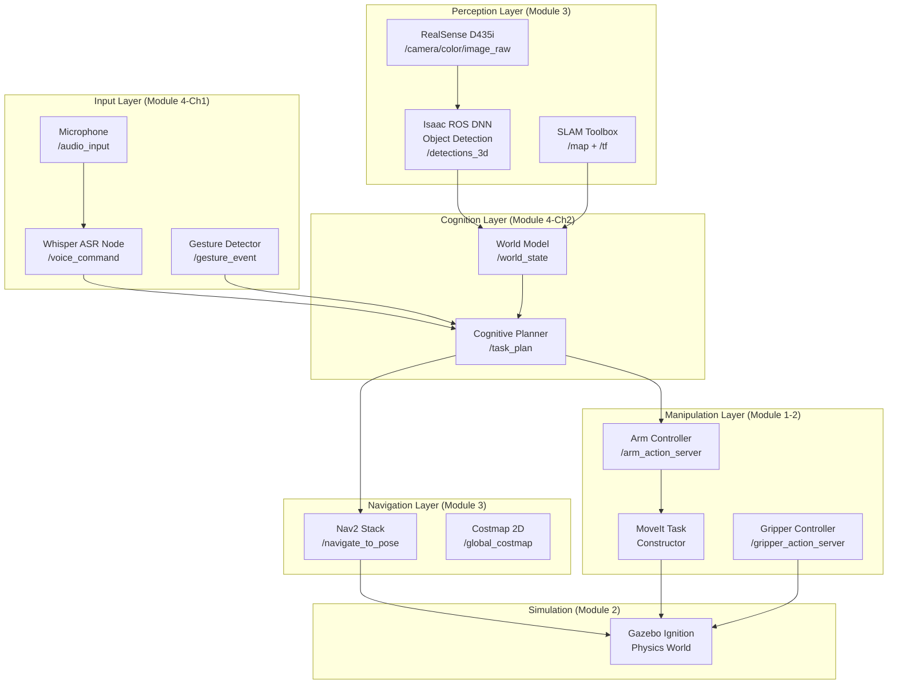
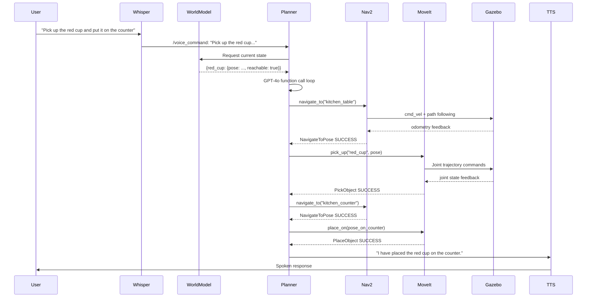

# Capstone: The Autonomous Humanoid

> **Week 13** — Module 4: Vision-Language-Action (VLA)

---

## Learning Objectives

By the end of this chapter, you will be able to:

1. Design a **full-stack system architecture** for an autonomous humanoid robot.
2. Integrate all four course modules into a single cohesive ROS 2 workspace.
3. Implement a **multi-modal interaction pipeline** combining speech, gesture, and vision.
4. Apply structured **project milestones** to manage a complex robotics software project.
5. Evaluate a robotics system against a formal **assessment rubric**.
6. Debug integration failures across module boundaries using ROS 2 introspection tools.

---

## Prerequisites

This capstone chapter assumes you have completed all prior modules:

- **Module 1** — ROS 2 nodes, topics, services, actions, URDF
- **Module 2** — Gazebo simulation, sensor plugins, physics tuning
- **Module 3** — NVIDIA Isaac Sim, Nav2 navigation, Isaac ROS perception
- **Module 4, Chapters 1-2** — Whisper voice pipeline, LLM cognitive planning

:::note
The capstone is designed to run entirely in simulation (Gazebo Ignition or Isaac Sim). Physical hardware is not required, though the architecture is identical for real deployment.
:::

---

## 1. Project Overview

You will build **ARIA** — *Autonomous Reasoning and Interaction Agent* — a simulated humanoid robot capable of:

1. **Listening** to spoken natural language commands via microphone.
2. **Understanding** the instruction using an LLM-powered cognitive planner.
3. **Navigating** to goal locations using Nav2 with obstacle avoidance.
4. **Perceiving** objects using a depth camera and object detection.
5. **Manipulating** objects with a 6-DOF arm.
6. **Reporting** task status back to the user verbally.

ARIA operates inside a simulated household environment containing a kitchen, dining room, and living area. The entire system runs as a set of interconnected ROS 2 nodes.

---

## 2. Full System Architecture

The system is divided into five subsystems, each corresponding to a course module:



### 2.1 Data Flow Through the System

The canonical flow for a single command is:



---

## 3. Repository Structure

Organize your workspace as a standard ROS 2 colcon workspace:

```
aria_ws/
├── src/
│   ├── aria_bringup/           # Launch files, top-level config
│   │   ├── launch/
│   │   │   ├── aria_sim.launch.py
│   │   │   └── aria_full.launch.py
│   │   └── config/
│   │       ├── nav2_params.yaml
│   │       └── aria_params.yaml
│   ├── aria_description/       # URDF, meshes, materials (Module 1)
│   │   ├── urdf/aria.urdf.xacro
│   │   └── meshes/
│   ├── aria_simulation/        # Gazebo world, plugins (Module 2)
│   │   ├── worlds/household.sdf
│   │   └── models/
│   ├── aria_perception/        # Vision, SLAM, world model (Module 3)
│   │   ├── aria_perception/
│   │   │   ├── object_detector.py
│   │   │   └── world_model.py
│   │   └── package.xml
│   ├── aria_voice/             # ASR + TTS pipeline (Module 4 Ch1)
│   │   ├── aria_voice/
│   │   │   ├── whisper_node.py
│   │   │   └── tts_node.py
│   │   └── package.xml
│   ├── aria_planner/           # LLM cognitive planning (Module 4 Ch2)
│   │   ├── aria_planner/
│   │   │   ├── cognitive_planner_node.py
│   │   │   ├── tools/
│   │   │   └── safety/
│   │   └── package.xml
│   └── aria_manipulation/      # MoveIt arm control (Module 1-2)
│       ├── aria_manipulation/
│       │   ├── pick_place_server.py
│       │   └── gripper_controller.py
│       └── package.xml
└── install/
```

---

## 4. Multi-Modal Interaction

ARIA supports three input modalities simultaneously:

### 4.1 Speech Input (Primary)

Covered in Module 4 Chapter 1. Whisper transcribes microphone audio and publishes to `/voice_command`.

### 4.2 Gesture Input (Secondary)

A MediaPipe-based gesture detector node recognizes hand gestures and maps them to commands:

```python
# aria_voice/gesture_node.py
import rclpy
from rclpy.node import Node
from std_msgs.msg import String
import cv2
import mediapipe as mp

GESTURE_MAP = {
    "STOP":       "halt all operations immediately",
    "COME_HERE":  "navigate to my location",
    "POINT_LEFT": "navigate left of current position",
    "THUMBS_UP":  "task acknowledged, continue",
    "OPEN_PALM":  "pause current task",
}

class GestureDetectorNode(Node):
    def __init__(self):
        super().__init__("gesture_detector")
        self.pub = self.create_publisher(String, "/gesture_event", 10)
        self.mp_hands = mp.solutions.hands
        self.hands = self.mp_hands.Hands(
            static_image_mode=False,
            max_num_hands=1,
            min_detection_confidence=0.7,
        )
        self.cap = cv2.VideoCapture(0)
        self.create_timer(0.033, self.process_frame)  # ~30 Hz
        self.get_logger().info("Gesture Detector ready.")

    def process_frame(self):
        ret, frame = self.cap.read()
        if not ret:
            return

        rgb = cv2.cvtColor(frame, cv2.COLOR_BGR2RGB)
        results = self.hands.process(rgb)

        if results.multi_hand_landmarks:
            gesture = self._classify_gesture(results.multi_hand_landmarks[0])
            if gesture in GESTURE_MAP:
                command = GESTURE_MAP[gesture]
                self.get_logger().info(f"Gesture detected: {gesture} -> '{command}'")
                self.pub.publish(String(data=command))

    def _classify_gesture(self, hand_landmarks) -> str:
        """Simplified gesture classification based on finger extension."""
        # In a real implementation, use a trained classifier
        # This is a placeholder for demonstration
        return "THUMBS_UP"

    def destroy_node(self):
        self.cap.release()
        super().destroy_node()
```

### 4.3 Vision-Based Attention (Tertiary)

The perception layer publishes detected objects, and the planner updates the world model continuously:

```python
# aria_perception/world_model.py
"""
Maintains a live world model from sensor inputs.
The planner queries this before each planning cycle.
"""
import rclpy
from rclpy.node import Node
from vision_msgs.msg import Detection3DArray
from geometry_msgs.msg import PoseStamped
import json

class WorldModelNode(Node):
    def __init__(self):
        super().__init__("world_model")
        self._objects: dict = {}
        self._robot_pose = None

        self.create_subscription(
            Detection3DArray, "/detections_3d", self._on_detections, 10
        )
        self.create_subscription(
            PoseStamped, "/robot_pose", self._on_robot_pose, 10
        )
        # Publish world state as JSON string for the planner
        self.state_pub = self.create_publisher(String, "/world_state", 10)
        self.create_timer(1.0, self._publish_state)

    def _on_detections(self, msg: Detection3DArray):
        for det in msg.detections:
            if det.results:
                label = det.results[0].hypothesis.class_id
                pose = det.bbox.center
                self._objects[label] = {
                    "x": pose.position.x,
                    "y": pose.position.y,
                    "z": pose.position.z,
                    "confidence": det.results[0].hypothesis.score,
                    "graspable": True,
                }

    def _on_robot_pose(self, msg: PoseStamped):
        self._robot_pose = {
            "x": msg.pose.position.x,
            "y": msg.pose.position.y,
        }

    def _publish_state(self):
        state = {
            "robot_pose": self._robot_pose,
            "objects": self._objects,
        }
        from std_msgs.msg import String as StringMsg
        self.state_pub.publish(StringMsg(data=json.dumps(state)))
```

---

## 5. Integration Node: The Orchestrator

The `aria_orchestrator` node ties all subsystems together:

```python
# aria_planner/orchestrator_node.py
"""
Top-level orchestrator for the ARIA autonomous humanoid.
Manages the lifecycle of tasks from voice command to completion.
"""
import json
import os
import rclpy
from rclpy.node import Node
from rclpy.callback_groups import ReentrantCallbackGroup
from std_msgs.msg import String
from openai import OpenAI

client = OpenAI(api_key=os.environ["OPENAI_API_KEY"])

# Import all tool definitions
from aria_planner.tools.navigation_tools import NAVIGATION_TOOLS
from aria_planner.tools.manipulation_tools import MANIPULATION_TOOLS
from aria_planner.tools.query_tools import QUERY_TOOLS

ALL_TOOLS = NAVIGATION_TOOLS + MANIPULATION_TOOLS + QUERY_TOOLS

ARIA_SYSTEM_PROMPT = """
You are ARIA, an autonomous humanoid robot assistant.
You operate in a household environment.
Your capabilities:
- Navigate to any named room or piece of furniture
- Pick up and place objects up to 2kg
- Open and close doors, drawers, and containers
- Report on the state of the environment

Behavioral guidelines:
- Always confirm task understanding before executing a long sequence
- Pause and request clarification if the instruction is ambiguous
- Prefer safe, reversible actions when uncertain
- Speak naturally when reporting status

You have access to tools for all actions. Use them sequentially.
Never attempt actions outside your workspace boundaries.
"""

class ARIAOrchestrator(Node):
    def __init__(self):
        super().__init__("aria_orchestrator")
        cb_group = ReentrantCallbackGroup()

        # Subscriptions
        self.create_subscription(
            String, "/voice_command", self._on_voice_command, 10,
            callback_group=cb_group
        )
        self.create_subscription(
            String, "/gesture_event", self._on_gesture_event, 10,
            callback_group=cb_group
        )
        self.create_subscription(
            String, "/world_state", self._on_world_state, 10
        )

        # Publications
        self.tts_pub = self.create_publisher(String, "/tts_text", 10)
        self.status_pub = self.create_publisher(String, "/aria_status", 10)

        # State
        self._world_state: dict = {}
        self._active_task: bool = False

        self.get_logger().info("ARIA Orchestrator ready. Listening for commands.")

    def _on_world_state(self, msg: String):
        try:
            self._world_state = json.loads(msg.data)
        except json.JSONDecodeError:
            pass

    def _on_voice_command(self, msg: String):
        if self._active_task:
            self.tts_pub.publish(String(
                data="I am currently busy with a task. Please wait."
            ))
            return
        self._run_task(msg.data)

    def _on_gesture_event(self, msg: String):
        if msg.data == "halt all operations immediately":
            self._active_task = False
            self.tts_pub.publish(String(data="Stopping all operations."))
        elif not self._active_task:
            self._run_task(msg.data)

    def _run_task(self, instruction: str):
        self._active_task = True
        self.get_logger().info(f"Starting task: '{instruction}'")
        self.tts_pub.publish(String(
            data=f"Understood. I will: {instruction}"
        ))

        messages = [
            {"role": "system", "content": ARIA_SYSTEM_PROMPT},
            {
                "role": "user",
                "content": (
                    f"Current world state:\n{json.dumps(self._world_state, indent=2)}\n\n"
                    f"Instruction: {instruction}"
                ),
            },
        ]

        final_response = self._planning_loop(messages)

        self.get_logger().info(f"Task complete: {final_response}")
        self.tts_pub.publish(String(data=final_response))
        self.status_pub.publish(String(data="idle"))
        self._active_task = False

    def _planning_loop(self, messages: list) -> str:
        for _ in range(20):
            response = client.chat.completions.create(
                model="gpt-4o",
                messages=messages,
                tools=ALL_TOOLS,
                tool_choice="auto",
                temperature=0.1,
            )
            msg = response.choices[0].message
            messages.append(msg)

            if not msg.tool_calls:
                return msg.content or "Task complete."

            for tc in msg.tool_calls:
                fn = tc.function.name
                args = json.loads(tc.function.arguments)
                result = self._dispatch(fn, args)
                messages.append({
                    "role": "tool",
                    "tool_call_id": tc.id,
                    "content": json.dumps(result),
                })

        return "I have reached my planning limit. Please assist me."

    def _dispatch(self, fn_name: str, args: dict) -> dict:
        """Route tool calls to the appropriate subsystem."""
        self.get_logger().info(f"Tool call: {fn_name}({args})")
        # In a full implementation, each handler calls a ROS 2 action server
        # Here we show the dispatch routing structure
        dispatch_table = {
            "navigate_to":      self._nav_navigate_to,
            "pick_up":          self._arm_pick_up,
            "place_on":         self._arm_place_on,
            "open_container":   self._arm_open_container,
            "close_container":  self._arm_close_container,
            "query_object":     self._perception_query,
            "report_status":    self._report_status,
        }
        handler = dispatch_table.get(fn_name)
        if handler is None:
            return {"error": f"Unknown tool: {fn_name}"}
        return handler(args)

    # ---------- Subsystem handlers (stubs — implement with ROS 2 action clients) ----------

    def _nav_navigate_to(self, args: dict) -> dict:
        location = args["location"]
        self.get_logger().info(f"NAV: Navigating to {location}")
        # TODO: Send goal to Nav2 NavigateToPose action server
        return {"status": "success", "arrived_at": location}

    def _arm_pick_up(self, args: dict) -> dict:
        obj = args["object_name"]
        self.get_logger().info(f"ARM: Picking up {obj}")
        # TODO: Call MoveIt pick action server with object pose from world model
        return {"status": "success", "holding": obj}

    def _arm_place_on(self, args: dict) -> dict:
        surface = args["surface"]
        self.get_logger().info(f"ARM: Placing on {surface}")
        # TODO: Call MoveIt place action server
        return {"status": "success", "placed_on": surface}

    def _arm_open_container(self, args: dict) -> dict:
        container = args["container_name"]
        self.get_logger().info(f"ARM: Opening {container}")
        return {"status": "success", "opened": container}

    def _arm_close_container(self, args: dict) -> dict:
        container = args["container_name"]
        return {"status": "success", "closed": container}

    def _perception_query(self, args: dict) -> dict:
        obj = args["object_name"]
        obj_info = self._world_state.get("objects", {}).get(obj)
        if obj_info:
            return {"found": True, "object": obj, "pose": obj_info}
        return {"found": False, "object": obj}

    def _report_status(self, args: dict) -> dict:
        self.status_pub.publish(String(data=args.get("status", "")))
        return {"acknowledged": True}


def main():
    rclpy.init()
    node = ARIAOrchestrator()
    rclpy.spin(node)
    rclpy.shutdown()

if __name__ == "__main__":
    main()
```

---

## 6. Project Milestones and Timeline

The capstone spans **Week 13** with the following structured milestones:

| Milestone | Day | Deliverable | Points |
|---|---|---|---|
| **M1: Architecture Review** | Day 1 | System architecture diagram, package structure, all stub nodes launching without error | 10 |
| **M2: Simulation World** | Day 2 | Gazebo world running with humanoid URDF, sensors publishing, Nav2 map loaded | 15 |
| **M3: Perception Pipeline** | Day 3 | Object detection publishing detections, world model updating correctly | 15 |
| **M4: Voice Integration** | Day 4 | Whisper node transcribing, commands reaching orchestrator | 15 |
| **M5: Navigation Task** | Day 5 | Robot navigates to 3 named locations from voice command | 15 |
| **M6: Manipulation Task** | Day 6 | Robot picks up and places one object from voice command | 20 |
| **M7: Full Demo** | Day 7 | All subsystems integrated, demo video of 3-command sequence | 10 |
| **Total** | | | **100** |

### Milestone 1 Checklist

```bash
# Verify all nodes can be launched without errors
colcon build --symlink-install
source install/setup.bash
ros2 launch aria_bringup aria_sim.launch.py

# In another terminal, check all expected topics are present
ros2 topic list | grep -E "voice_command|world_state|detections_3d|aria_status"
```

### Milestone 5 Verification Script

```python
# tests/test_navigation.py
"""
Automated test: send three navigate commands and verify robot arrives.
Run from within the ROS 2 environment with the simulation active.
"""
import time
import rclpy
from rclpy.node import Node
from std_msgs.msg import String

NAVIGATION_TEST_COMMANDS = [
    "Navigate to the kitchen.",
    "Go to the dining room.",
    "Return to the home position.",
]

class NavigationTestNode(Node):
    def __init__(self):
        super().__init__("navigation_tester")
        self.cmd_pub = self.create_publisher(String, "/voice_command", 10)
        self.results = []
        self.create_subscription(String, "/aria_status", self._on_status, 10)
        # Start test after 2s for system to initialize
        self.create_timer(2.0, self._send_next_command)
        self._cmd_index = 0

    def _send_next_command(self):
        if self._cmd_index < len(NAVIGATION_TEST_COMMANDS):
            cmd = NAVIGATION_TEST_COMMANDS[self._cmd_index]
            self.get_logger().info(f"Sending: '{cmd}'")
            self.cmd_pub.publish(String(data=cmd))
            self._cmd_index += 1
        else:
            self.get_logger().info(f"Test complete. Results: {self.results}")
            rclpy.shutdown()

    def _on_status(self, msg: String):
        self.results.append(msg.data)
        self.get_logger().info(f"Status: {msg.data}")

def main():
    rclpy.init()
    node = NavigationTestNode()
    rclpy.spin(node)

if __name__ == "__main__":
    main()
```

---

## 7. Assessment Rubric

### Rubric: Functional Completeness (50 points)

| Criterion | Excellent (100%) | Satisfactory (70%) | Needs Work (40%) |
|---|---|---|---|
| Voice recognition | Transcribes correctly in quiet conditions, handles accents | Transcribes correctly in quiet conditions | Transcription errors under 5% accuracy |
| Navigation | Reaches all waypoints, avoids all dynamic obstacles | Reaches all waypoints, avoids static obstacles | Reaches most waypoints |
| Object detection | Detects all 5 test objects with correct 3D pose | Detects 4 of 5 with approximately correct pose | Detects 3 or fewer |
| Pick and place | Successfully completes 3/3 pick-and-place trials | Successfully completes 2/3 trials | Completes 1/3 trials |
| Task completion | Completes 3/3 voice-commanded tasks end-to-end | Completes 2/3 tasks end-to-end | Completes 1/3 tasks |

### Rubric: Code Quality (25 points)

| Criterion | Points |
|---|---|
| All ROS 2 nodes follow package structure convention | 5 |
| Safety constraints implemented (workspace + force) | 5 |
| Error handling and recovery behaviors present | 5 |
| Behavior tree or structured planning (not just flat list) | 5 |
| All code is commented and self-documenting | 5 |

### Rubric: Architecture and Documentation (25 points)

| Criterion | Points |
|---|---|
| Complete system architecture diagram (Mermaid) | 5 |
| README with setup and run instructions | 5 |
| All module boundaries clearly defined | 5 |
| Reflection essay: design decisions and trade-offs | 10 |

---

## 8. Common Integration Challenges and Solutions

### 8.1 TF Frame Mismatches

When perception and navigation disagree on object poses, it is usually a TF frame problem.

```bash
# Check the full TF tree
ros2 run tf2_tools view_frames

# Verify a specific frame transformation
ros2 run tf2_ros tf2_echo map base_link
```

:::warning
Every pose used by the planner must be in the `map` frame, not `base_link` or `camera_link`. Always transform poses before passing them to the LLM or action servers.
:::

### 8.2 LLM Planning Failures

If the LLM produces a plan that fails midway:

1. Print the full `messages` list to inspect what world state was provided.
2. Check if the object names in the world state match the object names the LLM is calling.
3. Reduce temperature to `0.05` for more deterministic behavior.
4. Add explicit examples in the system prompt (few-shot prompting).

### 8.3 Navigation Stuck in Local Minima

```yaml
# config/nav2_params.yaml — increase recovery behaviors
recoveries_server:
  ros__parameters:
    costmap_topic: local_costmap/costmap_raw
    footprint_topic: local_costmap/published_footprint
    cycle_frequency: 10.0
    recovery_plugins: ["spin", "backup", "wait"]
    spin:
      plugin: "nav2_recoveries/Spin"
    backup:
      plugin: "nav2_recoveries/BackUp"
    wait:
      plugin: "nav2_recoveries/Wait"
```

### 8.4 Arm Not Reaching Objects

Verify the grasp pose is within the arm's reachability envelope. In simulation, visualize the planning scene in RViz2:

```bash
ros2 launch moveit_ros_visualization moveit_rviz.launch.py
```

---

## 9. Demo Scenario: The Three-Command Test

For the final demo, ARIA must complete the following three-command sequence without human intervention:

**Command 1**: "Please fetch the water bottle from the kitchen counter and bring it to the living room."

**Command 2**: "Now pick up all the books from the floor and stack them on the bookshelf."

**Command 3**: "When you're done, come back here and tell me what you accomplished."

The robot's response to Command 3 demonstrates the full system: navigation, manipulation, and natural language generation all working together.

:::tip
Record your demo as a screen capture of the Gazebo simulation window plus the ROS 2 terminal output. A 2-minute video demonstrating the three-command sequence is the primary deliverable for Milestone 7.
:::

---

## 10. Extension Challenges (Optional, Bonus Points)

For students who complete the core capstone ahead of schedule:

1. **Multi-robot coordination** (+10 pts): Add a second ARIA robot that assists with carrying large objects. Implement a basic task allocation system.
2. **Learning from demonstration** (+10 pts): Record a manual teleoperation session in Gazebo. Use it as a few-shot example in the LLM system prompt to improve planning quality for that task type.
3. **Failure detection and recovery** (+10 pts): Add a monitor node that detects when the robot is stuck (no progress toward goal for 30 seconds) and triggers an automatic recovery behavior.
4. **Real hardware deployment** (+20 pts): If you have access to a Unitree Go2, H1, or similar platform, deploy the perception and navigation stack on real hardware and demonstrate at least one successful voice-commanded navigation task.

---

## Takeaways

- A production-grade autonomous humanoid system integrates at least five distinct subsystems: perception, world modeling, cognitive planning, navigation, and manipulation.
- The **orchestrator pattern** — a single node that routes between subsystems based on LLM decisions — is a practical and understandable architecture for coursework and prototyping.
- **Multi-modal input** (voice, gesture, vision) makes the system more robust to failures in any single input channel.
- Integration testing must be automated from the start; manual testing does not scale as system complexity grows.
- **TF frame consistency** is the most common source of integration failures in robotics systems.
- The gap between a demo that works once and a system that works reliably is filled by error handling, recovery behaviors, and extensive testing.

---

## Review Questions

1. Explain why the orchestrator node subscribes to `/world_state` but does not perform object detection itself. What software engineering principle does this reflect?
2. In the milestone timeline, why is the Gazebo simulation world milestone (M2) placed before the perception pipeline milestone (M3)?
3. What are two concrete failure modes that can occur in the pick-and-place pipeline, and how would you detect each one programmatically?
4. Why is `ReentrantCallbackGroup` used in the orchestrator node? What would go wrong if you used the default `MutuallyExclusiveCallbackGroup`?
5. Propose a formal acceptance test for the three-command demo scenario. What specific measurements would you record to evaluate success?

---

## Exercise: Implement a Recovery Behavior

The orchestrator currently does nothing when `navigate_to` returns a failure. Implement a recovery strategy:

1. On navigation failure, publish a `/tts_text` message asking the user to clear the path.
2. Wait 5 seconds (use `rclpy.spin_until_future_complete` with a timer future).
3. Retry navigation once.
4. If the retry also fails, set `_active_task = False` and report the failure verbally.

Write the modified `_nav_navigate_to` handler and test it by intentionally blocking the simulated robot's path with a Gazebo object.
